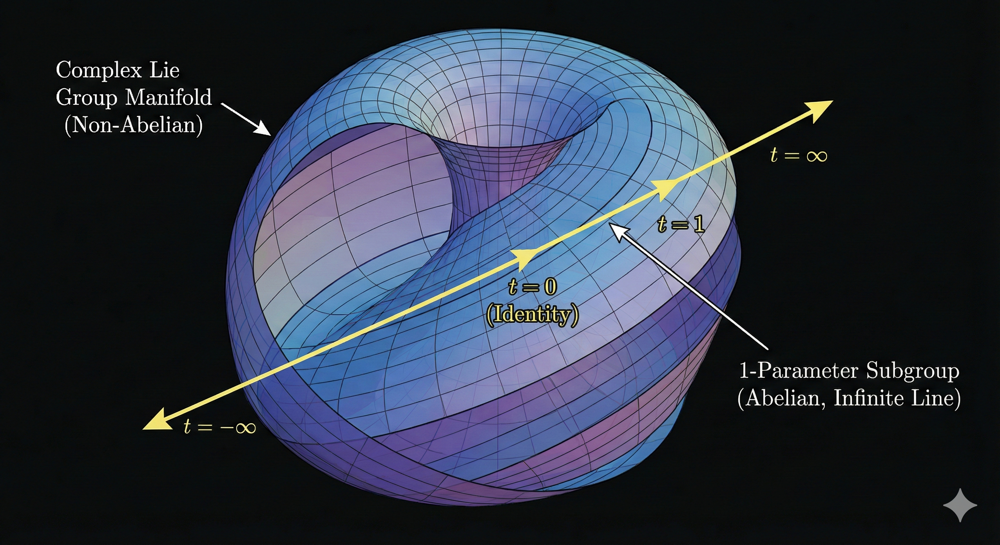
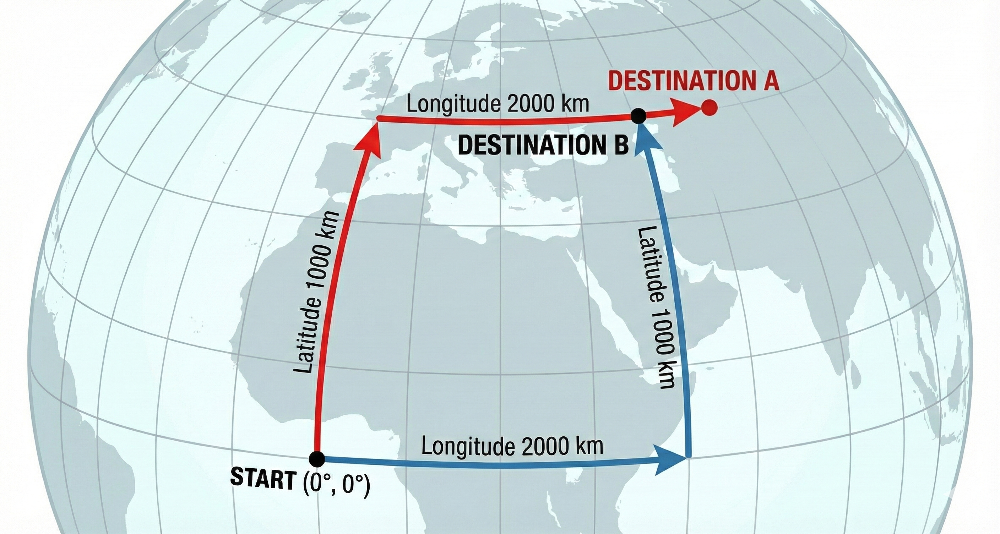

+++
title = "(b) Lie algebra"
weight = 3
+++

---

### 1. 준동형 사상(Homomorphism)

우리는 복잡한 '연산자 곱셈($\cdot$)'을 쉬운 '파라미터 덧셈($+$)'으로 바꿔서 계산하고 싶어 한다. 수학적으로 이 두 연산 구조가 완벽하게 일치하는 것을 준동형 사상(Homomorphism) 이라고 한다.

$$
\hat{S}(A) \cdot \hat{S}(B) \stackrel{?}{=} \hat{S}(A+B) 
$$

하지만, 이 등식은 항상 성립하는 것이 아니다. **리 군의 종류에 따라 이 규칙은 지켜지기도 하고, 처참하게 깨지기도 한다.**

---

### 2. 준동형이 성립하는 경우: "1-매개변수 부분군"
 
**1-매개변수 (Just 1-Parameter)** 는 변수가 "하나" 라는 뜻일 뿐이다. 어떻게 움직이는지에 대한 약속은 없다. (가속, 감속, 멈춤, 점프 다 가능) **부분군 (Subgroup)** 은 **"규칙(준동형)을 지켜라"** 라는 강제성을 부여함을 의미한다.

**(1) 기하학적 의미: 대칭의 축 (Axis of Symmetry)**

 

 

- **무한히 뻗은 직선(Infinite Line)**: 울퉁불퉁한 산맥(비가환 리 군)을 뚫고 지나가는 직선 터널과 같다.
- **대칭성 (Symmetry)**: 이 직선 축 위의 어느 지점에 서 있든, 앞뒤로 이동하는 규칙은 완벽하게 동일하다. 즉, 이 경로는 연속적인 대칭성(Continuous Symmetry)이 보존되는 축이다.

**(2) 수학적 의미: 지수 함수의 필연성**

이 평평한 대칭 축 위에서는, 우리가 아는 단순 덧셈이 완벽하게 작동한다. 예로, "3만큼 이동하고 2만큼 더 이동하는 것은($\cdot$), 처음부터 5만큼 이동한 것($+$)과 같다."

$$
\hat{S}(\tau_1) \cdot \hat{S}(\tau_2) = \hat{S}(\tau_1 + \tau_2)
$$

수학적으로 **"입력을 더했더니 출력이 곱해지는 함수"** 는 세상에 단 하나, **지수 함수(Exponential)** 뿐이다. $\hat{G}$는 생성자로 다음챕터에서 상세하게 다룬다.

$$
\hat{S}(\tau) = e^{\tau \hat{G}}
$$

---

### 3. 준동형이 성립하는 경우: "다변수 가환 리 군"

변수가 여러 개($A, B, \dots$)라고 해서 무조건 복잡해지는 것은 아니다. 변수들이 서로를 방해하지 않는다면(독립적이라면), 여전히 단순 덧셈이 성립한다. 이를 가환(Abelian) 리 군이라고 한다.

**(1) 기하학적 의미: 평평한 바둑판 (Flat Grid)**

- 2차원 평면에서의 이동(Translation). $x$축 이동($A$)과 $y$축 이동($B$).
- 오른쪽으로 먼저 가고 위로 가나($A \cdot B$), 위로 먼저 가고 오른쪽으로 가나($B \cdot A$) 도착점은 같다.이 공간은 휘어있지 않고 **평평(Flat)** 하기 때문에, 변수가 아무리 많아도 서로 간섭하지 않는다.
 
**(2) 수학적 의미: 교환자의 소멸**

서로 순서를 바꿔도 결과가 같으므로, 오차항인 교환자가 0이 된다.

$$
[\hat{G}_i, \hat{G}_j] = \hat{G}_i\hat{G}_j - \hat{G}_j\hat{G}_i = 0
$$

각 생성자는 교환이 가능하므로, 지수에 대한 덧셈이 가능하다.

$$
e^{A\hat{G}_A} \cdot e^{B\hat{G}_B} = e^{A\hat{G}_A+B\hat{G}_B}
$$

---

### 4. 준동형이 깨지는 경우: "다변수 비가환 리 군"

 

 

문제는 서로 다른 조작을 섞을 때(예: $x$축 회전 후 $y$축 회전) 발생한다. 이를 비가환(Non-Abelian) 이라고 하며, 이때는 우리가 아는 단순 덧셈 규칙이 깨진다.

**(1) 근본 원인: 생성자의 충돌**

가환 리 군과 달리, 여기서는 서로 다른 방향의 생성자들끼리 순서를 바꾸면 결과가 달라진다.

$$
[\hat{G}_A, \hat{G}_B] = \hat{G}_A \hat{G}_B - \hat{G}_B \hat{G}_A \neq 0
$$

**(2) 결과: BCH 공식의 등장**

생성자가 꼬여있으니, 이를 사용하는 파라미터 덧셈도 당연히 성립하지 않는다. (여기서 $\hat{X} = A\hat{G}_A$, $\hat{Y} = B\hat{G}_B$ 라고 하자.)

$$
e^{\hat{X}} \cdot e^{\hat{Y}} \neq e^{\hat{X}+\hat{Y}}
$$

즉, 파라미터 제어판에서 $X+Y$ (벡터 합)라고 입력했는데, 실제 로봇(연산자 곱)은 엉뚱한 위치에 가 있는 것이다. 이 깨진 등호를 억지로 맞추기 위해 필요한 보정값이 바로 BCH 공식(Baker-Campbell-Hausdorff formula) 이다.

$$
\mathbf{\hat{Z}} = \hat{X} + \hat{Y} + \underbrace{\frac{1}{2}[\hat{X}, \hat{Y}] + \frac{1}{12}([\hat{X}, [\hat{X}, \hat{Y}]] + [\hat{Y}, [\hat{Y}, \hat{X}]]) + \cdots}_{\text{비가환성에 의한 보정항들}}
$$

$$
e^{\hat{X}} \cdot e^{\hat{Y}} = e^{\mathbf{\hat{Z}}}
$$

여기서 $[\hat{X}, \hat{Y}]$ (교환자)는 덧셈 규칙이 깨진 정도, 즉 "순서를 바꿨을 때 생기는 경로의 오차" 를 나타낸다. 이는 "단순히 더하면($\hat{X}+\hat{Y}$) 안 되고, 휘어진 공간의 특성($[\hat{X},\hat{Y}]$)만큼 보정해줘야 함"을 의미한다.

---

### 4. 리 대수(Lie Algebra): "준동형의 부활"

그렇다면 이 복잡한 리 군을 어떻게 다룰 것인가. 여기서 리 대수(Lie Algebra) 가 등장한다. BCH 공식에서 $A, B$가 아주 작은 미소 변환(Infinitesimal) 이라면, 오차항(교환자)은 $0$에 가깝게 무시할 수 있다. **아주 좁은 영역(접평면)에서는, 깨졌던 준동형 성질(선형성)이 다시 부활한다.** 

이 좁은 평평한 세상을 리 대수(Lie Algebra) 라고 부른다.

- 선형성: 여기서는 복잡한 곡면 계산 대신, 선형 대수(덧셈, 상수배) 를 마음껏 쓸 수 있다. ($e^\hat{X} e^\hat{Y} \approx e^{\hat{X}+\hat{Y}}$)
- 생성자(Generator): 이 평평한 공간의 기저(Basis)가 바로 생성자 $\hat{G}$ 들이다. (앞서 미소 변환에서 구한 기울기다.)
- 지수화(Exponentialization): 우리는 이 평면 지도(Lie Algebra) 위에서 쉬운 덧셈으로 길을 찾은 뒤, 지수 함수를 통해 실제 곡면(Lie Group)으로 투영한다.

---
