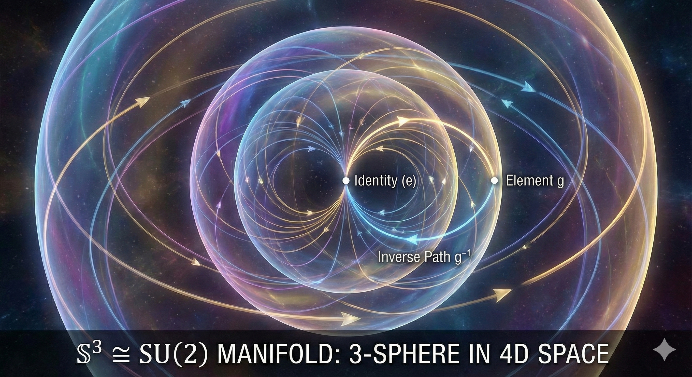
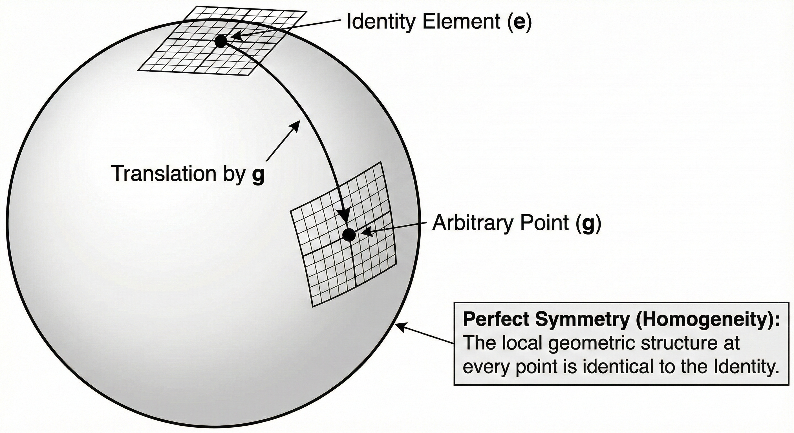

+++
title = "(b) Manifold"
weight = 2
+++

---

### 1. Operator-valued function

연산자 값 함수 (Operator-valued function) $\hat{S}(\tau)$를 단순한 수식으로 보아서는 안 된다. 이는 추상적인 선형 연산자들의 집합(공간)위를 움직이는 연산자 값 함수이다. 이 함수는 스칼라 파라미터 $\tau$를 입력으로 받아, 그에 해당하는 구체적인 선형 연산자 를 출력으로 내놓는다.

- $\hat{S}(\tau)$ 는 연산자가 아니라, 연산자를 찍어내는 **연산자 값 함수 (Operator-valued function)** 이다.
- $\hat{S}(1)$, $\hat{S}(3.5)$ 처럼 값이 **확정된 것이 연산자다.** 리 군(Lie Group)을 구성하는 원소(Element)는, $\tau$에 특정 숫자를 넣어서 계산이 끝난 결과물 하나하나다.

---

### 2. 다양체(Manifold): "점들이 모여 만든 도형"

이제 확정된 연산자들(점)을 모두 모아보자.

- $\tau=0$ 일 때의 연산자 $\hat{S}(0)$ (점)
- $\tau=0.1$ 일 때의 연산자 $\hat{S}(0.1)$ (점)
- $\tau=100$ 일 때의 연산자 $\hat{S}(100)$ (점)

**이 무수히 많은 점들을 다 찍어서 이으면 하나의 매끄러운 도형이 된다. 이 도형을 다양체(Manifold)** 라고 부르며,  바로 리 군(Lie Group) 의 실체다. 그렇다면, **연산자의 점이 무엇** 이란 말인가. **기저를 축으로 보고, 그 축으로 이루어진 공간안의 점** 이다.

**1) 이산 기저(행렬)**

$2 \times 2$ 행렬 하나를 생각해 보자. 숫자가 4개 들어간다.

$$
\hat{A}
=\begin{bmatrix}
a & b \\
c & d
\end{bmatrix}
$$

이 행렬은 벡터 $[x, y]^T$를 변환시키는 연산자이다. 이 $\hat{A}$ 순서쌍으로 다시 써보면,

$$
\hat{A} \longleftrightarrow (a, b, c, d)
$$

이렇게 쓰는 순간, 이 연산자는 **4차원 공간($\mathbb{R}^4$)에 찍힌 하나의 '점'** 이 된다. (물론 기저를 다르게 잡으면, **다른 공간에 찍힌 점**이 된다.)

**2) 연속 기저(미분연산자 등)**

$d/dx$를 생각해 보자. $d/dx$가 점이 되려면 좌표(숫자 성분)가 있어야 한다. 함수 공간의 기저(Basis)를 정하면 이 좌표가 보인다.가장 쉬운 예로 다항식 기저 ${1, x, x^2, x^3, \dots}$를 순서대로 벡터의 축이라고 가정해 본다.

- $d/dx$를 $1$ 에 걸면: $0$
- $d/dx$를 $x$ 에 걸면: $1$
- $d/dx$를 $x^2$ 에 걸면: $2x$
- $d/dx$를 $x^3$ 에 걸면: $3x^2$

이 규칙을 행렬(좌표)로 옮기면, $d/dx$는 다음과 같은 무한 행렬이라는 '점'이 된다.

$$
\frac{d}{dx} \sim \begin{bmatrix}
0 & 1 & 0 & 0 & \cdots \\
0 & 0 & 2 & 0 & \cdots \\
0 & 0 & 0 & 3 & \cdots \\
\vdots & \vdots & \vdots & \vdots & \ddots
\end{bmatrix}
$$

이전의 $2 \times 2$ 행렬이 4개의 숫자로 이루어진 점 $(a,b,c,d)$ 라면, $d/dx$는 **$(0, 1, 0, \dots, 0, 0, 2, \dots)$라는 좌표를 가진 무한 차원 공간상의 한 점** 된다.

---

### 3. 다양체의 예시1: 1-매개변수 곡선

**1) $SO(2)$: 2차원 회전 행렬의 집합**

$$
R(\tau) = \begin{pmatrix} \cos\tau & -\sin\tau \\ \sin\tau & \cos\tau \end{pmatrix}, \qquad \tau \in [0, 2\pi)
$$

(1) 군 구조: 매개변수에 대해 무한이 미분 가능한 리군 구조를 가지고 있다.

- 곱셈: $R(\tau_1) \cdot R(\tau_2) = R(\tau_1 + \tau_2)$
- 항등원: $R(0) = I$
- 역원: $R(\tau)^{-1} = R(-\tau)$

(2) 기저와 좌표1

기저를 축으로 보고, 그 축으로 이루어진 공간안의 점을 찍어 보자. 기저는 임의로 설정할 수 있다고 하였다. 스팩트럼 분해를 사용하여 기저를 잡아보자.

- 스펙트럼 분해

$$
R(\tau) = e^{i\tau}|v_+\rangle\langle v^+| + e^{-i\tau}|v_-\rangle\langle v^-|
$$

- 두 사영 연산자:

$$
P_+ := |v_+\rangle\langle v^+| = \frac{1}{2}\begin{pmatrix} 1 & i \\ -i & 1 \end{pmatrix}, \quad
P_- := |v_-\rangle\langle v^-| = \frac{1}{2}\begin{pmatrix} 1 & -i \\ i & 1 \end{pmatrix}
$$

(3) 기저와 좌표2

복소 평면 $\mathbb{C}$ 를 1-복소-차원 벡터 공간 으로 보면, 좌표를 아래와 같이 표현할 수 있다.

$$
R(\tau) = e^{i\tau} \cdot 1
$$

**2) 직선**

$(x, y, z) = (0, 0, \tau)$. $z$축을 따라가는 직선.

$$
\sigma_z = \begin{pmatrix} 1 & 0 \\ 0 & -1 \end{pmatrix}
$$

$$
M(\tau) = \tau \sigma_z
$$

**3) 원**

$(x, y, z) = (\cos\tau,\, \sin\tau,\, 0)$. $xy$-평면 위의 단위 원.

$$
\sigma_x = \begin{pmatrix} 0 & 1 \\ 1 & 0 \end{pmatrix}, \quad \sigma_y = \begin{pmatrix} 0 & -i \\ i & 0 \end{pmatrix}, \quad \sigma_z = \begin{pmatrix} 1 & 0 \\ 0 & -1 \end{pmatrix}
$$

$$
M(\tau) = \cos\tau \, \sigma_x + \sin\tau \, \sigma_y
$$

**4) 나선**

$(x, y, z) = (\cos\tau,\, \sin\tau,\, \tau)$. $z$-축을 따라 위로 감기는 나선.

$$
\sigma_x = \begin{pmatrix} 0 & 1 \\ 1 & 0 \end{pmatrix}, \quad \sigma_y = \begin{pmatrix} 0 & -i \\ i & 0 \end{pmatrix}, \quad \sigma_z = \begin{pmatrix} 1 & 0 \\ 0 & -1 \end{pmatrix}
$$

$$
M(\tau) = \cos\tau \, \sigma_x + \sin\tau \, \sigma_y + \tau \, \sigma_z
$$

---

### 4. 다양체의 예시2: 2-곡면

$M(x, y, z)$: 무흔적 에르미트 2×2 행렬의 집합, 여기서, 기저 $\sigma_x, \sigma_y, \sigma_z$ 는 파울리 행렬이다.

$$
\sigma_x = \begin{pmatrix} 0 & 1 \\ 1 & 0 \end{pmatrix}, \quad \sigma_y = \begin{pmatrix} 0 & -i \\ i & 0 \end{pmatrix}, \quad \sigma_z = \begin{pmatrix} 1 & 0 \\ 0 & -1 \end{pmatrix}
$$

$$
M(x, y, z) = x\sigma_x + y\sigma_y + z\sigma_z = \begin{pmatrix} z & x - iy \\ x + iy & -z \end{pmatrix}, \qquad (x, y, z) \in \mathbb{R}^3
$$

(1) 군 구조: 행렬 덧셈에 대해 매개변수에 대해 무한이 미분 가능한 아벨 리 군 구조를 가지고 있다.

- 덧셈: $M(\vec{r}_1) + M(\vec{r}_2) = M(\vec{r}_1 + \vec{r}_2)$
- 항등원: $M(0, 0, 0) = 0$
- 역원: $M(x, y, z) + M(-x, -y, -z) = 0$

(2) 기저와 좌표 1: 파울리 기저

기저를 축으로 보고, 그 축으로 이루어진 공간 안의 점을 찍어 보자. 가장 자연스러운 기저는 파울리 행렬 자체이다. 좌표 $(x, y, z) \in \mathbb{R}^3$. 세 개의 독립 실수 좌표가 자유로이 움직인다. 다양체로서 $\mathbb{R}^3$ 와 동형.

- 파울리 기저:

$$
\{\sigma_x, \sigma_y, \sigma_z\}
$$

- 좌표 표현:

$$
M = x \cdot \sigma_x + y \cdot \sigma_y + z \cdot \sigma_z
$$

(3) 기저와 좌표 2: 사다리 기저

기저를 $\sigma_z$ 의 고유 기저 (사다리 기저, ladder basis) 로 다시 잡아 보자. 이 기저는 양자역학의 각운동량 올림·내림 연산자로 익숙하다.

- 사다리 기저:

$$
\sigma_+ := \frac{\sigma_x + i\sigma_y}{2} = \begin{pmatrix} 0 & 1 \\ 0 & 0 \end{pmatrix}, \quad \sigma_- := \frac{\sigma_x - i\sigma_y}{2} = \begin{pmatrix} 0 & 0 \\ 1 & 0 \end{pmatrix}, \quad \sigma_z
$$

- 좌표 표현:

$$
M = z \cdot \sigma_z + (x - iy) \cdot \sigma_+ + (x + iy) \cdot \sigma_-
$$

(4) 기저와 좌표 3: 압축 표현 ($\mathbb{R} \times \mathbb{C}$)

자유도가 실수 1 차원 + 복소 1 차원 이라는 점을 정리하면, 다양체를 $\mathbb{R} \times \mathbb{C}$ 로 압축하여 표현할 수 있다.

$$
M = \begin{pmatrix} z & \bar{w} \\ w & -z \end{pmatrix}, \qquad z \in \mathbb{R},\ w = x + iy \in \mathbb{C}
$$

---

### 3. Lie ground & manifold

매끄러운 도형(다양체)은 세상에 많다. 찌그러진 감자 표면도 다양체다. 하지만 **$\hat{S}(\tau)$가 만드는 도형은 단순한 껍질이 아니라, 그 자체가 하나의 유기적인 연산 체계(Group)** 다. **리 군의 기하학적 구조**는 아래를 만족해야 한다.

 

 

**(1) 닫혀 있다 (Closure): 도형을 벗어나지 않는 움직임**

일반적인 감자 모양 표면 위의 점 A와 점 B를 더하면, 그 결과는 표면 밖으로 튀어 나가거나 엉뚱한 곳에 찍힐 수 있다. 하지만 리 군의 다양체는 다르다. 리 군이라는 다양체 위의 임의의 두 점(연산자) $\hat{A}, \hat{B}$를 가져와서 연산(곱)을 하면, 그 **결과물 $\hat{C} = \hat{A} \cdot \hat{B}$는 반드시 다시 그 다양체 표면 위의 어딘가에 존재** 한다.

**(2) 매끄러운 연산 (Smoothness): 미분이 가능한 구조**

리 군이 되기 위한 가장 중요한 조건은, 이 연산(곱하기와 역원) 자체가 '미분 가능'해야 한다는 것이다. 파라미터 공간에서 점 $\hat{A}$를 아주 살짝($d\theta$만큼) 밀었을 때, 그 결과인 $\hat{C}$도 갑자기 점프하지 않고 아주 살짝 부드럽게 움직여야 한다.이 성질 덕분에 우리는 이 다양체 위에서 **접선(Tangent vector)** 을 그을 수 있고, 이것이 바로 물리학에서 가장 중요한 **리 대수(Lie Algebra, 생성자)** 가 된다.

**(3) 항등원과 역원: 기준점과 되감기**

리 군의 다양체에는 반드시 **기준점(Identity, 항등원)** 이 존재하며, 어디로 이동하든 다시 **원점으로 되돌아오는 길(Inverse, 역원)** 이 도형 위에 매끄럽게 있어야 한다.

**(4) 완벽한 대칭 구조**

이 성질은, 위의 (1), (2), (3)을 모두 만족하기에, 완벽한 대칭 구조로 귀결되는 것이다. 즉, **리 군 다양체의 모든 점은 "원점의 복제본"이다.** 아래는 브라-켓 표기를 사용하여 엄밀하고 자세하게 증명한다.

---

### 4. Lie group의 완벽한 대칭 구조에 대한 증명

리 군의 가장 중요한 기하학적 특징은 **"도형의 어느 위치에 서 있든, 그 주변의 기하학적 구조는 원점($\hat{I}$)과 완벽하게 동일하다"** 는 것이다. 이를 **균질성(Homogeneity)** 이라고 한다.공간이 찌그러지거나(Non-unitary) 휘어진 일반적인 경우까지 포괄하기 위해, 듀얼 브라(Dual Bra, $\langle n^d |$) 표기법을 도입하여 이를 증명한다.

 

 

**(1) 초기 설정: 듀얼 기저의 도입**

원점($\tau=0$)의 기저 $|m\rangle$이 비직교(Non-orthogonal) 기저일지라도, 우리는 $\langle n^d | m \rangle = \delta_{nm}$을 만족하는 **듀얼 기저 $\langle n^d |$** 를 정의할 수 있다. 단, 이때의 $|m\rangle$은 리 군의 표현 공간(Representation Space)을 구성하는 임의의 기저임에 유의한다.

$$
\langle n^d | m \rangle = \delta_{nm}
$$

**(2) 리 군의 작용: 이동과 보정: 역원 사용**

리 군 연산자 $\hat{S}(\tau)$가 작용하여 위치를 이동시킨다. 이때 공간이 변형되면 듀얼 기저는 그 역으로 변형되어 균형을 맞춘다.

- 본 기저의 이동: $| m(\tau) \rangle = \hat{S}(\tau) | m \rangle$
- 듀얼 기저의 이동: $\langle n^d(\tau) | = \langle n^d | \hat{S}^{-1}(\tau)$

**(3) 구조적 불변성 증명 (Algebraic Invariance): 항등원 & 닫혀 있음 사용**

이동한 위치에서 구조(내적 관계)가 깨지지 않음을 확인한다.

$$
\langle n^d(\tau) | m(\tau) \rangle
= \langle n^d | \hat{S}^{-1}(\tau) \hat{S}(\tau) | m \rangle
= \langle n^d | \hat{I} | m \rangle
= \delta_{nm}
$$

따라서, 리 군 내부 어디를 가더라도, 공간을 지탱하는 **대수적 뼈대(Identity)** 는 변하지 않는다.

**(4) 기하학적 매끄러움 증명 (Geometric Smoothness)**

구조가 보존된다고 해서 반드시 리 군인 것은 아니다(이산 군일 수도 있음). 이 보존 과정이 미분 가능하게 일어남을 보여야 한다.

$$
\frac{d}{d\tau} \langle n^d(\tau) | m(\tau) \rangle
= \langle n^d | \frac{d}{d\tau}(\hat{S}^{-1}\hat{S}) | m \rangle
= \langle n^d | \frac{d}{d\tau}\hat{I}| m \rangle
= \langle n^d | 0 | m \rangle
= 0
$$

미분값이 발산하지 않고 0으로 정의된다는 것은,

- 이동 경로가 끊김 없이 연결되어 있음을 의미한다.
- **"기저가 휘어지더라도(변하더라도), 그 안에서의 물리량(내적 값)은 관측자에 대해 불변한다"** 는 **공변성(Covariance)** 의 의미를 내포한다.

**(5) 결론**

- 리 군은 구조적으로 완벽하게 보존되며(Algebra), 그 형태가 미분 가능하게 연결된(Geometry) 도형이다.
- 리 군은 우주 어디를 가나 국소적으로 원점과 구별할 수 없는 완벽한 대칭성을 가진다.