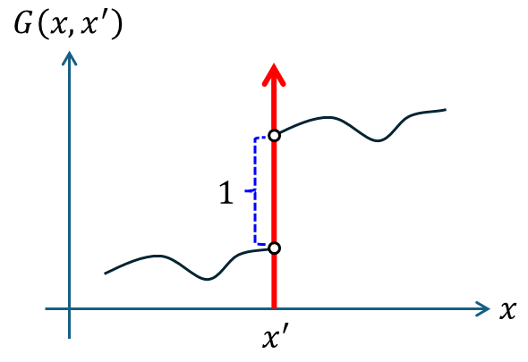

+++
title = "(b) First-order ODE"
weight = 2
+++

---

### 1. Jump condition

$$
\frac{\partial}{\partial x}G\left(x,x'\right)+q\left(x\right)G\left(x,x'\right)=\delta\left(x-x'\right), \quad q\left(x\right):\text{ continuous}
$$

위의 연산에 대해, 디렉 델타가 결과로 나오기 위해서는,$\partial_{x}G\left(x,x'\right)$또는 $G\left(x,x'\right)$가 디렉 델타가 되어야 한다. $G\left(x,x'\right)$이 디렉 델타 라면, $x$에 대한 미분이 불가능 하기에, 이것은 디렉 델타가 될 수 없다. 따라서, $\partial_{x}G\left(x,x'\right)$는 디렉 델타가 되어야 한다.

$$
\frac{\partial}{\partial x}G\left(x,x'\right)=\delta\left(x-x'\right)
$$

위로부터, $x'$과 **인접한 부분**에서, 그린함수는 “단위 계단 함수” 임을 알 수 있다.

$$
G\left(x,x'\right)=u\left(x-x'\right)
$$

위 그린함수의 형태를 그려보면 다음과 같다.

ℹ️ 선형연산자 L이 1차 미분일 경우, $G\left(x,x'\right)$는 $x=x'$에서 불연속이다.

---

### 2. Solution method

$$
L=\frac{d}{dx}+q\left(x\right)
$$

(1) $x\ne x'$

$$
LG\left(x,x'\right)=0
$$

$$
G\left(x,x'\right)=
\begin{cases}
  c_1\left(x'\right)u_1\left(x\right), & x < x'
  \\
  c_2\left(x'\right)u_2\left(x\right), & x > x'
\end{cases}
$$

(2) $x=x'$

$$
LG\left(x,x')=\delta(x-x'\right) 
$$

$$
\int_{x_{>}'}^{x_{<}'}LG\left(x,x'\right)dx=\int_{x_{>}'}^{x_{<}'}\delta\left(x-x'\right)dx=1
$$

$$
\int_{x_{>}'}^{x_{<}'}dx\left\lbrack\frac{\partial}{\partial x}G\left(x,x'\right)+q\left(x\right)G\left(x,x'\right)\right\rbrack=\int_{x_{>}'}^{x_{<}'}dx\left\lbrack\delta\left(x-x'\right)\right\rbrack=1
$$

$$
G\left(x_{<}',x'\right)-G\left(x_{>}',x'\right)+\int_{x_{>}'}^{x_{<}'}dx\left\lbrack q\left(x\right)G\left(x,x'\right)\right\rbrack=1
$$

q(x) continuous 하다. 또한,

$$
\int_{x_{>}'}^{x_{<}'}dx\left\lbrack q\left(x\right)G\left(x,x'\right)\right\rbrack=0
$$

따라서, jump condtition을 아래와 같이 구할 수 있다.

$$
G\left(x_{<}',x'\right)-G\left(x_{>}',x'\right)=1
$$

---

example1)

해석범위는 $x\in\left\lbrack a,\infty\right)$이고, 초기값 $G\left(a,x'\right)=0$이다.  $G\left(x,x'\right)$을 구하여라.

$$
\frac{d}{dx}G\left(x,x'\right)=\delta\left(x-x'\right)
$$



(1) $x\ne x'$

boundary condition 적용하면,

$$
G\left(x,x'\right)=
\begin{cases}
  0 & x < x'
  \\ 
  c_2 & x > x'
\end{cases}
$$

(2) $x=x'$

Jump condition 의해서,

$$
c_2-0=1
$$

따라서,

$$
G\left(x,x'\right)=
\begin{cases}
  0 & x < x'
  \\
  1 & x > x'
\end{cases}
$$



---

[7.2: Boundary Value Green’s Functions - Mathematics LibreTexts](https://math.libretexts.org/Bookshelves/Differential_Equations/Introduction_to_Partial_Differential_Equations_(Herman)/07%3A_Green's_Functions/7.02%3A_Boundary_Value_Greens_Functions)

[그린 함수(Green's Functions) : 네이버 블로그](https://blog.naver.com/qio910/222068013070?trackingCode=rss)