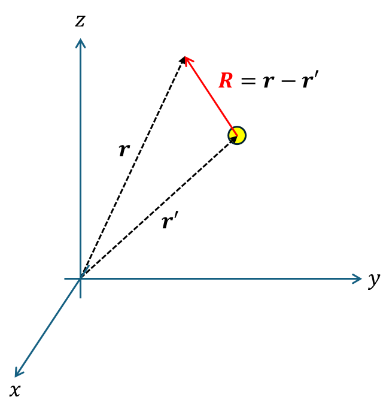

+++
title = "(i) Laplacian for free-space"
weight = 6
+++

---

### 0. 정리

그린 함수는 항상 소스점 r'을 기준으로 정의된다.

- 3D (결과 암기)

$$
G\left(\vec{r},\vec{r}'\right)=-\frac{1}{4\pi\left|\vec{R}\right|}=-\frac{1}{4\pi\left|\vec{r-\vec{r}'}\right|},\quad\vec{R}=\vec{r-\vec{r}'}
$$

- 2D (결과 암기)

$$
G\left(\vec{r},\vec{r}'\right)=\frac{\ln\left|\vec{\rho}\right|}{2\pi}=\frac{\ln\left|\vec{r-\vec{r}'}\right|}{2\pi},\quad\vec{\rho}=\vec{r-\vec{r}'}
$$

---

### 1. 3D, 라플라스 연산에 대한 그린함수

$$
\nabla^2G\left(\vec{r},\vec{r}'\right)=\delta^3\left(\vec{r}\vec{-r}'\right)
$$

$$
G\left(\vec{r},\vec{r}'\right)=-\frac{1}{4\pi\left|\vec{r-\vec{r}'}\right|}=-\frac{1}{4\pi\left|\vec{R}\right|},\quad\vec{R}=\vec{r-\vec{r}'}
$$

**proof1)**

경계조건이 특정하게 주어져 있지 않은 경우, Laplacian 연산자는 이동 불변성을 만족한다. 미분 연산은 기울기 이기 때문에, 위치가 이동하더라도, 기울기는 변하지 않는다.

$$
R=\left|\vec{r}-\vec{r}'\right|
$$

$$
\frac{1}{R^2}\frac{d}{dR}\left(R^2\frac{d}{dR}\right)G\left(R\right)=\frac{\delta\left(R\right)}{4\pi R^2}
$$

$$
\frac{d}{dR}\left(R^2\frac{d}{dR}\right)G\left(R\right)=\frac{\delta\left(R\right)}{4\pi}
$$

$$
R^2\frac{d}{dR}G\left(R\right)=\frac{1}{4\pi}u\left(R\right)
$$

$$
\frac{d}{dR}G\left(R\right)=\frac{1}{4\pi R^2}
$$

$$
G\left(R\right)=-\frac{1}{4\pi R}+C
$$

**proof2)**

경계조건이 특정하게 주어져 있지 않은 경우, 연산자는 이동 불변성을 만족한다. 미분 연산은 기울기 이기 때문에, 위치가 이동하더라도, 기울기는 변하지 않는다.

$$
\nabla G\left(R\right)=\frac{\hat{R}}{4\pi R^2}
$$

$$
\int d\vec{R}\cdot\left\lbrack\nabla G\left(R\right)\right\rbrack=\int dG\left(R\right)=G\left(R\right)+C
$$

$$
\int d\vec{R}\cdot\left\lbrack\nabla G\left(R\right)\right\rbrack=\int dR\left\lbrack\frac{1}{4\pi R^2}\right\rbrack=-\frac{1}{4\pi R}+C
$$

$$
G\left(R\right)=-\frac{1}{4\pi R}+C
$$

일반화하면, 다음과 같다.

$$
G\left(\vec{r},\vec{r}'\right)=-\frac{1}{4\pi\left|\vec{R}\right|}=-\frac{1}{4\pi\left|\vec{r-\vec{r}'}\right|},\quad\vec{R}=\vec{r-\vec{r}'}
$$

---

### 2. 2D, 라플라스 연산에 대한 그린함수

$$
\nabla^2G\left(\vec{r},\vec{r}'\right)=\delta^2\left(\vec{r}-\vec{r}'\right)
$$

$$
G\left(\vec{r},\vec{r}'\right)=-\frac{1}{4\pi\left|\vec{R}\right|}=-\frac{1}{4\pi\left|\vec{r-\vec{r}'}\right|},\quad\vec{R}=\vec{r-\vec{r}'}
$$

**proof1)**

경계조건이 특정하게 주어져 있지 않은 경우, 연산자는 이동 불변성을 만족한다. 미분 연산은 기울기 이기 때문에, 위치가 이동하더라도, 기울기는 변하지 않는다.

$$
\frac{1}{\rho}\frac{d}{d\rho}\left(\rho\frac{d}{d\rho}\right)G\left(\rho\right)=\frac{\delta\left(\rho\right)}{2\pi\rho}
$$

$$
\frac{d}{d\rho}\left(\rho\frac{d}{d\rho}\right)G\left(\rho\right)=\frac{\delta\left(\rho\right)}{2\pi}
$$

$$
\rho\frac{d}{d\rho}G\left(\rho\right)=\frac{1}{2\pi}u\left(\rho\right)
$$

$$
\frac{d}{d\rho}G\left(\rho\right)=\frac{1}{2\pi\rho}u\left(\rho\right)
$$

$$
G\left(\rho\right)=\frac{\ln\rho}{2\pi\rho}+C
$$

**proof2)**

경계조건이 특정하게 주어져 있지 않은 경우, 연산자는 이동 불변성을 만족한다. 미분 연산은 기울기 이기 때문에, 위치가 이동하더라도, 기울기는 변하지 않는다.

$$
\nabla G\left(\rho\right)=\frac{\hat{\rho}}{2\pi\rho}
$$

$$
\int d\vec{\rho}\cdot\left\lbrack\nabla G\left(\rho\right)\right\rbrack=\int dG\left(\rho\right)=G\left(\rho\right)+C
$$

$$
\int d\vec{\rho}\cdot\left\lbrack\nabla G\left(\rho\right)\right\rbrack=\int d\rho\left\lbrack\frac{1}{2\pi\rho}\right\rbrack=\frac{\ln\rho}{2\pi}+C
$$

일반화하면, 다음과 같다.

$$
G\left(\vec{r},\vec{r}'\right)=-\frac{1}{4\pi\left|\vec{R}\right|}=-\frac{1}{4\pi\left|\vec{r-\vec{r}'}\right|},\quad\vec{R}=\vec{r-\vec{r}'}
$$

---

[7.5: Green’s Functions for the 2D Poisson Equation - Mathematics LibreTexts](https://math.libretexts.org/Bookshelves/Differential_Equations/Introduction_to_Partial_Differential_Equations_(Herman)/07%3A_Green's_Functions/7.05%3A_Greens_Functions_for_the_2D_Poisson_Equation)