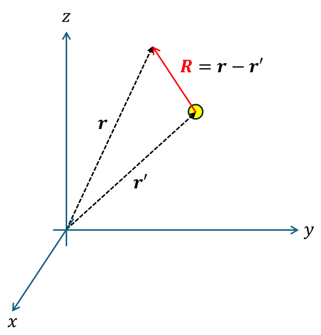

+++
title = "(i) Divergence for free-space"
weight = 5
+++

---

### 0. 정리

그린 함수는 항상 소스점 r'을 기준으로 정의된다.

- 3D 좌표계

$$
\nabla\cdot\hat{R}G\left(\vec{r},\vec{r}'\right)=\delta^3\left(\vec{r}-\vec{r}'\right)
$$

$$
G\left(\vec{r},\vec{r}'\right)=\frac{1}{4\pi\left|\vec{R}\right|^2}=\frac{1}{4\pi\left|\vec{r}-\vec{r}'\right|^2},\quad\vec{R}=\vec{r}-\vec{r}'
$$

- 2D 좌표계

$$
\nabla\cdot\hat{\rho}G\left(\vec{r},\vec{r}'\right)=\delta^2\left(\vec{r}-\vec{r}'\right)
$$

$$
G\left(\vec{r},\vec{r}'\right)=\frac{1}{2\pi\left|\vec{\rho}\right|}=\frac{1}{2\pi\left|\vec{r}-\vec{r}'\right|^2},\quad\vec{\rho}=\vec{r}-\vec{r}'
$$

---

### 1. 3D Divergence & Green function

$$
G\left(\vec{r},\vec{r}'\right)=\frac{1}{4\pi\left|\vec{R}\right|^2}=\frac{1}{4\pi\left|\vec{r}-\vec{r}'\right|^2},\quad\vec{R}=\vec{r}-\vec{r}'
$$

proof)

경계조건이 특정하게 주어져 있지 않은 경우, gradient 연산자는 이동 불변성을 만족한다. 미분 연산은 기울기 이기 때문에, 위치가 이동하더라도, 기울기는 변하지 않는다.

$$
R=\left|\vec{r}-\vec{r}'\right|
$$

$$
\nabla\cdot\hat{R}G\left(R\right)=\delta^3\left(R\right)
$$

$$
\nabla\cdot\hat{R}G\left(R\right)=\frac{1}{R^2}\frac{\partial}{\partial R}R^2\cdot G\left(R\right)=\frac{\delta\left(R\right)}{4\pi R^2}
$$

$$
R^2G\left(R\right)=\frac{1}{4\pi}u\left(R\right)
$$

$$
G\left(R\right)=\frac{1}{4\pi R^2},\quad R>0
$$

일반화하면, 다음과 같다.

$$
G\left(\vec{r},\vec{r}'\right)=\frac{1}{4\pi\left|\vec{R}\right|^2}=\frac{1}{4\pi\left|\vec{r}-\vec{r}'\right|^2},\quad\vec{R}=\vec{r}-\vec{r}'
$$

---

### 2. 2D Divergence & Green function

$$
G\left(\vec{r},\vec{r}'\right)=\frac{1}{2\pi\left|\vec{\rho}\right|}=\frac{1}{2\pi\left|\vec{r}-\vec{r}'\right|},\quad\vec{\rho}=\vec{r}-\vec{r}'
$$

proof)

경계조건이 특정하게 주어져 있지 않은 경우, 연산자는 이동 불변성을 만족한다. 미분 연산은 기울기 이기 때문에, 위치가 이동하더라도, 기울기는 변하지 않는다.

$$
\rho=\left|\vec{r}-\vec{r}'\right|
$$

$$
\nabla\cdot\hat{\rho}G\left(\rho\right)=\delta^2\left(\rho\right)
$$

$$
\nabla\cdot\hat{\rho}G\left(\rho\right)=\frac{1}{\rho}\frac{\partial}{\partial\rho}\rho\cdot G\left(\rho\right)=\frac{\delta\left(\rho\right)}{2\pi\rho}
$$

$$
\frac{\partial}{\partial\rho}\rho\cdot G\left(\rho\right)=\frac{\delta\left(\rho\right)}{2\pi}
$$

$$
\rho\cdot G\left(\rho\right)=\frac{1}{2\pi}u\left(\rho\right)
$$

$$
G\left(\rho\right)=\frac{1}{2\pi\rho},\quad\rho>0
$$

일반화하면, 다음과 같다.

$$
G\left(\vec{r},\vec{r}'\right)=\frac{1}{2\pi\left|\vec{\rho}\right|}=\frac{1}{2\pi\left|\vec{r}-\vec{r}'\right|},\quad\vec{\rho}=\vec{r}-\vec{r}'
$$

---

[(67) 6. 디랙 델타함수와 헬름홀츠의 정리 - YouTube](https://www.youtube.com/watch?v=24n9cscx-Ls&list=PLLWQoVH2Ys6jOBdvEr8PZChpprWlK7Ro_&index=7)

[디랙 델타 함수 - 나무위키](https://namu.wiki/w/%EB%94%94%EB%9E%99%20%EB%8D%B8%ED%83%80%20%ED%95%A8%EC%88%98#s-2.3)

[가우스 법칙과 디랙 델타 함수(Gauss's .. : 네이버블로그](https://blog.naver.com/qio910/221494296600)