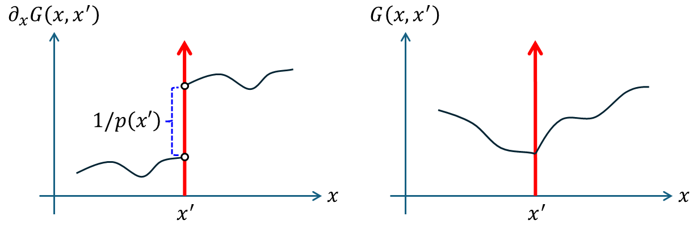

+++
title = "(i) Second-order PDE"
weight = 3
+++

---

### 1. Jump condition & Continuous

$$
\left\lbrack\frac{\partial}{\partial x}\left(p\left(x\right)\frac{\partial}{\partial x}\right)+q\left(x\right)\right\rbrack G\left(x,x'\right)=\delta\left(x-x'\right)
$$

$$
p\left(x\right),q\left(x\right):\text{ continous}
$$

위의 연산에 대해, 디렉 델타가 결과로 나오기 위해서는, $\partial_{x}\left(p\left(x\right)\partial_{x}\right)G\left(x,x'\right)$ 또는 $G\left(x,x'\right)$가 디렉 델타가 되어야 한다. $G\left(x,x'\right)$이 디렉 델타 라면, $x$에 대한 미분이 불가능 하기에, $G\left(x,x'\right)$이 디렉 델타가 될 수 없다. 따라서, $\partial_{x}\left(p\left(x\right)\partial_{x}\right)G\left(x,x'\right)$ 이 디렉 델타가 되어야 한다.

$$
\frac{\partial}{\partial x}\left(p\left(x\right)\frac{\partial}{\partial x}\right)G\left(x,x'\right)=\delta\left(x-x'\right)
$$

위로부터, $x'$과 **인접한 부분**에서, $\partial_{x}{\displaystyle G\left(x,x'\right)}$는 **불연속 함수인** **“단위 계단 함수”** 임을 알 수 있다. [*Characteristics of Dirac delta](https://www.notion.so/Characteristics-of-Dirac-delta-1cc8bc3f14068129a99ed044cc755420?pvs=21)

$$
p\left(x\right)\frac{\partial}{\partialx}G\left(x,x'\right)=u\left(x-x'\right)\implies\frac{\partial}{\partialx}G\left(x,x'\right)=\frac{1}{p\left(x\right)}u\left(x-x'\right)
$$

$x'$과 **인접한 부분**에서 위 식을 적분하면, G(x,x')은 **연속 함수**가 나옴을 알 수 있다. 위 그린함수의 형태를 그려보면 다음과 같다.

ℹ️ 선형연산자 L이 2차 미분일 경우,

- Jump condition, $DG\left(x,x'\right)$는 $x=x'$에서 불연속이다.

- Continuous, $G\left(x,x'\right)$는 $x=x'$에서 연속이나, 좌우 미분값이 다르다.

---

### 2. General solution

$$
\left\lbrack\frac{\partial}{\partial x}\left(p\left(x\right)\frac{\partial}{\partial x}\right)+q\left(x\right)\right\rbrack G\left(x,x'\right)=\delta\left(x-x'\right)
$$

(1) $x\ne x'$

$$
LG\left(x,x')\right.=0
$$

$$
G\left(x,x'\right)
=\begin{cases}
    c_1\left(x'\right)u_1\left(x\right) & x < x'
    \\
    c_2\left(x'\right)u_2\left(x\right) & x > x'
\end{cases}
$$

&emsp;&emsp;&emsp;&emsp;Boundary condition 사용하여, 계수들 중 일부를 구한다.

(2) $x=x'$

$$
LG\left(x,x')=\delta(x-x'\right)
$$

$$
\int_{x_{>}'}^{x_{<}'}LG\left(x,x'\right)dx=\int_{x_{>}'}^{x_{<}'}\delta\left(x-x'\right)dx=1
$$

$$
\int_{x_{>}'}^{x_{<}'}dx\left\lbrack\frac{\partial}{\partial x}\left(p\left(x\right)\frac{\partial}{\partial x}\right)G\left(x,x'\right)+q\left(x\right)G\left(x,x'\right)\right\rbrack=1
$$

$$
p\left(x\right)\frac{\partial}{\partial x}\left.G\left(x,x'\right)\right|_{x_{<}'}-p\left(x\right)\frac{\partial}{\partial x}\left.G\left(x,x'\right)\right|_{x_{>}'}+\int_{x_{>}'}^{x_{<}'}dx\left\lbrack q\left(x\right)G\left(x,x'\right)\right\rbrack=1
$$

여기에서,

$$
\int_{x_{>}'}^{x_{<}'}dx\left\lbrack q\left(x\right)G\left(x,x'\right)\right\rbrack=0
$$

따라서,

$$
p\left(x\right)\frac{\partial}{\partial x}\left.G\left(x,x'\right)\right|_{x_{<}'}-p\left(x\right)\frac{\partial}{\partial x}\left.G\left(x,x'\right)\right|_{x_{>}'}=1
$$

$$
\implies c_2\left(x'\right)u_2'\left(x_{<}'\right)-c_1\left(x'\right)u_1'\left(x_{>}'\right)=\frac{1}{p(x')}
$$

&emsp;&emsp;&emsp;&emsp;이것을 jump condition 라고 한다.

(3) 연속성을 이용하여, 나머지 해의 계수를 구한다.

$$
G\left(x_{>}',x'\right)=G\left(x_{<}',x'\right)\implies c_1\left(x'\right)u_1\left(x'\right)=c_2\left(x'\right)u_2\left(x'\right)
$$

---

### 3. Wronskian solution

위 내용 중, 연속성과  jump condition 을 다시 써보면, 다음과 같다.

$$
c_1\left(x'\right)u_1\left(x'\right)-c_2\left(x'\right)u_2\left(x'\right)=0
$$

$$
c_2\left(x'\right)u_2'\left(x'\right)-c_1\left(x'\right)u_1'\left(x'\right)=\frac{1}{p(x')}
$$

위 식은 다음과 같다.

$$
\left[\begin{matrix}
    u_1 & u_2
    \\
    u_1' & u_2'
\end{matrix}\right]
\left[\begin{matrix}
    c_1
    \\
    -c_2
\end{matrix}\right]=
\left[\begin{matrix}
    0
    \\
    -\frac{1}{p\left(x'\right)}
\end{matrix}\right]
$$

$$
\left[\begin{matrix}
    c_1
    \\
    -c_2
\end{matrix}\right]=
\frac{1}{p\left(x'\right)W}
\left[\begin{matrix}
    u_2' & -u_2
    \\
    -u_1' & u_1
\end{matrix}\right]
\left[\begin{matrix}
    0
    \\
    -1
\end{matrix}\right]
$$

따라서,

$$
W=u_1\left(x'\right)u_2'\left(x'\right)-u_2\left(x'\right)u_1'\left(x'\right)
$$

$$
c_1\left(x'\right)=\frac{u_2\left(x'\right)}{p\left(x'\right)W},\quad c_2\left(x'\right)=\frac{u_1\left(x'\right)}{p\left(x'\right)W}
$$

---

**example1)**

해석범위 $x\in\left\lbrack0,\pi\right\rbrack$이고, 초기값 $G\left(0,x'\right)=0$, $G\left(\pi,x'\right)=0$이다.  $G\left(x,x'\right)$을 구하여라.

$$
\frac{\partial^2}{\partial x^2}G\left(x,x'\right)=\delta\left(x-x'\right)
$$


    
(1) $x\ne x'$
    
Boundary condition 을 만족하는 해의 형태를 구한다.
    
$$
G\left(0,x'\right)=G\left(\pi,x'\right)=0
$$
    
$$
G\left(x,x'\right)=
\begin{cases}
    c_1\left(x'\right)x & x < x'
    \\
    c_2\left(x'\right)\left(-\pi+x\right) & x > x'
\end{cases}
$$
    
(2) $x=x'$
    
Jump condition 을 적용한다.
    
$$
c_2-c_1=1
$$
    
연속성을 이용한다.
    
$$
c_1x'=c_2\left(-\pi+x'\right)\implies c_2=\frac{x'}{\pi}
$$
    
$$
c_1=\frac{x'}{\pi}-1
$$
    
따라서,
    
$$
G\left(x,x'\right)=
\begin{cases}
    \left(\cfrac{x'}{\pi}-1\right)x  & x < x'
    \\
    \left(\cfrac{x}{\pi}-1\right)x' & x > x'
\end{cases}
$$




    
Boundary condition 을 만족하는 해의 형태를 구한다.

  
    
$$
G\left(0,x'\right)=G\left(\pi,x'\right)=0
$$
    
$$
G\left(x,x'\right)=
\begin{cases}
    c_1\left(x'\right)x & x < x'
    \\
    c_2\left(x'\right)\left(-1+\frac{x}{\pi}\right) & x > x'
\end{cases}
$$
    
Wronskian 을 사용하여 계수를 구한다.
    
$$
W=u_1\left(x'\right)u_2'\left(x'\right)-u_2\left(x'\right)u_1'\left(x'\right)=\frac{x'}{\pi}-\left(-1+\frac{x'}{\pi}\right)=1
$$
    
$$
c_1\left(x'\right)=\frac{u_2\left(x'\right)}{W}=-1+\frac{x'}{\pi}
$$
    
$$
c_2\left(x'\right)=\frac{u_1\left(x'\right)}{W}=x'
$$
    
따라서, 해는 다음과 같다.
    
$$
G\left(x,x'\right)=
\begin{cases}
    \left(\cfrac{x'}{\pi}-1\right)x & x < x'
    \\
    \left(\cfrac{x}{\pi}-1\right)x' & x > x'
\end{cases}
$$



**example2)**

해석범위 $x\in\left(-\infty,\infty\right)$이고, 초기값 $\partial_{x}G\left(0,x'\right)=0$, $\partial_{x}G\left(l,x'\right)=0$이다. $G\left(x,x'\right)$을 구하여라.

$$
\left(\frac{\partial^2}{\partial x^2}+k^2\right)G\left(x,x'\right)=\delta\left(x-x'\right)
$$



공사중

(1) $x\ne x'$ 

Boundary condition 을 만족하는 해의 형태를 구한다.

(2) $x=x'$

Jump condition 을 적용한다.

연속성을 이용한다.

따라서,





Boundary condition 을 만족하는 해의 형태를 구한다.

  
    
$$
\partial_{x}G\left(0,x'\right)=\partial_{x}G\left(l,x'\right)=0
$$
    
$$
G\left(x,x'\right)=
\begin{cases}
    c_1\left(x'\right)\cos kx & x < x'
    \\
    c_2\left(x'\right)\cos k\left(l-x\right) & x > x'
\end{cases}
$$
    
Wronskian 을 사용하여 계수를 구한다.

$$
W=k\sin kl,\quad c_1\left(x'\right)=\frac{\cos k\left(x'-l\right)}{k\sin kl},\quad c_2\left(x'\right)=\frac{\cos kx'}{k\sin kl}
$$

따라서, 해는 다음과 같다.

$$
G\left(x,x'\right)=
\begin{cases}
    \cfrac{\cos k\left(x'-l\right)}{k\sin kl}\cos kx & x < x'
    \\ 
    \cfrac{\cos kx'}{k\sin kl}\cos k\left(x-l\right) & x > x'
\end{cases}
$$



---

[7.2: Boundary Value Green’s Functions - Mathematics LibreTexts](https://math.libretexts.org/Bookshelves/Differential_Equations/Introduction_to_Partial_Differential_Equations_(Herman)/07%3A_Green's_Functions/7.02%3A_Boundary_Value_Greens_Functions)

[그린 함수(Green's Functions) : 네이버 블로그](https://blog.naver.com/qio910/222068013070?trackingCode=rss)