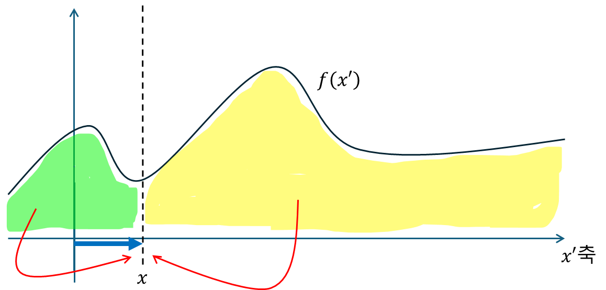
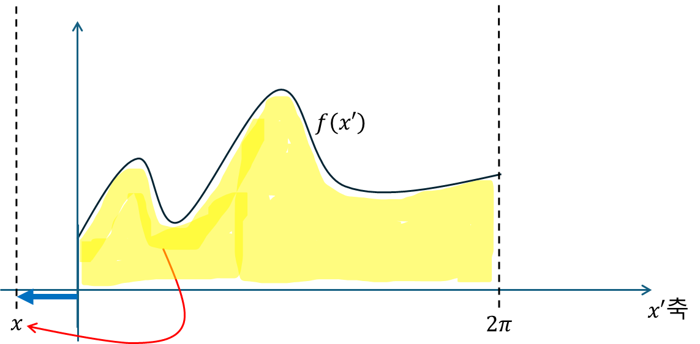
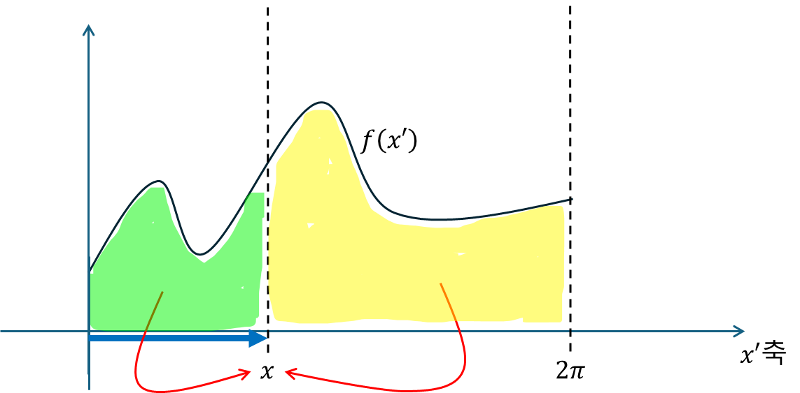
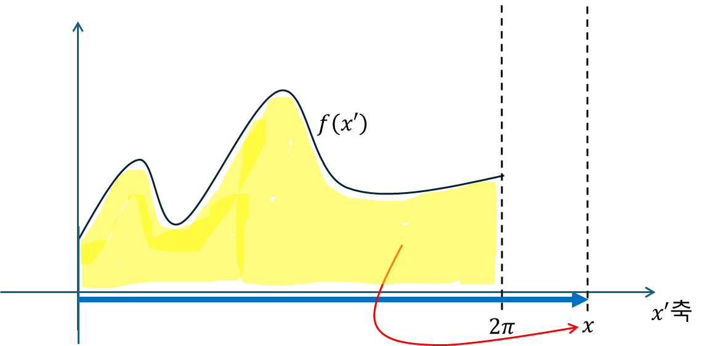
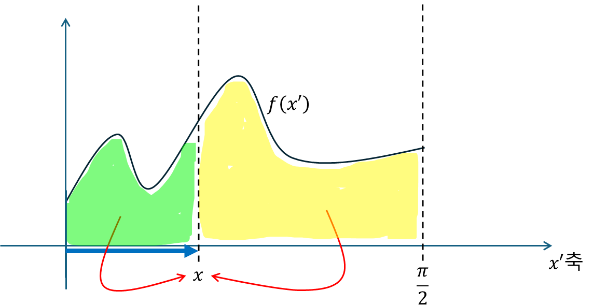

+++
title = "(p) Green function examples"
weight = 4
+++

---

Find the general solution of the given differential equations. Don't evaluate the integral that defines $ y_{p}(x)$.

**example1-1)**

$$y''-16y=xe^{-2x}, \quad x\in(-∞,∞)$$


   
$$
D^2-16=0
$$
    
$$
y_{p}=\frac{1}{\left(D+4\right)\left(D-4\right)}\left\lbrack xe^{-2x}\right\rbrack=\frac{e^{-2x}}{\left(D+2\right)\left(D-6\right)}\left\lbrack x\right\rbrack
$$
    
$$
=\frac{e^{-2x}}{D^2-4D-12}\left\lbrack x\right\rbrack=-\frac{e^{-2x}}{12}\cdot\left\lbrace1-\frac13D+\frac{1}{12}D^2\right\rbrace\left\lbrack x\right\rbrack=-\frac{e^{-2x}}{12}\left(x-\frac13\right)
$$




    
(1) $x\ne x'$
    
$$
\left(D^2-16\right)G\left(x,x'\right)=0
$$
    
경계조건에서 0이어야 하므로,
    
$$
G\left(x,x'\right)=
\begin{cases}
    c_1\left(x'\right)e^{4x} & x < x'
    \\
    c_2\left(x'\right)e^{-4x} & x > x'
\end{cases}
$$
    
(2) $x=x'$
    
$$
W=\left|\left[\begin{matrix}
    e^{4x} & e^{-4x}
    \\
    4e^{4x} & -4e^{-4x}
\end{matrix}\right]\right|
=-4-4=-8
$$
    
$$
c_1=-\frac{e^{-4x'}}{8},\quad c_2=-\frac{e^{4x'}}{8}
$$
    
(3) $y_{p}(x)$
    

    
$$
y_{p}=-\frac18\int_{x}^{\infty}dx'\left\lbrack e^{-4x'}e^{4x}\cdot x'e^{-2x'}\right\rbrack-\frac18\int_{-\infty}^{x}dx'\left\lbrack e^{4x'}e^{-4x}\cdot x'e^{-2x'}\right\rbrack
$$
    
$$
=-\frac{e^{4x}}{8}\int_{x}^{\infty}dx'\left\lbrack x'e^{-6x'}\right\rbrack-\frac{e^{-4x}}{8}\int_{-\infty}^{x}dx'\left\lbrack x'e^{2x'}\right\rbrack
$$
    
문제에서는 전개하지 않아도 된다 했으나, 위의 결과와 비교해 본다.
    
$$
\int_{x}^{\infty}dx'\left\lbrack x'e^{-6x'}\right\rbrack=\left\lbrack-\frac16x'e^{-6x'}-\frac{1}{36}e^{-6x'}\right\rbrack_{x}^{\infty}=\frac16xe^{-6x}+\frac{1}{36}e^{-6x}
$$
    
$$
\int_{-\infty}^{x}dx'\left\lbrack x'e^{2x'}\right\rbrack=\left\lbrack\frac12x'e^{2x'}-\frac14e^{2x'}\right\rbrack_{-\infty}^{x}=\frac12xe^{2x}-\frac14 e^{2x}
$$
    
$$
y_{p}=-\frac18\left\lbrack\frac16xe^{-2x}+\frac{1}{36}e^{-2x}+\frac12xe^{-2x}-\frac14e^{-2x}\right\rbrack
$$
    
$$
=-\frac18\left\lbrack\frac23xe^{-2x}-\frac29e^{-2x}\right\rbrack=-\frac{e^{-2x}}{12}\left(x-\frac13\right)
$$



**example1-2)**

$$y''+2y'+y=e^{-x}, x\in[0,∞)$$



$$
\left(D+1\right)^2=0
$$
    
$$
y_{p}=\frac{1}{\left(D+1\right)^2}\left\lbrack e^{-x}\right\rbrack=\frac{x^2}{2}e^{-x}
$$


    

    
(1) $x\ne x'$
    
$$
\left(D+1\right)^2G\left(x,x'\right)=0
$$
    
경계조건에서 0이어야 하므로,
    
$$
G\left(x,x'\right)
=\begin{cases}
   0 & x < x'
   \\
   c_2\left(x'\right)\left(a+x\right)e^{-x} & x > x'
\end{cases}
$$
    
(2) $x=x'$

 
    
continuous 조건
    
$$
a=-x'
$$
    
jump condition
    
$$
1=\frac{\partial}{\partial x}\left\lbrack c_2\left(x'\right)\left(-x'+x\right)e^{-x}\right\rbrack_{x=x'}=c_2\left(x'\right)e^{-x'}
$$
    
$$
c_2\left(x'\right)=e^{x'}
$$
    
따라서,
    
$$
G\left(x,x'\right)=
\begin{cases}
    0 & x < x'
    \\
    e^{x'}\left(-x'+x\right)e^{-x} & x > x'
\end{cases}
$$
    
(3) $y_{p}(x)$
    

    
$$
y_{p}=\int_0^{x}dx'\left\lbrack e^{x'}\left(-x'+x\right)e^{-x}\cdot e^{-x'}\right\rbrack=-e^{-x}\int_0^{x}dx'\left\lbrack x'\right\rbrack+xe^{x}\int_0^{x}dx'
$$
    
$$
=\frac{x^2}{2}e^{-x}
$$



**example1-3)**

$$y''+9y=x+\sin x,\quad x\in[0,∞)$$


  
$$
D^2+9=0
$$
    
$$
y_{p1}=\frac{1}{D^2+9}\left\lbrack x\right\rbrack=\frac19\cdot\left(1\right)x=\frac19x
$$
    
$$
y_{p2}=\frac{1}{D^2+9}\operatorname{Im}\left\lbrack e^{jx}\right\rbrack=\operatorname{Im}\left\lbrack\frac18e^{jx}\right\rbrack=\frac18\sin x
$$


    

    
(1) $x\ne x'$
    
$$
\left(D^2+9\right)G\left(x,x'\right)=0
$$
    
(2) $x=x'$

qqq

(3) $y_{p}(x)$

qqq



**example2) 중요**

Solve the initial-value problem

$$
y''+4y=\sin2x,\quad y\left(0\right)=1,\quad y'\left(0\right)=-2
$$


    
특수해
    
$$
D^2+4=0
$$
    
$$
y_{p}=\frac{1}{D^2+4}\operatorname{Im}\left\lbrack e^{j2x}\right\rbrack=\frac{1}{\left(D-j2\right)\left(D+2j\right)}\operatorname{Im}\left\lbrack e^{j2x}\right\rbrack
$$
    
$$
=\operatorname{Im}\left\lbrack\frac{x}{4j}\left(\cos2x+j\sin2x\right)\right\rbrack=-\frac{x}{4}\cos2x
$$
    
일반해
    
$$
y_{h}=c_1\cos2x+c_2\sin2x
$$
    
최종해
 
$$
c_1=1
$$
    
$$
2c_2-\frac14=-2\to c_2=-\frac78
$$
    
$$
y=\cos2x-\frac78\sin2x-\frac{x}{4}\cos2x
$$

    
    


(1) $x\ne x'$
    
$$
\left(D^2+4\right)G\left(x,x'\right)=0
$$
    
$$
G\left(x,x'\right)
=\begin{cases}
    0 & x < x'
    \\
    c_2\left(x'\right)\left(a\sin2x+b\cos2x\right) & x > x'
\end{cases}
$$
    
(2) $x=x'$
    
continuous
    
$$
G\left(x,x'\right)
=\begin{cases}
    0 & x < x'
    \\
    c_2\left(x'\right)\sin2\left(x-x'\right) & x > x'
\end{cases}
$$
    
jump condition
    
$$
c_2\left(x'\right)=\frac12
$$
    
(3) y$_{p}$(x)

$$
y_{p}=\int_0^{x}dx'\left\lbrack\frac12\sin2\left(x-x'\right)\cdot\sin2x'\right\rbrack+\int_{x}^{2\pi}dx'\left\lbrack0\cdot\sin2x'\right\rbrack
$$
    
$$
=\frac12\int_0^{x}dx'\left\lbrack-\frac12\cos2x+\frac12\cos2\left(x-2x'\right)\right\rbrack
$$
    
$$
=-\frac{x}{4}\cos2x+\frac14\int_0^{x}dx'\left\lbrack\cos2\left(x-2x'\right)\right\rbrack
$$
    
$$
=-\frac{x}{4}\cos2x-\frac{1}{16}\left.\sin2\left(x-2x'\right)\right|_{x'=0}^{x}=-\frac{x}{4}\cos2x-\frac{1}{16}\left(\sin2\left(-x\right)-\sin2x\right)
$$
    
$$
=-\frac{x}{4}\cos2x+\frac18\sin2x
$$
    
특수해

$$
y_{h}=c_1\cos2x+c_2\sin2x
$$
    
boundary condition 적용한다.
    
$$
c_1=1
$$
    
$$
2c_2=-2\to c_2=-1
$$
    
$$
y_{h}=\cos2x-\sin2x
$$
    
최종해
    
$$
y=\cos2x-\frac78\sin2x-\frac{x}{4}\cos2x
$$



**example3) 매우중요**

Solve the initial-value problem

$$
y''+4y=f\left(x\right),\quad y\left(0\right)=1,\quad y'\left(0\right)=-2
$$

where the forcing function f is piecewise defined:

$$
f\left(x\right)
=\begin{cases}
    0 & x < 0
    \\
    \sin2x & 0 \le x \le 2\pi
    \\
    0 & x > 2\pi
\end{cases}
$$


    
$$
G\left(x,x'\right)
=\begin{cases}
    0 & x < x'
    \\
    \cfrac12\sin2\left(x-x'\right) & x > x'
\end{cases}
$$
    
(1) $x<0$
    

$$
y_{p}=\int_0^{2\pi}dx'\left\lbrack0\cdot\sin2x'\right\rbrack=0
$$
    
적분범위를 유심히 살펴본다.

  
    
(2) $0\le x\le2\pi$

    
$$
y_{p}=\int_0^{x}dx'\left\lbrack\frac12\sin2\left(x-x'\right)\cdot\sin2x'\right\rbrack+\int_{x}^{2\pi}dx'\left\lbrack0\cdot\sin2x'\right\rbrack
$$
    
$$
=-\frac{x}{4}\cos2x+\frac18\sin2x
$$
    
(3) $2\pi < x$

    
$$
y_{p}=\int_0^{2\pi}dx'\left\lbrack\frac12\sin2\left(x-x'\right)\cdot\sin2x'\right\rbrack
$$
    
$$
=-\frac{2\pi}{4}\cos4\pi+\frac18\sin4\pi=-\frac{\pi}{2}
$$

 

적분범위를 유심히 살펴본다.



    

**example4)**

Solve the boundary-value problem

$$
y''+4y=2,\quad y'\left(0\right)=0,\quad y\left(\frac{\pi}{2}\right)=0
$$


    
(1) $x\ne x'$
    
$$
\left(D^2+4\right)G\left(x,x'\right)=0
$$
    
$$
G\left(x,x'\right)
=\begin{cases}
    c_1\left(x'\right)\cos2x & x < x'
    \\
    c_2\left(x'\right)\sin2x & x > x'
\end{cases}
$$
    
(2)$x=x'$
    
$$
W=
\left|\left[\begin{matrix}
    \cos2x & \sin2x
    \\
    -2\sin2x & 2\cos2x
\end{matrix}\right]\right|
=2
$$
    
$$
c_1=\frac{\sin2x'}{2},\quad c_2=\frac{\cos2x'}{2}
$$
    
(3) $y_{p}(x)$

    
$$
y_{p}=\int_0^{x}dx'\left\lbrack\cos2x'\sin2x\right\rbrack+\int_{x}^{\frac{\pi}{2}}dx'\left\lbrack\sin2x'\cos2x\right\rbrack
$$
    
$$
=\sin2x\int_0^{x}dx'\left\lbrack\cos2x'\right\rbrack+\cos2x\int_{x}^{\frac{\pi}{2}}dx'\left\lbrack\sin2x'\right\rbrack
$$
    


**example5)**

Solve the boundary-value problem

$$
x^2y''-3xy'+3y=24x^5,\quad y\left(1\right)=0,\quad y\left(2\right)=0
$$


    
스트룸-리우빌 형태로 변형한다.

  
    
$$
\left\lbrack\left(D^2-\frac{3}{x}D\right)+\frac{3}{x^2}\right\rbrack y=24x^3
$$
    
$$
r\left(x\right)=\exp\left\lbrace\int dx\left\lbrack\frac{3}{x}\right\rbrack\right\rbrace=x^3
$$
    
$$
\left\lbrack D\left(x^3D\right)+3x\right\rbrack y=24x^6
$$
    
(1) $x\ne x'$
    
특성방정식은 아래와 같다.
    
$$
\left(\lambda-3\right)\left(\lambda-1\right)=0
$$
    
$$
G\left(x,x'\right)
=\begin{cases}
    c_1\left(x'\right)\left(ax^3+x\right) & x < x'
    \\
    c_2\left(x'\right)\left(x^3+bx\right) & x > x'
\end{cases}
$$
    
$$
a=-1,b=-4
$$
    
(2) $x=x'$
    
$$
W=
\left|\left[\begin{matrix}
    -x^3+x & x^3-4x
    \\
    -3x^2+1 & 3x^2-4
\end{matrix}\right]\right|
=-6x^3
$$
    
$$
c_1=\frac{x'^3-4x'}{-6x'^6}=-\frac{x'^2-4}{6x'^5}
$$

$$
c_2=\frac{-x'^3+x'}{-6x'^6}=\frac{x'^2-1}{6x'^5}
$$
    
$$
G\left(x,x'\right)=
\begin{cases}
    \cfrac{x'^2-4}{6x'^5}\left(x^3-x\right) & x < x'
    \\
    \cfrac{x'^2-1}{6x'^5}\left(x^3-4x\right) &  x >x'
\end{cases}
$$
    
(3) $y_{p}(x)$
    
$$
y_p(x) = 6(4x - x^3) (\ln \left|x^4 - 4\right| - \ln 3) + 6(x - x^3) (16 - x^4)
$$


    
---

[그린 함수(Green's Functions) : 네이버 블로그](https://blog.naver.com/qio910/222068013070?)