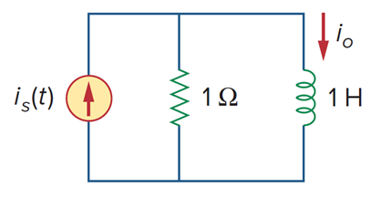
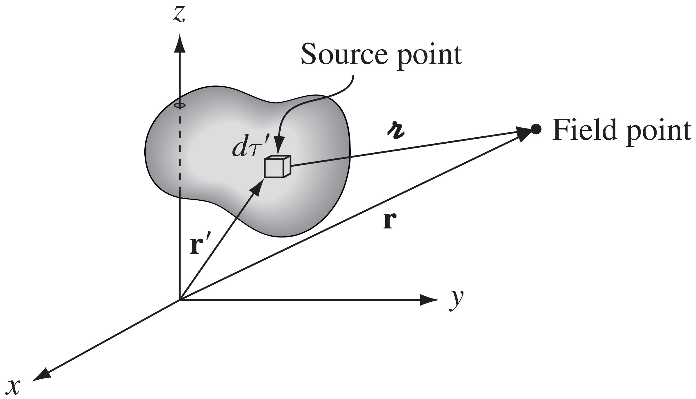

+++
title = "Preface"
weight = 1
+++

---

그린함수는 미분방정식의 특수해를 찾는데 사용되는 기법이다.
아래는 그린함수를 미분의 관점(임펄스 응답)과 적분의 관점(중첩)에서 설명한다.

---

### 1. Green function & 미분

미분연산자 $\operatorname{L}$ 에 대한 미분방정식은 아래와 같이 쓸 수 있다.

$$
Ly=f
$$

f 는 source 이다. 회로라면, f 는 전원 소스로서 생각할 수 있다. 다른 관점으로 보면, 전압 신호가 회로에 입력된다고도 볼 수 있다. 즉, **입력 신호**로 볼 수 있다.만약, t' 초에서 입력된 신호가 dirac delta 라면, $f(t)=\delta(t-t')$ 으로 쓸 수 있다. 이 때, 이 f를 만족하는 $y$를 $G(t,t')$ 이라고 할 수 있으며, 이것을 그린함수라고 한다. 컨볼루션과 임펄스 응답과 동일한 개념임을 상기하라.

$$
LG(t,t')=\delta(t-t')
$$

위 를 사용하여, $Ly=f$ 를 만족하는 특수해를 구할 수 있다.

$$
LG(t,t')f(t')=\delta(t-t')f(t')
$$

양변을 t' 에 대해 적분한다.

$$
\int dt'\left[LG(t,t')f(t')\right]
=\int dt'\left[\delta(t-t')f(t')\right]
$$

왼쪽 항

$$
\int dt'\left[LG(t,t')f(t')\right]
=L\int dt'\left[G(t,t')f(t')\right]
$$

오른쪽 항

$$
\int dt'\left[\delta(t-t')f(t')\right]
=f(t)
$$

두 식이 같음을 이용하면,

$$
L\int dt'\left[G(t,t')f(t')\right]
=f(t)
$$

$$
y_p=\int dt'\left[G(t,t')f(t')\right]
$$

위의 개념을 사용하여, 아래 회로의 전달함수를 구해보자.

회로에 대한 미분방정식은 다음과 같다.

$$
i_{s}=v+i_{o},\quad v=Di_{o}
$$

입력에 디렉 델타 함수를 넣으면, 전달함수를 구할 수 있다.

$$
\delta\left(t\right)=\left(D+1\right)h\left(t\right)
$$

위의 미분방정식을 풀어야 한다. **source 항이 디렉 델타로 표현되었을 때, 이 식을 만족하는 미분방정식의 해를 그린함수(시스템 관점에서는 임펄스 응답)라고 하며, 이 그린함수를 구하는 것이 목적**이다.

(1) $t\ne0$

일반적인 제차 미분방정식의 풀이이다.

$$
h\left(t\right)=Ae^{-t}
$$

(2) $t=0$

미분방정식의 양변을 적분한다.

$$
\int_0^{0<}dt\left\lbrack\delta\left(t\right)\right\rbrack=\int_0^{0<}dt\left\lbrack\left(D+1\right)h\left(t\right)\right\rbrack 
$$

$$
1=\int_0^{0<}dt\left\lbrack Dh\left(t\right)\right\rbrack+\int_0^{0<}dt\left\lbrack h\left(t\right)\right\rbrack 
$$

그린함수를 구할 때, 경계조건은 일반적으로 0으로 설정한다.

$$
1=h\left(0<\right)+h\left(0\right),\quad\int_0^{0<}dt\left\lbrack h\left(t\right)\right\rbrack=0
$$

$$
1=h\left(0<\right) \implies A=1
$$

따라서, 임펄스 응답은 다음과 같다.

$$
h\left(t\right)=e^{-t}
$$

---

### 2. Green function & 적분

위와 같은 그림을 생각하면, 원천소스 특정 "점", f(r') 이 관측위치에 어떠한 결과를 만들어 낸다.  이를 수식으로 표현하면, 다음과 같다.

$$
G\left(\vec{r},\vec{r}'\right)f\left(\vec{r}'\right)
$$

이 모든 결과를 더하면, 천제 원천소스가 만들어 내는 총 결과를 구할 수 있다. 

$$u=\int_{r'}d^3\vec{r}'\left\lbrack G\left(\vec{r},\vec{r}'\right)f\left(\vec{r}'\right)\right\rbrack
$$

G는 그린함수로 kernel(커널)이다. 연산자 L로 지배방정식을 표현하자. u는 지배방정식의 해이므로 대입해 보자.

$$
Lu\left(\vec{r}\right)=f\left(\vec{r}\right)
$$

$$
L\int_{r'}d^3\vec{r}'\left\lbrack G\left(\vec{r},\vec{r}'\right)f\left(\vec{r}'\right)\right\rbrack=\int_{r'}d^3\vec{r}'\left\lbrack LG\left(\vec{r},\vec{r}'\right)f\left(\vec{r}'\right)\right\rbrack=f\left(\vec{r}\right)
$$

따라서,

$$
LG\left(\vec{r},\vec{r}'\right)=\delta\left(\vec{r}-\vec{r}'\right)
$$

그린함수 & 미분에서 G는 시스템에 임펄스를 넣어 도출되는 시스템 특성이라고 하였다. 임펄스를 특정 위치에서 source 라고 간주할 수 있다.