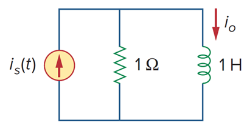

+++
title = "Preface"
weight = 1
+++

---

### 1. Green function & 미분

아래 회로의 전달함수를 구해보자.

회로에 대한 미분방정식은 다음과 같다.

$$
i_{s}=v+i_{o},\quad v=Di_{o}
$$

입력에 디렉 델타 함수를 넣으면, 전달함수를 구할 수 있다.

$$
\delta\left(t\right)=\left(D+1\right)h\left(t\right)
$$

위의 미분방정식을 풀어야 한다. **source 항이 디렉 델타로 표현되었을 때, 이 식을 만족하는 미분방정식의 해를 그린함수라고 하며, 이 그린함수를 구하는 것이 목적**이다.

(1) $t\ne0$

일반적인 제차 미분방정식의 풀이이다.

$$
h\left(t\right)=Ae^{-t}
$$

(2) $t=0$

미분방정식의 양변을 적분한다.

$$
\int_0^{0<}dt\left\lbrack\delta\left(t\right)\right\rbrack=\int_0^{0<}dt\left\lbrack\left(D+1\right)h\left(t\right)\right\rbrack 
$$

$$
1=\int_0^{0<}dt\left\lbrack Dh\left(t\right)\right\rbrack+\int_0^{0<}dt\left\lbrack h\left(t\right)\right\rbrack 
$$

$$
1=h\left(0<\right)+h\left(0\right),\quad\int_0^{0<}dt\left\lbrack h\left(t\right)\right\rbrack=0
$$

$$
1=h\left(0<\right) \implies A=1
$$

따라서, 최종해는 다음과 같다.

$$
h\left(t\right)=e^{-t}
$$

---

### 2. Green function & 적분

위와 같은 그림을 생각하면, 원천소스 특정 "점", f(r') 이 관측위치에 어떠한 결과를 만들어 낸다.  이를 수식으로 표현하면, 다음과 같다.

$$
G\left(\vec{r},\vec{r}'\right)f\left(\vec{r}'\right)
$$

이 모든 결과를 더하면, 천제 원천소스가 만들어 내는 총 결과를 구할 수 있다. 연산자 L로 지배방정식을 표현하고, 해를 표현하면, 다음과 같다.

$$
Lu\left(\vec{r}\right)=f\left(\vec{r}\right)
$$

$$u=\int_{r'}d^3\vec{r}'\left\lbrack G\left(\vec{r},\vec{r}'\right)f\left(\vec{r}'\right)\right\rbrack
$$

G는 그린함수로 kernel(커널)이다. u는 미분연산자에 대한 지배방정식의 해이므로 대입해 보자.

$$
Lu=L\int_{r'}d^3\vec{r}'\left\lbrack G\left(\vec{r},\vec{r}'\right)f\left(\vec{r}'\right)\right\rbrack
$$

$$
=\int_{r'}d^3\vec{r}'\left\lbrack LG\left(\vec{r},\vec{r}'\right)f\left(\vec{r}'\right)\right\rbrack
$$

$$
=f\left(\vec{r}\right)
$$

따라서,

$$
LG\left(\vec{r},\vec{r}'\right)=\delta\left(\vec{r}-\vec{r}'\right)
$$

그린함수 & 미분에서 G는 시스템에 임펄스를 넣어 도출되는 시스템 특성이라고 하였다. 임펄스를 특정 위치에서 source 라고 간주할 수 있다.