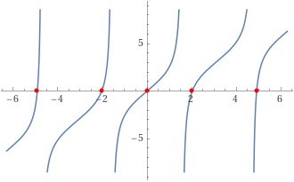

+++
title = "(p) ODE solution using SL"
weight = 5
+++

---

example1) Determine the normalized eigenfunctions of the problem

$$
y''+\lambda y=0,\quad y\left(0\right)=y\left(1\right)=0
$$



$φ_{n}$ 을 eigenfunction 이라고 하자.

$$
D^2\varphi_{n}=-\lambda_{n}w\left(x\right)\varphi_{n}
$$

w(x)=1로 놓으면,

$$
\left(D^2+\lambda_{n}\right)\varphi_{n}=0
$$

(1) $λ_{n}>0$

$$
\varphi_{n}=a_{n}\sin\sqrt{\lambda_{n}}x+b_{n}\cos\sqrt{\lambda_{n}}x
$$

(2) $λ_{n}<0$

$$
\varphi_{n}=a_{n}e^{-\sqrt{-\lambda_{n}}x}+b_{n}e^{+\sqrt{-\lambda_{n}}x}
$$

(3) $λ_{0}=0$

$$
\varphi_0=a_0+b_0x
$$

(1) $λ_{n}>0$

$$
\varphi_{n}=a_{n}\sin\sqrt{\lambda_{n}}_{}x+b_{n}\cos\sqrt{\lambda_{n}}x 
$$

$$
\varphi_{n}\left(0\right)=0=b_{n},\quad b_{n}=0 
$$

$$
\varphi_{n}\left(1\right)=0=a_{n}\sin\sqrt{\lambda_{n}},\quad\sqrt{\lambda_{n}}=n\pi,\,\,n=1,2,\cdots
$$

고유함수가 orthonormal 함을 사용하여, 계수 $a_{n}$을 구하면,

$$
\int_0^1dx\left\lbrack a_{n}\sin n\pi x\right\rbrack^2=1 
$$

$$
\left|a_{n}\right|^2\cdot\frac12\int_{-1}^1dx\left\lbrack\sin^2n\pi x\right\rbrack=\left|a_{n}\right|^2\cdot\frac12\cdot1=\frac{\left|a_{n}\right|^2}{2}=1 
$$

$$
\left|a_{n}\right|=\sqrt2 
$$

$$
\varphi_{n}=\sqrt{2}\sin n\pi x
$$

(2) $λ_{n}<0$

$$
\varphi_{n}=a_{n}e^{-\sqrt{-\lambda_{n}}x}+b_{n}e^{+\sqrt{-\lambda_{n}}x} 
$$

$$
\varphi_{n}\left(0\right)=0=a_{n}+b_{n} 
$$

$$
\varphi_{n}\left(1\right)=0=a_{n}e^{-\sqrt{-\lambda_{n}}}+b_{n}e^{+\sqrt{-\lambda_{n}}} 
$$

$$
a_{n}\left(e^{-\sqrt{-\lambda_{n}}}-e^{+\sqrt{-\lambda_{n}}}\right)=0 
$$

$$
a_{n}=0\text{ or }\lambda_{n}=0 
$$

$$
\varphi_{n}=0\text{ or 존재할 수 없음}
$$

(3) $λ_{0}=0$

$$
\varphi_0=a_0+b_0x
$$

$$
\varphi_0\left(0\right)=0=a_0,\quad a_0=0 
$$

$$
\varphi_0\left(1\right)=0=b_0,\quad b_0=0 
$$

$$
\varphi_0=0
$$

eigen-expansion을 수행한다.

$$
y''+\lambda y=0 
$$

$$
\sum\lambda_{n}c_{n}\varphi_{n}+\sum\lambda c_{n}\varphi_{n}=0\implies\sum\left(\lambda-\lambda_{n}\right)c_{n}\varphi_{n}=0
$$

orthogonality를 이용한다.

$$
\left(\lambda-\lambda_{n}\right)c_{n}=0,\quad c_{n}=\frac{\lambda}{\lambda_{n}} 
$$

$$
y=\sum_{n=1}^{N}\frac{\lambda}{\lambda_{n}}\sqrt{2}\sin n\pi x
$$





$φ_{n}$ 을 eigenfunction 이라고 하자.

$$
\left(D^2+\lambda\right)\varphi_{n}=-\lambda_{n}w\left(x\right)\varphi_{n}
$$

w(x)=1로 놓으면,

$$
\left(D^2+\lambda+\lambda_{n}\right)\varphi_{n}=0
$$

(1) $λ+λ_{n}\ne0$

$$
\varphi_{n}=a_{n}\sin\sqrt{\lambda_{n}+\lambda}x+b_{n}\cos\sqrt{\lambda_{n}+\lambda}x
$$

(2) $λ+λ_{n}$=0

$$
\varphi_{n}=a_{n}+b_{n}x
$$

(1) $λ+λ_{n}\ne0$

$$
\varphi_{n}=a_{n}\sin\sqrt{\lambda_{n}+\lambda}x+b_{n}\cos\sqrt{\lambda_{n}+\lambda}x 
$$

$$
\varphi_{n}\left(0\right)=0=b_{n},\quad b_{n}=0 
$$

$$
\varphi_{n}\left(1\right)=0=a_{n}\sin\sqrt{\lambda_{n}+\lambda},\quad\sqrt{\lambda_{n}+\lambda}=n\pi,\,\,n=1,2,\cdots
$$

계수 $a_{n}$을 구하면,

$$
\int_0^1dx\left\lbrack a_{n}\sin n\pi x\right\rbrack^2=1 
$$

$$
\left|a_{n}\right|^2\cdot\frac12\int_{-1}^1dx\left\lbrack\sin^2n\pi x\right\rbrack=\left|a_{n}\right|^2\cdot\frac12\cdot1=\frac{\left|a_{n}\right|^2}{2}=1 
$$

$$
\left|a_{n}\right|=\sqrt2 
$$

$$
\varphi_{n}=\sqrt{2}\sin n\pi x
$$

(2) $λ+λ_{n}=0$

$$
\varphi_{n}=a_{n}+b_{n}x 
$$

$$
\varphi_{n}\left(0\right)=0=a_{n},\quad a_{n}=0 
$$

$$
\varphi_{n}\left(1\right)=0=b_{n},\quad b_{n}=0 
$$

$$
\varphi_{n}=0
$$

eigen-expansion을 수행한다. 따라서,

$$
y=\sum_{n}c_{n}\sqrt{2}\sin n\pi x
$$



---

example2) Determine the normalized eigenfunctions of the problem

$$
y''+2y=-x,\quad y\left(0\right)=0,\quad y\left(1\right)+y'\left(1\right)=0
$$



$φ_{n}$ 을 eigenfunction 이라고 하자.

$$
D^2\varphi_{n}=-\lambda_{n}w\left(x\right)\varphi_{n}
$$

w(x)=1로 놓으면,

$$
\left(D^2+\lambda_{n}\right)\varphi_{n}=0
$$

(1) $λ_{n}$≠0

$$
\varphi_{n}=a_{n}\sin\sqrt{\lambda_{n}}x+b_{n}\cos\sqrt{\lambda_{n}}x
$$

(2) λ$_{n}$=0

$$
\varphi_{n}=a_{n}+b_{n}x
$$

$c_{n}$ 은 0이 아니어야 한다.

(1) $λ_{n}≠0$

$$
\varphi_{n}=a_{n}\sin\sqrt{\lambda_{n}}x+b_{n}\cos\sqrt{\lambda_{n}}x
$$

$$
\varphi_{n}\left(0\right)=0=b_{n},\quad b_{n}=0
$$

$$
\varphi_{n}\left(1\right)+\varphi_{n}'\left(1\right)=0=a_{n}\left(\sin\sqrt{\lambda_{n}}+\sqrt{\lambda_{n}}\cos\sqrt{\lambda_{n}}\right)
$$

$$
0=\sin\sqrt{\lambda_{n}}+\sqrt{\lambda_{n}}\cos\sqrt{\lambda_{n}}
$$

$$
0=\tan\sqrt{\lambda_{n}}+\sqrt{\lambda_{n}}
$$

계수 $λ_{n}$을 구하면,

  

$$
\lambda_{n}=2.0288,4.9132,7.9787,11.086,14.207,\cdots,\quad n=1,2,3,\cdots
$$

(2) $λ_{n}=0$

$$
\varphi_{n}=a_{n}+b_{n}x
$$

$$
\varphi_{n}\left(0\right)=0=a_{n},\quad a_{n}=0
$$

$$
\varphi_{n}\left(1\right)+\varphi_{n}'\left(1\right)=2b_{n}=0,\quad b_{n}=0
$$

따라서, λ$_{n}$=0 은 고유값이 될 수 없다.

고유함수의 계수를 구해보자.

$$
\int_0^1dx\left\lbrack a_{n}\sin\sqrt{\lambda_n}x\right\rbrack^2=1 
$$

$$
\left|a_{n}\right|^2\int_0^1dx\left\lbrack\sin^2\sqrt{\lambda_n}x\right\rbrack=\frac{\left|a_{n}\right|^2}{2}\int_0^1dx\left\lbrack1-\cos2\sqrt{\lambda_n}x\right\rbrack 
$$

$$
1=\frac{\left|a_{n}\right|^2}{2}\left(1-\left.\frac{1}{2\sqrt{\lambda_n}}\sin2\sqrt{\lambda_n}x\right|_0^1\right)=\frac{\left|a_{n}\right|^2}{2}\left(1-\frac{1}{2\sqrt{\lambda_n}}\sin2\sqrt{\lambda_n}\right) 
$$

$$
\left|a_{n}\right|^2=\frac{2}{1-\frac{1}{2\sqrt{\lambda_n}}\sin2\sqrt{\lambda_n}}
$$

since, $0=\sin\sqrt{\lambda_{n}}+\sqrt{\lambda_{n}}\cos\sqrt{\lambda_{n}}$

$$
\left|a_{n}\right|^2=\frac{2}{1+\cos^2\sqrt{\lambda_n}} 
$$

$$
\varphi_{n}=\frac{\sqrt{2}\sin\sqrt{\lambda_{n}}x}{\left(1+\cos^2\sqrt{\lambda_{n}}\right)^{1/2}}
$$

eigen-expansion 을 수행한다.

$$
y''=-2y-x 
$$

$$
\sum\lambda_{n}c_{n}\varphi_{n}=-2\sum c_{n}\varphi_{n}-x 
$$

$$
\sum\left(\lambda_{n}-2\right)c_{n}\varphi_{n}=x
$$

orthogonality 를 이용한다.

$$
\left(\lambda_{n}-2\right)c_{n}=\langle x\left|\right.\varphi_{n}\rangle 
$$

$$
c_{n}=\frac{1}{\lambda_{n}-2}\langle x\left|\right.\varphi_{n}\rangle 
$$

$$
\langle x|\varphi_{n}\rangle=\frac{\sqrt{2}}{\left(1+\cos^2\sqrt{\lambda_{n}}\right)^{1/2}}\int_0^1dx\left\lbrack x\sin\sqrt{\lambda_{n}}x\right\rbrack=\frac{2\sqrt2\sin\sqrt{\lambda_{n}}}{\lambda_{n}\left(1+\cos^2\sqrt{\lambda_{n}}\right)^{1/2}}
$$

따라서,

$$
y=\sum_{n=1}^{N}\frac{2\sqrt2\sin\sqrt{\lambda_{n}}\sin\sqrt{\lambda_{n}}x}{\lambda_{n}\left(\lambda_{n}-2\right)\left(1+\cos^2\sqrt{\lambda_{n}}\right)^{1/2}}
$$

 

<video controls autoplay loop style="display: block; margin: 0 auto; max-width: 60%; height: auto; object-fit: contain;">
  <source src="image2.mp4" type="video/mp4">
  Your browser does not support the video tag.
</video>





$$
y''+2y=-x
$$

$φ_{n}$ 을 eigenfunction 이라고 하자. 따라서, 위 미분 방정식의 해는

$$
y=\sum c_{n}\varphi_{n}
$$

eigenfunction 구하면,

$$
\left(D^2+2\right)\varphi_{n}=-\lambda_{n}w\left(x\right)\varphi_{n}
$$

w(x)=1로 놓으면,

$$
\varphi_{n}=a_{n}\sin\sqrt{2+\lambda_{n}}x+b_{n}\cos\sqrt{2+\lambda_{n}}x
$$

boundary condition을 적용한다. 따라서,

$$
\varphi_{n}\left(0\right)=0=b_{n},\quad b_{n}=0 
$$

$$
\varphi_{n}\left(1\right)+\varphi_{n}'\left(1\right)=0=a_{n}\left(\sin\sqrt{2+\lambda_{n}}+\sqrt{2+\lambda_{n}}\cos\sqrt{2+\lambda_{n}}\right) 
$$

$$
0=\tan\sqrt{2+\lambda_{n}}+\sqrt{2+\lambda_{n}}
$$

$2+λ_{n}$을 구하면,

$$
2+\lambda_{n}=2.0288,4.9132,7.9787,11.086,14.207,\cdots,\quad n=1,2,3,\cdots
$$

따라서,

$$
\lambda_{n}=0.0288,2.9132,5.9787,9.086,12.207,\cdots,\quad n=1,2,3,\cdots
$$

고유함수의 계수를 구해보자.

$$
\int_0^1dx\left\lbrack a_{n}\sin\sqrt{2+\lambda_{n}}x\right\rbrack^2=1 
$$

$$
\left|a_{n}\right|^2\int_0^1dx\left\lbrack\sin^2\sqrt{2+\lambda_{n}}x\right\rbrack=\frac{\left|a_{n}\right|^2}{2}\int_0^1dx\left\lbrack1-\cos2\sqrt{2+\lambda_{n}}x\right\rbrack 
$$

$$
1=\frac{\left|a_{n}\right|^2}{2}\left(1-\frac{1}{2\sqrt{2+\lambda_{n}}}\sin2\sqrt{2+\lambda_{n}}\right) 
$$

$$
\left|a_{n}\right|^2=\frac{2}{1-\frac{1}{2\sqrt{2+\lambda_{n}}}\sin2\sqrt{2+\lambda_{n}}}=\frac{2}{1-\frac{\sin\sqrt{2+\lambda_{n}}\cos\sqrt{2+\lambda_{n}}}{\sqrt{2+\lambda_{n}}}}
$$

since, $0=\sin\sqrt{2+\lambda_{n}}+\sqrt{2+\lambda_{n}}\cos\sqrt{2+\lambda_{n}}$

$$
\left|a_{n}\right|^2=\frac{2}{1+\cos^2\sqrt{2+\lambda_{n}}} 
$$

$$
\varphi_{n}=\frac{\sqrt{2}\sin\sqrt{2+\lambda_{n}}x}{\left(1+\cos^2\sqrt{2+\lambda_{n}}\right)^{1/2}}
$$

$$
y=\sum_{n=1}^{N}\frac{\langle \varphi_{n}|x \rangle}{\lambda_{n}}\varphi_{n} 
$$

$$
\langle x | \varphi_{n}\rangle=\frac{\sqrt{2}}{\left(1+\cos^2\sqrt{2+\lambda_{n}}\right)^{1/2}}\int_0^1dx\left\lbrack x\sin\sqrt{2+\lambda_{n}}x\right\rbrack
$$

$$
=\frac{2\sqrt2\sin\sqrt{1+\lambda_{n}}}{\left(2+\lambda_{n}\right)\left(1+\cos^2\sqrt{1+\lambda_{n}}\right)^{1/2}} 
$$

$$
y=\sum_{n=1}^{N}\frac{2\sqrt2\sin\sqrt{2+\lambda_{n}}\sin\sqrt{2+\lambda_{n}}x}{\lambda_{n}\left(2+\lambda_{n}\right)\left(1+\cos^2\sqrt{2+\lambda_{n}}\right)^{1/2}}
$$



---

example3) Determine the normalized eigenfunctions of the problem (필수)

$$
\left(xy'\right)'+\frac{y}{x}=\frac{1}{x},\quad y\left(1\right)=y\left(e\right)=0
$$



$$
D\left(xD\right)\varphi_{n}=-k_{n}^2w\left(x\right)\varphi_{n}
$$

w=1/x 로 놓는다. eigen-value 와 eigen-function 을 구한다.

$$
x^2\varphi_{n}''+x\varphi_n'+k_{n}^2\varphi_n=0 
$$

$$
D^2+k_{n}^2=0
$$

(1) $k_{n}\ne0$

$$
\varphi_{n}=a_{n}\sin\left(k_{n}\ln x\right)+b_{n}\cos\left(k_{n}\ln x\right)
$$

(2) $k_{n}=0$

$$
\varphi_{n}=a_{n}+b_{n}\ln x
$$

 
(1) $k_{n}\ne0$

Applying B.C

$$
\varphi_{n}\left(1\right)=0=b_{n} 
$$

$$
\varphi_{n}\left(e\right)=0=a_{n}\sin k_{n} 
$$

$$
k_{n}=n\pi,\quad n=1,2,3,\cdots 
$$

$$
\varphi_{n}=a_{n}\sin\left(n\pi\ln x\right)
$$

계수 $a_{n}$을 구하기 위해서는,

$$
\left|a_{n}\right|^2\int_1^{e}dx\left\lbrack\frac{\sin^2\left(n\pi\ln x\right)}{x}\right\rbrack=1
$$

$$
\int_1^{e}dx\left\lbrack\frac{\sin^2\left(n\pi\ln x\right)}{x}\right\rbrack=\frac12\int_1^{e}dx\left\lbrack\frac{1-\cos\left(2n\pi\ln x\right)}{x}\right\rbrack 
$$

$$
=\frac12\left\lbrack\left.\ln x\right|_1^{e}-\left.\frac{1}{2n\pi}\sin\left(2n\pi\ln x\right)\right|_1^{e}\right\rbrack=\frac12 
$$

$$
\left|a_{n}\right|=\frac{1}{\sqrt{2}} 
$$

$$
\varphi_{n}=\frac{1}{\sqrt{2}}\sin\left(n\pi\ln x\right)
$$

(2) $k_{n}=0$

$$
\varphi_{n}\left(1\right)=0=a_{n} 
$$

$$
\varphi_{n}\left(e\right)=0=b_{n} 
$$

$$
\varphi_{n}=0
$$

eigen-expansion을 수행한다.

$$
x\left(xy'\right)'-y=-1 
$$

$$
\sum_{n}c_{n}n^2\pi^2\varphi_{n}-\sum c_{n}\varphi_{n}=-1 
$$

$$
\sum c_{n}\varphi_{n}\left(1-n^2\pi^2\right)=1
$$

orthogonality 를 이용한다.

$$
c_{n}\int_1^{e}dx\left\lbrack\frac{\varphi_{n}\varphi_{n}^{\ast}}{x}\left(1-n^2\pi^2\right)\right\rbrack=\langle \varphi_{n}|1\rangle_{w} 
$$

$$
c_{n}\int_1^{e}dx\left\lbrack\frac{\varphi_{n}\varphi_{n}^{\ast}}{x}\left(1-n^2\pi^2\right)\right\rbrack=c_{n}\left(1-n^2\pi^2\right)
$$

$$
\langle \varphi_{n}|1 \rangle_{w}=\int_1^{e}dx\left\lbrack\frac{\sin\left(n\pi\ln x\right)}{\sqrt{2}x}\right\rbrack=-\frac{1}{\sqrt{2}n\pi}\cos\left(n\pi\ln x\right)\left|_1^{e}\right.=\frac{1}{\sqrt{2}n\pi}\left\lbrack \cos\left(n\pi\right)-1\right\rbrack 
$$

$$
c_{n}=\frac{1}{\sqrt{2}n\pi}\frac{\cos\left(n\pi\right)-1}{1-n^2\pi^2}
$$

따라서,

$$
y=\sum\frac{1}{2n\pi}\frac{\cos\left(n\pi\right)-1}{1-n^2\pi^2}\sin\left(n\pi\ln x\right)
$$





$$
\left\lbrack D\left(xD\right) -\frac1x \right\rbrack \varphi_{n}=-k_{n}^2w\left(x\right)\varphi_{n}
$$

w=1/x 로 놓는다. 그렇다면, 위 문제의 미분 방정식을 아래와 같이 변형된다.

$$
x\left(xy'\right)'-y=-1
$$

eigen-expansion 으로 표현된 해는 다음과 같다.

$$
y=\sum_{n=1}^{N}\frac{\langle \varphi_{n}|1 \rangle_{w}}{k_{n}^2}\varphi_{n}
$$

eigenfunction 을 구한다.

$$
x^2\varphi_{n}''+x\varphi_{n}'+\left(1+k_{n}^2\right)\varphi_{n}=0 
$$

$$
D^2+\left(1+k_{n}^2\right)=0 
$$

$$
\varphi_{n}=a_{n}\sin\left(\sqrt{1+k_{n}^2}\ln x\right)+b_{n}\cos\left(\sqrt{1+k_{n}^2}\ln x\right)
$$

Applying B.C

$$
\varphi_{n}\left(1\right)=0=b_{n} 
$$

$$
\varphi_{n}\left(e\right)=0=a_{n}\sin\sqrt{1+k_{n}^2} 
$$

$$
\sqrt{1+k_{n}^2}=n\pi,\quad n=1,2,3,\cdots
$$

여기에서, $k_{n}^{2}$ 는 다음과 같다.

$$
k_{n}^2=n^2\pi^2-1,\quad n=1,2,3,\cdots 
$$

$$
\varphi_{n}=a_{n}\sin\left(n\pi\ln x\right)
$$

계수 $a_{n}$ 구하기 위해서는,

$$
\left|a_{n}\right|^2\int_1^{e}dx\left\lbrack\frac{\sin^2\left(n\pi\ln x\right)}{x}\right\rbrack=1 
$$

$$
\int_1^{e}dx\left\lbrack\frac{\sin^2\left(n\pi\ln x\right)}{x}\right\rbrack=\frac12\int_1^{e}dx\left\lbrack\frac{1-\cos\left(2n\pi\ln x\right)}{x}\right\rbrack 
$$

$$
=\frac12\left\lbrack\left.\ln x\right|_1^{e}-\left.\frac{1}{2n\pi}\sin\left(2n\pi\ln x\right)\right|_1^{e}\right\rbrack=\frac12 
$$

$$
\left|a_{n}\right|=\frac{1}{\sqrt{2}} 
$$

$$
\varphi_{n}=\frac{1}{\sqrt{2}}\sin\left(n\pi\ln x\right)
$$

따라서,

$$
y=\sum_{n=1}^{N}\frac{\langle\varphi_{n}|1 \rangle_{w}}{k_{n}^2}\varphi_{n}
$$

$$
\langle \varphi_{n}|1 \rangle_{w} = \int_1^{e}dx\left\lbrack\frac{\sin\left(n\pi\ln x\right)}{\sqrt2x}\right\rbrack=-\frac{1}{\sqrt2n\pi}\cos\left(n\pi\ln x\right)\left|_1^{e}\right.
$$

$$
=\frac{1}{\sqrt2n\pi}\left\lbrack \cos\left(n\pi\right)-1\right\rbrack 
$$

$$
y=\sum\frac{1}{2n\pi}\frac{\cos\left(n\pi\right)-1}{1-n^2\pi^2}\sin\left(n\pi\ln x\right)
$$



---

[스트룸-리우빌 이론 - 공돌이의 수학정리노트 (Angelo's Math Notes)](https://angeloyeo.github.io/2021/06/06/Sturm_Liouville.html)