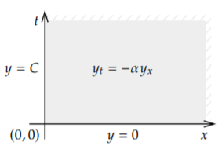
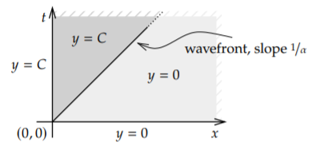

+++
title = "(a) Laplace transform for PDE"
weight = 3
+++

---

**라플라스 변환을 수행할 수 있는 조건**

- 적분 범위를 0부터 무한대로 잡을 수 있는 경계조건이어야 한다.

---

**example1) Consider the first order PDE**

$$
\frac{\partial}{\partial t}y\left(x,t\right)=-\alpha\frac{\partial}{\partial x}y\left(x,t\right),\quad x>0,\quad t>0
$$

$$
\text{[B.C]}\quad y\left(0,t\right)=C,\quad\text{[I.C]}\quad y\left(x,0\right)=0
$$


    

 
    
$$
sY\left(x,s\right)-y\left(x,0\right)=-\alpha\frac{\partial}{\partial x}Y\left(x,s\right)
$$
    
$$
\frac{\partial}{\partial x}Y\left(x,s\right)+\frac{s}{\alpha}Y\left(x,s\right)=0
$$
    
$$
Y\left(x,s\right)=c_1e^{-\frac{s}{\alpha}x}
$$
    
[B.C]을 라플라스 변환한다.
    
$$
Y\left(0,s\right)=\frac{C}{s}=c_1
$$
    
$$
Y\left(x,s\right)=\frac{C}{s}e^{-\frac{x}{\alpha}s}
$$
    
역라플라스 변환을 수행한다.
    
$$
L^{-1}\left\lbrace Y\left(x,s\right)\right\rbrace\left(x,t\right)=Cu\left(t-\frac{x}{\alpha}\right)
$$

 
    
 

 




   
$$
\frac{\partial}{\partial t}Y\left(s,t\right)=-\alpha\left\lbrace s Y\left(s,t\right)-y\left(0,t\right)\right\rbrace
$$
    
$$
\frac{\partial}{\partial t}Y\left(s,t\right)+\alpha sY\left(s,t\right)=\alpha C
$$
    
$$
Y\left(s,t\right)=c_1e^{-\alpha st}+\frac{C}{s}
$$
    
[I.C]을 라플라스 변환한다.
    
$$
Y\left(s,0\right)=0\to c_1=-\frac{C}{s}
$$
    
$$
Y\left(s,t\right)=-\frac{C}{s}e^{-\alpha st}+\frac{C}{s}
$$
    
역라플라스 변환을 수행한다.
    
$$
L^{-1}\left\lbrace Y\left(s,t\right)\right\rbrace\left(x,t\right)=Cu\left(x\right)-Cu\left(x-\alpha t\right)
$$



---

**example2) Consider**

$$
\frac{\partial}{\partial t}y\left(x,t\right)+\frac{\partial}{\partial x}y\left(x,t\right)+y\left(x,t\right)=0,\quad x>0,\quad t>0
$$

$$
\text{[B.C]}\quad y\left(0,t\right)=\sin t,\quad\text{[I.C]}\quad y\left(x,0\right)=0
$$


    
$$
sY\left(x,s\right)-y\left(x,0\right)+\frac{\partial}{\partial x}Y\left(x,s\right)+Y\left(x,s\right)=0
$$
    
$$
\frac{\partial}{\partial x}Y\left(x,s\right)+\left(s+1\right)Y\left(x,s\right)=0
$$
    
$$
Y\left(x,s\right)=c_1e^{-\left(s+1\right)x}
$$
    
[B.C]을 라플라스 변환한다.
    
$$
Y\left(0,s\right)=\frac{1}{s^2+1}=c_1
$$
    
$$
Y\left(x,s\right)=e^{-x}\frac{e^{-xs}}{s^2+1}
$$
    
역라플라스 변환을 수행한다.
    
$$
L^{-1}\left\lbrace Y\left(x,s\right)\right\rbrace\left(x,t\right)=e^{-x} \left\lbrack\sin t\cdot u\left(t\right)\right\rbrack _{t=x}=e^{-x}\sin\left(t-x\right)u\left(t-x\right)
$$
    


---

**example3) Let us use Laplace for the following problem**

$$
\frac{\partial}{\partial t}y\left(x,t\right)=\frac{\partial^2}{\partial x^2}y\left(x,t\right),\quad x>0,\quad t>0
$$

$$
\text{[B.C]}\quad y_{x}\left(0,t\right)=f\left(t\right),\quad\text{[I.C]}\quad y\left(x,0\right)=0
$$


    
$$
\frac{\partial}{\partial t}Y\left(s,t\right)=s^2Y\left(s,t\right)-sY\left(0,t\right)-y\left(0,t\right)
$$
    
위는 x에 대한 라플라스 변환이다. 그러나 I.C 을 적용하기가 힘들다. 따라서, t에 대한 라플라스 변환을 수행한다.
    
$$
sY\left(x,s\right)-y\left(x,0\right)=\frac{\partial^2}{\partial x^2}Y\left(x,s\right)
$$
    
$$
Y\left(x,s\right)=c_1e^{-\sqrt{s}x}+c_2e^{+\sqrt{s}x}
$$
    
수렴하기 위해서는 $c_{2}=0$ 이어야 한다.
    
$$
Y\left(x,s\right)=c_1e^{-\sqrt{s}x}
$$
    
[B.C]을 라플라스 변환한다.
    
$$
\frac{\partial}{\partial x}Y\left(0,s\right)=F\left(s\right)\implies\frac{\partial}{\partial x}Y\left(0,s\right)=-c_1\sqrt{s}=F\left(s\right)\implies c_1=-\frac{F\left(s\right)}{\sqrt{s}}
$$
    
$$
Y\left(x,s\right)=-\frac{F\left(s\right)}{\sqrt{s}}e^{-\sqrt{s}x}
$$
    
역라플라스 변환을 수행한다.
    
$$
L^{-1}\left\lbrace Y\left(x,s\right)\right\rbrace\left(x,t\right)=\frac{1}{2\pi i}\int_{c-i\infty}^{c+i\infty}ds\left\lbrack\frac{F\left(s\right)}{s}e^{-\sqrt{s}x}e^{st}\right\rbrack
$$
    


---

**example4) Consider the first order PDE**

$$
\frac{\partial}{\partial x}u\left(x,t\right)+\frac{\partial}{\partial t}u\left(x,t\right)=x,\quad x>0,\quad t>0
$$

$$
\text{[B.C]}\quad u\left(0,t\right)=0,\quad\text{[I.C]}\quad u\left(x,0\right)=0
$$



$$
sU\left(s,t\right)-u\left(0,t\right)+\frac{\partial}{\partial t}U\left(s,t\right)=\frac{1}{s^2}
$$
    
$$
\frac{\partial}{\partial t}U\left(s,t\right)+sU\left(s,t\right)=\frac{1}{s^2}
$$
    
일반해를 구한다.
    
$$
U_{h}\left(x,s\right)=c_1e^{-\sqrt{s}x}+c_2e^{+\sqrt{s}x}
$$
    
특수해를 구한다.
    
$$
U_{p}=\left.\frac{1}{D+s}\right|_{D=0}\frac{1}{s^2}=\frac{1}{s^3}
$$
    
따라서,
    
$$
U\left(s,t\right)=c_1e^{-st}+\frac{1}{s^3}
$$
    
계수$_{1}$구하고 적용한다.
    
$$
U\left(s,t\right)=\frac{1}{s^3}\left(1-e^{-st}\right)
$$
    
역라플라스 변환을 수행한다.
    
$$
L^{-1}\left\lbrace U\left(s,t\right)\right\rbrace\left(x,t\right)=\frac12x^2u\left(x\right)-\left.\frac12x^2u\left(x\right)\right|_{x=x-t}=\frac12x^2u\left(x\right)-\frac12\left(x-t\right)^2u\left(x-t\right)
$$
    


---

**example5)**

$$
\frac{\partial}{\partial t}u\left(x,t\right)=\frac{\partial^2}{\partial x^2}u\left(x,t\right),\quad 0 < x < 2,\quad t > 0
$$

$$
\text{[B.C]}\quad u\left(0,t\right)=0,\quad u\left(2,t\right)=0
$$

$$
\text{[I.C]}\quad u\left(x,0\right)=3\sin2\pi x
$$


    
$$
sU\left(x,s\right)-u\left(x,0\right)=\frac{\partial^2}{\partial x^2}U\left(x,s\right)
$$
    
$$
\frac{\partial^2}{\partial x^2}U\left(x,s\right)-sU\left(x,s\right)=-3\sin2\pi x
$$
    
일반해를 구한다.
    
$$
U_{h}\left(x,s\right)=c_1e^{-\sqrt{s}x}+c_2e^{+\sqrt{s}x}
$$
    
특수해를 구한다. 페이저 변환을 사용한다. (아래 풀이가 성립하려면, s가 실수여야 한다.)
    
$$
\left(-4\pi^2-s\right)U_{p}\left(x,s\right)=3i
$$
    
$$
U_{p}=\operatorname{Re}\left\lbrack\frac{-3i}{4\pi^2+s}e^{i2\pi x}\right\rbrack=\frac{3}{4\pi^2+s}\sin2\pi x
$$
    
따라서,
    
$$
U\left(x,s\right)=c_1e^{-\sqrt{s}x}+c_2e^{+\sqrt{s}x}+\frac{3}{4\pi^2+s}\sin2\pi x
$$
    
계수를 구하고 적용한다.
    
$$
U\left(0,s\right)=c_1+c_2=0
$$
    
$$
U\left(2,s\right)=c_1e^{-2\sqrt{s}}+c_2e^{+2\sqrt{s}}=0
$$
    
$$
c_1e^{-2\sqrt{s}}-c_1e^{+2\sqrt{s}}=0\implies c_1\left(e^{-2\sqrt{s}}-e^{+2\sqrt{s}}\right)=0
$$
    
s는 0이 아니여야 한다. 따라서, $c_{1}=c_{2}=0$ 이다. 여기서 중요한 사실을 기억해라. 연산자가 self-adjoint 하다면, 특수해는 전체해와 같다.
    
$$
U\left(x,s\right)=\frac{3}{4\pi^2+s}\sin2\pi x
$$
    
역라플라스 변환을 수행한다.
    
$$
L^{-1}\left\lbrace U\left(x,s\right)\right\rbrace\left(x,t\right)=3\sin2\pi x\cdot e^{-4\pi^2t}u\left(t\right)
$$



---

**example6)**

$$
\frac{\partial^2}{\partial t^2}u\left(x,t\right)=c^2\frac{\partial^2}{\partial x^2}u\left(x,t\right)+\sin\pi x,\quad 0 < x < 1,\quad t > 0
$$

$$
\text{[B.C]}\quad u\left(0,t\right)=u\left(1,t\right)=0
$$

$$
\text{[I.C]}\quad u\left(x,0\right)=0,\quad u_{t}\left(x,0\right)=0
$$


    
$$
s^2U\left(x,s\right)-sU\left(x,s\right)-u\left(x,0\right)=c^2\frac{\partial^2}{\partial x^2}U\left(x,s\right)+\frac{\sin\pi x}{s}
$$
    
$$
\frac{\partial^2}{\partial x^2}U\left(x,s\right)-\frac{s^2}{c^2}U\left(x,s\right)=-\frac{1}{c^2}\left\lbrace sU\left(x,0\right)+u\left(x,0\right)+\frac{\sin\pi x}{s}\right\rbrace
$$
    
$$
\frac{\partial^2}{\partial x^2}U\left(x,s\right)-\frac{s^2}{c^2}U\left(x,s\right)=-\frac{1}{c^2}\left(\frac{\sin\pi x}{s}\right)
$$
    
일반해를 구한다.
    
$$
U_{h}\left(x,s\right)=c_1e^{-\frac{s}{c}x}+c_2e^{+\frac{s}{c}x}
$$
    
특수해를 구한다.
    
$$
U_{p}=-\operatorname{\frac{1}{sc^2}Im}\left\lbrack\left.\frac{1}{D^2-\frac{s^2}{c^2}}\right|_{D=i\pi}e^{i\pi x}\right\rbrack=\frac{1}{s}\operatorname{Im}\left\lbrack\frac{1}{c^2\pi^2+s^2}e^{i\pi x}\right\rbrack=\frac{\sin\pi x}{s\left(s^2+c^2\pi^2\right)}
$$
    
$$
U\left(x,s\right)=c_1e^{-\frac{s}{c}x}+c_2e^{+\frac{s}{c}x}+\frac{\sin\pi x}{s\left(s^2+c^2\pi^2\right)}
$$
    
$$
U\left(x,s\right)=c_1e^{-\frac{s}{c}x}+c_2e^{+\frac{s}{c}x}+\frac{\sin\pi x}{c^2\pi^2}\left(\frac{1}{s}-\frac{s}{s^2+c^2\pi^2}\right)
$$
    
계수를 구하고 적용한다.
    
$$
U\left(0,s\right)=c_1+c_2=0
$$
    
$$
U\left(1,s\right)=c_1e^{-\frac{s}{c}}+c_2e^{+\frac{s}{c}}=0
$$
    
$$
c_1e^{-\frac{s}{c}}-c_1e^{\frac{s}{c}}=0\implies c_1\left(e^{-\frac{s}{c}}-e^{\frac{s}{c}}\right)=0
$$
    
s는 0이 아니여야 한다. 따라서,$c_{1}=c_{2}=0$ 이다. 여기서 중요한 사실을 기억해라. 연산자가 self-adjoint 하다면, 특수해는 전체해와 같다.
    
$$
U\left(x,s\right)=\frac{\sin\pi x}{c^2\pi^2}\left(\frac{1}{s}-\frac{s}{s^2+c^2\pi^2}\right)
$$
    
역라플라스 변환을 수행한다.
    
$$
L^{-1}\left\lbrace U\left(x,s\right)\right\rbrace\left(x,t\right)=\frac{\sin\pi x}{c^2\pi^2}\left\lbrace u\left(t\right)-\cos c\pi t\cdot u\left(t\right)\right\rbrace
$$
    


---

[6.5: Solving PDEs with the Laplace Transform - Mathematics LibreTexts](https://math.libretexts.org/Bookshelves/Differential_Equations/Differential_Equations_for_Engineers_(Lebl)/6%3A_The_Laplace_Transform/6.5%3A_Solving_PDEs_with_the_Laplace_Transform)

[Full.pdf](Full.pdf)

[laplace_trans_pdes_09.pdf](laplace_trans_pdes_09.pdf)