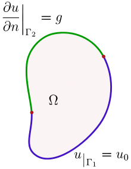

+++
title = "(r) Uniqueness of Poisson's equation"
weight = 2
+++

---

### 1. Poisson's equation

포아송 방정식은 아래와 같이 표현할 수 있다. 라플라스 방정식은 f=0 일 때를 의미한다.

$$
\nabla^2\varphi\left(\vec{r}\right)=f\left(\vec{r}\right)
$$

---

### 2. Weak solution for Poisson's equation

포아송 방정식에 대한 해를, $\varphi_1$, $\varphi_2$ 하고, 두 해의 차이를 $\psi=\varphi_1-\varphi_2$ 라고 하자. 이를 포아송 방정식에 대입하면, 다음과 같다.

$$
\nabla^2\psi\left(\vec{r}\right)=0
$$

$\psi$가 0임을 보인다면, 해는 유일하다. 위 미분방정식의 해인 $\psi$가 strong solution 이고, weak solution 또한 strong solution 이라고 가정하면,

$$
\int d^3V \left\lbrack\psi^\ast\nabla^2\psi\right\rbrack=0
$$

$$
\int d^3V \left\lbrack\psi^\ast\nabla^2\psi\right\rbrack=\int d^2\vec{s}\cdot\left\lbrack \psi^\ast\nabla\psi\right\rbrack-\int d^3V\left\lbrack \nabla\psi^\ast\cdot\nabla\psi\right\rbrack
$$

$$
\int d^2\vec{s}\cdot\left\lbrack \psi^\ast\nabla\psi\right\rbrack-\int d^3V\left|\nabla\psi\right|^2=0
$$

---

### 3. Dirichlet boundary condition

경계면에서, 값은 이미 정해져 있으므로,

$$
\psi_S=\varphi_{1S}-\varphi_{2S}=0\implies\int d^2\vec{s}\cdot\left\lbrack \psi^\ast\nabla\psi\right\rbrack=0
$$

$$
\int d^3V \left|\nabla\psi\right|^2=0
$$

따라서,

$$
\nabla\psi=0
$$

디레클레 조건의 경계면에서도 만족하려면,

$$
\psi=0
$$

ℹ️ 위 증명을 이용하면, 이상적인 금속 내부의 전계가 0인 이유를 알 수 있다.

---

### 4. Neumann boundary condition

경계면에서,

$$
\hat{n}\cdot\nabla\varphi_1=\hat{n}\cdot\nabla\varphi_2
$$

$$
\hat{n}\cdot\nabla\psi_S=0\implies\int d^2\vec{s}\cdot\left\lbrack \psi^\ast\nabla\psi\right\rbrack=0
$$

$$
\int d^3V \left|\nabla\psi\right|^2=0
$$

따라서,

$$
\nabla\psi=0\implies\psi = C
$$

C는 여러 값을 가질 수 있으므로, 해는 유일하지 않다.

ℹ️ 전자기학에서 potential 은 유일하지 않을 수 있다. 이를 gauge invariance 라고 한다. 그러나, potential 의 gradient는 유일하므로, 전기장은 유일한 값을 가진다. 

---

### 5. Mixed boundary condition

$$
\psi_{\Gamma_1}=\varphi_{1,\Gamma_1}-\varphi_{2,\Gamma_1}=0
$$

$$
\hat{n}\cdot\nabla\varphi_{1,\Gamma_2}=\hat{n}\cdot\nabla\varphi_{2,\Gamma_2}\implies\hat{n}\cdot\nabla\psi_{\Gamma_2}=0
$$

이것은 다음을 의미한다.

$$
\int d^2\vec{s}\cdot\left\lbrack \psi^\ast\nabla\psi\right\rbrack=0
$$

$$
\int d^3V \left|\nabla\psi\right|^2=0
$$

노이만 경계조건 뿐만아니라, 디레클레 경계조건도 만족해야 하므로,

$$
\psi=0
$$

따라서, 해는 유일하다.