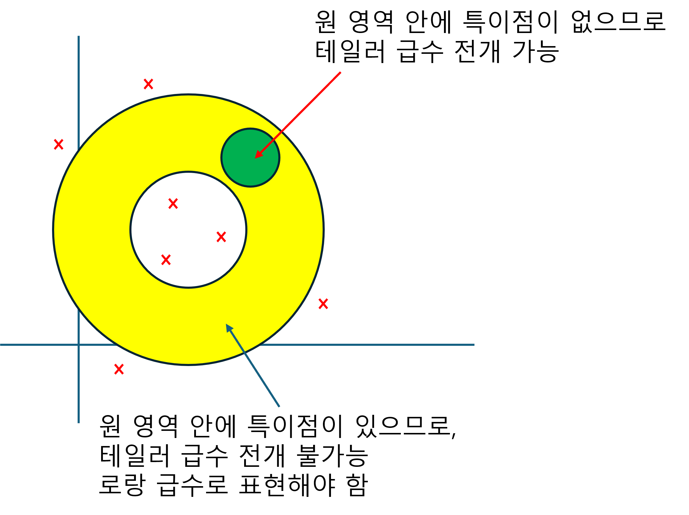

+++
title = "(b) Lourent's series"
weight = 1
+++

---

- 모델링 최외각의 안쪽 영역내에서 특이점이 존재하지 않을 경우, 테일러 급수를 사용한다.
- 모델링 최외각의 안쪽 영역내에서 특이점이 존재할 경우, 로랑급수를 사용한다.
- 테일러 급수는, 특이점의 영향이 없는 순수 수렴가능한 영역 자체를 모델링 하는 것이다.
- 로랑급수는 순수 수렴 가능한 영역의 모델링(테일러 급수, 다항 함수) + 특이점이 수렴 가능한 영역에 미치는 영향력의 모델링(유리함수)을 말한다.

---

### 1. 로랑 급수

지금까지 함수의 상태 벡터 $|f\rangle$를 연속기저(위치기저) $|x\rangle$를 사용하여 표현하였다. 복소수로 확장하여, $|f\rangle$를 $|(z-z_0)^n\rangle$을 사용한 이산기저로도 표현할 수 있으며, 기저의 좌표값을 로랑급수라고 한다.

$$
f(z)=\sum_{n=-\infty}^{\infty} b_n (z-z_0)^n,
\quad\text{where, }
b_n
=\frac{1}{2\pi i}\oint dz (z-z_0)^{-n-1}f(z)
$$

proof)

$|(z-z_0)^n\rangle=|n\rangle$ 이라고 하자. 그러면 함수를 위치 기저로 표현하면 $\langle z|n\rangle=(z−z_0)^n$ 
이다.

$$
|f\rangle
=\sum_{n=-\infty}^{\infty} b_n |n\rangle
$$

$b_n$ 이 무엇인지 알기 위해서는, $|n\rangle$의 쌍대기저 $\langle n|$가 무엇인지 알아야 한다.

$$
\langle m|n\rangle
=\delta_{mn}
$$

즉, 위 식을 만족하기 위한 $\langle n|$를 찾아야 한다. 쌍대기저(범함수)는 아래를 만족해야한다.

$$
\langle m|n\rangle
=\delta_{mn}
=C\oint dz {g_m^\ast(z)(z-z_0)^n}
=C\oint dz (z-z_0)^{k}
$$

코시의 적분 정리에 의해서,

$$
\oint dz (z-z_0)^{k}
=\begin{cases}
(k=-1) & 2\pi i\\
(k\ne-1) & 0
\end{cases}
$$

따라서,

$$
C
=\frac{1}{2\pi i}
$$

$$
\langle m|n\rangle
=\frac{1}{2\pi i}\oint dz \{ (z-z_0)^{-m-1}(z-z_0)^n \}
=\frac{1}{2\pi i}\oint dz \{ (z-z_0)^{-m-1}\langle z|n\rangle\}
$$

쌍대기저는 아래와 같이 표현할 수 있다.

$$
\langle m|
=\frac{1}{2\pi i}\oint dz (z-z_0)^{-m-1}\langle z|
$$

또한, $b_n$은 다음과 같다.

$$
b_n
=\langle n|f\rangle
=\frac{1}{2\pi i}\oint dz (z-z_0)^{-n-1}f(z)
$$

---

### 2. 테일러 급수

테일러 급수는 로랑급수의 특별한 경우로, 함수 $f(z)$가 점 $z_ 
0$를 포함하는 경로 $\mathbf{C}$ 내부 모든 곳에서 해석적일 경우 적용할 수 있다.

$$
f(z)=\sum_{n=0}^{\infty} b_n (z-z_0)^n,
\quad\text{where, }
b_n
=\frac{f^n(z_0)}{n!}
$$

proof)

함수 $f(z)$가 점 $z_ 
0$를 포함하는 경로 $\mathbf{C}$ 내부 모든 곳에서 해석적임을 이용한다.

(1) $n<0$ 

$n=-1$ 인 경우,

$$
b_{-1}=\frac{1}{2\pi i}\oint dz f(z)(z-z_0)^0 =0
$$

따라서, $n<0$ 일때, 모두 해석적이므로,

$$
b_{n}=0 \,\, (n<0)
$$

(2) $n>0$

$$
b_n=\frac{1}{2\pi i}\oint dz f(z)(z-z_0)^{-n-1}
$$

$n>0$에서, 경로 $\mathbf{C}$ 내부 모든 곳에서 해석적이면, 코시의 도함수 공식을 사용할 수 있다.

$$
\frac{f^n(z_0)}{n!}
=\frac{1}{2\pi i}\oint dz f(z)(z-z_0)^{-n-1}
$$

---

### 3. 매크로니 급수

매크로니 급수는 테일러 급수의 특별한 경우로, 함수 $f(z)$가 점 $z_ 
0=0$를 포함하는 경로 $\mathbf{C}$ 내부 모든 곳에서 해석적일 경우, 적용할수 있다.

$$
f(z)=\sum_{n=0}^{\infty} b_n z^n,
\quad\text{where, }
b_n
=\frac{f^n(0)}{n!}
$$

아래는 몇가지 중요(암기) 매크로니 급수를 보여준다.

$$
e^x
=1+x+\frac{x^2}{2!}+\frac{x^3}{3!}+\cdots
$$

$$
\sin x
=x-\frac{x^3}{3!}+\frac{x^5}{5!}-\frac{x^7}{7!}+\frac{x^9}{9!}+\cdots
$$

$$
\cos x
=1-\frac{x^2}{2!}+\frac{x^4}{4!}-\frac{x^6}{6!}+\frac{x^8}{8!}+\cdots
$$

$$
\frac{1}{1-z}
=1+z+z^2+z^3+\cdots,\quad\text{단, }|z|<1
$$

---

**example1)** Expand $f(z)$ in a Laurent series valid for the following annular domains.

$$
f(z)=\frac{1}{z(z-1)}
$$

(a) $0<|z|<1$, (b) $1<|z|$, (c) $0<|z-1|<1$, (d) $1<|z-1|$, (e) $ 1<|z-2|<2$



$$
f(z)=\frac{1}{z(z-1)}=-\frac{1}{z}+\frac{1}{z-1}
$$

 

(1) $1/z$, $z=0$ 에서 특이점을 가진다. 따라서, 로랑급수로 전개한다.

$$
-\frac{1}{z}
$$

(2) $1/(z-1)$, 특이점이 없다. 따라서, 테일러 급수로 전개한다.

$$
\frac{1}{z-1}=-1(1+z+z^2+z^3+\cdots)
$$

따라서,

$$
f(z)
=-\frac{1}{z}-1-z-z^2-z^3+\cdots
$$





$$
f(z)=\frac{1}{z(z-1)}=-\frac{1}{z}+\frac{1}{z-1}
$$

 

(1) $1/z$, 특이점이 있다. 따라서, 로랑급수로 전개한다.

$$
-\frac{1}{z}
$$

(2) $1/(z-1)$, 특이점이 있다. 따라서, 로랑 급수로 전개한다.

$$
\frac{1}{z-1}=\frac{1}{z(1-1/z)}=\frac{1}{z}(1+\frac{1}{z}+\frac{1}{z^2}+\cdots)
$$

따라서,

$$
f(z)
=\frac{1}{z^2}+\frac{1}{z^3}+\frac{1}{z^4}+\cdots
$$





$$
f(z)=\frac{1}{z(z-1)}=-\frac{1}{z}+\frac{1}{z-1}
$$

 

(1) $1/z$, 특이점이 없다. 따라서, 테일러 급수로 전개한다.

$$
-\frac{1}{z}
=\frac{1}{1-(z-1)}
=1+(z-1)+(z-1)^2+(z-1)^3+\cdots
$$

(2) $1/(z-1)$, 특이점이 있다. 따라서, 로랑 급수로 전개한다.

$$
\frac{1}{z-1}
$$

따라서,

$$
f(z)
=\frac{1}{z-1}+1+(z-1)+(z-1)^2+(z-1)^3+\cdots
$$





$$
f(z)=\frac{1}{z(z-1)}=-\frac{1}{z}+\frac{1}{z-1}
$$

 

(1) $1/z$, 특이점이 있다. 따라서, 로랑 급수로 전개한다.

$$
-\frac{1}{z}
=-\frac{1}{(z-1)(1+1/(z-1))}
=-\frac{1}{z-1}\left\{1-\frac{1}{z-1}+\frac{1}{(z-1)^2}+\cdots\right\}
$$

(2) $1/(z-1)$, 특이점이 있다. 따라서, 로랑 급수로 전개한다.

$$
\frac{1}{z-1}
$$

따라서,

$$
f(z)
=\frac{1}{(z-1)^2}-\frac{1}{(z-1)^3}+\frac{1}{(z-1)^4}+\cdots
$$





$$
f(z)=\frac{1}{z(z-1)}=-\frac{1}{z}+\frac{1}{z-1}
$$

 

(1) $1/z$, 특이점이 없다. 따라서, 테일러 급수로 전개한다.

$$
-\frac{1}{z}
=\frac{1}{-2-(z-2)}
=\frac{-1/2}{1-\{-(z-2)/2\}}
=-\frac{1}{2}\left\{1-\frac{z-2}{2}+\left(\frac{z-2}{2}\right)^2+\left(\frac{z-2}{2}\right)^3+\cdots\right\}
$$

(2) $1/(z-1)$, 특이점이 있다. 따라서, 로랑 급수로 전개한다.

$$
\frac{1}{z-1}
=\frac{1}{(z-2)(1+1/(z-2))}
=\frac{1}{z-2}\left\{1-\frac{1}{z-2}+\frac{1}{(z-2)^2}+\cdots\right\}
$$

 

따라서, 조건에 맞게 전개한 식을 합치면 된다.



**example2)** Expand $f(z$) in a Laurent series valid for $0<|z|$

$$
f(z)=e^{3/z}
$$



$$
e^{3/z}
=1+\frac{3}{z}+\frac{1}{2!}\cdot\left(\frac{3}{z}\right)^2+\frac{1}{3!}\cdot\left(\frac{3}{z}\right)^3\cdots
$$



**example3)** Expand $f(z$) in a Laurent series valid for $0<|z|$

$$
f(z)=\frac{\cos z}{z}
$$



$$
\frac{\cos z}{z}
=\frac{1}{z}\left\{1-\frac{z^2}{2!}+\frac{z^4}{4!}+\cdots\right\}
$$



**example4)** Expand $f(z$) in a Laurent series valid for $0<|z-1|$

$$
f(z)=\frac{e^{z}}{z-1}
$$



$$
\frac{e^{z}}{z-1}
=\frac{e\cdot e^{z-1}}{z-1}
=\frac{e}{z-1}\left\{1+\frac{(z-1)^2}{2!}+\frac{(z-1)^3}{4!}+\cdots\right\}
$$

