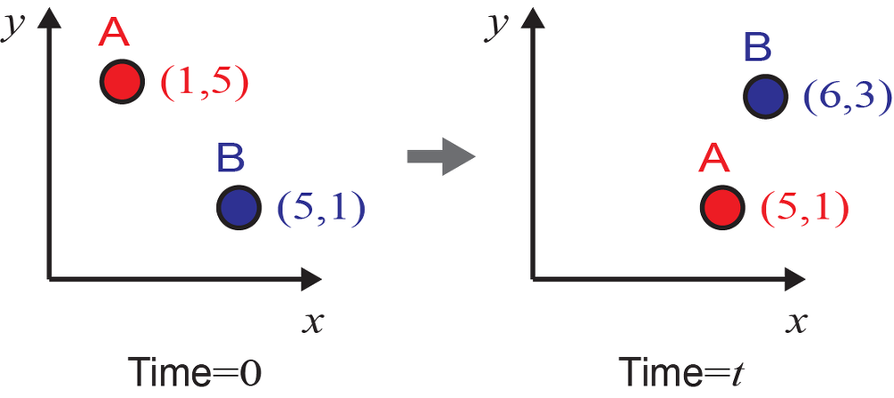

+++
title = "(a) Lagrangian and Eulerian specification"
weight = 2
+++

---

---

### 1. Lagrangian specification

- 라그랑지 좌표계는 **물체를 따라가면서 기술하는 좌표계**이다.
- 중요한 것은 **시간 0일 때의 물체의 위치(초기위치)를 좌표로 사용하여 위치를 기술**한다는 점
- 물체 A는 라그랑지 기술방법으로 초기 시간에 (1,5,0)인 것이고, 시간 *t*에서는 (1,5,*t*)인 것
- 물론, 물체 A의 시간 *t*에서의 실제 위치는 (5,1)이다.그러므로 초기 위치로부터 시간 *t*에서의 위치로 보내주는 아래와 **맵핑(mapping)함수 *M* 가 필요**

$$
\left(5,1\right)=M\left(1,5,t\right)
$$

- **물질 A의 라그랑지 좌표는 (label된 초기좌표) 계속 (1,5)로써 시간에 따라 변하지 않는다.**
물론 시간이 지난 후, 나중 위치를 함수 *r* 로 확인할 수 있지만, **라그랑지 방법에서 좌표는 초기위치를 사용함을 다시 새겨두자.**

---

### 2. Lagrangian specification의 사용 이유

"그냥 A의 경우 (1,5)에서 (5,1)로 이동했다고 하면 되지. 왜 복잡하게 만드는 것인가? 1000개나 100000개 또는 무한개라고 할 수 있는 많은 입자의 좌표를 추적한다고 하자. 이것들이 원래 어디에 있던 물질이고, 어디로 어떤 경로로 얼만큼 이동했느냐를 알고 싶어할 때는 이러한 다소 번거러워 보일 수도 있는 방식이 상당히 쉽고 효과적이다.

예를 들어, 무수히 많은 입자들의 변위(displacement, 위치의 변화)는 아래와 같이 구할 수 있다.

$$
M\left(x_0,y_0,t\right)-\left(x_0,y_0\right)
$$

$M(x_0, y_0, t)$는 시간 $t$에서의 위치이고 $(x_0, y_0)$는 초기위치이다. 즉, 초기위치와 시간의 함수로써 구할 수 있다.

---

### 3. Eulerian specification

- 오일러 좌표계는 물체보다는 **고정된 위치를 중요시하는 좌표계**
- 이러한 좌표기술 방법은 물체 하나하나를 따라가는 것보다 **특정 위치에서의 물성을 중요시하는 분야**에서 주로 사용

예를 들어, 위에서 위치 (5,1)에 초기에는 물체 B가 있고 시간 *t*에서는 물체 A가 있다고 하자. 속도의 관점에서 말하면,  초기에 위치 (5,1)의 속도는 물체 B의 속도이며, 시간 *t*에서의 속도는 물체 A의 속도이다. **이게 바로 오일러 기술 방식이다.**

---

### 4. 두 기술법의 차이를 이해

- $v_L(x_0, y_0, t)$가 **라그랑지안 관점**에서 기술된 좌표계에 의한 것이라면, 이는 초기좌표가 $x_0$와 $y_0$였던 물질이 시간 $t$가 지난 후에 위치한 지점에서의 속도를 의미한다.

- $v_E(x, y, t)$가 **오일리안 관점**에서 기술된 좌표계에 의한 것이라면, 그냥 $x$와 $y$라는 위치에서 $t$라는 시간에 우연찮게 놓인 물질의 속도를 의미한다.

---

[오일러(Eulerian)와 라그랑지(Lagrangian)의 좌표계의 차이와 물질미분(material derivative) - 성돌의 전자노트](https://sdolnote.tistory.com/entry/LagrangianEulerian)

[라그랑지안 vs 오일러리안 해석 : 네이버 블로그](https://m.blog.naver.com/hodong32/222883981417)