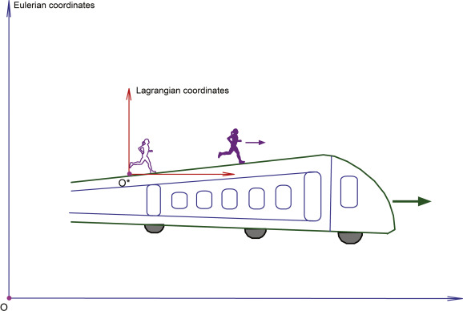

+++
title = "(a) Material derivative"
weight = 3
+++

---

입자(물체)를 추적하면서 물리량을 구한다고 하자.**입자를 추적**하기에 오일리안 관점은 적합하지 않다. 결국, 라그랑지안 관점이 되어야 하는 것이다.

---

### 1. 라그랑지안 관점을 유지하면서, 오일리안 기술법으로 해석

 

입자(물체)를 추적하면서 물리량을 구하고자 할 때, 입자 자체를 따라가는 라그랑지안 관점이 가장 적합하다. 하지만 공간 전체에 걸쳐 분포하는 물리량(예: 온도장, 속도장)을 다루고 계산할 때는, 고정된 공간 지점을 기준으로 하는 오일리안 기술법이 계산적으로 훨씬 효율적이다.

우리는 이 두 가지 장점을 모두 활용하고자 한다. 즉, 관측 대상(입자 또는 물체)이 정해져 있는 경우에도, 입자의 ‘진정한’ 변화율(라그랑지안 관점의 개념)을, 우리가 계산적으로 다루기 쉬운 오일리안 기술법의 변수들을 사용하여 표현하는 방법이 필요하다. 이것이 바로 물질 미분을 통해 이루어진다.

$$
\vec{F}\left(\vec{r_0},t\right)\implies\vec{F}\left(M\left(\vec{r_0},t\right),t\right)
$$

$$
\frac{D}{D t}\vec{F}\left(\vec{r_0},t\right)\implies\frac{D}{Dt}\vec{F}\left(M\left(\vec{r_0},t\right),t\right)
$$

---

### 2. 어떠한 속도를 가지고 움직이는 관측자는 세상을 달리 본다.

- **고정된 지점에서의 변화**: 설령 입자가 움직이지 않고 특정 지점에 가만히 있었다고 가정해 보자. 이 지점의 온도가 시간 t에 따라 변할 수 있다 (예: 난방이 켜지면서 방의 온도가 점차 올라감). 입자가 이 지점에 머물렀다면, 시간이 지남에 따라 온도가 변하는 것을 느꼈을 것이다. 이것이 오일리안 관점에서 ∂T/∂t로 표현되는 국소 미분이다. 입자는 움직이면서도, '시간의 흐름'을 겪기 때문에 이 변화를 여전히 경험한다.
- **움직여서 변화**: 입자가 움직이면서 온도가 다른 공간의 다른 지점으로 이동하기 때문에 온도가 변한다. 예를 들어, 차가운 공기가 난로 쪽으로 이동하면 공기의 온도가 올라간다. 이때 공기 흐름 자체가 안정적이어서 난로 주변 공간의 온도는 시간에 따라 변하지 않는다고 해도 (즉, ∂T/∂t =0), 공기 입자는 이동하면서 더 높은 온도의 지역으로 들어가기 때문에 온도가 상승하는 것을 느낀다. 이것이 오일리안 관점에서 (v⋅∇)T로 표현되는 대류 미분이다. 입자는 움직이기 때문에, 이 '공간을 이동하며 겪는 변화'를 직접적으로 경험하게 된다.

---

### 3. 물질 미분

- 물체가 이동하므로, **시간에 따른 변화(국소 변화)** 와 **공간 이동에 따른 변화(대류 변화)** 를 동시에 겪는다. 따라서, 입자가 실제로 경험하는 전체 변화율을 나타내기 위해 단순히 시간에 대한 편미분(∂/∂t)이 아닌, 총 변화율을 나타내는 **물질 미분(D/Dt)** 이 필요하다.

$$
d\vec{F}=dt\frac{\partial\vec{F}}{\partial t}+dx_{i}\frac{\partial\vec{F}}{\partial x_{i}}
$$

$$
\frac{D\vec{F}}{Dt}=\frac{d\vec{F}}{dt}=\left(\frac{\partial}{\partial t}+\frac{dx_{i}}{dt}\frac{\partial}{\partial x_{i}}\right)\vec{F}=\left(\frac{\partial}{\partial t}+v_{i}\frac{\partial}{\partial x_{i}}\right)\vec{F}
$$

$$
\frac{D}{Dt}=\frac{\partial}{\partial t}+\vec{v}\cdot\nabla
$$

---

### 4. 물질 미분의 적용: 여러 프레임 간의 연결

운동프레임의 속도는 정지프레임 대비 V이다. 운동프레임에서 보는 물체의 속도는 운동프레임 대비 v'이다. 운동프레임의 관측자가 **라그랑지안 관점(물체 추적)** 으로 이 물체를 해석하고자 한다. 그런데 운동프레임의 관측자는 정지프레임의 관측자가 표준적으로 해석하는 방식(오일리안 기술법)을 레퍼런스로 삼아 물체의 운동을 해석하고 싶다.

같은 의미를 다르게 표현하면, 운동 프레임의 관측자가 운동 프레임 안에서 움직이는 물체의 변화를 관찰하되, 그 모든 변화를 최종적으로는 **'세상 모든 사람이 이해하는 고정된 기준(정지 프레임)'의 언어로(오일러리안 기술법)으로 설명** 하고 싶다. 이것은 두 가지 프레임(운동 프레임과 정지 프레임)의 관점을 연결하고, 모든 관성계에서 물리 법칙이 일관되게 적용됨을 보이고자 하는 것이다.

여기서 물질 미분의 역할을 명확하게 살펴보자.

**(1) '물체를 따라가며 관찰하는' (라그랑지안) 관점의 표현**

우리가 알고 싶은 것은 운동 프레임의 관측자가 측정하는 '물체'(라그랑지안 관점)에 대한 물리량의 변화율이다. 물질 미분 D/Dt가 바로 이 변화율을 나타내는 연산자이다.

**(2) '정지 프레임의 오일러리안 언어'로의 번역/표현**

물질 미분은 아래와 같이 정의된다.

$$
\frac{D}{Dt}=\frac{\partial}{\partial t}+\vec{u}\cdot\nabla
$$

여기서 ∂/∂t와 ∇는 모두 정지 프레임(r,t)에서 정의된 오일러리안 기술법의 연산자이다. 즉, 고정된 공간 지점에서의 시간적 변화와 공간적 변화를 나타낸다. 물체의 정지 프레임에 대한 총 속도 u는 운동 프레임 속도 V와 운동 프레임 내 물체 속도 v′의 합인 u=V+v′로 표현된다. 따라서,

$$
\frac{D}{Dt}=\frac{\partial}{\partial t}+(\vec{V}+\vec{v}')\cdot\nabla
$$

---

[Eulerian and Lagrangian Descriptions in Fluid Mechanics](https://www.youtube.com/watch?v=mdN8OOkx2ko)