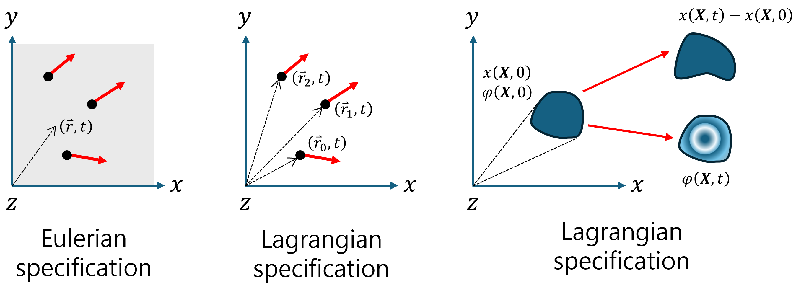

+++
title = "(a) Description"
weight = 3
+++

---

'라그랑주 기술법(Lagrangian description)' 이라는 표현이 '라그랑주 좌표계(Lagrangian coordinate system)' 보다 훨씬 더 적합하고 올바른 용어

---

---

### 1. Eulerian description

- 오일러리안 기술법은 **검사(관측) 영역의 임의의 좌표에서 물리량을 기술**하는 방식이다.
- 즉, **일반적으로 우리가 사용**하는 방식이다.
- 예를 들어, t=0 에서 위치 (5,1)에 초기에는 물체 B가 있고 시간 t=5 에서는 물체 A가 있다고 하자. 속도의 예를 들면, (5,1,0)에서의 속도는 물체 B의 속도이며, (5,1,5)에서의 속도는 물체 A의 속도이다. 

---

### 2. Lagrangian description

- 라그랑지안 기술법은 **물체를 따라가면서 물리량을 기술한다.**
- 물체의 위치에 초점을 맞추는 것이 아니라. **물체에 대한 물리적양(물체의 모양을 포함)의 변형율 중요시**한다.
- **시간 0일 때의 물체의 위치(초기위치)를 좌표로 사용하여 위치를 기술**한다.
- **물질의 초기 위치는 물질 고유의 label** 이다.
- 물체 A를 라그랑지 기술방법으로 (1,5,0) 쓸 수 있다. 시간 t가 지났을 때, 물체 A는 (1,5,t) 로 기술한다. 
- 물론, 물체 A의 시간 t에서의 실제 위치(오일리안 기술법)는 (1,5)가 아니다.
- 그러므로 초기 위치로부터 시간 t에서의 위치로 보내주는 아래와 **맵핑(mapping)함수 M이 필요** 하다.

$$
\left(1,5\right)=M\left(1,5,0\right)
$$

$$
\left(x,y\right)=M\left(1,5,t\right)
$$

---

### 3. Lagrangian description의 사용 이유

"그냥 A의 경우 (1,5)에서 (5,1)로 이동했다고 하면 되지. 왜 복잡하게 만드는 것인가? 1000개나 100000개 또는 무한개라고 할 수 있는 많은 입자의 좌표를 추적한다고 하자. 이것들이 원래 어디에 있던 물질이고, 어디로 어떤 경로로 얼만큼 이동했느냐를 알고 싶어할 때는 이러한 다소 번거러워 보일 수도 있는 방식이 상당히 쉽고 효과적이다.

예를 들어, 무수히 많은 입자들의 변위(displacement, 위치의 변화)는 아래와 같이 구할 수 있다.

$$
M\left(x_0,y_0,t\right)-\left(x_0,y_0\right)
$$

$M(x_0, y_0, t)$는 시간 $t$에서의 위치이고 $(x_0, y_0)$는 초기위치이다. 즉, 초기위치와 시간의 함수로써 구할 수 있다.

---

### 4. 두 기술법의 차이를 이해

- $v_L(x_0, y_0, t)$가 **라그랑지안 기술법** 이며, **초기좌표가 $x_0$와 $y_0$였던 물질**이 시간 $t$가 지난 후에 위치한 지점에서의 속도를 의미.
- $v_E(x, y, t)$가 **오일리안 기술법** 이며, 그냥 $x$와 $y$라는 위치에서 $t$라는 시간에 우연찮게 놓인 물질의 속도를 의미.

---

[오일러(Eulerian)와 라그랑지(Lagrangian)의 좌표계의 차이와 물질미분(material derivative) - 성돌의 전자노트](https://sdolnote.tistory.com/entry/LagrangianEulerian)

[라그랑지안 vs 오일러리안 해석 : 네이버 블로그](https://m.blog.naver.com/hodong32/222883981417)