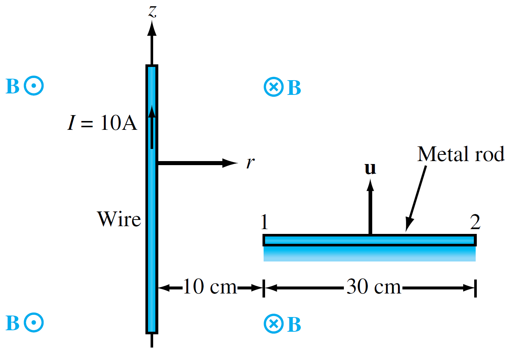
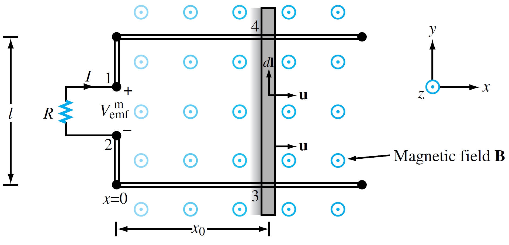

+++
title = "(i) Electromotive force I"
weight = 4
+++

---

움직이는 물체를 **정지프레임에서 라그랑지안 관점**으로 **정지프레임에서 오일리안 기술법**으로 표현한 것이다.

움직이는 물체에서 발생하는 전자기 유도 현상은 물리학에서 중요한 주제이다. 이 문서에서는 이러한 현상을 정지 프레임(실험실 프레임)에서 라그랑지안 관점을 오일러 기술법을 사용하여 분석한다. 특히, 입자(물체)의 움직임을 추적하는 라그랑지안 관점과 공간 전체에 분포하는 장(field)을 효율적으로 다루는 오일리안 기술법 방식 사이를 물질 미분(Material Derivative) 개념을 활용하여 기전력의 본질을 깊이 있게 이해하고자 한다.

---

### 0. 논의의 제약조건

- **비상대론적 한계**: 물체의 움직이는 속도는 빛의 속도에 비해 매우 느리다고 가정한다. (non-relativistic limit)
- **관성계**: 모든 관측과 현상은 관성계(가속하지 않는 기준계)에서 이루어진다.
- **미미한 섭동**: 움직이는 전하(또는 물체)가 주변 자기장이나 전기장을 변화시키지 않는다고 가정한다. 외부 장(external field)이 움직이는 물체에 미치는 영향만 고려하고, 움직이는 물체 자체가 생성하는 장의 영향은 무시한다. 이는 마치 움직이는 물체가 주변 공간의 중력장을 변화시키지 않는다고 가정하는 것과 유사하다.

---

### 1. 구하고자 하는 것

이 논의의 핵심은 다음 두 가지를 이해하는 것이다.

- **움직이는 하전 입자에 작용하는 힘**: 자기장 속에서 움직이는 전하가 어떤 힘을 받는지.
- **변압 기전력 및 운동 기전력** : 이러한 힘이 어떻게 전기적인 압력(기전력)을 유도하는지.

**힘(Force)은 언제나 특정 물체(입자)에 작용하는 것**이다. 여기에서는 **정지 프레임에서 라그랑지안 관점을 사용**한다. 그러나 전기장과 자기장은 공간 전체에 걸쳐 분포하는 벡터장이며, 이를 계산적으로 효율적으로 다루기 위해서는 고정된 공간을 기준으로 하는 오일리안 기술법이 필요하다.

이러한 이유로 우리는 라그랑주적 본질(입자가 겪는 변화)을 오일러적 기술법(공간 변수로 표현)으로 바꾸어주는 **물질 미분** 개념을 활용하여 이 현상을 분석한다.

---

### 2. 맥스웰 방정식과 물질 미분: 정지 관측자의 시선

우리가 일반적으로 아는 맥스웰 방정식은 정지한 관성계(실험실 프레임)에서 전자기장 E와 B의 시간적, 공간적 변화를 기술한다. 여기에 나오는 시간 미분(∂/∂t)은 고정된 지점에서의 장 자체의 변화율을 의미한다. **정지 관측자는 움직이는 전하가 자기장 내에서 자기력을 받는것으로 관측(매우중요)** 한다. **여기서의 v는 물체의 속도**를 의미한다.

- E은 정지 프레임에서 측정되는 전기장이다.
- H은 정지 프레임에서 측정되는 자기장이다.
- J은 정지 프레임이서 측정되는 전류밀도이다.
  
$$
\nabla\times\vec{E}
=-\frac{D}{Dt}\vec{B}=-\left(\frac{\partial}{\partial t}+\vec{v}\cdot\nabla\right)\vec{B}
$$

$$
\nabla\times\vec{H}
=\vec{J}+\frac{D}{Dt}\vec{D}=\vec{J}+\left(\frac{\partial}{\partial t}+\vec{v}\cdot\nabla\right)\vec{D}
$$

---

### 3. 기전력의 유도: 물질 미분의 핵심 역할

비상대론적 근사를 사용한다.

$$
\nabla\times\vec{E}=-\frac{\partial\vec{B}}{\partial t}-\vec{v}\cdot\nabla\vec{B}
$$

아래와 같은 벡터 항등식을 이용한다.

$$
\nabla\times\vec{v}\times\vec{B}=\vec{v}\left(\nabla\cdot\vec{B}\right)-\vec{B}\left(\nabla\cdot\vec{v}\right)+\left(\vec{B}\cdot\nabla\right)\vec{v}-\left(\vec{v}\cdot\nabla\right)\vec{B}
$$

비압축성(∇⋅v=0) 및 속도 벡터가 공간적으로 일정(∇v=0), 즉 물체가 강체처럼 병진 운동만 하는 경우)하다고 가정하면,

$$
\nabla\times\vec{v}\times\vec{B}=-\left(\vec{v}\cdot\nabla\right)\vec{B}+\vec{v}\left(\nabla\cdot\vec{B}\right)
$$

맥스웰 방정식의 자기 가우스 법칙(∇⋅B=0)을 고려하면,

$$
\nabla\times\vec{v}\times\vec{B}=-\left(\vec{v}\cdot\nabla\right)\vec{B}
$$

따라서, 식은 다음과 같이 바꿀 수 있다.

$$
\nabla\times\vec{E}=-\frac{\partial\vec{B}}{\partial t}+\nabla\times\vec{v}\times\vec{B}
$$

Stoke’s theorem 을 사용한다.

$$
\int_{s}d^2\vec{s}\cdot\nabla\times\vec{E}=-\frac{\partial}{\partial t}\int_{s}d^2\vec{s}\cdot\vec{B}+\int_{s}d^2\vec{s}\cdot\nabla\times\vec{v}\times\vec{B}
$$

$$
\oint_{C}d\vec{l}\cdot\vec{E}=-\frac{\partial}{\partial t}\Phi_{B}+\oint_{C}d\vec{l}\cdot\vec{v}\times\vec{B}
$$

이 최종 기전력 식은 두 가지 주요 항으로 나눌 수 있다.

**(1) 원천 자기장의 변화에 의한 변압 기전력**

$$
-\frac{\partial}{\partial t}\Phi_{B}
=\oint_{C}d\vec{l}\cdot\vec{E}_{ind}
$$

이 항은 원천 자기장 B자체가 시간에 따라 변함으로써 유도되는 기전력이다. **여기서 E는 자기장 변화에 의해 유도되는 전기장**이다.

**(2) 외부 움직이는 요소에 의한 운동 기전력**

$$
\oint_{C}d\vec{l}\cdot\vec{v}\times\vec{B}
$$

이 항은 외부에서 움직이는 도체(루프 C)가 자기장 B를 가로지르면서 생기는 기전력이다. 이는 물질(도체)의 움직임(v)에 따른 이류(convection) 효과를 직접적으로 나타낸다.

위의 두 항을 종합하면, 전기장 E에 대한 기전력은 다음과 같이 표현된다.

$$
\oint_{C}d\vec{l}\cdot\vec{E}=\oint_{C}d\vec{l}\cdot\left(\vec{E}_{ind}+\vec{v}\times\vec{B}\right)
$$

이 식은 적분 영역이 동일하므로, 피적분 함수를 비교하여 전기장 E는 다음과 같이 표현됨을 알 수 있다.

$$
\vec{E}=\vec{E}_{ind}+\vec{v}\times\vec{B}
$$

---

### 4. Practice

**example1)** The wire shown in Fig. is in free space and carries a current I = 10 [A]. A 30-cm-long metal rod moves at a
constant velocity $\vec{v}=\hat{z}3$ [m/s]. Find $V_{12}$



$$
\vec{B}=\hat{\phi}\frac{\mu I}{2\pi\rho}
$$

움직이는 물체에 대한 해석으로, 라그랑지안 관점에서 오일리안 기술법을 사용한다.

$$
V_{12}=\int_{2}^{1} d\vec{l}\cdot\left[\vec{v}\times\vec{B}\right]
=-\int_{2}^{1} d\rho\left[v\cdot\frac{\mu I}{2\pi\rho}\right]
=-\frac{15\mu}{\pi}\int_{0.4}^{0.1} d\rho\left[\frac{1}{\rho}\right]
=\frac{15\mu}{\pi}\ln4
$$



**example2)** The rectangular loop shown in Fig. has a constant width l, but its length $x_0$ increases with time as a conducting bar slides at a uniform velocity u in a static magnetic field $B=\hat{z}B_0x$. Note that B increases linearly with x. The bar starts from x = 0 at t = 0. Find the motional emf between terminals 1 and 2 and the current I flowing through the resistor R. Assume that the loop resistance is ignored.



움직이는 물체에 대한 해석으로, 라그랑지안 관점에서 오일리안 기술법을 사용한다.

  

$$
V_{emf}=\int_{3}^{4} d\vec{l}\cdot\left[\vec{v}\times\vec{B}\right]
=-\int_{3}^{4} dy\left[v\cdot B_0x\right]
=-lB_0vx
=-lB_0v^2t
$$





움직이는 물체에 대한 해석으로, 라그랑지안 관점에서 오일리안 기술법을 사용한다.

  

$$
V_{emf}
=-\frac{D\Phi_B}{Dt}
=-\frac{D}{Dt}\int_{s} d^2\vec{s}\cdot\vec{B}
=-\frac{D}{Dt}\int_{0}^{l}dy\int_{0}^{x}dx[B_0x]
$$

$$
=-l\frac{D}{Dt}\left(\frac{B_0x^2}{2}\right)
=-lB_0v^2t
$$



---

[조금은 느리게 살자: 패러데이의 전자기 유도 법칙(Faradays Law of Electromagnetic Induction)](https://ghebook.blogspot.com/2010/08/faradays-law-of-electromagnetic.html)

[[수학, 계산] 벡터 항등식-2탄 계산 — Steemit](https://steemit.com/kr-math/@beoped/5jyraq-2)