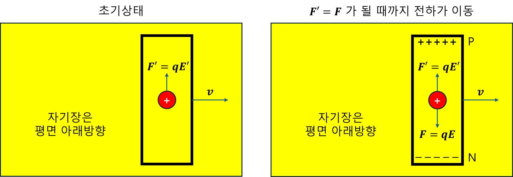
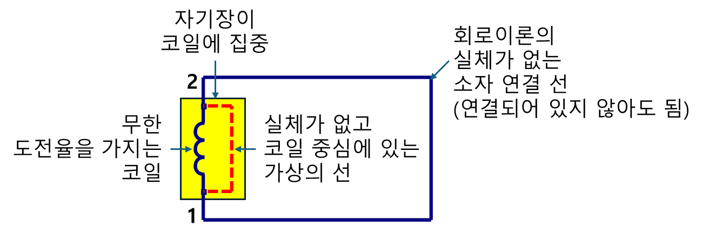

+++
title = "(r) EMF & Voltage"
weight = 7
+++

---

### 0. EMF & Voltage: 기전력과 전압, 왜 부호가 다른 이유

- **EMF는 전압이 아니다.**
- EMF는 **전압을 만들어내기 위해 단위 전하에 해 준 '일'** 을 뜻한다. 쉽게 말해, **EMF는 전위차(전압)의 '원인'** 이다.

---

### 1. 운동 기전력만 있는 경우 (변압 기전력 = 0)

 

아래 식은 정지 프레임에서 전자기 유도를 설명하는 패러데이 법칙의 일반적인 형태" 또는 "물질 미분 개념을 통해 유도된 정지 프레임에서의 패러데이 법칙이다.

$$
\oint_{C}d\vec{l}\cdot\vec{E}=-\frac{\partial}{\partial t}\Phi_{B}+\oint_{C}d\vec{l}\cdot\vec{v}\times\vec{B}
$$

만약 **주변 자기장 $\vec{B}$ 자체가 시간에 따라 변하지 않는다면**, 즉 변압 기전력의 원인이 없다면, 식은 다음과 같이 간단해진다.

$$
\oint_{C}d\vec{l}\cdot\vec{E} = \oint_{C}d\vec{l}\cdot\vec{v}\times\vec{B}
$$

$\vec{v} \times \vec{B}$ 는 자기장 속에서 움직이는 전하에게 작용하는 **자기력**을 단위 전하당 힘으로 나타낸 것이다. 이 힘이 전하들을 도체 안에서 움직이게 해서 기전력을 만들어낸다. 전하들은 이 자기력과 막대 내부에 형성된 정전기장에 의한 힘($q\vec{E}_{\text{electrostatic}}$)이 균형을 이룰 때까지 움직인다.

이제 막대 양단 N과 P 사이의 **전압($V_{PN}$)** 을 구해보자. 

$$V_{PN} = -\int_{N}^{P}d\vec{l}\cdot\vec{E}_{electrostatic}$$

이 총 힘의 평형을 통해, 도체 내부에는 $\vec{E}_{\text{electrostatic}}=-\vec{v}\times\vec{B}$ 관계가 성립하는 정전기장이 존재하게 된다.

$$
V_{PN} = -\int_{N}^{P}d\vec{l}\cdot(-\vec{v}\times\vec{B}) = \int_{N}^{P}d\vec{l}\cdot(\vec{v}\times\vec{B})
$$

이 $V_{PN}$는 운동 기전력 때문에 막대 양단에 생기는 **전압** 이다. 운동 기전력에서는 $\int (\vec{v} \times \vec{B}) \cdot d\vec{l}$ 자체가 전하에게 해 준 '일'이다.

---

### 2. 변압 기전력만 있는 경우 (운동 기전력 = 0)

이번에는 코일(도체 루프)은 움직이지 않고 가만히 있는데, 주위의 자기장이 시간에 따라 변해서 기전력이 생기는 상황을 **변압 기전력(Transformer EMF)** 이라 한다. 코일이 움직이지 않으니 $\vec{v}=0$이라서 운동 기전력 항은 사라진다.

패러데이 유도 법칙은 다음과 같이 간단해진다.

$$
V_{emf} = \oint_{C}d\vec{l}\cdot\vec{E}=-\frac{\partial}{\partial t}\Phi_{B}
$$

인덕터(코일)의 경우, 유도 기전력은 코일을 통과하는 자기 선속($\Phi_B$)의 변화율에 비례하며, 전류 변화율과 인덕턴스 $L$로 표현할 수 있다.

$$
N\Phi_{B} = Li
$$

$$
V_{emf} = -\frac{\partial}{\partial t}\Phi_{B} = -L\frac{di}{dt}, \quad N=1
$$

코일을 포함하고 코일 바깥쪽을 통과하는 적분 경로를 설정하자.
이상적인 도체(전기가 아주 잘 통하는)로 만든 코일 안에는 전기장이 0이다. 아래식의 최종 형태는, **코일 외부 전기장이 전하에게 해준 일** 이다.

$$
V_{emf}
=\oint_{C}d\vec{l}\cdot\vec{E}
=\int_2^1 d\vec{l}\cdot\vec{E}_{coil}+\int_1^2 d\vec{l}\cdot\vec{E}_{ext}
=\int_1^2 d\vec{l}\cdot\vec{E}_{ext}
$$

**이제 EMF와 코일 양단에 걸리는 전압($V$)의 부호 차이를 살펴보자.** 회로 이론에서 코일 양단에 걸리는 **전압($V$)** 은 수동부호규약에 의해, 다음과 같이 정의한다.

$$V = L\frac{di}{dt}$$

이 $V$는 전류가 흐르는 방향으로 측정되는 **전압 '강하'(voltage drop)**, 즉 전기 에너지가 소모되면서 전위가 높은 곳에서 낮은 곳으로 떨어지는 양을 의미한다. 마치 물이 높은 곳에서 낮은 곳으로 흐르면서 에너지를 잃는 것과 비슷하다.

하지만 **유도 기전력(emf)** 은 **렌츠의 법칙에 따라 '자기 선속의 변화를 방해하는 방향'** 으로 유도된다. 예를 들어, 코일에 흐르는 전류가 증가하면 코일은 그 증가를 '막기 위해' 반대 방향으로 EMF를 만들어낸다.

따라서, $V_{emf} = -L\frac{di}{dt}$ (전류 변화를 '방해하는' 방향, 즉 역기전력)와 $V=L\frac{di}{dt}$ (전류 흐름에 따른 전위 '강하' 방향) 사이에는 **정확히 부호가 반대**인 관계가 생긴다.