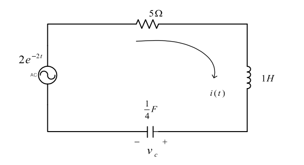

+++
title = "(b) LTI & Circuit analysis"
weight = 3
+++

---

- 회로 시스템에 적분변환 이론을 적용하여 해석한다.
- LTI 의미를 공고히 한다.

---

초기조건 : $i(0)=1 [\text{A}],v_c(0)=-6 [\text{V}]$ 일 때, 전류를 구하시오.

---

### 1. 미분 방정식을 사용한 풀이1

$$
-2e^{-2t}+5i+D(i-1)-6+v_c'=0,\quad
i=\frac{1}{4}Dv_c'\to v_c'=4D^{-1}i
$$

$$
-2e^{-2t}+5i+Di-6+4D^{-1}i=0\to
4e^{-2t}+5Di+D^2i+4i=0
$$

정리하면 다음과 같다.

$$
D^2i+5Di+4i=-4e^{-2t}
$$

일반해와 특수해를 구한다.

$$
i_h=c_1e^{-t}+c_2e^{-4t}
$$

$$
i_p=\left.\frac{-4}{(D+1)(D+4)}\right|_{D=-2}e^{-2t}=2e^{-2t}
$$

초기조건을 사용하여 계수를 구하면,

$$
i(0)
=1
=c_1+c_2+2
$$

$$
Di(0)
=3
=-c_1-4c_2-4
$$

$$
c_1=1, c_2=-2
$$

따라서,

$$
i=e^{-t}+2e^{-2t}-2e^{-4t}
$$

---

### 2. 라플라스 변환을 사용한 풀이

위 회로 시스템은, causality 하다. 따라서, 단방향 라플라스 변환을 수행한다.

$$
-\frac{2}{s+2}+5I+s\left(I-\frac{1}{s}\right)-\frac{6}{s}+\frac{4}{s}I=0
$$

$$
\left(5+\frac{4}{s}+s\right)I
=\frac{2}{s+2}+1+\frac{6}{s}
$$

$$
I
=\frac{1}{s+1}+\frac{2}{s+2}-\frac{2}{s+4}
$$

$$
i
=\langle t|I\rangle
=e^{-t}+2e^{-2t}-2e^{-4t}
$$

---

### 3. 임펄스 응답을 사용한 풀이 (잘못된 풀이)

입력에 임펄스를 넣어, 시스템의 임펄스 응답을 구한다.

$$
\delta(t)+5i+D(i-1)-6+v_c'=0,\quad
i=\frac{1}{4}Dv_c'\to v_c'=4D^{-1}i
$$

$$
\delta(t)+5i+Di-6+4D^{-1}i=0
$$

단방향 라플라스 변환을 수행한다.

$$
1+5I+sI-\frac{6}{s}+4sI=0
$$

$$
H\left(s\right)=I\left(s\right)=\frac{6/s+2}{5+4/s+s}=\frac{2s+6}{\left(s+4\right)\left(s+1\right)}=\frac{2/3}{s+4}+\frac{4/3}{s+1}
$$

실제 입력을 라플라스 변환하고, 시스템 함수와 곱하여, 입력에 대한 출력을 구한다.

$$
I_{in}=\langle s|2e^{-2t}u(t)\rangle
=2\langle s+2|u\rangle
=\frac{2}{s+2}
$$

$$
I
=I_{in}H
=\frac{2}{s+2}\left(\frac{2/3}{s+4}+\frac{4/3}{s+1}\right)
=-\frac{8/3}{s+1}+\frac{2}{s+2}+\frac{2/3}{s+4}
$$

역 라플라스 변환을 수행한다.

$$
i
=\langle t|I\rangle
=-\frac83e^{-t}+2e^{-2t}+\frac23e^{-4t}
$$

이 결과는 **위에서 풀이한 결과와 다름**을 확인할 수 있다. 앞선 챕터의 내용들을 상기해보자. 

- **임펄스 응답을 사용하여 시스템의 출력을 구하려면, 시스템이 LTI 여야 한다는 전제조건이 있어야 한다.** 그러나, 위 회로는 초기값이 존재함으로, LTI 시스템이 아니다.
  
- 라플라스 변환을 사용한 옳은 풀이를 보면, 시스템의 출력을 구하였다. 라플라스 변환은 선형시스템에만 적용할 수 있다는 잘못된 일부의 언급을 반박하는 내용이다. 라플라스 변환은 선형이건 비선형이건 수행할 수 있다.
  
- 라플라스 변환을 사용한다는 것은, 컨볼루션 또한 가능하다는 것을 의미한다. 이것은 위와 마찬가지로, 컨볼루션이 선형시스템만 적용할 수 있다는 잘못된 일부의 언급을 반박하는 내용이다. 컨볼루션은 선형이건 비선형이건 수행할 수 있다.

---

### 4. 미분방정식 풀이2 (그린함수 사용)

이 풀이 역시 **임펄스 입력에 대한 해석**을 다룬다. 하지만, **위의 잘못된 풀이와는 다르게 올바른 해를 도출**한다. 어떠한 차이가 있는지 풀이를 보며 생각해보자.

위 회로에 대한 미분방정식은 다음과 같다.

$$
D^2i+5Di+4i=-4e^{-2t}
$$

$$
i(0)=1, Di(0)=3
$$

특수해를 구한다.

$$
i_h=\begin{cases}
c_{1}e^{-t}+c_2e^{-4t} & t > t'\\
c_{3}(t')e^{-t}+c_4e^{-4t} & 0\le t < t'
\end{cases}
$$

**(1) t=0 에서**

**핵심** → $i_h(0)=0$, $Di_h(0)=0$ 로 설정하면, $c_3=c_4=0$ 이다.

**(2) t=t' 에서**

$$
Di_h(t')=u(t')\to
Di_h(t')=-c_1e^{-t'}-4c_2e^{-4t'}=1
$$

$$
i(t'+)=i(t'-)\to
c_{1}e^{-t'}+c_2e^{-4t'}=0
$$

$$
c_1=\frac{1}{3}e^{t'},\quad c_2=-\frac{1}{3}e^{4t'}
$$

따라서,

$$
i_h=\begin{cases}
\frac{1}{3}e^{t'-t}-\frac{1}{3}e^{4(t'-t)} & t > t'\\
0 & 0\le t < t'
\end{cases}
$$

공사중 (그린함수는 풀이가 너무 길어..)

---

### 5. Practice

