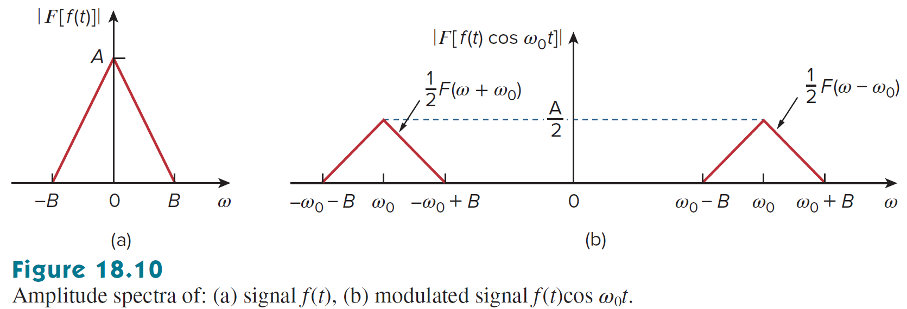
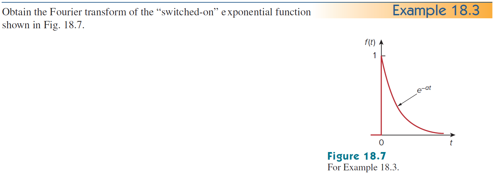
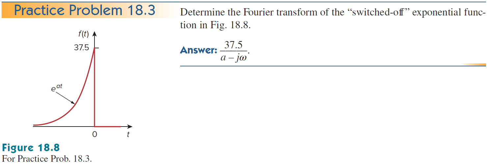
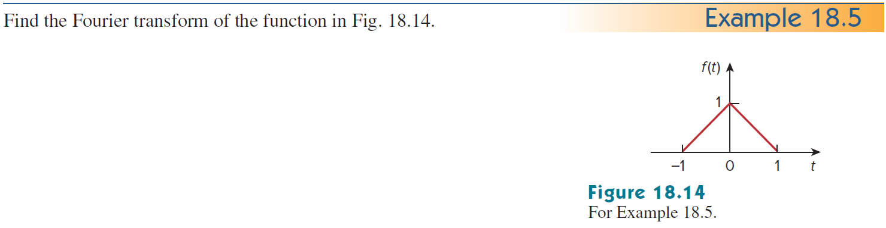

+++
title = "(b) Fourier transform II"
weight = 6
+++

---

### 1. 중요변환

**1) Dirac delta function - time to frequency domain**

$$
\mathcal{F}\left\lbrace\delta\left(t\right)\right\rbrace\left(\omega\right)
=\langle \omega| \delta \rangle
$$



비대칭성 기반 푸리에 변환의 정의를 사용하면, $\langle\omega|t\rangle=e^{-i\omega t}$ 임을 알 수 있다.

$$
\mathcal{F}\left\lbrace\delta\left(t\right)\right\rbrace\left(\omega\right)
=\langle\omega|f\rangle
=\int^{\infty}_{-\infty}dt \langle\omega |t\rangle\langle t|f\rangle
=\int^{\infty}_{-\infty}dt \left[e^{-i\omega t}f\left(t\right)\right]
$$

따라서,

$$
\langle\omega\ | \left(\int^{\infty}_{-\infty}dt|t\rangle\langle t| \right) |\delta \rangle
=\int^{\infty}_{-\infty}dt \langle\omega |t\rangle\langle t | \delta \rangle
=\int^{\infty}_{-\infty}dt \left[e^{-i\omega t}\delta\left(t\right)\right]
=1
$$





$\langle\omega|t\rangle=\cfrac{1}{\sqrt{2\pi}}e^{-i\omega t}$
    
$$
\langle\omega\ | \left(\int^{\infty}_{-\infty}dt|t\rangle\langle t| \right) |\delta \rangle
=\int^{\infty}_{-\infty}dt \langle\omega |t\rangle\langle t | \delta \rangle
=\int^{\infty}_{-\infty}dt \left[\frac{1}{\sqrt{2\pi}}e^{-i\omega t}\delta\left(t\right)\right]
=\frac{1}{\sqrt{2\pi}}
$$



**2) Dirac delta function - frequency to time domain**

$$
\mathcal{F}^{-1}\left\lbrace\delta\left(\omega\right)\right\rbrace\left(t\right)
=\langle t| \delta \rangle
$$


    
$\langle t|\omega\rangle=e^{+i\omega t}$
    
$$
\langle t| \left(\int^{\infty}_{-\infty}d\omega|\omega\rangle\langle \omega|\right)|\delta \rangle
=\int^{\infty}_{-\infty}d\omega\langle t|\omega\rangle\langle \omega|\delta\rangle
=\int^{\infty}_{-\infty}d\omega\left[e^{+i\omega t}\delta\left(\omega\right)\right]
=1
$$




    
$\langle t|\omega\rangle=\cfrac{1}{\sqrt{2\pi}}e^{+i\omega t}$
    
$$
\langle t| \left(\int^{\infty}_{-\infty}d\omega|\omega\rangle\langle \omega|\right)|\delta \rangle
=\int^{\infty}_{-\infty}d\omega\langle t|\omega\rangle\langle \omega|\delta\rangle
=\int^{\infty}_{-\infty}d\omega\left[\frac{1}{\sqrt{2\pi}}e^{+i\omega t}\delta\left(\omega\right)\right]
=\frac{1}{\sqrt{2\pi}}
$$



**3) DC, Constant**

$$
\mathcal{F}\left\lbrace1\right\rbrace\left(\omega\right)
=\langle\omega|1\rangle
$$



$$
\langle\omega|1\rangle
=\int^{\infty}_{-\infty}dt\left[e^{-i\omega t}\cdot 1\right]
=2\pi\delta\left(\omega\right)
$$





$$
\langle\omega|1\rangle
=\int^{\infty}_{-\infty}dt\left[\frac{1}{\sqrt{2\pi}}e^{-i\omega t}\cdot 1\right]
=\sqrt{2\pi}\delta\left(\omega\right)
$$



**4) Unit function**

$$
\mathcal{F}\left\lbrace u\left(t\right)\right\rbrace\left(\omega\right)
=\langle\omega|u\rangle
$$


    
일반적으로 적분이 안되므로, 정칙화를 사용한다. 제시된 식에 정칙화를 사용하면, 라플라스 변환과 유사해 진다.

  

$$
\lim_{\epsilon\to0+}\int_0^{\infty}dt\left\lbrack e^{-i\omega t}e^{-\epsilon t}\right\rbrack
=\lim_{\epsilon\to0+}\frac{1}{\epsilon+i\omega}
$$

(1) $\omega\ne0$ 경우

$$
\lim_{\epsilon\to0+}\frac{1}{\epsilon+i\omega}=\frac{1}{i\omega}
$$

(2) $\omega=0$ 경우

$$
\lim_{\epsilon\to0+}\frac{1}{\epsilon+i\omega}=\lim_{\epsilon\to0+}\frac{1}{\epsilon}=\infty
$$

따라서, 위 둘의 결과를 합치면,

$$
\lim_{\epsilon\to0+}\frac{1}{\epsilon+i\omega}=\frac{1}{i\omega}+A\delta\left(\omega\right)
$$

계수 A를 구하기 위해, 디렉델타 성질을 사용한다.

$$
\lim_{\epsilon\to0+}\int^{\infty}_{-\infty}d\omega\left[\frac{1}{\epsilon+i\omega}\right]=\int^{\infty}_{-\infty}d\omega\left[\frac{1}{i\omega}\right]+A
$$

동일한 속도로 $\omega$ 가 움직인다라고 하면, (정칙적, 해석적)

$$
A=\lim_{\epsilon\to0+}\int^{\infty}_{-\infty}d\omega\left[\frac{1}{\epsilon+i\omega}\right]
=\lim_{\epsilon\to0+}\int^{\infty}_{-\infty}d\omega\left[\frac{\epsilon}{\epsilon^2+\omega^2}-i\frac{\omega}{\epsilon^2+\omega^2}\right]
$$

두번째 적분항은 기함수 이므로,

$$
A=\lim_{\epsilon\to0+}\int^{\infty}_{-\infty}d\omega\left[\frac{\epsilon}{\epsilon^2+\omega^2}\right]
=\lim_{\epsilon\to0+}\int^{\infty}_{-\infty}d\left(\frac{\omega}{\epsilon}\right)\left[\frac{1}{1+\left (\frac{\omega}{\epsilon}\right)^2}\right]
$$

$$
=\left[\operatorname{atan}\left(\frac{\omega}{\epsilon}\right) \right]^{\infty}_{-\infty}=\pi
$$

최종적으로,

$$
\langle\omega|u\rangle
=\frac{1}{i\omega}+\pi\delta\left(\omega\right)
$$





$$
\langle\omega|u\rangle
=\frac{1}{\sqrt{2\pi}}\left\lbrace\frac{1}{i\omega}+\pi\delta\left(\omega\right)\right\rbrace
$$



**5) cosine function**

$$
\mathcal{F}\left\lbrace\cos at\right\rbrace\left(\omega\right)=
\langle\omega|\cos at\rangle
$$


    
$$
F(\omega)=\int_{-\infty}^{\infty}dt\left\lbrack\cos at\cdot e^{-i\omega t}\right\rbrack=\int_{-\infty}^{\infty}dt\left\lbrack\frac{e^{+iat}+e^{-iat}}{2}\cdot e^{-i\omega t}\right\rbrack
$$
    
$$
=\int_{-\infty}^{\infty}dt\left\lbrack\frac{e^{+i\left(a-\omega\right)t}+e^{-i\left(a+\omega\right)t}}{2}\right\rbrack=\frac{2\pi\delta\left(a-\omega\right)}{2}+\frac{2\pi\delta\left(a+\omega\right)}{2}
$$
    
$$
=\pi\delta\left(\omega-a\right)+\pi\delta\left(a+\omega\right)
$$




    
$$
\langle\omega|\cos at\rangle
=\frac{1}{\sqrt{2\pi}}\left\lbrace\pi\delta\left(\omega-a\right)+\pi\delta\left(\omega+a\right)\right\rbrace
$$



**6) sine function**

$$
\mathcal{F}\left\lbrace\sin at\right\rbrace\left(\omega\right)
=\langle\omega|\sin at\rangle
$$


    
$$
F(\omega)=\int_{-\infty}^{\infty}dt\left\lbrack\sin at\cdot e^{-i\omega t}\right\rbrack=\int_{-\infty}^{\infty}dt\left\lbrack\frac{e^{+iat}-e^{-iat}}{2i}\cdot e^{-i\omega t}\right\rbrack
$$
    
$$
=\int_{-\infty}^{\infty}dt\left\lbrack\frac{e^{+i\left(a-\omega\right)t}-e^{-i\left(a+\omega\right)t}}{2i}\right\rbrack=\frac{2\pi\delta\left(a-\omega\right)}{2i}-\frac{2\pi\delta\left(a+\omega\right)}{2i}
$$
    
$$
=-i\pi\delta\left(\omega-a\right)+i\pi\delta\left(a+\omega\right)
$$





$$
\langle\omega|\sin at\rangle
=\frac{1}{\sqrt{2\pi}}\left\lbrace-i\pi\delta\left(\omega-a\right)+i\pi\delta\left(\omega+a\right)\right\rbrace
$$



---

### 2. Properties

**1) time scaling & shifting**

$$
\mathcal{F}\left\lbrace f\left(at+b\right)\right\rbrace\left(\omega\right)
=\langle \omega|f\left(at+b\right)\rangle
=e^{i\frac{b}{a}\omega}\left\langle\omega\middle|f(at)\right\rangle
=\frac{1}{\left|a\right|}e^{i\frac{b}{a}\omega}\left\langle \frac{\omega}{a}\middle|f\right\rangle
$$



(1) a>0

$$
\mathcal{F}\left\lbrace f\left(at\right)\right\rbrace\left(\omega\right)
=e^{i\frac{b}{a}\omega}\int_{-\infty}^{\infty}\frac{1}{a}d\tau\left\lbrack f\left(\tau\right)e^{-i\frac{\omega}{a}\tau}\right\rbrack=\frac{1}{a}e^{i\frac{b}{a}\omega}\mathcal{F}\left\lbrace f\left(t\right)\right\rbrace\left(\frac{\omega}{a}\right)
$$

(2) a<0

$$
\mathcal{F}\left\lbrace f\left(at\right)\right\rbrace\left(\omega\right)
=e^{i\frac{b}{a}\omega}\int_{\infty}^{-\infty}\frac{1}{a}d\tau\left\lbrack f\left(\tau\right)e^{-i\frac{\omega}{a}\tau}\right\rbrack=-\frac{1}{a}e^{i\frac{b}{a}\omega}\mathcal{F}\left\lbrace f\left(t\right)\right\rbrace\left(\frac{\omega}{a}\right)
$$

 
    


    
**2) time shifting**

$$
\mathcal{F}\left\lbrace f\left(t-t'\right)\right\rbrace\left(\omega\right)
=\langle \omega|f\left(t-t'\right)\rangle
=e^{-i\omega t'}\left\langle \omega\middle|f\right\rangle
$$


    
$$
\mathcal{F}\left\lbrace f\left(t-t'\right)\right\rbrace\left(\omega\right)=\int_{-\infty}^{\infty}dt\left\lbrack f\left(t-t'\right)e^{-i\omega t}\right\rbrack=\int_{-\infty}^{\infty}d\tau\left\lbrack f\left(\tau\right)e^{-i\omega\left(\tau+t'\right)}\right\rbrack
$$
    
$$
=e^{-i\omega t'}F\left(\omega\right)
$$



**3) frequency shifting**

$$
\mathcal{F}\left\lbrace e^{iat}f\left(t\right)\right\rbrace\left(\omega\right)
=\langle \omega|e^{iat}f\rangle
=\langle \omega+i\cdot ia|f\rangle
=\langle \omega-a|f\rangle
$$



$$
\mathcal{F}\left\lbrace e^{iat}f\left(t\right)\right\rbrace\left(\omega\right)=\int_{-\infty}^{\infty}dt\left\lbrack f\left(t\right)e^{-i\left(\omega-a\right)t}\right\rbrack=F\left(\omega-a\right)
$$
    

<b>응용</b>
    



**4) convolution**

$$
\mathcal{F}\left\lbrace h\left(t\right)\ast f\left(t\right)\right\rbrace\left(\omega\right)
=\langle\omega|h\ast f\rangle
$$



$$
\mathcal{F}\left\lbrace h\left(t\right)\ast f\left(t\right)\right\rbrace\left(\omega\right)=\int^{\infty}_{-\infty}dt\left[e^{-i\omega t}\int^{\infty}_{-\infty}d\tau\left[h\left(t-\tau\right)f\left(\tau\right)\right] \right]
$$

$$
=\int^{\infty}_{-\infty}dt\left[e^{-i\omega \left(t-\tau+\tau\right)}\int^{\infty}_{-\infty}d\tau\left[h\left(t-\tau\right)f\left(\tau\right)\right] \right]
$$

$$
=\int^{\infty}_{-\infty}d\tau\left[f\left(\tau\right)e^{-i\omega\tau}\int^{\infty}_{-\infty}dt\left[h\left(t-\tau\right)e^{-i\omega \left(t-\tau\right)}\right] \right]
$$

$$
=\int^{\infty}_{-\infty}d\tau\left[f\left(\tau\right)e^{-i\omega\tau}H\left(\omega\right)\right]
$$

$$
=H\left(\omega\right)\int^{\infty}_{-\infty}d\tau\left[f\left(\tau\right)e^{-i\omega\tau}\right]
$$

$$
=H\left(\omega\right)F\left(\omega\right)
$$





$$
\langle\omega|h\ast f\rangle
=\sqrt{2\pi}\langle\omega|h\rangle\langle\omega|f\rangle
=\frac{1}{\sqrt{2\pi}}H\left(\omega\right)F\left(\omega\right)
$$



**5) time differentiation**

$$
\mathcal{F}\left\lbrace\frac{d}{dt}f\left(t\right)\right\rbrace\left(\omega\right)
=\left\langle\omega\middle|\frac{\partial^n}{\partial t^n}f\right\rangle 
=\langle \omega|(\hat{D}_t)^n|f\rangle 
=(i\omega)^n\langle\omega|f\rangle
$$



$$
\mathcal{F}\left\lbrace\frac{\partial^{n}}{\partial t^{n}}f\left(t\right)\right\rbrace\left(\omega\right)
=\int^{\infty}_{-\infty}dt\left[e^{-i\omega t}\frac{\partial^{n}}{\partial t^{n}}f\left(t\right)\right]
$$

$$
=\int^{\infty}_{-\infty}dt\left[\frac{\partial}{\partial t}\left\lbrace e^{-i\omega t}\frac{\partial^{n-1}}{\partial t^{n-1}}f\left(t\right)\right\rbrace+i\omega e^{-i\omega t}\frac{\partial^{n-1}}{\partial t^{n-1}}f\left(t\right)\right]
$$

$$
=\left[e^{-i\omega t}\frac{\partial^{n-1}}{\partial t^{n-1}}f\left(t\right)\right]^{\infty}_{-\infty}+i\omega \int^{\infty}_{-\infty}dt\left[ e^{-i\omega t}\frac{\partial^{n-1}}{\partial t^{n-1}}f\left(t\right)\right]
$$

$$
=i\omega \int^{\infty}_{-\infty}dt\left[ e^{-i\omega t}\frac{\partial^{n-1}}{\partial t^{n-1}}f\left(t\right)\right]
$$

계속 반복해서 적용하면,

$$
\mathcal{F}\left\lbrace\frac{\partial^{n}}{\partial t^{n}}f\left(t\right)\right\rbrace\left(\omega\right)
=\left(i\omega\right)^{n}F\left(\omega\right)
$$



**6) frequency differentiation** 

$$
\mathcal{F}\left\lbrace t^{n}f\left(t\right)\right\rbrace\left(\omega\right)
=\langle\omega|t^n\cdot f\rangle
=\langle \omega|(\hat{t})^n|f\rangle
=i^n(\hat{D}_\omega)^n \langle \omega|f\rangle
$$



$$
\mathcal{F}\left\lbrace t^{n}f\left(t\right)\right\rbrace\left(\omega\right)
=\int^{\infty}_{-\infty}dt\left[e^{-i\omega t}t^n f\left(t\right)\right]
$$

$$
=\int^{\infty}_{-\infty}dt\left[f\left(t\right)\left(\frac{1}{-i}\right)^n\frac{\partial^n}{\partial\omega^n}e^{-i\omega t}\right]
=i^n\frac{\partial^n}{\partial\omega^n}\int^{\infty}_{-\infty}dt\left[f\left(t\right)e^{-i\omega t}\right]
$$

$$
=i^n\frac{d^n}{d\omega^n}\mathcal{F}\left\lbrace f\left(t\right)\right\rbrace\left(\omega\right)
$$



**7) time integration** 

$$
\left\langle\omega\middle|\int^{t}_{-\infty}dt'f\right\rangle
=\langle\omega|(\hat{D}_t)^{-1}|f\rangle
=\langle\omega|u\ast f\rangle
= \frac{1}{i\omega} \langle \omega|f\rangle + \pi \langle 0|f\rangle \delta(\omega)
$$



$$
\mathcal{F}\left\lbrace\int_{-\infty}^{t}dt'\left\lbrack f\left(t'\right)\right\rbrack\right\rbrace\left(\omega\right)
=\mathcal{F}\left\lbrace u\left(t\right)\ast f\left(t\right)\right\rbrace\left(\omega\right)
$$

$$
=\left(\frac{1}{i\omega}+\pi\delta\left(\omega\right)\right)F\left(\omega\right)=\frac{F\left(\omega\right)}{i\omega}+\pi F\left(0\right)\delta\left(\omega\right)
$$



---

### 3. Inverse Laplace & Fourier transform

비대칭성 기반의 푸리에 변환을 사용한다.

$$
\mathcal{L}^{-1}\left\lbrace F_L\left(s\right)\right\rbrace\left(t\right)
=\langle t|F_L\rangle
=\frac{1}{2\pi i}\int_{\sigma-i\infty}^{\sigma+i\infty}ds\left\lbrack e^{st}F_L\left(s\right)\right\rbrack
$$

$$
\mathcal{F}^{-1}\left\lbrace F(\omega)\right\rbrace\left(t\right)
=\langle t|F\rangle
=\frac{1}{2\pi}\int_{-\infty}^{\infty}d\omega\left[e^{i\omega t}F\left(\omega\right)\right]
$$

$s=i\omega$를 라플라스 변환에 대입해 보자.

$$
\mathcal{L}^{-1}\left\lbrace F_L\left(i\omega\right)\right\rbrace\left(t\right)=\mathcal{F}^{-1}\left\lbrace F(\omega)\right\rbrace\left(t\right)
\implies
\langle t|F_L(i\omega)\rangle=\langle t|F\rangle
$$

ℹ️ 푸리에 역변환은 라플라스 역변환과 동일하다.

---

### 4. Duality

푸리에 변환의 쌍대성은 시간 영역과 주파수 영역 사이의 대칭적인 관계를 나타낸다. 함수 $f(t)$의 푸리에 변환이 $F(\omega)$일 때, $F(\omega)$를 시간 함수 $F(t)$로 간주하고 그 푸리에 변환을 구하면 원래 함수 $f(t)$와 관련된 형태가 나온다.

**비대칭성 (Asymmetric Convention)**

$$
\mathcal{F}\{F(t)\}(\omega)
=2\pi f(-\omega),\quad
\langle\omega|F(t)\rangle
=2\pi\langle-\omega|f\rangle
$$



$F(\omega)$를 시간 함수 $F(t)$로 간주하고 비대칭 푸리에 변환을 수행하면,

$$
\mathcal{F}\{F(t)\}(\omega)
=\int_{-\infty}^{\infty} dt \left[ F(t) e^{-i\omega t} \right]
$$

역 푸리에 변환 정의에서 변수 $\omega$와 $t$를 교환하면,

$$
f(\omega) = \frac{1}{2\pi} \int_{-\infty}^{\infty} dt \left[ F(t) e^{it\omega } \right]
$$

여기서 $\omega$ 대신에  $-\omega$를 대입하면,

$$
f(-\omega) = \frac{1}{2\pi} \int_{-\infty}^{\infty} dt \left[ F(t) e^{-it \omega} \right] 
$$

이 식의 양변에 $2\pi$를 곱하면,

$$
\mathcal{F}\{F(t)\}(\omega)=2\pi f(-\omega),\quad
\langle\omega|F(t)\rangle=2\pi\langle-\omega|f\rangle
$$



**대칭성 (Symmetric Convention)**

$$
\mathcal{F}\{F(t)\}(\omega)
= f(-\omega), \quad
\langle \omega | F(t) \rangle
= \langle -\omega | f \rangle
$$

---

### 5. Practice1 - 대칭성 기반 풀이

**example1)** 

$$
\mathcal{F}\left\lbrace u\left(t-t'\right)\right\rbrace\left(\omega\right)
$$



$$
\langle\omega|u\left(t-t'\right)\rangle
=e^{-i\omega t'}\langle\omega|u\rangle
=\frac{e^{-i\omega t'}}{\sqrt{2\pi}}\left\lbrace\frac{1}{i\omega}+\pi\delta\left(\omega\right)\right\rbrace
$$



**example2)**

$$
\mathcal{F}\left\lbrace\delta\left(t-t'\right)\right\rbrace\left(\omega\right)
$$


    
$$
\langle\omega|\delta\left(t-t'\right)\rangle
=e^{-i\omega t'}\langle\omega|\delta\rangle
=\frac{e^{-i\omega t'}}{\sqrt{2\pi}}
$$



**example3)**

$$
\mathcal{F}\left\lbrace e^{iat}\right\rbrace\left(\omega\right)
$$


    
$$
\langle\omega|e^{iat}\rangle
=\langle\omega+i\cdot ia|1\rangle
=\sqrt{2\pi}\delta\left(\omega-a\right)
$$



**example4)** 

$$
\mathcal{F}\left\lbrace e^{at}u\left(t\right)\right\rbrace\left(\omega\right),\quad a<0
$$



$$
\langle\omega|e^{at}u\rangle
=\langle\omega+ia|u\rangle
=\frac{1}{\sqrt{2\pi}}\left\lbrace\frac{1}{i\left(\omega+ia\right)}+\pi\delta\left(\omega+ia\right) \right\rbrace
$$

$$
=\frac{1}{\sqrt{2\pi}}\cdot\frac{1}{i\omega-a}
$$



**example5)** 

$$
\mathcal{F}\left\lbrace u\left(-t\right)\right\rbrace\left(\omega\right)
$$



$$
\langle\omega|u\left(-t\right)\rangle
=\langle-\omega|u\rangle
=\frac{1}{\sqrt{2\pi}}\left\lbrace -\frac{1}{i\omega}+\pi\delta\left(\omega\right) \right\rbrace
$$



**example6)**

$$
\mathcal{F}\left\lbrace e^{at}u\left(-t\right)\right\rbrace\left(\omega\right),\quad a>0
$$



$$
\langle\omega|e^{at}u\left(-t\right)\rangle
=\langle\omega+ia|u\left(-t\right)\rangle
=\langle-\omega-ia|u\left(t\right)\rangle
$$

$$
=\frac{1}{\sqrt{2\pi}}\left\lbrace\frac{1}{i\left(-\omega-ia\right)}+\pi\delta\left(-\omega-ia\right) \right\rbrace
$$

$$
=\frac{1}{\sqrt{2\pi}}\cdot\frac{1}{-i\omega+a}
$$



**example7)**

$$
\mathcal{F}\left\lbrace e^{-t}u\left(t-1\right)\right\rbrace\left(\omega\right)
$$



$$
\langle\omega|e^{-t}u\left(t-1\right)\rangle
=\langle\omega-i|u\left(t-1\right)\rangle
=e^{-i(\omega-i)}\langle\omega-i|u\rangle
$$

$$
=e^{-i\omega-1}\langle\omega-i|u\rangle
=\frac{e^{-i\omega-1}}{\sqrt{2\pi}}\cdot\frac{1}{i\omega+1}
$$



**example8)**

$$
\mathcal{F}\left\lbrace e^{-2t}u\left(2t-1\right)\right\rbrace\left(\omega\right)
$$



$$
\langle \omega| e^{-2t}u\left(2t-1\right)\rangle
=\langle \omega-2i| u\left(2t-1\right)\rangle
$$

$$
=e^{-\frac{i}{2}(\omega-2i)}\langle \omega-2i| u\left(2t\right)\rangle
=\frac{1}{2}e^{-i\frac{\omega}{2}-1}\left\langle \frac{\omega}{2}-i\middle| u\right\rangle
$$

$$
=\frac{1}{2\sqrt{2\pi}}e^{-i\frac{\omega}{2}-1}\left\lbrace\frac{1}{i\left(\omega/2-i\right)}\right\rbrace
$$

$$
=\frac{1}{\sqrt{2\pi}}\frac{e^{-i\omega/2-1}}{i\omega+2}
$$



**example9)**

$$
\mathcal{F}\left\lbrace e^{t}u\left(1-t\right)\right\rbrace\left(\omega\right)
$$



$$
\langle \omega| e^{t}u\left(1-t\right)\rangle
=\langle \omega+i| u\left(1-t\right)\rangle
=e^{-i\omega+1}\langle \omega+i| u\left(-t\right)\rangle
$$

$$
=e^{-i\omega+1}\langle -\omega-i| u\rangle
=\frac{1}{\sqrt{2\pi}}e^{-i\omega+1}\cdot\frac{1}{i(-\omega-i)}
$$

$$
=\frac{1}{\sqrt{2\pi}}\frac{e^{1-i\omega}}{1-i\omega}
$$



**example10)**

$$
\mathcal{F}\left\lbrace tu\left(t\right)\right\rbrace\left(\omega\right)
$$



$$
\langle\omega|t\cdot u\rangle
=\langle \omega|\hat{t}|u\rangle
=i\hat{D}_\omega\langle\omega|u\rangle
$$

$$
=\frac{i}{\sqrt{2\pi}}\hat{D}_\omega\left\lbrace\frac{1}{i\omega}+\pi\delta\left(\omega\right)\right\rbrace
=\frac{i}{\sqrt{2\pi}}\left\lbrace-\frac{1}{i\omega^2}+\pi\delta'\left(\omega\right)\right\rbrace
$$



**example11)**

$$
\mathcal{F}\left\lbrace tu\left(-t\right)\right\rbrace\left(\omega\right)
$$



$$
\langle\omega|t\cdot u(-t)\rangle
=\langle \omega|\hat{t}|u(-t)\rangle
=i\hat{D}_\omega\langle-\omega|u\rangle
$$

$$
=\frac{i}{\sqrt{2\pi}}\hat{D}_\omega\left\lbrace -\frac{1}{i\omega}+\pi\delta\left(\omega\right) \right\rbrace
=\frac{i}{\sqrt{2\pi}}\left\lbrace\frac{1}{i\omega^2}+\pi\delta'\left(\omega\right)\right\rbrace
$$



---

### 6. Practice2 - 비대칭성 기반 풀이

**example1) 문제 자체가 중요**



$$
\langle \omega | \hat{D}_t | f \rangle
= (i\omega)\langle \omega | f \rangle
$$

왼쪽항

$$
\left\langle \omega \middle| \frac{d}{dt} f \right\rangle
= \left\langle \omega \middle| A\delta\left(t+\frac{\tau}{2}\right) - A\delta\left(t-\frac{\tau}{2}\right) \right\rangle
$$

$$
= \left\langle \omega \middle| A\delta\left(t+\frac{\tau}{2}\right)\right\rangle - \left\langle \omega \middle| A\delta\left(t-\frac{\tau}{2}\right) \right\rangle
= A\left( e^{i\frac{\tau}{2}\omega} - e^{-i\frac{\tau}{2}\omega} \right) \left\langle \omega \middle| \delta\right\rangle
$$

$$
=A\left( e^{i\frac{\tau}{2}\omega} - e^{-i\frac{\tau}{2}\omega} \right)
$$

따라서,

$$
\langle\omega|f\rangle
=\frac{A}{i\omega}\left( e^{i\frac{\tau}{2}\omega} - e^{-i\frac{\tau}{2}\omega} \right)
=A\tau\frac{\sin\left(\omega\tau/2\right)}{\omega\tau/2}
=A\tau\cdot \operatorname{sinc}\left(\frac{\omega\tau}{2}\right)
$$



**example2)**



$$
\langle \omega | \hat{D}_t | f \rangle
= (i\omega)\langle \omega | f \rangle
$$

왼쪽항

$$
\left\langle \omega \middle| \frac{d}{dt} f \right\rangle
= \left\langle \omega \middle| 25\delta\left(t+1\right)- 50\delta\left(t\right)+25\delta\left(t-1\right) \right\rangle
=50\left(\frac{e^{i\omega}+e^{-i\omega}}{2}-1\right)
$$

따라서,

$$
\langle\omega|f\rangle
=\frac{50}{i\omega}\left(\frac{e^{i\omega}+e^{-i\omega}}{2}-1\right)
=\frac{50}{i\omega}\left(\cos\omega-1\right)
$$



**example3)**



$$
\langle\omega|e^{at}u\rangle
=\langle\omega+ia|u\rangle
=\frac{1}{i\left(\omega+ia\right)}+\pi\delta\left(\omega+ia\right)
$$

$$
=\frac{1}{i\omega-a}
$$



**example4)** 



$$
\langle\omega|37.5e^{at}u\left(-t\right)\rangle
=37.5\langle\omega+ia|u\left(-t\right)\rangle
=37.5\langle-\omega-ia|u\left(t\right)\rangle
$$

$$
=37.5\left\lbrace\frac{1}{i\left(-\omega-ia\right)}+\pi\delta\left(-\omega-ia\right) \right\rbrace
$$

$$
=\frac{37.5}{-i\omega+a}
$$



**example5)**



$$
\left\langle\omega\middle|\frac{d}{dt}f\right\rangle
=\left\langle\omega\middle|2\delta(t)\right\rangle
=2
$$

$$
\left\langle\omega\middle|f\right\rangle
=\frac{2}{i\omega}
$$


    
**example6)** 



$$
\left\langle\omega\middle|u(t)-u(t-1)\right\rangle
=\left\langle\omega\middle|u\right\rangle-e^{-i\omega}\left\langle \omega\middle|u\right\rangle
=(1-e^{-i\omega})\left\langle \omega\middle|u\right\rangle
$$

$$
=(1-e^{-i\omega})\left\lbrace\frac{1}{i\omega}+\pi\delta(\omega)\right\rbrace
$$





$$
\left\langle\omega\middle|e^{-2t}u\right\rangle
=10\left\langle\omega-2i\middle|u\right\rangle
=\frac{10}{2-i\omega}
$$





$$
\left\langle\omega\middle|75t\lbrace u(t)-u(t-2)\rbrace\right\rangle
=75i\frac{d}{d\omega}\left\langle\omega\middle|u(t)-u(t-2)\right\rangle
$$

$$
=75i\frac{d}{d\omega}\left[\frac{1}{i\omega}+\pi\delta(\omega)-e^{-i2\omega}\left\lbrace \frac{1}{i\omega}+\pi\delta(\omega)\right\rbrace\right]
$$

$$
=75i\frac{d}{d\omega}\left[\left\lbrace1-e^{-i2\omega}\right\rbrace\left\lbrace \frac{1}{i\omega}+\pi\delta(\omega)\right\rbrace\right]
$$

$$
=\frac{150ie^{-i2\omega}}{\omega}-\frac{75(1-e^{-i2\omega})}{\omega^2}
$$



**example7)**



$$
f'(t)=u(t+1)-2u(t)+u(t-1)
$$

$$
f''(t)=\delta(t+1)-2\delta(t)+\delta(t-1)
$$

따라서,

$$
\left\langle\omega\middle|f''(t)\right\rangle
=(i\omega)^2\left\langle\omega\middle|f\right\rangle
$$

$$
\left\langle\omega\middle|f''(t)\right\rangle
=\left\langle\omega\middle|\delta(t+1)-2\delta(t)+\delta(t-1)\right\rangle
$$

$$
=e^{i\omega}+e^{-i\omega}-2
$$

푸리에 변환의 결과는

$$
\left\langle\omega\middle|f\right\rangle
=\frac{1}{(i\omega)^2}(e^{i\omega}+e^{-i\omega}-2)
=-\frac{2}{\omega^2}(\cos\omega-1)
$$

$$
=\operatorname{sinc^2}\left(\frac{\omega}{2}\right)
$$



**example8)**



공사중



---

**example9)**



$$
\left\langle t\middle|F(s)\right\rangle
=\left\langle t\middle|\frac{10s+4}{s^2+6s+8}\right\rangle
=\left\langle t\middle|\frac{10(s+3)-26}{(s+3)^2-1}\right\rangle
$$

$$
=e^{-3t}\left\langle t\middle|\frac{10s-26}{s^2-1}\right\rangle
=e^{-3t}(10\cosh t-26\sinh t)u(t)
$$





$$
\left\langle t\middle|F(s)\right\rangle
=\left\langle t\middle|\frac{-s^2+21}{-s^2+9}\right\rangle
=\left\langle t\middle|1-\frac{12}{s^2-3^2}\right\rangle
=\left\langle t\middle|1-\frac{4\cdot3}{s^2-3^2}\right\rangle
$$

$$
=\delta(t)-4\sinh 3t\cdot u(t)
$$



**example10)** 



$$
\left\langle t\middle|\frac{6(3+2s)}{(1+s)(4+s)(2+s)}\right\rangle
=\left\langle t\middle|\frac{2}{1+s}-\frac{5}{4+s}+\frac{3}{2+s}\right\rangle
$$

$$
=(2e^{-t}+3e^{-2t}-5e^{-4t})u(t)
$$





$$
\left\langle t\middle|\pi\delta(-is)+\frac{1}{s}+\frac{2(1+s)}{(1+s)^2+16}\right\rangle
=\left\langle t\middle|\frac{1}{|-i|}\pi\delta(s)+\frac{1}{s}+\frac{2(1+s)}{(1+s)^2+16}\right\rangle
$$

$s=i\omega$ 이다. $\delta(s)$ 는 $s\ne0$ 에서  $\delta(s)=0$ 이다.
따라서,

$$
\left\langle t\middle|\frac{1}{s}+\frac{2(1+s)}{(1+s)^2+16}\right\rangle
=\left\langle t\middle|\frac{1}{s}\right\rangle+2e^{-t}\left\langle t\middle|\frac{s}{s^2+4^2}\right\rangle
$$

$$
=(1+2e^{-t}\cos4t)u(t)
$$

