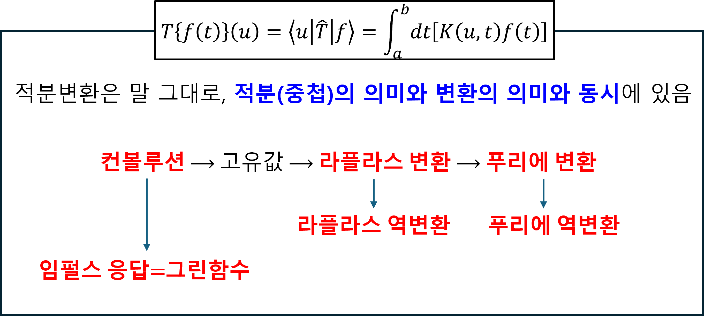

+++
title = "Preface"
weight = 1
+++

---

- Integral Transformation

$$
T\{f(t)\}\left(u\right)=\int_{t_1}^{t_2}dt\left\lbrack K\left(u,t\right)f\left(t\right)\right\rbrack
$$

- Convolution

$$
y\left(t\right)=\int_0^{t}d\tau\left\lbrack h\left(\tau\right)x\left(t-\tau\right)\right\rbrack
$$

- Laplace transformation

$$
\langle s|f\rangle
=\int_{-\infty}^{\infty}dt\left\lbrack e^{-st}f\left(t\right)\right\rbrack
$$

$$
\langle t|F\rangle
=\frac{1}{2\pi i}\int_{\sigma-i\infty}^{\sigma+i\infty}ds\left\lbrack e^{st}F\left(s\right)\right\rbrack
$$

- Fourier transformation, 비대칭형

$$
\langle\omega|f\rangle
=\int_{-\infty}^{\infty}dt\left\lbrack e^{-i\omega t}f\left(t\right)\right\rbrack
$$

$$
\langle t|F\rangle
=\frac{1}{2\pi}\int_{-\infty}^{\infty}d\omega\left\lbrack e^{i\omega t}F\left(\omega\right)\right\rbrack
$$

- Fourier transformation, 대칭형

$$
\langle k|f\rangle
=\frac{1}{\sqrt{2\pi}}\int_{-\infty}^{\infty}dk\left\lbrack e^{-ikx}f\left(k\right)\right\rbrack
$$

$$
\langle x|F\rangle
=\frac{1}{\sqrt{2\pi}}\int_{-\infty}^{\infty}dk\left\lbrack e^{+ikx}F\left(k\right)\right\rbrack
$$

- Green’s function

$$
y\left(t\right)=\int_{r^{\prime}}^{}dr^{\prime}\left\lbrack G\left(r,r^{\prime}\right)f\left(r^{\prime}\right)\right\rbrack
$$
