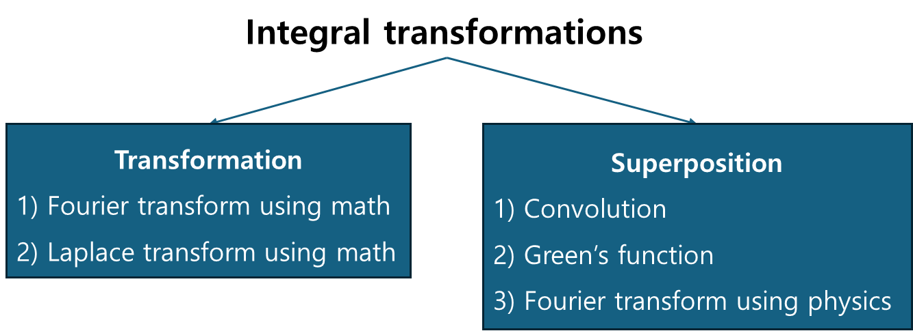

+++
title = "Preface"
weight = 1
+++

---

아래 그림과 같이 적분 변환은 크게 2가지 관점으로 분류할 수 있다. 분류가 되었다고 해서, 2개는 서로 별개의 것이 아니라, 서로 연결되어 있음을 주의한다.

$$
\left(Tf\right)\left(u\right)=\int_{t_1}^{t_2}dt\left\lbrack K\left(u,t\right)f\left(t\right)\right\rbrack
$$

---

### 1. Transformation

- Fourier transformation using math

$$
F\left\lbrace f\left(t\right)\right\rbrace\left(\omega\right)=\int_{-\infty}^{\infty}dt\left\lbrack f\left(t\right)e^{-j\omega t}\right\rbrack
$$

$$
f\left(t\right)=\frac{1}{2\pi}\int_{-\infty}^{\infty}d\omega\left\lbrack F\left(\omega\right)e^{j\omega t}\right\rbrack
$$

- Laplace transformation using math

$$
L\left\lbrace f\left(t\right)\right\rbrace\left(s\right)=\int_{-\infty}^{\infty}dt\left\lbrack f\left(t\right)e^{-st}\right\rbrack
$$

$$
f\left(t\right)=\frac{1}{2\pi j}\int_{\sigma-j\infty}^{\sigma+j\infty}ds\left\lbrack F\left(s\right)e^{st}\right\rbrack
$$

---

### 2. Superposition

- Convolution

$$
y\left(t\right)=\int_0^{t}d\tau\left\lbrack h\left(\tau\right)x\left(t-\tau\right)\right\rbrack
$$

- Green’s function

$$
y\left(t\right)=\int_{r^{\prime}}^{}dr^{\prime}\left\lbrack G\left(r,r^{\prime}\right)f\left(r^{\prime}\right)\right\rbrack
$$

- Fourier transformation using physic

$$
\psi\left(x\right)=\frac{1}{\sqrt{2\pi}}\int_{-\infty}^{\infty}dk\left\lbrack\Psi\left(k\right)e^{+ikx}\right\rbrack
$$

$$
\Psi\left(k\right)=\frac{1}{\sqrt{2\pi}}\int_{-\infty}^{\infty}dx\left\lbrack\psi\left(x\right)e^{-ikx}\right\rbrack
$$