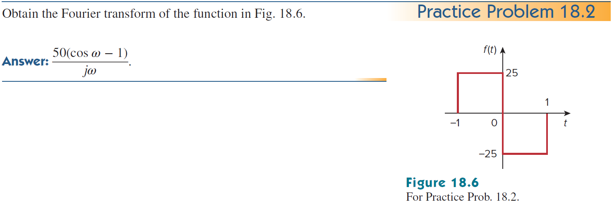
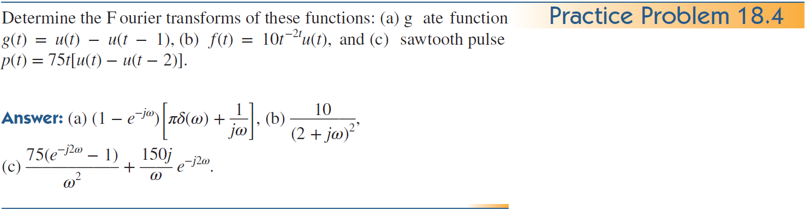
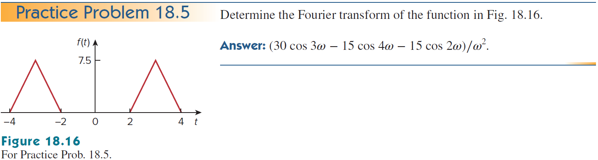

+++
title = "(a) Fourier transform - Dirac notation"
weight = 7
+++

---

이 챕터에서는 **대칭성 기반의 정의** 를 사용한다.

---

### 1. 중요변환

**1) Dirac delta function - time to frequency domain**

$$
\langle \omega| \delta \rangle=\frac{1}{\sqrt{2\pi}}
$$



$\langle\omega|t\rangle=\cfrac{1}{\sqrt{2\pi}}e^{-i\omega t}$ 라고 하자.
    
$$
\langle\omega\ | \left(\int^{\infty}_{-\infty}dt|t\rangle\langle t| \right) |\delta \rangle
=\int^{\infty}_{-\infty}dt \langle\omega |t\rangle\langle t | \delta \rangle
=\int^{\infty}_{-\infty}dt \left[\frac{1}{\sqrt{2\pi}}e^{-i\omega t}\delta\left(t\right)\right]
=\frac{1}{\sqrt{2\pi}}
$$



**2) Dirac delta function - frequency to time domain**

$$
\langle t| \delta \rangle=\frac{1}{\sqrt{2\pi}}
$$


    
$\langle t|\omega\rangle
=\cfrac{1}{\sqrt{2\pi}}e^{+i\omega t}$ 라고 하자.
    
$$
\langle t| \left(\int^{\infty}_{-\infty}d\omega|\omega\rangle\langle \omega|\right)|\delta \rangle
=\int^{\infty}_{-\infty}d\omega\langle t|\omega\rangle\langle \omega|\delta\rangle
=\int^{\infty}_{-\infty}d\omega\left[\frac{1}{\sqrt{2\pi}}e^{+i\omega t}\delta\left(t\right)\right]
=\frac{1}{\sqrt{2\pi}}
$$



**3) DC, Constant**

$$
\langle\omega|1\rangle
=\sqrt{2\pi}\delta\left(\omega\right)
$$



$$
\langle\omega|1\rangle
=\int^{\infty}_{-\infty}dt\left[\frac{1}{\sqrt{2\pi}}e^{-i\omega t}\cdot 1\right]
=\sqrt{2\pi}\delta\left(\omega\right)
$$



**4) Unit function**

$$
\langle\omega|u\rangle
=\frac{1}{\sqrt{2\pi}}\left\lbrace\frac{1}{i\omega}+\pi\delta\left(\omega\right)\right\rbrace
$$
  
**5) cosine function**

$$
\langle\omega|\cos at\rangle
=\frac{1}{\sqrt{2\pi}}\left\lbrace\pi\delta\left(\omega-a\right)+\pi\delta\left(\omega+a\right)\right\rbrace
$$

**6) sine function**

$$
\langle\omega|\sin at\rangle
=\frac{1}{\sqrt{2\pi}}\left\lbrace-i\pi\delta\left(\omega-a\right)+i\pi\delta\left(\omega+a\right)\right\rbrace
$$

---

### 2. Properties 1

**1) time scaling & shifting**

$$
\langle \omega|f\left(at+b\right)\rangle
=e^{i\frac{b}{a}\omega}\left\langle\omega\middle|f(at)\right\rangle
=\frac{1}{\left|a\right|}e^{i\frac{b}{a}\omega}\left\langle \frac{\omega}{a}\middle|f\right\rangle
$$
    
**2) time shifting**

$$
\langle \omega|f\left(t-t'\right)\rangle
=e^{-i\omega t'}\left\langle \omega\middle|f\right\rangle
$$

**3) frequency shifting**

$$
\langle \omega|e^{iat}f\rangle
=\langle \omega+i\cdot ia|f\rangle
=\langle \omega-a|f\rangle
$$

**4) convolution**

$$
\langle\omega|h\ast f\rangle
=\sqrt{2\pi}\langle\omega|h\rangle\langle\omega|f\rangle
$$

---

**example1)** 

$$
\mathcal{F}\left\lbrace u\left(t-t'\right)\right\rbrace\left(\omega\right)
$$



$$
\langle\omega|u\left(t-t'\right)\rangle
=e^{-i\omega t'}\langle\omega|u\rangle
=\frac{e^{-i\omega t'}}{\sqrt{2\pi}}\left\lbrace\frac{1}{i\omega}+\pi\delta\left(\omega\right)\right\rbrace
$$



**example2)**

$$
\mathcal{F}\left\lbrace\delta\left(t-t'\right)\right\rbrace\left(\omega\right)
$$


    
$$
\langle\omega|\delta\left(t-t'\right)\rangle
=e^{-i\omega t'}\langle\omega|\delta\rangle
=\frac{e^{-i\omega t'}}{\sqrt{2\pi}}
$$



**example3)**

$$
\mathcal{F}\left\lbrace e^{iat}\right\rbrace\left(\omega\right)
$$


    
$$
\langle\omega|e^{iat}\rangle
=\langle\omega+i\cdot ia|1\rangle
=\sqrt{2\pi}\delta\left(\omega-a\right)
$$



**example4)** 

$$
\mathcal{F}\left\lbrace e^{at}u\left(t\right)\right\rbrace\left(\omega\right),\quad a<0
$$



$$
\langle\omega|e^{at}u\rangle
=\langle\omega+ia|u\rangle
=\frac{1}{\sqrt{2\pi}}\left\lbrace\frac{1}{i\left(\omega+ia\right)}+\pi\delta\left(\omega+ia\right) \right\rbrace
$$

$$
=\frac{1}{\sqrt{2\pi}}\cdot\frac{1}{i\omega-a}
$$



**example5)** 

$$
\mathcal{F}\left\lbrace u\left(-t\right)\right\rbrace\left(\omega\right)
$$



$$
\langle\omega|u\left(-t\right)\rangle
=\langle-\omega|u\rangle
=\frac{1}{\sqrt{2\pi}}\left\lbrace -\frac{1}{i\omega}+\pi\delta\left(\omega\right) \right\rbrace
$$



**example6)**

$$
\mathcal{F}\left\lbrace e^{at}u\left(-t\right)\right\rbrace\left(\omega\right),\quad a>0
$$



$$
\langle\omega|e^{at}u\left(-t\right)\rangle
=\langle\omega+ia|u\left(-t\right)\rangle
=\langle-\omega-ia|u\left(t\right)\rangle
$$

$$
=\frac{1}{\sqrt{2\pi}}\left\lbrace\frac{1}{i\left(-\omega-ia\right)}+\pi\delta\left(-\omega-ia\right) \right\rbrace
$$

$$
=\frac{1}{\sqrt{2\pi}}\cdot\frac{1}{-i\omega+a}
$$



**example7)**

$$
\mathcal{F}\left\lbrace e^{-t}u\left(t-1\right)\right\rbrace\left(\omega\right)
$$



$$
\langle\omega|e^{-t}u\left(t-1\right)\rangle
=\langle\omega-i|u\left(t-1\right)\rangle
=e^{-i(\omega-i)}\langle\omega-i|u\rangle
$$

$$
=e^{-i\omega-1}\langle\omega-i|u\rangle
=\frac{e^{-i\omega-1}}{\sqrt{2\pi}}\cdot\frac{1}{i\omega+1}
$$



**example8)**

$$
\mathcal{F}\left\lbrace e^{-2t}u\left(2t-1\right)\right\rbrace\left(\omega\right)
$$



$$
\langle \omega| e^{-2t}u\left(2t-1\right)\rangle
=\langle \omega-2i| u\left(2t-1\right)\rangle
$$

$$
=e^{-i\frac{\omega}{2}-1}\langle \omega-2i| u\left(2t\right)\rangle
=\frac{1}{2}e^{-i\frac{\omega}{2}-1}\left\langle \frac{\omega}{2}-i\middle| u\right\rangle
$$

$$
=\frac{1}{2\sqrt{2\pi}}e^{-i\frac{\omega}{2}-1}\left\lbrace\frac{1}{i\left(\omega/2-i\right)}\right\rbrace
$$

$$
=\frac{1}{\sqrt{2\pi}}\frac{e^{-i\omega/2-1}}{i\omega+2}
$$



**example9)**

$$
\mathcal{F}\left\lbrace e^{t}u\left(1-t\right)\right\rbrace\left(\omega\right)
$$



$$
\langle \omega| e^{t}u\left(1-t\right)\rangle
=\langle \omega+i| u\left(1-t\right)\rangle
=e^{-i\omega+1}\langle \omega+i| u\left(-t\right)\rangle
$$

$$
=e^{-i\omega+1}\langle -\omega-i| u\rangle
=\frac{1}{\sqrt{2\pi}}e^{-i\omega+1}\cdot\frac{1}{i(-\omega-i)}
$$

$$
=\frac{1}{\sqrt{2\pi}}\frac{e^{1-i\omega}}{1-i\omega}
$$



---

### 3. Properties 2

**1) time differentiation, 중요**

$$
\langle \omega|(\hat{D}_t)^n|f\rangle = (i\omega)^n \langle \omega|f\rangle
$$

**2) frequency differentiation** 

$$
\langle \omega|(\hat{t})^n|f\rangle = i^n(\hat{D}_\omega)^n \langle \omega|f\rangle
$$

**3) time integration** 

$$
\langle\omega|(\hat{D}_t)^{-1}|f\rangle
=\langle\omega|u\ast f\rangle
=\sqrt{2\pi}\langle\omega|u\rangle\langle\omega|f\rangle
$$

$$
= \frac{1}{i\omega} \langle \omega|f\rangle + \pi \langle 0|f\rangle \delta(\omega)
$$

---

**example1) 중요**

$$
\mathcal{F}\left\lbrace tu\left(t\right)\right\rbrace\left(\omega\right)
$$



$$
\mathcal{F}\left\lbrace tu\left(t\right)\right\rbrace\left(\omega\right)
=i\frac{d}{d\omega}\mathcal{F}\left\lbrace u\left(t\right)\right\rbrace\left(\omega\right)
$$

$$
=i\frac{d}{d\omega}\left\lbrace \frac{1}{i\omega}+\pi\delta\left(\omega\right)\right\rbrace
=-\frac{1}{\omega^2}+i\pi\delta'\left(\omega\right)
$$



**example2)**

$$
\mathcal{F}\left\lbrace tu\left(-t\right)\right\rbrace\left(\omega\right)
$$



$$
\mathcal{F}\left\lbrace tu\left(-t\right)\right\rbrace\left(\omega\right)
=\mathcal{F}\left\lbrace -tu\left(t\right)\right\rbrace\left(-\omega\right)
$$

$$
=i\frac{d}{d\omega}\mathcal{F}\left\lbrace u\left(t\right)\right\rbrace\left(-\omega\right)
=i\frac{d}{d\omega}\left\lbrace -\frac{1}{i\omega}+\pi\delta\left(\omega\right)\right\rbrace
$$

$$
=\frac{1}{\omega^2}+i\pi\delta'\left(\omega\right)
$$



**example3)**

$$
\mathcal{F}\left\lbrace tu\left(2t+1\right)\right\rbrace\left(\omega\right)
$$



$$
\mathcal{F}\left\lbrace tu\left(2t+1\right)\right\rbrace\left(\omega\right)
=\mathcal{F}\left\lbrace\frac{1}{2}\left(2t+1-1\right)u\left(2t+1\right)\right\rbrace\left(\omega\right)
$$

$$
=\frac{1}{2}\mathcal{F}\left\lbrace\left(2t+1-1\right)u\left(2t+1\right)\right\rbrace\left(\omega\right)
$$

$$
=\frac{1}{2}\mathcal{F}\left\lbrace\left(2t+1\right)u\left(2t+1\right)-u\left(2t+1\right)\right\rbrace\left(\omega\right)
$$

$$
=\frac{1}{4}e^{+i\frac{1}{2}\omega}\mathcal{F}\left\lbrace tu\left(t\right)-u\left(t\right)\right\rbrace\left(\frac{\omega}{2}\right)
$$

$$
=\frac{1}{4}e^{+i\frac{1}{2}\omega}\left[2i\frac{d}{d\omega}\mathcal{F}\left\lbrace u\left(t\right)\right\rbrace -\mathcal{F}\left\lbrace u\left(t\right)\right\rbrace\right]\left(\frac{\omega}{2}\right)
$$

$$
=\frac{1}{4}e^{+i\frac{1}{2}\omega}\left[\frac{2}{\omega^2}+2i\pi\delta'\left(\omega\right) -\mathcal{F}\left\lbrace u\left(t\right)\right\rbrace\right]\left(\frac{\omega}{2}\right)
$$



---

### 8. Inverse Laplace & Fourier transform

$$
\mathcal{L}^{-1}\left\lbrace F_L\left(s\right)\right\rbrace\left(t\right)=\frac{1}{2\pi i}\int_{\sigma-i\infty}^{\sigma+i\infty}ds\left\lbrack e^{st}F_L\left(s\right)\right\rbrack
$$

$$
\mathcal{F}^{-1}\left\lbrace F(\omega)\right\rbrace\left(t\right)=\frac{1}{2\pi}\int_{-\infty}^{\infty}d\omega\left[e^{i\omega t}F\left(\omega\right)\right]
$$

$s=i\omega$를 라플라스 변환에 대입해 보자.

$$
\mathcal{L}^{-1}\left\lbrace F_L\left(i\omega\right)\right\rbrace\left(t\right)=\mathcal{F}^{-1}\left\lbrace F(\omega)\right\rbrace\left(t\right)
$$

ℹ️ 푸리에 역변환은 라플라스 역변환과 동일하다.

---

### 9. Duality

---

### 10. Practice

**필수, example1)**

- sol
    
    $$
    \mathcal{F}\left\lbrack f'\left(t\right)\right\rbrack=\left(i\omega\right)F\left(\omega\right)
    $$
    
    $$
    A\mathcal{F}\left\lbrack\delta\left(t+\frac{\tau}{2}\right)\right.-\left.\delta\left(t-\frac{\tau}{2}\right)\right\rbrack=A\left(e^{i\omega\frac{\tau}{2}}-e^{-i\omega\frac{\tau}{2}}\right)
    $$
    
    $$
    F\left(\omega\right)=A\left(\frac{e^{i\omega\frac{\tau}{2}}-e^{-i\omega\frac{\tau}{2}}}{i\omega}\right)=A\tau\frac{\sin\left(\omega\tau/2\right)}{\omega\tau/2}=\operatorname{A\tau\cdot sinc\left(\frac{\omega\tau}{2}\right)}
    $$
    

**example2)**

- sol
    
    $$
    \mathcal{F}\left\lbrack f'\left(t\right)\right\rbrack=\left(i\omega\right)F\left(\omega\right)
    $$
    
    $$
    25\mathcal{F}\left\lbrack\delta\left(t+1\right)-2\delta\left(t\right)+\delta\left(t-1\right)\right\rbrack=25\left(e^{i\omega}-2+e^{-i\omega}\right)
    $$
    
    $$
    F\left(\omega\right)=\frac{50}{i\omega}\left(\frac{e^{i\omega}+e^{-i\omega}}{2}-1\right)=\frac{50}{i\omega}\left(\cos\omega-1\right)
    $$
    

**example3)**

- sol

**example4) @Seungmin Son** 

- sol

**example6)**

- sol (a)
    
    $$
    \mathcal{F}\left\lbrack\frac{d}{dt}\operatorname{sgn}\left(t\right)\operatorname{}\right\rbrack=\left(i\omega\right)\mathcal{F}\left(\omega\right)
    $$
    
    $$
    \mathcal{F}\left\lbrack2\delta\operatorname{}\left(t\right)\operatorname{}\right\rbrack=2
    $$
    
    $$
    \mathcal{F}\left\lbrack\frac{d}{dt}\operatorname{sgn}\left(t\right)\operatorname{}\right\rbrack=\frac{2}{i\omega}
    $$
    
    ---
    
    unit function 로 풀어 보기 [최수인 (Unlicensed)](https://hertz2hnu.atlassian.net/wiki/people/712020:1f3af0d6-22e5-4b45-9a8a-7a617da825a0?ref=confluence)
    
- sol (b)
    
    $$
    \mathcal{F}\left\lbrack e^{-\left|a\right|t}u\left(t\right)+e^{\left|a\right|t}u\left(-t\right)\operatorname{}\right\rbrack=\frac{1}{s+a}-\frac{1}{s-a}=\frac{-2a}{s^2-a^2}=\frac{2a}{\omega^2+a^2}
    $$
    
- sol (c)
    
    푸리에 변환은 푸리에 역변환과 형태가 동일함을 이용한다.
    
    - i\omega=t\rightarrow dt=-id\omega
    
    $$
    \int_{-\infty}^{\infty}dt\left\lbrack\frac{\sin t}{t}e^{-i\omega t}\right\rbrack=-\int_{-i\infty}^{i\infty}ds\left\lbrack\frac{\sin s}{s}e^{st}\right\rbrack=-2\pi i\cdot\mathcal{L}^{-1}\left\lbrack\frac{\sin s}{s}\right\rbrack
    $$
    
    $$
    \mathcal{L}^{-1}\left\lbrack\frac{\sin s}{s}\right\rbrack=\mathcal{L}^{-1}\left\lbrack\frac{1}{s}\left(\frac{e^{-is}-e^{is}}{2i}\right)\right\rbrack=-\frac{1}{2i}\left(u\left(t-1\right)-u\left(t+1\right)\right)
    $$
    
    $$
    \int_{-\infty}^{\infty}dt\left\lbrack\frac{\sin t}{t}e^{-i\omega t}\right\rbrack=\pi\left\lbrace u\left(-i\omega-1\right)-u\left(-i\omega+1\right)\right\rbrace
    $$
    
    ---
    
    복소적분을 사용하여 풀기
    
    $$
    \operatorname{Re}\left\lbrack\int_{-\infty}^{\infty}dt\left\lbrack\frac{-ie^{it}}{t}e^{-i\omega t}\right\rbrack\right\rbrack=\operatorname{Re}\left\lbrack\oint_{C}-\int_{C_{R}}-\int_{C_{r}}\right\rbrack
    $$
    
    $$
    \oint_{C}=0
    $$
    
    - \int_{C_{}}dz\left\lbrack\frac{-ie^{iz\left(1-\omega\right)}}{z}\right\rbrack=i\int_{C}dz\left\lbrack\frac{e^{iz\left(1-\omega\right)}}{z}\right\rbrack=-\int_{C}Re^{i\theta}d\theta\left\lbrack\frac{e^{iRe^{i\theta}\left(1-\omega\right)}}{Re^{i\theta}}\right\rbrack
    
    $$
    =-\int_{C}^{}d\theta\left\lbrack e^{iR\left(\cos\theta+i\sin\theta)\left(1-\omega\right)\right)}\right\rbrack
    $$
    
    if $\omega<1$, upper contour
    
    - \int_{C_{R}}=0,\text{ Jordan's lemma}
    - \int_{C_{r}}^{}=\lim_{R\rightarrow0}\left\lbrack-\int_{\pi}^0d\theta\left\lbrack1\right\rbrack\right\rbrack=\pi
    
    $$
    \operatorname{Re}\left\lbrack\int_{-\infty}^{\infty}dt\left\lbrack\frac{-ie^{it}}{t}e^{-i\omega t}\right\rbrack\right\rbrack=\pi
    $$
    
    if $\omega>1$, lower contour
    
    - \int_{C_{R}}=0,\text{ Jordan's lemma}
    - \int_{C_{r}}^{}=\lim_{R\rightarrow0}\left\lbrack-\int_{\pi}^0d\theta\left\lbrack1\right\rbrack\right\rbrack=\pi
    
    $$
    \operatorname{Re}\left\lbrack\int_{-\infty}^{\infty}dt\left\lbrack\frac{-ie^{it}}{t}e^{-i\omega t}\right\rbrack\right\rbrack=\pi
    $$
    
    if $\omega=1$, by Cauchy principal value, 0
    
    $$
    \operatorname{Re}\left\lbrack\int_{-\infty}^{\infty}dt\left\lbrack\frac{-ie^{it}}{t}e^{-i\omega t}\right\rbrack\right\rbrack=0
    $$
    

**example7) @Seungmin Son** 

- sol (a)
- sol (b)
- sol (c)

**example8)**

- sol

**example9)** @Seungmin Son 

- sol

---

**example1)**

- sol

**example2) @Seungmin Son** 

- sol (a)
- sol (b)
    
    $$
    \mathcal{F}^{-1}\left\lbrack\pi\delta\left(-is\right)+\frac{1}{s}+\frac{2\left(s+1\right)}{\left(s+1\right)^2+16}\right\rbrack=u\left(t\right)\left\lbrace1+2e^{-st}\cdot\cos4t\right\rbrace
    $$