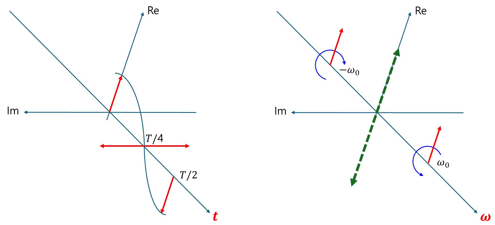

+++
title = "(b) Fourier transform I"
weight = 5
+++

---

### 1. 푸리에 변환의 본질

**함수는 여러 주파수 성분들이 중첩** 되어 있다고 볼 수 있다. 푸리에 변환은 각 주파수 성분의 크기를 구하는 것이다. 아래는 cosine과 sine 함수를 나타내며, 빨간색은 주파수 성분의 크기이다.

- cosine 함수

- sine 함수

---

### 2. 각 주파수 성분들은 orthogonal 하다.

$$
\langle e^{i\omega't}|e^{i\omega t} \rangle=2\pi\delta\left(\omega-\omega'\right)
$$



$$
\int_{-\infty}^{\infty}dt\left\lbrack e^{i\omega t}e^{-i\omega't}\right\rbrack
$$

위 식이 무엇인지 구하는 것이 목적이다. 'Regularization(정칙화) 기법'을 사용하자. 수학이나 물리학에서 다루는 문제 중에는 발산하거나(divergent), 특이점(singularity)을 포함하거나, 또는 해가 유일하게 결정되지 않는(ill-posed problem) 등 수학적으로 잘 정의되지 않거나 다루기 어려운 경우가 있다. 정칙화는 이러한 문제들을 직접 다루는 대신, 하나 이상의 매개변수(ϵ 등)를 도입하여 문제를 약간 변형(정칙화)함으로써 임시적으로 잘 정의되고 다루기 쉬운 형태로 만든 다음, 그 매개변수에 대해 특정 극한을 취하여 원래 문제의 '해석적인(meaningful)' 결과를 얻어내는 기법 이다.

$$
\Omega=\omega-\omega'
$$

$$
f_{\epsilon}(\Omega)=\int_{-\infty}^{\infty}dt\left\lbrack e^{i\Omega t}e^{-\epsilon|t|}\right\rbrack
$$

$$
\int_{-\infty}^{\infty}dt\left\lbrack e^{i\left(\omega-\omega'\right)t}\right\rbrack
=\lim_{\epsilon\to0}f_{\epsilon}(\Omega)
=\lim_{\epsilon\to0}\int_{-\infty}^{\infty}dt\left\lbrack e^{i\Omega t}e^{-\epsilon|t|}\right\rbrack
=\int_{-\infty}^0dt\left\lbrack e^{i\Omega t}e^{\epsilon t}dt\right\rbrack+\int_0^{\infty}dt\left\lbrack e^{i\Omega t}e^{-\epsilon t}\right\rbrack
$$

음수 구간

$$
\int_{-\infty}^0dt\left\lbrack e^{i\Omega t}e^{\epsilon t}dt\right\rbrack=\int_{-\infty}^0dt\left\lbrack e^{(\epsilon+i\Omega)t}\right\rbrack=\left[\frac{1}{\epsilon+ i\Omega}e^{(\epsilon+i\Omega)t}\right]_{-\infty}^0=\frac{1}{\epsilon+ i\Omega}
$$

양수 구간

$$
\int_{0}^{\infty} e^{i\Omega t} e^{-\epsilon t} dt = \int_{0}^{\infty} e^{(-\epsilon + i\Omega)t} dt = \left[ \frac{1}{-\epsilon + i\Omega} e^{(-\epsilon + i\Omega)t} \right]_{0}^{\infty} = \frac{1}{\epsilon - i\Omega}
$$

따라서,

$$
f_{\epsilon}(\Omega)=\int_{-\infty}^{\infty}dt\left\lbrack e^{i\Omega t}e^{-\epsilon|t|}\right\rbrack=\frac{2\epsilon}{\Omega^2 + \epsilon^2}
$$

(1) $\Omega=0$

$$
\lim_{\epsilon\to0}f_{\epsilon}(\Omega)=\lim_{\epsilon\to0}\frac{2}{\epsilon}=\infty
$$

(2) $\Omega\ne0$

$$
\lim_{\epsilon\to0}f_{\epsilon}(\Omega)=\lim_{\epsilon\to0}\frac{0}{\Omega^2}=0
$$

(1) & (2) 의 결과를 사용하면, 다음을 얻을 수 있다.

$$
\lim_{\epsilon\to0}f_{\epsilon}(\Omega)=A\delta\left(\Omega\right)
$$

계수 A가 무엇인지 구해보자. 디렉델타함수의 정의를 사용한다.

$$
A=\int_{-\infty}^{\infty}d\Omega\left\lbrack \frac{2\epsilon}{\Omega^2 + \epsilon^2} \right\rbrack
=2\int_{-\infty}^{\infty}d\left(\frac{\Omega}{\epsilon}\right)\left\lbrack \frac{1}{\left(\frac{\Omega}{\epsilon}\right)^2 + 1} \right\rbrack
=2\left[\operatorname{atan}\left(\frac{\Omega}{\epsilon}\right)\right]^{\infty}_{-\infty}=2\pi
$$

최종적으로,

$$
\langle e^{i\omega't}|e^{i\omega t} \rangle=2\pi\delta\left(\omega-\omega'\right)
$$

만약 orthonormal 한 기저로서 표현하고 싶다면,

$$
\left\langle \frac{e^{i\omega't}}{\sqrt{2\pi}}\middle|\frac{e^{i\omega t}}{\sqrt{2\pi}}\right\rangle=\delta\left(\omega-\omega'\right)
$$



---

### 3. 푸리에 변환, 정규 직교성(orthonormal) or 대칭성 기반의 정의

- **물리학, 특히 양자역학:** 정규 직교성 기반 정의가 압도적으로 많이 사용된다. 에너지 보존과 확률 진폭 해석의 중요성 때문이다.
- 물리학적으로 사용될 때, 해석 공간의 변환보다는 **주파수가 중첩되어 있다는 의미가 강함**

$$
f\left(t\right)=\frac{1}{\sqrt{2\pi}}\int_{-\infty}^{\infty}d\omega\left\lbrack F\left(\omega\right)e^{-i\omega t}\right\rbrack
$$

$$
F\left(\omega\right)=F\left\lbrace f\left(t\right)\right\rbrace\left(\omega\right)=\frac{1}{\sqrt{2\pi}}\int_{-\infty}^{\infty}dt\left\lbrack f\left(t\right)e^{+i\omega t}\right\rbrack
$$

---

### 4. 푸리에 변환, 비대칭성 기반의 정의

- **수학:** 비대칭성 기반 정의가 더 많이 사용되는 경향이 있다. 비대칭적인 형태가 수학적 이론 전개에 편리하기 때문
- **공학, 특히 신호 처리:** 비대칭성 기반 정의가 더 많이 사용되는 경향이 있다.
- 수학, 공학적으로 사용될 때, 주파수 중첩 보다는 **해석 공간의 변환 이라는 의미가 강함**

$$
F\left(\omega\right)=F\left\lbrace f\left(t\right)\right\rbrace\left(\omega\right)=\int_{-\infty}^{\infty}dt\left\lbrack f\left(t\right)e^{-i\omega t}\right\rbrack
$$

$$
f\left(t\right)=\frac{1}{2\pi}\int_{-\infty}^{\infty}dt\left\lbrack F\left(\omega\right)e^{+i\omega t}\right\rbrack
$$

---

### 5. 라플라스 변환과의 관계

라플라스 변환에서 **$s=\sigma+i\omega$** 이면, **$\sigma=0$** 일 때, 푸리에 변환이라고 한다. **즉, 푸리에 변환은 라플라스 변환의 특수한 경우**

---

### 6. 페이저 변환과의 관계

페이저 변환과 수학적 뿌리는 동일하다. **그러나 전혀 다른 변환으로 생각하자.** 페이저 변환은 주파수가 1개 (2개 이상 안됨) 일 때, 적용할 수 있는 방법이다.

---