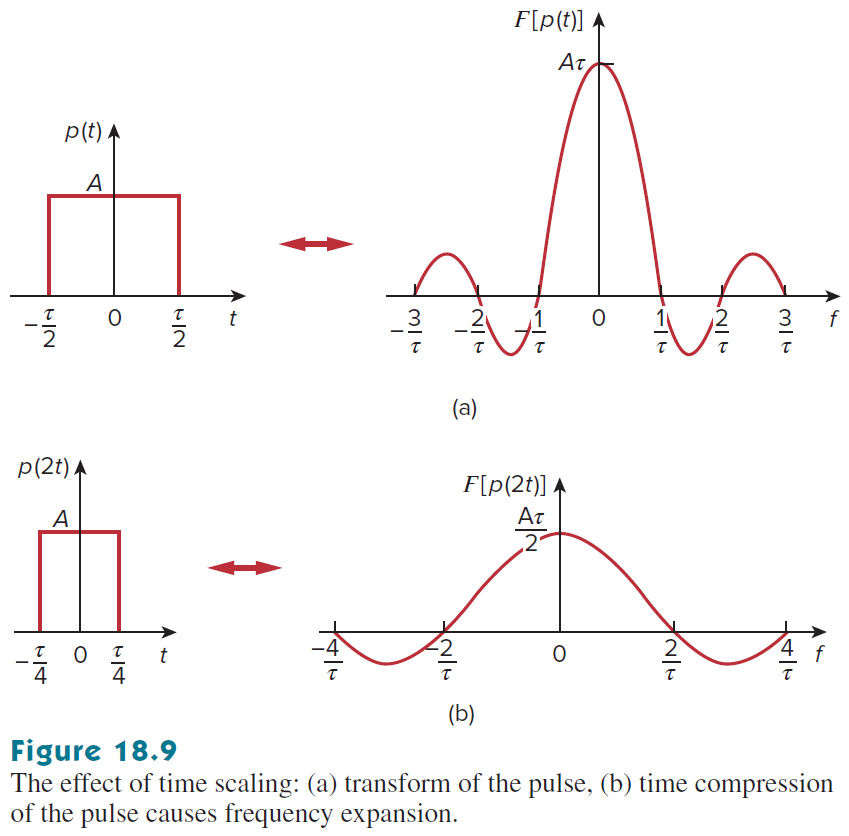
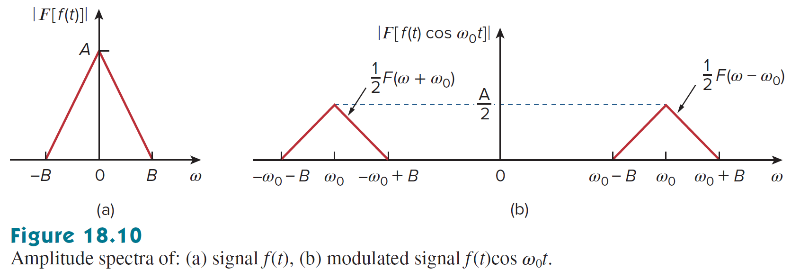
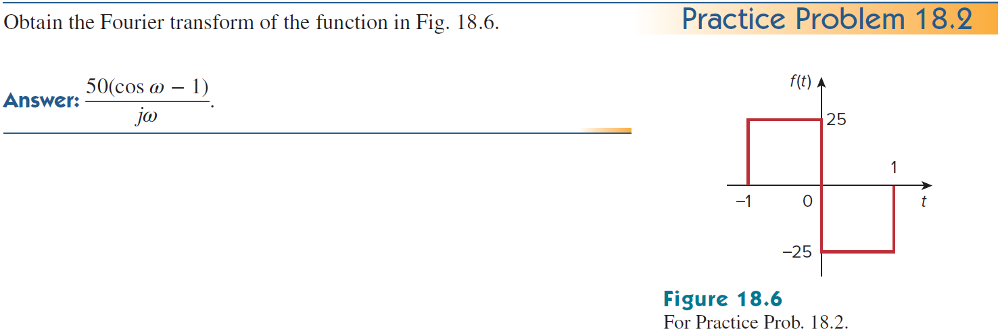
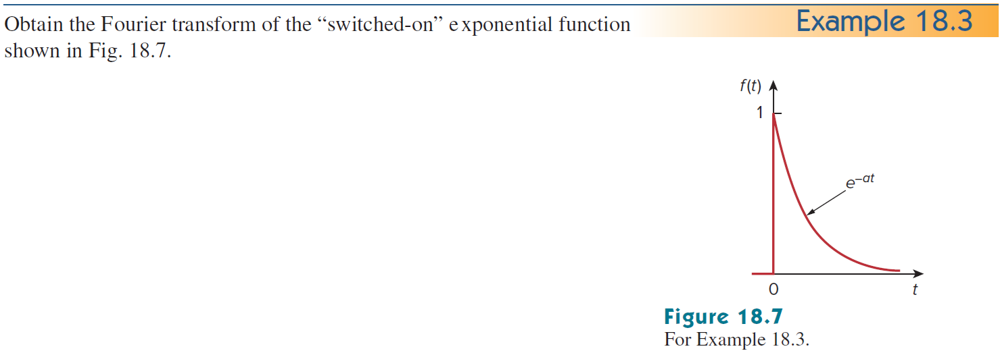

+++
title = "(b) Fourier transform II"
weight = 6
+++

---

이 챕터에서는 **비대칭성 기반의 정의** 를 사용한다.

---

### 1. 중요변환

**example1) 델타 신호를 만들기 위해서는 모든 주파수 신호가 합쳐져야 한다.**

$$
\mathcal{F}\left\lbrace\delta\left(t\right)\right\rbrace\left(\omega\right)=1
$$


    
$$
F(\omega)=\int_{-\infty}^{\infty}dt\left\lbrack\delta\left(t\right)e^{-i\omega t}\right\rbrack=1\cdot\int_{-\infty}^{\infty}dt\left\lbrack\delta\left(t\right)\right\rbrack=1
$$



**example2) 주파수가 0인 신호는 DC 신호이다.**

$$
\mathcal{F}^{-1}\left\lbrace\delta\left(\omega\right)\right\rbrace\left(t\right)=\frac{1}{2\pi}
$$


    
$$
f(t)=\frac{1}{2\pi}\int_{-\infty}^{\infty}d\omega\left\lbrack\delta\left(\omega\right)e^{i\omega t}\right\rbrack=\frac{1}{2\pi}\int_{-\infty}^{\infty}d\omega\left\lbrack\delta\left(\omega\right)\right\rbrack=\frac{1}{2\pi}
$$



**example4) DC 신호는 주파수가 0 인 신호이다.**

$$
\mathcal{F}\left\lbrace1\right\rbrace\left(\omega\right)=2\pi\delta\left(\omega\right)
$$


    
$$
F(\omega)=\int_{-\infty}^{\infty}dt\left\lbrack e^{-i\omega t}\right\rbrack=2\pi\delta\left(\omega\right)
$$



**example5)**

$$
\mathcal{F}\left\lbrace u\left(t\right)\right\rbrace\left(\omega\right)=\frac{1}{i\omega}+\pi\delta\left(\omega\right)
$$


    
일반적으로 적분이 안되므로, 정칙화를 사용한다. 제시된 식에 정칙화를 사용하면, 라플라스 변환과 유사해 진다.

  

$$
\lim_{\epsilon\to0+}\int_0^{\infty}dt\left\lbrack e^{-i\omega t}e^{-\epsilon t}\right\rbrack
=\lim_{\epsilon\to0+}\frac{1}{\epsilon+i\omega}
$$

(1) $\omega\ne0$ 경우

$$
\lim_{\epsilon\to0+}\frac{1}{\epsilon+i\omega}=\frac{1}{i\omega}
$$

(2) $\omega=0$ 경우

$$
\lim_{\epsilon\to0+}\frac{1}{\epsilon+i\omega}=\lim_{\epsilon\to0+}\frac{1}{\epsilon}=\infty
$$

따라서, 위 둘의 결과를 합치면,

$$
\lim_{\epsilon\to0+}\frac{1}{\epsilon+i\omega}=\frac{1}{i\omega}+A\delta\left(\omega\right)
$$

계수 A를 구하기 위해, 디렉델타 성질을 사용한다.

$$
\lim_{\epsilon\to0+}\int^{\infty}_{-\infty}d\omega\left[\frac{1}{\epsilon+i\omega}\right]=\int^{\infty}_{-\infty}d\omega\left[\frac{1}{i\omega}\right]+A
$$

동일한 속도로 $\omega$ 가 움직인다라고 하면, (정칙적, 해석적)

$$
A=\lim_{\epsilon\to0+}\int^{\infty}_{-\infty}d\omega\left[\frac{1}{\epsilon+i\omega}\right]
=\lim_{\epsilon\to0+}\int^{\infty}_{-\infty}d\omega\left[\frac{\epsilon}{\epsilon^2+\omega^2}-i\frac{\omega}{\epsilon^2+\omega^2}\right]
$$

두번째 적분항은 기함수 이므로,

$$
A=\lim_{\epsilon\to0+}\int^{\infty}_{-\infty}d\omega\left[\frac{\epsilon}{\epsilon^2+\omega^2}\right]
=\lim_{\epsilon\to0+}\int^{\infty}_{-\infty}d\left(\frac{\omega}{\epsilon}\right)\left[\frac{1}{1+\left (\frac{\omega}{\epsilon}\right)^2}\right]
$$

$$
=\left[\operatorname{atan}\left(\frac{\omega}{\epsilon}\right) \right]^{\infty}_{-\infty}=\pi
$$

최종적으로,

$$
\mathcal{F}\left\lbrace u\left(t\right)\right\rbrace\left(\omega\right)=\frac{1}{i\omega}+\pi\delta\left(\omega\right)
$$


    
**example6)**

$$
\mathcal{F}\left\lbrace\cos at\right\rbrace\left(\omega\right)=\pi\delta\left(\omega-a\right)+\pi\delta\left(\omega+a\right)
$$


    
$$
F(\omega)=\int_{-\infty}^{\infty}dt\left\lbrack\cos at\cdot e^{-i\omega t}\right\rbrack=\int_{-\infty}^{\infty}dt\left\lbrack\frac{e^{+iat}+e^{-iat}}{2}\cdot e^{-i\omega t}\right\rbrack
$$
    
$$
=\int_{-\infty}^{\infty}dt\left\lbrack\frac{e^{+i\left(a-\omega\right)t}+e^{-i\left(a+\omega\right)t}}{2}\right\rbrack=\frac{2\pi\delta\left(a-\omega\right)}{2}+\frac{2\pi\delta\left(a+\omega\right)}{2}
$$
    
$$
=\pi\delta\left(\omega-a\right)+\pi\delta\left(a+\omega\right)
$$


    

**example7)**

$$
\mathcal{F}\left\lbrace\sin at\right\rbrace\left(\omega\right)=-i\pi\delta\left(\omega-a\right)+i\pi\delta\left(\omega+a\right)
$$


    
$$
F(\omega)=\int_{-\infty}^{\infty}dt\left\lbrack\sin at\cdot e^{-i\omega t}\right\rbrack=\int_{-\infty}^{\infty}dt\left\lbrack\frac{e^{+iat}-e^{-iat}}{2i}\cdot e^{-i\omega t}\right\rbrack
$$
    
$$
=\int_{-\infty}^{\infty}dt\left\lbrack\frac{e^{+i\left(a-\omega\right)t}-e^{-i\left(a+\omega\right)t}}{2i}\right\rbrack=\frac{2\pi\delta\left(a-\omega\right)}{2i}-\frac{2\pi\delta\left(a+\omega\right)}{2i}
$$
    
$$
=-i\pi\delta\left(\omega-a\right)+i\pi\delta\left(a+\omega\right)
$$



---

### 2. Properties, 라플라스 변환과 동일

**1) time scaling**

$$
\mathcal{F}\left\lbrace f\left(at+b\right)\right\rbrace\left(\omega\right)=\frac{1}{\left|a\right|}e^{i\frac{b}{a}\omega}\mathcal{F}\left\lbrace f\left(t\right)\right\rbrace\left(\frac{\omega}{a}\right)
$$



(1) a>0

$$
\mathcal{F}\left\lbrace f\left(at\right)\right\rbrace\left(\omega\right)=e^{i\frac{b}{a}\omega}\int_{-\infty}^{\infty}\frac{1}{a}d\tau\left\lbrack f\left(\tau\right)e^{-i\frac{\omega}{a}\tau}\right\rbrack=\frac{1}{\left|a\right|}e^{i\frac{b}{a}\omega}\mathcal{F}\left\lbrace f\left(t\right)\right\rbrace\left(\frac{\omega}{a}\right)
$$

(2) a<0

$$
\mathcal{F}\left\lbrace f\left(at\right)\right\rbrace\left(\omega\right)=e^{i\frac{b}{a}}\int_{\infty}^{-\infty}\frac{1}{a}d\tau\left\lbrack f\left(\tau\right)e^{-i\frac{\omega}{a}\tau}\right\rbrack=-\frac{1}{\left|a\right|}e^{i\frac{b}{a}\omega}\mathcal{F}\left\lbrace f\left(t\right)\right\rbrace\left(\frac{\omega}{a}\right)
$$

 
    


    
**2) time shifting**

$$
\mathcal{F}\left\lbrace f\left(t-t'\right)\right\rbrace\left(\omega\right)=e^{-i\omega t'}\mathcal{F}\left\lbrace f\left(t\right)\right\rbrace\left(\omega\right)
$$


    
$$
\mathcal{F}\left\lbrace f\left(t-t'\right)\right\rbrace\left(\omega\right)=\int_{-\infty}^{\infty}dt\left\lbrack f\left(t-t'\right)e^{-i\omega t}\right\rbrack=\int_{-\infty}^{\infty}d\tau\left\lbrack f\left(\tau\right)e^{-i\omega\left(\tau+t'\right)}\right\rbrack
$$
    
$$
=e^{-i\omega t'}F\left(\omega\right)
$$


    

**3) frequency shifting**

$$
\mathcal{F}\left\lbrace e^{iat}f\left(t\right)\right\rbrace\left(\omega\right)=\mathcal{F}\left\lbrace f\left(t\right)\right\rbrace\left(\omega-a\right)
$$



$$
\mathcal{F}\left\lbrace e^{iat}f\left(t\right)\right\rbrace\left(\omega\right)=\int_{-\infty}^{\infty}dt\left\lbrack f\left(t\right)e^{-i\left(\omega-a\right)t}\right\rbrack=F\left(\omega-a\right)
$$
    

<b>응용</b>
    
 

    

**4) convolution**

$$
\mathcal{F}\left\lbrace h\left(t\right)\ast f\left(t\right)\right\rbrace\left(\omega\right)=H\left(\omega\right)F\left(\omega\right)
$$



$$
\mathcal{F}\left\lbrace h\left(t\right)\ast f\left(t\right)\right\rbrace\left(\omega\right)=\int^{\infty}_{-\infty}dt\left[e^{-i\omega t}\int^{\infty}_{-\infty}d\tau\left[h\left(t-\tau\right)f\left(\tau\right)\right] \right]
$$

$$
=\int^{\infty}_{-\infty}dt\left[e^{-i\omega \left(t-\tau+\tau\right)}\int^{\infty}_{-\infty}d\tau\left[h\left(t-\tau\right)f\left(\tau\right)\right] \right]
$$

$$
=\int^{\infty}_{-\infty}d\tau\left[f\left(\tau\right)e^{-i\omega\tau}\int^{\infty}_{-\infty}dt\left[h\left(t-\tau\right)e^{-i\omega \left(t-\tau\right)}\right] \right]
$$

$$
=\int^{\infty}_{-\infty}d\tau\left[f\left(\tau\right)e^{-i\omega\tau}H\left(\omega\right)\right]
$$

$$
=H\left(\omega\right)\int^{\infty}_{-\infty}d\tau\left[f\left(\tau\right)e^{-i\omega\tau}\right]
$$

$$
=H\left(\omega\right)F\left(\omega\right)
$$



---

**example1)** 

$$
\mathcal{F}\left\lbrace u\left(t-t'\right)\right\rbrace\left(\omega\right)
$$



$$
e^{-i\omega t'}\mathcal{F}\left\lbrace u\left(t\right)\right\rbrace\left(\omega\right)
=\frac{e^{-i\omega't}}{i\omega}+e^{-i\omega' t}\pi\delta\left(\omega\right)
$$



**example2)**

$$
\mathcal{F}\left\lbrace\delta\left(t-t'\right)\right\rbrace\left(\omega\right)
$$


    
$$
F(\omega)=\int_{-\infty}^{\infty}dt\left[\delta\left(t-t'\right)e^{-i\omega t}\right]=e^{-i\omega t'}\int_{-\infty}^{\infty}dt\left[\delta\left(t-t'\right)\right]
=e^{-i\omega t'}
$$




    
공사중



**example3)**

$$
\mathcal{F}\left\lbrace e^{iat}\right\rbrace\left(\omega\right)
$$


    
$$
F(\omega)=\int_{-\infty}^{\infty}dt\left\lbrack e^{iat}\cdot e^{-i\omega t}\right\rbrack=\int_{-\infty}^{\infty}dt\left\lbrack e^{-i\left(\omega-a\right)t}\right\rbrack=2\pi\delta\left(\omega-a\right)
$$




    
$$
F(\omega)=2\pi\delta\left(\omega\right)|_{\omega-a}=2\pi\delta\left(\omega-a\right)
$$



**example4)** 

$$
\mathcal{F}\left\lbrace e^{at}u\left(t\right)\right\rbrace\left(\omega\right),\quad a<0
$$



$$
F\left(\omega\right)=\int^{\infty}_{0}dt\left[e^{\left(a-i\omega\right)t}\right]
=\frac{1}{a-i\omega}\left.e^{\left(a-i\omega\right)t}\right|^{\infty}_{0}
=\frac{1}{-a+i\omega}
$$





$$
\mathcal{F}\left\lbrace e^{at}u\left(t\right)\right\rbrace\left(\omega\right)=\mathcal{F}\left\lbrace e^{i(-ia)t}u\left(t\right)\right\rbrace\left(\omega\right)
$$

$$
F\left(\omega\right)=\left[\frac{1}{i\omega}+\pi\delta\left(\omega\right)\right]_{\omega+ia}=\frac{1}{-a+i\omega}+\pi\delta\left(\omega+ia\right)
$$

여기에서, $\omega$ 는 실수이므로, $\delta\left(\omega+ia\right)=0$ 이다. 따라서,

$$
F\left(\omega\right)=\frac{1}{-a+i\omega}
$$





라플라스 변환과 매우 유사하다.

$$
F_L\left(s\right)=\left.\frac{1}{s}\right|_{s-a}=\frac{1}{s-a}
$$

s에 $i\omega$ 를 대입하면,

$$
F\left(\omega\right)=F_L\left(i\omega\right)=\frac{1}{-a+i\omega}
$$



**example5)** 

$$
\mathcal{F}\left\lbrace u\left(-t\right)\right\rbrace\left(\omega\right)
$$



$$
\mathcal{F}\left\lbrace u\left(-t\right)\right\rbrace\left(\omega\right)
=\frac{1}{|-1|}\mathcal{F}\left\lbrace u\left(t\right)\right\rbrace\left(-\omega\right)
$$

$$
=-\frac{1}{i\omega}+\pi\delta\left(-\omega\right)
=-\frac{1}{i\omega}+\pi\delta\left(\omega\right)
$$



**example6)**

$$
\mathcal{F}\left\lbrace e^{at}u\left(-t\right)\right\rbrace\left(\omega\right),\quad a>0
$$



$$
F\left(\omega\right)=\int^{0}_{-\infty}dt\left[e^{\left(a-i\omega\right)t}\right]
=\frac{1}{a-i\omega}\left.e^{\left(a-i\omega\right)t}\right|^{0}_{-\infty}
=\frac{1}{a-i\omega}
$$





$$
\mathcal{F}\left\lbrace e^{at}u\left(-t\right)\right\rbrace\left(\omega\right)
=\mathcal{F}\left\lbrace e^{-a\cdot-t}u\left(-t\right)\right\rbrace\left(\omega\right)=\mathcal{F}\left\lbrace e^{-at}u\left(t\right)\right\rbrace\left(-\omega\right)
$$

라플라스 변환과 유사하게,

$$
F_L\left(s\right)=\left.\frac{1}{s}\right|_{-s+a}=\frac{1}{a-s}
$$

s에 $i\omega$ 를 대입하면,

$$
F\left(\omega\right)=F_L\left(i\omega\right)=\frac{1}{a-i\omega}
$$



**example7)**

$$
\mathcal{F}\left\lbrace e^{-t}u\left(t-1\right)\right\rbrace\left(\omega\right)
$$



$$
\mathcal{F}\left\lbrace e^{-\left(t-1\right)-1}u\left(t-1\right)\right\rbrace\left(\omega\right)
=e^{-s}\mathcal{L}\left\lbrace e^{-t-1}u\left(t\right)\right\rbrace\left(s\right)|_{s=i\omega}
$$

$$
=e^{-s-1}\mathcal{L}\left\lbrace e^{-t}u\left(t\right)\right\rbrace\left(s\right)|_{s=i\omega}
=e^{-s-1}\mathcal{L}\left\lbrace u\left(t\right)\right\rbrace\left(s+1\right)|_{s=i\omega}
$$

$$
=\left.\frac{e^{-s-1}}{s+1}\right|_{s=i\omega}
=\frac{e^{-i\omega-1}}{i\omega+1}
$$





$$
\mathcal{F}\left\lbrace e^{i\cdot i\left(t-1\right)-1}u\left(t-1\right)\right\rbrace\left(\omega\right)
=e^{-i\omega-1}\mathcal{F}\left\lbrace e^{i\cdot it}u\left(t\right)\right\rbrace\left(\omega\right)
$$

$$
=e^{-i\omega-1}\mathcal{F}\left\lbrace u\left(t\right)\right\rbrace\left(\omega-i\right)
$$

$$
=e^{-i\omega-1}\left\lbrace \frac{1}{i\left(\omega-i\right)}+\pi\delta\left(\omega-i\right) \right\rbrace
$$

$$
=\frac{e^{-i\omega-1}}{i\omega+1}
$$



**example8)**

$$
\mathcal{F}\left\lbrace e^{-2t}u\left(2t-1\right)\right\rbrace\left(\omega\right)
$$



$$
\mathcal{L}\left\lbrace e^{-(2t-1)-1}u\left(2t-1\right)\right\rbrace\left(s\right)
=e^{-1}\mathcal{L}\left\lbrace e^{-(2t-1)}u\left(2t-1\right)\right\rbrace\left(s\right)
$$

$$
=e^{-\frac{s}{2}}\frac{e^{-1}}{2}\mathcal{L}\left\lbrace e^{-t}u\left(t\right)\right\rbrace\left(\frac{s}{2}\right)
=\frac{1}{2}e^{-\frac{s}{2}-1}\mathcal{L}\left\lbrace u\left(t\right)\right\rbrace\left(\frac{s}{2}+1\right)
$$

$$
=\frac{1}{2}e^{-\frac{s}{2}-1}\cdot\frac{2}{s+2}
$$

$s=i\omega$ 를 대입하면,

$$
\frac{e^{-i\omega/2-1}}{i\omega+2}
$$

$$
\mathcal{L}\left\lbrace e^{-(2t-1)-1}u\left(2t-1\right)\right\rbrace\left(s\right)
=e^{-1}\mathcal{L}\left\lbrace e^{-(2t-1)}u\left(2t-1\right)\right\rbrace\left(s\right)
$$

$$
=\left.\mathcal{L}\left\lbrace e^{-(t-\frac{1}{2})}u\left(t-\frac{1}{2}\right)\right\rbrace\left(s\right)\right|_{\frac{s}{2}}
=e^{-\frac{s}{2}}\left[\mathcal{L}\left\lbrace e^{-t}u\left(t\right)\right\rbrace\left(s\right)\right]_{\frac{s}{2}}
$$

$$
=e^{-\frac{s}{2}}\left[\mathcal{L}\left\lbrace u\left(t\right)\right\rbrace\left(s\right)\right]_{\frac{s}{2}+1}
$$

$s=i\omega$ 를 대입하면,

$$
\frac{e^{-i\omega/2-1}}{i\omega+2}
$$



**example9)**

$$
\mathcal{F}\left\lbrace e^{t}u\left(1-t\right)\right\rbrace\left(\omega\right)
$$



$$
\mathcal{L}\left\lbrace e^{t}u\left(1-t\right)\right\rbrace\left(s\right)
=\mathcal{L}\left\lbrace e^{-(1-t)+1}u\left(1-t\right)\right\rbrace\left(s\right)
$$

$$
=e^1\mathcal{L}\left\lbrace e^{-(1-t)}u\left(1-t\right)\right\rbrace\left(s\right)
=e^1e^{-s}\mathcal{L}\left\lbrace e^{-t}u\left(t\right)\right\rbrace\left(-s\right)
$$

$$
=e^{-s+1}\mathcal{L}\left\lbrace u\left(t\right)\right\rbrace\left(-s+1\right)
$$

$$
=\frac{e^{1-s}}{1-s}
$$

$s=i\omega$ 를 대입하면,

$$
\frac{e^{1-i\omega}}{1-i\omega}
$$



---

### 3. Properties 2

**1) time differentiation, 중요**

$$
\mathcal{F}\left\lbrace\frac{d}{dt}f\left(t\right)\right\rbrace\left(\omega\right)=\left(i\omega\right)F\left(\omega\right)
$$

$$
\mathcal{F}\left\lbrace\frac{d^{n}}{d t^{n}}f\left(t\right)\right\rbrace\left(\omega\right)=\left(i\omega\right)^{n}F\left(\omega\right)
$$



$$
\mathcal{F}\left\lbrace\frac{\partial^{n}}{\partial t^{n}}f\left(t\right)\right\rbrace\left(\omega\right)
=\int^{\infty}_{-\infty}dt\left[e^{-i\omega t}\frac{\partial^{n}}{\partial t^{n}}f\left(t\right)\right]
$$

$$
=\int^{\infty}_{-\infty}dt\left[\frac{\partial}{\partial t}\left\lbrace e^{-i\omega t}\frac{\partial^{n-1}}{\partial t^{n-1}}f\left(t\right)\right\rbrace+i\omega e^{-i\omega t}\frac{\partial^{n-1}}{\partial t^{n-1}}f\left(t\right)\right]
$$

$$
=\left[e^{-i\omega t}\frac{\partial^{n-1}}{\partial t^{n-1}}f\left(t\right)\right]^{\infty}_{-\infty}+i\omega \int^{\infty}_{-\infty}dt\left[ e^{-i\omega t}\frac{\partial^{n-1}}{\partial t^{n-1}}f\left(t\right)\right]
$$

$$
=i\omega \int^{\infty}_{-\infty}dt\left[ e^{-i\omega t}\frac{\partial^{n-1}}{\partial t^{n-1}}f\left(t\right)\right]
$$

계속 반복해서 적용하면,

$$
\mathcal{F}\left\lbrace\frac{\partial^{n}}{\partial t^{n}}f\left(t\right)\right\rbrace\left(\omega\right)
=\left(i\omega\right)^{n}F\left(\omega\right)
$$



**2) frequency differentiation** 

$$
\mathcal{F}\left\lbrace tf\left(t\right)\right\rbrace\left(\omega\right)=i\frac{d}{d\omega}\mathcal{F}\left\lbrace f\left(t\right)\right\rbrace\left(\omega\right)
$$

$$
\mathcal{F}\left\lbrace t^{n}f\left(t\right)\right\rbrace\left(\omega\right)=i^n\frac{d^n}{d\omega^n}\mathcal{F}\left\lbrace f\left(t\right)\right\rbrace\left(\omega\right)
$$



$$
\mathcal{F}\left\lbrace t^{n}f\left(t\right)\right\rbrace\left(\omega\right)
=\int^{\infty}_{-\infty}dt\left[e^{-i\omega t}t^n f\left(t\right)\right]
$$

$$
=\int^{\infty}_{-\infty}dt\left[f\left(t\right)\left(\frac{1}{-i}\right)^n\frac{\partial^n}{\partial\omega^n}e^{-i\omega t}\right]
=i^n\frac{\partial^n}{\partial\omega^n}\int^{\infty}_{-\infty}dt\left[f\left(t\right)e^{-i\omega t}\right]
$$

$$
=i^n\frac{d^n}{d\omega^n}\mathcal{F}\left\lbrace f\left(t\right)\right\rbrace\left(\omega\right)
$$



**3) time integration** 

$$
\mathcal{F}\left\lbrace\int_{-\infty}^{t}dt'\left\lbrack f\left(t'\right)\right\rbrack\right\rbrace\left(\omega\right)
=\mathcal{F}\left\lbrace u\left(t\right)\ast f\left(t\right)\right\rbrace\left(\omega\right)
$$

$$
=\left(\frac{1}{i\omega}+\pi\delta\left(\omega\right)\right)F\left(\omega\right)=\frac{F\left(\omega\right)}{i\omega}+\pi F\left(0\right)\delta\left(\omega\right)
$$

---

**example1) 중요**

$$
\mathcal{F}\left\lbrace tu\left(t\right)\right\rbrace\left(\omega\right)
$$



$$
\mathcal{F}\left\lbrace tu\left(t\right)\right\rbrace\left(\omega\right)
=i\frac{d}{d\omega}\mathcal{F}\left\lbrace u\left(t\right)\right\rbrace\left(\omega\right)
$$

$$
=i\frac{d}{d\omega}\left\lbrace \frac{1}{i\omega}+\pi\delta\left(\omega\right)\right\rbrace
=-\frac{1}{\omega^2}+i\pi\delta'\left(\omega\right)
$$



**example2)**

$$
\mathcal{F}\left\lbrace tu\left(-t\right)\right\rbrace\left(\omega\right)
$$



$$
\mathcal{F}\left\lbrace tu\left(-t\right)\right\rbrace\left(\omega\right)
=\mathcal{F}\left\lbrace -tu\left(t\right)\right\rbrace\left(-\omega\right)
$$

$$
=i\frac{d}{d\omega}\mathcal{F}\left\lbrace u\left(t\right)\right\rbrace\left(-\omega\right)
=i\frac{d}{d\omega}\left\lbrace -\frac{1}{i\omega}+\pi\delta\left(\omega\right)\right\rbrace
$$

$$
=\frac{1}{\omega^2}+i\pi\delta'\left(\omega\right)
$$



**example3)**

$$
\mathcal{F}\left\lbrace tu\left(2t+1\right)\right\rbrace\left(\omega\right)
$$



$$
\mathcal{F}\left\lbrace tu\left(2t+1\right)\right\rbrace\left(\omega\right)
=\mathcal{F}\left\lbrace\frac{1}{2}\left(2t+1-1\right)u\left(2t+1\right)\right\rbrace\left(\omega\right)
$$

$$
=\frac{1}{2}\mathcal{F}\left\lbrace\left(2t+1-1\right)u\left(2t+1\right)\right\rbrace\left(\omega\right)
$$

$$
=\frac{1}{2}\mathcal{F}\left\lbrace\left(2t+1\right)u\left(2t+1\right)-u\left(2t+1\right)\right\rbrace\left(\omega\right)
$$

$$
=\frac{1}{4}e^{+i\frac{1}{2}\omega}\mathcal{F}\left\lbrace tu\left(t\right)-u\left(t\right)\right\rbrace\left(\frac{\omega}{2}\right)
$$

$$
=\frac{1}{4}e^{+i\frac{1}{2}\omega}\left[2i\frac{d}{d\omega}\mathcal{F}\left\lbrace u\left(t\right)\right\rbrace -\mathcal{F}\left\lbrace u\left(t\right)\right\rbrace\right]\left(\frac{\omega}{2}\right)
$$

$$
=\frac{1}{4}e^{+i\frac{1}{2}\omega}\left[\frac{2}{\omega^2}+2i\pi\delta'\left(\omega\right) -\mathcal{F}\left\lbrace u\left(t\right)\right\rbrace\right]\left(\frac{\omega}{2}\right)
$$



---

### 8. Inverse Laplace & Fourier transform

$$
\mathcal{L}^{-1}\left\lbrace F_L\left(s\right)\right\rbrace\left(t\right)=\frac{1}{2\pi i}\int_{\sigma-i\infty}^{\sigma+i\infty}ds\left\lbrack e^{st}F_L\left(s\right)\right\rbrack
$$

$$
\mathcal{F}^{-1}\left\lbrace F(\omega)\right\rbrace\left(t\right)=\frac{1}{2\pi}\int_{-\infty}^{\infty}d\omega\left[e^{i\omega t}F\left(\omega\right)\right]
$$

$s=i\omega$를 라플라스 변환에 대입해 보자.

$$
\mathcal{L}^{-1}\left\lbrace F_L\left(i\omega\right)\right\rbrace\left(t\right)=\mathcal{F}^{-1}\left\lbrace F(\omega)\right\rbrace\left(t\right)
$$

ℹ️ 푸리에 역변환은 라플라스 역변환과 동일하다.

---

### 9. Duality

---

### 10. Practice

**필수, example1)**

- sol
    
    $$
    \mathcal{F}\left\lbrack f'\left(t\right)\right\rbrack=\left(i\omega\right)F\left(\omega\right)
    $$
    
    $$
    A\mathcal{F}\left\lbrack\delta\left(t+\frac{\tau}{2}\right)\right.-\left.\delta\left(t-\frac{\tau}{2}\right)\right\rbrack=A\left(e^{i\omega\frac{\tau}{2}}-e^{-i\omega\frac{\tau}{2}}\right)
    $$
    
    $$
    F\left(\omega\right)=A\left(\frac{e^{i\omega\frac{\tau}{2}}-e^{-i\omega\frac{\tau}{2}}}{i\omega}\right)=A\tau\frac{\sin\left(\omega\tau/2\right)}{\omega\tau/2}=\operatorname{A\tau\cdot sinc\left(\frac{\omega\tau}{2}\right)}
    $$
    

**example2)**

- sol
    
    $$
    \mathcal{F}\left\lbrack f'\left(t\right)\right\rbrack=\left(i\omega\right)F\left(\omega\right)
    $$
    
    $$
    25\mathcal{F}\left\lbrack\delta\left(t+1\right)-2\delta\left(t\right)+\delta\left(t-1\right)\right\rbrack=25\left(e^{i\omega}-2+e^{-i\omega}\right)
    $$
    
    $$
    F\left(\omega\right)=\frac{50}{i\omega}\left(\frac{e^{i\omega}+e^{-i\omega}}{2}-1\right)=\frac{50}{i\omega}\left(\cos\omega-1\right)
    $$
    

**example3)**

- sol

**example4) @Seungmin Son** 

- sol

**example6)**

- sol (a)
    
    $$
    \mathcal{F}\left\lbrack\frac{d}{dt}\operatorname{sgn}\left(t\right)\operatorname{}\right\rbrack=\left(i\omega\right)\mathcal{F}\left(\omega\right)
    $$
    
    $$
    \mathcal{F}\left\lbrack2\delta\operatorname{}\left(t\right)\operatorname{}\right\rbrack=2
    $$
    
    $$
    \mathcal{F}\left\lbrack\frac{d}{dt}\operatorname{sgn}\left(t\right)\operatorname{}\right\rbrack=\frac{2}{i\omega}
    $$
    
    ---
    
    unit function 로 풀어 보기 [최수인 (Unlicensed)](https://hertz2hnu.atlassian.net/wiki/people/712020:1f3af0d6-22e5-4b45-9a8a-7a617da825a0?ref=confluence)
    
- sol (b)
    
    $$
    \mathcal{F}\left\lbrack e^{-\left|a\right|t}u\left(t\right)+e^{\left|a\right|t}u\left(-t\right)\operatorname{}\right\rbrack=\frac{1}{s+a}-\frac{1}{s-a}=\frac{-2a}{s^2-a^2}=\frac{2a}{\omega^2+a^2}
    $$
    
- sol (c)
    
    푸리에 변환은 푸리에 역변환과 형태가 동일함을 이용한다.
    
    - i\omega=t\rightarrow dt=-id\omega
    
    $$
    \int_{-\infty}^{\infty}dt\left\lbrack\frac{\sin t}{t}e^{-i\omega t}\right\rbrack=-\int_{-i\infty}^{i\infty}ds\left\lbrack\frac{\sin s}{s}e^{st}\right\rbrack=-2\pi i\cdot\mathcal{L}^{-1}\left\lbrack\frac{\sin s}{s}\right\rbrack
    $$
    
    $$
    \mathcal{L}^{-1}\left\lbrack\frac{\sin s}{s}\right\rbrack=\mathcal{L}^{-1}\left\lbrack\frac{1}{s}\left(\frac{e^{-is}-e^{is}}{2i}\right)\right\rbrack=-\frac{1}{2i}\left(u\left(t-1\right)-u\left(t+1\right)\right)
    $$
    
    $$
    \int_{-\infty}^{\infty}dt\left\lbrack\frac{\sin t}{t}e^{-i\omega t}\right\rbrack=\pi\left\lbrace u\left(-i\omega-1\right)-u\left(-i\omega+1\right)\right\rbrace
    $$
    
    ---
    
    복소적분을 사용하여 풀기
    
    $$
    \operatorname{Re}\left\lbrack\int_{-\infty}^{\infty}dt\left\lbrack\frac{-ie^{it}}{t}e^{-i\omega t}\right\rbrack\right\rbrack=\operatorname{Re}\left\lbrack\oint_{C}-\int_{C_{R}}-\int_{C_{r}}\right\rbrack
    $$
    
    $$
    \oint_{C}=0
    $$
    
    - \int_{C_{}}dz\left\lbrack\frac{-ie^{iz\left(1-\omega\right)}}{z}\right\rbrack=i\int_{C}dz\left\lbrack\frac{e^{iz\left(1-\omega\right)}}{z}\right\rbrack=-\int_{C}Re^{i\theta}d\theta\left\lbrack\frac{e^{iRe^{i\theta}\left(1-\omega\right)}}{Re^{i\theta}}\right\rbrack
    
    $$
    =-\int_{C}^{}d\theta\left\lbrack e^{iR\left(\cos\theta+i\sin\theta)\left(1-\omega\right)\right)}\right\rbrack
    $$
    
    if $\omega<1$, upper contour
    
    - \int_{C_{R}}=0,\text{ Jordan's lemma}
    - \int_{C_{r}}^{}=\lim_{R\rightarrow0}\left\lbrack-\int_{\pi}^0d\theta\left\lbrack1\right\rbrack\right\rbrack=\pi
    
    $$
    \operatorname{Re}\left\lbrack\int_{-\infty}^{\infty}dt\left\lbrack\frac{-ie^{it}}{t}e^{-i\omega t}\right\rbrack\right\rbrack=\pi
    $$
    
    if $\omega>1$, lower contour
    
    - \int_{C_{R}}=0,\text{ Jordan's lemma}
    - \int_{C_{r}}^{}=\lim_{R\rightarrow0}\left\lbrack-\int_{\pi}^0d\theta\left\lbrack1\right\rbrack\right\rbrack=\pi
    
    $$
    \operatorname{Re}\left\lbrack\int_{-\infty}^{\infty}dt\left\lbrack\frac{-ie^{it}}{t}e^{-i\omega t}\right\rbrack\right\rbrack=\pi
    $$
    
    if $\omega=1$, by Cauchy principal value, 0
    
    $$
    \operatorname{Re}\left\lbrack\int_{-\infty}^{\infty}dt\left\lbrack\frac{-ie^{it}}{t}e^{-i\omega t}\right\rbrack\right\rbrack=0
    $$
    

**example7) @Seungmin Son** 

- sol (a)
- sol (b)
- sol (c)

**example8)**

- sol

**example9)** @Seungmin Son 

- sol

---

**example1)**

- sol

**example2) @Seungmin Son** 

- sol (a)
- sol (b)
    
    $$
    \mathcal{F}^{-1}\left\lbrack\pi\delta\left(-is\right)+\frac{1}{s}+\frac{2\left(s+1\right)}{\left(s+1\right)^2+16}\right\rbrack=u\left(t\right)\left\lbrace1+2e^{-st}\cdot\cos4t\right\rbrace
    $$