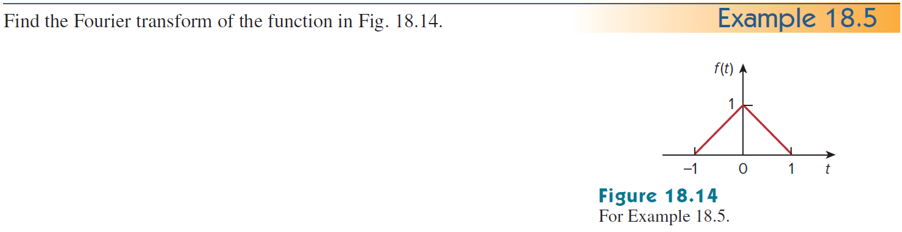
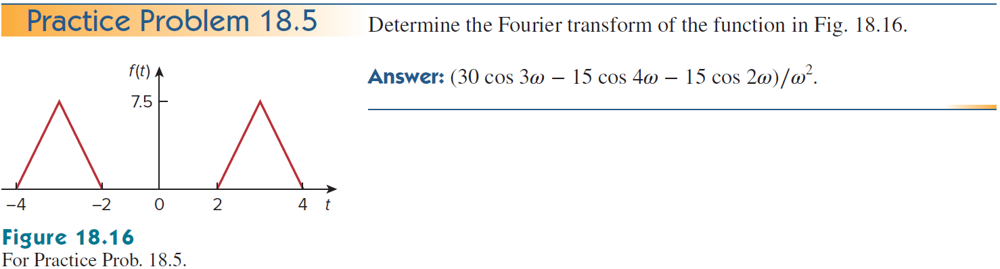

+++
title = "(b) Fourier transform II"
weight = 7
+++

---

### 1. 중요변환

**1) Dirac delta function - time to frequency domain**

$$
\mathcal{F}\left\lbrace\delta\left(t\right)\right\rbrace\left(\omega\right)
=\langle \omega| \delta \rangle
$$



$\langle\omega|t\rangle=e^{-i\omega t}$ 라고 하자.
    
$$
\langle\omega\ | \left(\int^{\infty}_{-\infty}dt|t\rangle\langle t| \right) |\delta \rangle
=\int^{\infty}_{-\infty}dt \langle\omega |t\rangle\langle t | \delta \rangle
=\int^{\infty}_{-\infty}dt \left[e^{-i\omega t}\delta\left(t\right)\right]
=1
$$





$\langle\omega|t\rangle=\cfrac{1}{\sqrt{2\pi}}e^{-i\omega t}$ 라고 하자.
    
$$
\langle\omega\ | \left(\int^{\infty}_{-\infty}dt|t\rangle\langle t| \right) |\delta \rangle
=\int^{\infty}_{-\infty}dt \langle\omega |t\rangle\langle t | \delta \rangle
=\int^{\infty}_{-\infty}dt \left[\frac{1}{\sqrt{2\pi}}e^{-i\omega t}\delta\left(t\right)\right]
=\frac{1}{\sqrt{2\pi}}
$$



**2) Dirac delta function - frequency to time domain**

$$
\mathcal{F}^{-1}\left\lbrace\delta\left(\omega\right)\right\rbrace\left(t\right)
=\langle t| \delta \rangle
$$


    
$\langle t|\omega\rangle
=e^{+i\omega t}$ 라고 하자.
    
$$
\langle t| \left(\int^{\infty}_{-\infty}d\omega|\omega\rangle\langle \omega|\right)|\delta \rangle
=\int^{\infty}_{-\infty}d\omega\langle t|\omega\rangle\langle \omega|\delta\rangle
=\int^{\infty}_{-\infty}d\omega\left[e^{+i\omega t}\delta\left(\omega\right)\right]
=1
$$




    
$\langle t|\omega\rangle
=\cfrac{1}{\sqrt{2\pi}}e^{+i\omega t}$ 라고 하자.
    
$$
\langle t| \left(\int^{\infty}_{-\infty}d\omega|\omega\rangle\langle \omega|\right)|\delta \rangle
=\int^{\infty}_{-\infty}d\omega\langle t|\omega\rangle\langle \omega|\delta\rangle
=\int^{\infty}_{-\infty}d\omega\left[\frac{1}{\sqrt{2\pi}}e^{+i\omega t}\delta\left(\omega\right)\right]
=\frac{1}{\sqrt{2\pi}}
$$



**3) DC, Constant**

$$
\mathcal{F}\left\lbrace1\right\rbrace\left(\omega\right)
=\langle\omega|1\rangle
$$



$$
\langle\omega|1\rangle
=\int^{\infty}_{-\infty}dt\left[e^{-i\omega t}\cdot 1\right]
=2\pi\delta\left(\omega\right)
$$





$$
\langle\omega|1\rangle
=\int^{\infty}_{-\infty}dt\left[\frac{1}{\sqrt{2\pi}}e^{-i\omega t}\cdot 1\right]
=\sqrt{2\pi}\delta\left(\omega\right)
$$



**4) Unit function**

$$
\mathcal{F}\left\lbrace u\left(t\right)\right\rbrace\left(\omega\right)
=\langle\omega|u\rangle
$$


    
일반적으로 적분이 안되므로, 정칙화를 사용한다. 제시된 식에 정칙화를 사용하면, 라플라스 변환과 유사해 진다.

  

$$
\lim_{\epsilon\to0+}\int_0^{\infty}dt\left\lbrack e^{-i\omega t}e^{-\epsilon t}\right\rbrack
=\lim_{\epsilon\to0+}\frac{1}{\epsilon+i\omega}
$$

(1) $\omega\ne0$ 경우

$$
\lim_{\epsilon\to0+}\frac{1}{\epsilon+i\omega}=\frac{1}{i\omega}
$$

(2) $\omega=0$ 경우

$$
\lim_{\epsilon\to0+}\frac{1}{\epsilon+i\omega}=\lim_{\epsilon\to0+}\frac{1}{\epsilon}=\infty
$$

따라서, 위 둘의 결과를 합치면,

$$
\lim_{\epsilon\to0+}\frac{1}{\epsilon+i\omega}=\frac{1}{i\omega}+A\delta\left(\omega\right)
$$

계수 A를 구하기 위해, 디렉델타 성질을 사용한다.

$$
\lim_{\epsilon\to0+}\int^{\infty}_{-\infty}d\omega\left[\frac{1}{\epsilon+i\omega}\right]=\int^{\infty}_{-\infty}d\omega\left[\frac{1}{i\omega}\right]+A
$$

동일한 속도로 $\omega$ 가 움직인다라고 하면, (정칙적, 해석적)

$$
A=\lim_{\epsilon\to0+}\int^{\infty}_{-\infty}d\omega\left[\frac{1}{\epsilon+i\omega}\right]
=\lim_{\epsilon\to0+}\int^{\infty}_{-\infty}d\omega\left[\frac{\epsilon}{\epsilon^2+\omega^2}-i\frac{\omega}{\epsilon^2+\omega^2}\right]
$$

두번째 적분항은 기함수 이므로,

$$
A=\lim_{\epsilon\to0+}\int^{\infty}_{-\infty}d\omega\left[\frac{\epsilon}{\epsilon^2+\omega^2}\right]
=\lim_{\epsilon\to0+}\int^{\infty}_{-\infty}d\left(\frac{\omega}{\epsilon}\right)\left[\frac{1}{1+\left (\frac{\omega}{\epsilon}\right)^2}\right]
$$

$$
=\left[\operatorname{atan}\left(\frac{\omega}{\epsilon}\right) \right]^{\infty}_{-\infty}=\pi
$$

최종적으로,

$$
\langle\omega|u\rangle
=\frac{1}{i\omega}+\pi\delta\left(\omega\right)
$$





$$
\langle\omega|u\rangle
=\frac{1}{\sqrt{2\pi}}\left\lbrace\frac{1}{i\omega}+\pi\delta\left(\omega\right)\right\rbrace
$$



**5) cosine function**

$$
\mathcal{F}\left\lbrace\cos at\right\rbrace\left(\omega\right)=
\langle\omega|\cos at\rangle
$$


    
$$
F(\omega)=\int_{-\infty}^{\infty}dt\left\lbrack\cos at\cdot e^{-i\omega t}\right\rbrack=\int_{-\infty}^{\infty}dt\left\lbrack\frac{e^{+iat}+e^{-iat}}{2}\cdot e^{-i\omega t}\right\rbrack
$$
    
$$
=\int_{-\infty}^{\infty}dt\left\lbrack\frac{e^{+i\left(a-\omega\right)t}+e^{-i\left(a+\omega\right)t}}{2}\right\rbrack=\frac{2\pi\delta\left(a-\omega\right)}{2}+\frac{2\pi\delta\left(a+\omega\right)}{2}
$$
    
$$
=\pi\delta\left(\omega-a\right)+\pi\delta\left(a+\omega\right)
$$




    
$$
\langle\omega|\cos at\rangle
=\frac{1}{\sqrt{2\pi}}\left\lbrace\pi\delta\left(\omega-a\right)+\pi\delta\left(\omega+a\right)\right\rbrace
$$



**6) sine function**

$$
\mathcal{F}\left\lbrace\sin at\right\rbrace\left(\omega\right)
=\langle\omega|\sin at\rangle
$$


    
$$
F(\omega)=\int_{-\infty}^{\infty}dt\left\lbrack\sin at\cdot e^{-i\omega t}\right\rbrack=\int_{-\infty}^{\infty}dt\left\lbrack\frac{e^{+iat}-e^{-iat}}{2i}\cdot e^{-i\omega t}\right\rbrack
$$
    
$$
=\int_{-\infty}^{\infty}dt\left\lbrack\frac{e^{+i\left(a-\omega\right)t}-e^{-i\left(a+\omega\right)t}}{2i}\right\rbrack=\frac{2\pi\delta\left(a-\omega\right)}{2i}-\frac{2\pi\delta\left(a+\omega\right)}{2i}
$$
    
$$
=-i\pi\delta\left(\omega-a\right)+i\pi\delta\left(a+\omega\right)
$$





$$
\langle\omega|\sin at\rangle
=\frac{1}{\sqrt{2\pi}}\left\lbrace-i\pi\delta\left(\omega-a\right)+i\pi\delta\left(\omega+a\right)\right\rbrace
$$



---

### 2. Properties

**1) time scaling & shifting**

$$
\mathcal{F}\left\lbrace f\left(at+b\right)\right\rbrace\left(\omega\right)
=\langle \omega|f\left(at+b\right)\rangle
=e^{i\frac{b}{a}\omega}\left\langle\omega\middle|f(at)\right\rangle
=\frac{1}{\left|a\right|}e^{i\frac{b}{a}\omega}\left\langle \frac{\omega}{a}\middle|f\right\rangle
$$



(1) a>0

$$
\mathcal{F}\left\lbrace f\left(at\right)\right\rbrace\left(\omega\right)
=e^{i\frac{b}{a}\omega}\int_{-\infty}^{\infty}\frac{1}{a}d\tau\left\lbrack f\left(\tau\right)e^{-i\frac{\omega}{a}\tau}\right\rbrack=\frac{1}{a}e^{i\frac{b}{a}\omega}\mathcal{F}\left\lbrace f\left(t\right)\right\rbrace\left(\frac{\omega}{a}\right)
$$

(2) a<0

$$
\mathcal{F}\left\lbrace f\left(at\right)\right\rbrace\left(\omega\right)
=e^{i\frac{b}{a}}\int_{\infty}^{-\infty}\frac{1}{a}d\tau\left\lbrack f\left(\tau\right)e^{-i\frac{\omega}{a}\tau}\right\rbrack=-\frac{1}{a}e^{i\frac{b}{a}\omega}\mathcal{F}\left\lbrace f\left(t\right)\right\rbrace\left(\frac{\omega}{a}\right)
$$

 
    


    
**2) time shifting**

$$
\mathcal{F}\left\lbrace f\left(t-t'\right)\right\rbrace\left(\omega\right)
=\langle \omega|f\left(t-t'\right)\rangle
=e^{-i\omega t'}\left\langle \omega\middle|f\right\rangle
$$


    
$$
\mathcal{F}\left\lbrace f\left(t-t'\right)\right\rbrace\left(\omega\right)=\int_{-\infty}^{\infty}dt\left\lbrack f\left(t-t'\right)e^{-i\omega t}\right\rbrack=\int_{-\infty}^{\infty}d\tau\left\lbrack f\left(\tau\right)e^{-i\omega\left(\tau+t'\right)}\right\rbrack
$$
    
$$
=e^{-i\omega t'}F\left(\omega\right)
$$



**3) frequency shifting**

$$
\mathcal{F}\left\lbrace e^{iat}f\left(t\right)\right\rbrace\left(\omega\right)
=\langle \omega|e^{iat}f\rangle
=\langle \omega+i\cdot ia|f\rangle
=\langle \omega-a|f\rangle
$$



$$
\mathcal{F}\left\lbrace e^{iat}f\left(t\right)\right\rbrace\left(\omega\right)=\int_{-\infty}^{\infty}dt\left\lbrack f\left(t\right)e^{-i\left(\omega-a\right)t}\right\rbrack=F\left(\omega-a\right)
$$
    

<b>응용</b>
    



**4) convolution**

$$
\mathcal{F}\left\lbrace h\left(t\right)\ast f\left(t\right)\right\rbrace\left(\omega\right)
=\langle\omega|h\ast f\rangle
$$



$$
\mathcal{F}\left\lbrace h\left(t\right)\ast f\left(t\right)\right\rbrace\left(\omega\right)=\int^{\infty}_{-\infty}dt\left[e^{-i\omega t}\int^{\infty}_{-\infty}d\tau\left[h\left(t-\tau\right)f\left(\tau\right)\right] \right]
$$

$$
=\int^{\infty}_{-\infty}dt\left[e^{-i\omega \left(t-\tau+\tau\right)}\int^{\infty}_{-\infty}d\tau\left[h\left(t-\tau\right)f\left(\tau\right)\right] \right]
$$

$$
=\int^{\infty}_{-\infty}d\tau\left[f\left(\tau\right)e^{-i\omega\tau}\int^{\infty}_{-\infty}dt\left[h\left(t-\tau\right)e^{-i\omega \left(t-\tau\right)}\right] \right]
$$

$$
=\int^{\infty}_{-\infty}d\tau\left[f\left(\tau\right)e^{-i\omega\tau}H\left(\omega\right)\right]
$$

$$
=H\left(\omega\right)\int^{\infty}_{-\infty}d\tau\left[f\left(\tau\right)e^{-i\omega\tau}\right]
$$

$$
=H\left(\omega\right)F\left(\omega\right)
$$





$$
\langle\omega|h\ast f\rangle
=\sqrt{2\pi}\langle\omega|h\rangle\langle\omega|f\rangle
=\frac{1}{\sqrt{2\pi}}H\left(\omega\right)F\left(\omega\right)
$$



**5) time differentiation**

$$
\mathcal{F}\left\lbrace\frac{d}{dt}f\left(t\right)\right\rbrace\left(\omega\right)
=\left\langle\omega\middle|\frac{\partial^n}{\partial t^n}f\right\rangle 
=\langle \omega|(\hat{D}_t)^n|f\rangle 
=(i\omega)^n\langle\omega|f\rangle
$$



$$
\mathcal{F}\left\lbrace\frac{\partial^{n}}{\partial t^{n}}f\left(t\right)\right\rbrace\left(\omega\right)
=\int^{\infty}_{-\infty}dt\left[e^{-i\omega t}\frac{\partial^{n}}{\partial t^{n}}f\left(t\right)\right]
$$

$$
=\int^{\infty}_{-\infty}dt\left[\frac{\partial}{\partial t}\left\lbrace e^{-i\omega t}\frac{\partial^{n-1}}{\partial t^{n-1}}f\left(t\right)\right\rbrace+i\omega e^{-i\omega t}\frac{\partial^{n-1}}{\partial t^{n-1}}f\left(t\right)\right]
$$

$$
=\left[e^{-i\omega t}\frac{\partial^{n-1}}{\partial t^{n-1}}f\left(t\right)\right]^{\infty}_{-\infty}+i\omega \int^{\infty}_{-\infty}dt\left[ e^{-i\omega t}\frac{\partial^{n-1}}{\partial t^{n-1}}f\left(t\right)\right]
$$

$$
=i\omega \int^{\infty}_{-\infty}dt\left[ e^{-i\omega t}\frac{\partial^{n-1}}{\partial t^{n-1}}f\left(t\right)\right]
$$

계속 반복해서 적용하면,

$$
\mathcal{F}\left\lbrace\frac{\partial^{n}}{\partial t^{n}}f\left(t\right)\right\rbrace\left(\omega\right)
=\left(i\omega\right)^{n}F\left(\omega\right)
$$



**6) frequency differentiation** 

$$
\mathcal{F}\left\lbrace t^{n}f\left(t\right)\right\rbrace\left(\omega\right)
=\langle\omega|t^n\cdot f\rangle
=\langle \omega|(\hat{t})^n|f\rangle
=i^n(\hat{D}_\omega)^n \langle \omega|f\rangle
$$



$$
\mathcal{F}\left\lbrace t^{n}f\left(t\right)\right\rbrace\left(\omega\right)
=\int^{\infty}_{-\infty}dt\left[e^{-i\omega t}t^n f\left(t\right)\right]
$$

$$
=\int^{\infty}_{-\infty}dt\left[f\left(t\right)\left(\frac{1}{-i}\right)^n\frac{\partial^n}{\partial\omega^n}e^{-i\omega t}\right]
=i^n\frac{\partial^n}{\partial\omega^n}\int^{\infty}_{-\infty}dt\left[f\left(t\right)e^{-i\omega t}\right]
$$

$$
=i^n\frac{d^n}{d\omega^n}\mathcal{F}\left\lbrace f\left(t\right)\right\rbrace\left(\omega\right)
$$



**7) time integration** 

$$
\left\langle\omega\middle|\int^{t}_{-\infty}dt'f\right\rangle
=\langle\omega|(\hat{D}_t)^{-1}|f\rangle
=\langle\omega|u\ast f\rangle
= \frac{1}{i\omega} \langle \omega|f\rangle + \pi \langle 0|f\rangle \delta(\omega)
$$



$$
\mathcal{F}\left\lbrace\int_{-\infty}^{t}dt'\left\lbrack f\left(t'\right)\right\rbrack\right\rbrace\left(\omega\right)
=\mathcal{F}\left\lbrace u\left(t\right)\ast f\left(t\right)\right\rbrace\left(\omega\right)
$$

$$
=\left(\frac{1}{i\omega}+\pi\delta\left(\omega\right)\right)F\left(\omega\right)=\frac{F\left(\omega\right)}{i\omega}+\pi F\left(0\right)\delta\left(\omega\right)
$$



---

### 3. Inverse Laplace & Fourier transform

$$
\mathcal{L}^{-1}\left\lbrace F_L\left(s\right)\right\rbrace\left(t\right)
=\langle t|F_L\rangle
=\frac{1}{2\pi i}\int_{\sigma-i\infty}^{\sigma+i\infty}ds\left\lbrack e^{st}F_L\left(s\right)\right\rbrack
$$

$$
\mathcal{F}^{-1}\left\lbrace F(\omega)\right\rbrace\left(t\right)
=\langle t|F\rangle
=\frac{1}{2\pi}\int_{-\infty}^{\infty}d\omega\left[e^{i\omega t}F\left(\omega\right)\right]
$$

$s=i\omega$를 라플라스 변환에 대입해 보자.

$$
\mathcal{L}^{-1}\left\lbrace F_L\left(i\omega\right)\right\rbrace\left(t\right)=\mathcal{F}^{-1}\left\lbrace F(\omega)\right\rbrace\left(t\right)
\implies
\langle t|F_L(i\omega)\rangle=\langle t|F\rangle
$$

ℹ️ 푸리에 역변환은 라플라스 역변환과 동일하다.

---

### 4. Duality

푸리에 변환의 쌍대성은 시간 영역과 주파수 영역 사이의 대칭적인 관계를 나타낸다. 함수 $f(t)$의 푸리에 변환이 $F(\omega)$일 때, $F(\omega)$를 시간 함수 $F(t)$로 간주하고 그 푸리에 변환을 구하면 원래 함수 $f(t)$와 관련된 형태가 나온다.

$F(\omega) = \mathcal{F}\{f(t)\}(\omega)$라고 할 때, $\mathcal{F}\{F(t)\}(\omega)$를 구해보자.

- **비대칭성 (Asymmetric Convention)**

$$
\mathcal{F}\{F(t)\}(\omega)=2\pi f(-\omega)
$$

$$
\langle\omega|F(t)\rangle_{asym}=2\pi\langle-\omega|f\rangle_{asym}
$$

$$
F(\omega) = \int_{-\infty}^{\infty} f(t) e^{-i\omega t} dt
$$

$$
f(t) = \frac{1}{2\pi} \int_{-\infty}^{\infty} F(\omega') e^{i\omega' t} d\omega'
$$

$F(\omega)$를 시간 함수 $F(t)$로 간주하고 비대칭 푸리에 변환을 수행하면:
$$\mathcal{F}\{F(t)\}(\omega) = \int_{-\infty}^{\infty} F(t) e^{-i\omega t} dt$$
위 역 푸리에 변환 정의에서 변수 $\omega'$와 $t$를 교환하면 $f(\omega') = \frac{1}{2\pi} \int_{-\infty}^{\infty} F(t) e^{it \omega'} dt$ 입니다.
여기서 $\omega' = -\omega$를 대입하면:
$$f(-\omega) = \frac{1}{2\pi} \int_{-\infty}^{\infty} F(t) e^{-it \omega} dt$$
이 식의 양변에 $2\pi$를 곱하면 $\int_{-\infty}^{\infty} F(t) e^{-it \omega} dt = 2\pi f(-\omega)$ 이고, 이는 $\mathcal{F}\{F(t)\}(\omega)$

- **대칭성 (Symmetric Convention)**

대칭 푸리에 변환 정의는 다음과 같습니다:
$$F(\omega) = \frac{1}{\sqrt{2\pi}} \int_{-\infty}^{\infty} f(t) e^{-i\omega t} dt$$
대칭 역 푸리에 변환 정의는 다음과 같습니다:
$$f(t) = \frac{1}{\sqrt{2\pi}} \int_{-\infty}^{\infty} F(\omega') e^{i\omega' t} d\omega'$$

마찬가지로 $F(\omega)$를 시간 함수 $F(t)$로 간주하고 대칭 푸리에 변환을 수행하면:
$$\mathcal{F}\{F(t)\}(\omega) = \frac{1}{\sqrt{2\pi}} \int_{-\infty}^{\infty} F(t) e^{-i\omega t} dt$$
위 역 푸리에 변환 정의에서 변수 $\omega'$와 $t$를 교환하면 $f(\omega') = \frac{1}{\sqrt{2\pi}} \int_{-\infty}^{\infty} F(t) e^{it \omega'} dt$ 입니다.
여기서 $\omega' = -\omega$를 대입하면:
$$f(-\omega) = \frac{1}{\sqrt{2\pi}} \int_{-\infty}^{\infty} F(t) e^{-it \omega} dt$$
이 식의 양변에 $\sqrt{2\pi}$를 곱하면 $\int_{-\infty}^{\infty} F(t) e^{-it \omega} dt = \sqrt{2\pi} f(-\omega)$ 입니다.
이를 $\mathcal{F}\{F(t)\}(\omega)$ 정의에 대입하면:
$$\mathcal{F}\{F(t)\}(\omega) = \frac{1}{\sqrt{2\pi}} \left( \sqrt{2\pi} f(-\omega) \right) = f(-\omega)$$

따라서, 대칭 규약에서의 쌍대성 관계
$$\mathcal{F}\{F(t)\}(\omega) = f(-\omega)$$
브라-켓 표기법으로:
$$\langle \omega | F(t) \rangle_{sym} = \langle -\omega | f \rangle_{sym}$$

---

### 5. Practice1 - 대칭성 기반 풀이

**example1)** 

$$
\mathcal{F}\left\lbrace u\left(t-t'\right)\right\rbrace\left(\omega\right)
$$



$$
\langle\omega|u\left(t-t'\right)\rangle
=e^{-i\omega t'}\langle\omega|u\rangle
=\frac{e^{-i\omega t'}}{\sqrt{2\pi}}\left\lbrace\frac{1}{i\omega}+\pi\delta\left(\omega\right)\right\rbrace
$$



**example2)**

$$
\mathcal{F}\left\lbrace\delta\left(t-t'\right)\right\rbrace\left(\omega\right)
$$


    
$$
\langle\omega|\delta\left(t-t'\right)\rangle
=e^{-i\omega t'}\langle\omega|\delta\rangle
=\frac{e^{-i\omega t'}}{\sqrt{2\pi}}
$$



**example3)**

$$
\mathcal{F}\left\lbrace e^{iat}\right\rbrace\left(\omega\right)
$$


    
$$
\langle\omega|e^{iat}\rangle
=\langle\omega+i\cdot ia|1\rangle
=\sqrt{2\pi}\delta\left(\omega-a\right)
$$



**example4)** 

$$
\mathcal{F}\left\lbrace e^{at}u\left(t\right)\right\rbrace\left(\omega\right),\quad a<0
$$



$$
\langle\omega|e^{at}u\rangle
=\langle\omega+ia|u\rangle
=\frac{1}{\sqrt{2\pi}}\left\lbrace\frac{1}{i\left(\omega+ia\right)}+\pi\delta\left(\omega+ia\right) \right\rbrace
$$

$$
=\frac{1}{\sqrt{2\pi}}\cdot\frac{1}{i\omega-a}
$$



**example5)** 

$$
\mathcal{F}\left\lbrace u\left(-t\right)\right\rbrace\left(\omega\right)
$$



$$
\langle\omega|u\left(-t\right)\rangle
=\langle-\omega|u\rangle
=\frac{1}{\sqrt{2\pi}}\left\lbrace -\frac{1}{i\omega}+\pi\delta\left(\omega\right) \right\rbrace
$$



**example6)**

$$
\mathcal{F}\left\lbrace e^{at}u\left(-t\right)\right\rbrace\left(\omega\right),\quad a>0
$$



$$
\langle\omega|e^{at}u\left(-t\right)\rangle
=\langle\omega+ia|u\left(-t\right)\rangle
=\langle-\omega-ia|u\left(t\right)\rangle
$$

$$
=\frac{1}{\sqrt{2\pi}}\left\lbrace\frac{1}{i\left(-\omega-ia\right)}+\pi\delta\left(-\omega-ia\right) \right\rbrace
$$

$$
=\frac{1}{\sqrt{2\pi}}\cdot\frac{1}{-i\omega+a}
$$



**example7)**

$$
\mathcal{F}\left\lbrace e^{-t}u\left(t-1\right)\right\rbrace\left(\omega\right)
$$



$$
\langle\omega|e^{-t}u\left(t-1\right)\rangle
=\langle\omega-i|u\left(t-1\right)\rangle
=e^{-i(\omega-i)}\langle\omega-i|u\rangle
$$

$$
=e^{-i\omega-1}\langle\omega-i|u\rangle
=\frac{e^{-i\omega-1}}{\sqrt{2\pi}}\cdot\frac{1}{i\omega+1}
$$



**example8)**

$$
\mathcal{F}\left\lbrace e^{-2t}u\left(2t-1\right)\right\rbrace\left(\omega\right)
$$



$$
\langle \omega| e^{-2t}u\left(2t-1\right)\rangle
=\langle \omega-2i| u\left(2t-1\right)\rangle
$$

$$
=e^{-\frac{i}{2}(\omega-2i)}\langle \omega-2i| u\left(2t\right)\rangle
=\frac{1}{2}e^{-i\frac{\omega}{2}-1}\left\langle \frac{\omega}{2}-i\middle| u\right\rangle
$$

$$
=\frac{1}{2\sqrt{2\pi}}e^{-i\frac{\omega}{2}-1}\left\lbrace\frac{1}{i\left(\omega/2-i\right)}\right\rbrace
$$

$$
=\frac{1}{\sqrt{2\pi}}\frac{e^{-i\omega/2-1}}{i\omega+2}
$$



**example9)**

$$
\mathcal{F}\left\lbrace e^{t}u\left(1-t\right)\right\rbrace\left(\omega\right)
$$



$$
\langle \omega| e^{t}u\left(1-t\right)\rangle
=\langle \omega+i| u\left(1-t\right)\rangle
=e^{-i\omega+1}\langle \omega+i| u\left(-t\right)\rangle
$$

$$
=e^{-i\omega+1}\langle -\omega-i| u\rangle
=\frac{1}{\sqrt{2\pi}}e^{-i\omega+1}\cdot\frac{1}{i(-\omega-i)}
$$

$$
=\frac{1}{\sqrt{2\pi}}\frac{e^{1-i\omega}}{1-i\omega}
$$



**example10)**

$$
\mathcal{F}\left\lbrace tu\left(t\right)\right\rbrace\left(\omega\right)
$$



$$
\langle\omega|t\cdot u\rangle
=\langle \omega|\hat{t}|u\rangle
=i\hat{D}_\omega\langle\omega|u\rangle
$$

$$
=\frac{i}{\sqrt{2\pi}}\hat{D}_\omega\left\lbrace\frac{1}{i\omega}+\pi\delta\left(\omega\right)\right\rbrace
=\frac{i}{\sqrt{2\pi}}\left\lbrace-\frac{1}{i\omega^2}+\pi\delta'\left(\omega\right)\right\rbrace
$$



**example11)**

$$
\mathcal{F}\left\lbrace tu\left(-t\right)\right\rbrace\left(\omega\right)
$$



$$
\langle\omega|t\cdot u(-t)\rangle
=\langle \omega|\hat{t}|u(-t)\rangle
=i\hat{D}_\omega\langle-\omega|u\rangle
$$

$$
=\frac{i}{\sqrt{2\pi}}\hat{D}_\omega\left\lbrace -\frac{1}{i\omega}+\pi\delta\left(\omega\right) \right\rbrace
=\frac{i}{\sqrt{2\pi}}\left\lbrace\frac{1}{i\omega^2}+\pi\delta'\left(\omega\right)\right\rbrace
$$



---

### 6. Practice2 - 비대칭성 기반 풀이

**example1) 필수**

- sol
    
    $$
    \mathcal{F}\left\lbrack f'\left(t\right)\right\rbrack=\left(i\omega\right)F\left(\omega\right)
    $$
    
    $$
    A\mathcal{F}\left\lbrack\delta\left(t+\frac{\tau}{2}\right)\right.-\left.\delta\left(t-\frac{\tau}{2}\right)\right\rbrack=A\left(e^{i\omega\frac{\tau}{2}}-e^{-i\omega\frac{\tau}{2}}\right)
    $$
    
    $$
    F\left(\omega\right)=A\left(\frac{e^{i\omega\frac{\tau}{2}}-e^{-i\omega\frac{\tau}{2}}}{i\omega}\right)=A\tau\frac{\sin\left(\omega\tau/2\right)}{\omega\tau/2}=\operatorname{A\tau\cdot sinc\left(\frac{\omega\tau}{2}\right)}
    $$
    

**example2)**

- sol
    
    $$
    \mathcal{F}\left\lbrack f'\left(t\right)\right\rbrack=\left(i\omega\right)F\left(\omega\right)
    $$
    
    $$
    25\mathcal{F}\left\lbrack\delta\left(t+1\right)-2\delta\left(t\right)+\delta\left(t-1\right)\right\rbrack=25\left(e^{i\omega}-2+e^{-i\omega}\right)
    $$
    
    $$
    F\left(\omega\right)=\frac{50}{i\omega}\left(\frac{e^{i\omega}+e^{-i\omega}}{2}-1\right)=\frac{50}{i\omega}\left(\cos\omega-1\right)
    $$
    

**example3)**

- sol

**example4) @Seungmin Son** 

- sol

**example6)**

- sol (a)
    
    $$
    \mathcal{F}\left\lbrack\frac{d}{dt}\operatorname{sgn}\left(t\right)\operatorname{}\right\rbrack=\left(i\omega\right)\mathcal{F}\left(\omega\right)
    $$
    
    $$
    \mathcal{F}\left\lbrack2\delta\operatorname{}\left(t\right)\operatorname{}\right\rbrack=2
    $$
    
    $$
    \mathcal{F}\left\lbrack\frac{d}{dt}\operatorname{sgn}\left(t\right)\operatorname{}\right\rbrack=\frac{2}{i\omega}
    $$
    
    ---
    
    unit function 로 풀어 보기 [최수인 (Unlicensed)](https://hertz2hnu.atlassian.net/wiki/people/712020:1f3af0d6-22e5-4b45-9a8a-7a617da825a0?ref=confluence)
    
- sol (b)
    
    $$
    \mathcal{F}\left\lbrack e^{-\left|a\right|t}u\left(t\right)+e^{\left|a\right|t}u\left(-t\right)\operatorname{}\right\rbrack=\frac{1}{s+a}-\frac{1}{s-a}=\frac{-2a}{s^2-a^2}=\frac{2a}{\omega^2+a^2}
    $$
    
- sol (c)
    
    푸리에 변환은 푸리에 역변환과 형태가 동일함을 이용한다.
    
    - i\omega=t\rightarrow dt=-id\omega
    
    $$
    \int_{-\infty}^{\infty}dt\left\lbrack\frac{\sin t}{t}e^{-i\omega t}\right\rbrack=-\int_{-i\infty}^{i\infty}ds\left\lbrack\frac{\sin s}{s}e^{st}\right\rbrack=-2\pi i\cdot\mathcal{L}^{-1}\left\lbrack\frac{\sin s}{s}\right\rbrack
    $$
    
    $$
    \mathcal{L}^{-1}\left\lbrack\frac{\sin s}{s}\right\rbrack=\mathcal{L}^{-1}\left\lbrack\frac{1}{s}\left(\frac{e^{-is}-e^{is}}{2i}\right)\right\rbrack=-\frac{1}{2i}\left(u\left(t-1\right)-u\left(t+1\right)\right)
    $$
    
    $$
    \int_{-\infty}^{\infty}dt\left\lbrack\frac{\sin t}{t}e^{-i\omega t}\right\rbrack=\pi\left\lbrace u\left(-i\omega-1\right)-u\left(-i\omega+1\right)\right\rbrace
    $$
    
    ---
    
    복소적분을 사용하여 풀기
    
    $$
    \operatorname{Re}\left\lbrack\int_{-\infty}^{\infty}dt\left\lbrack\frac{-ie^{it}}{t}e^{-i\omega t}\right\rbrack\right\rbrack=\operatorname{Re}\left\lbrack\oint_{C}-\int_{C_{R}}-\int_{C_{r}}\right\rbrack
    $$
    
    $$
    \oint_{C}=0
    $$
    
    - \int_{C_{}}dz\left\lbrack\frac{-ie^{iz\left(1-\omega\right)}}{z}\right\rbrack=i\int_{C}dz\left\lbrack\frac{e^{iz\left(1-\omega\right)}}{z}\right\rbrack=-\int_{C}Re^{i\theta}d\theta\left\lbrack\frac{e^{iRe^{i\theta}\left(1-\omega\right)}}{Re^{i\theta}}\right\rbrack
    
    $$
    =-\int_{C}^{}d\theta\left\lbrack e^{iR\left(\cos\theta+i\sin\theta)\left(1-\omega\right)\right)}\right\rbrack
    $$
    
    if $\omega<1$, upper contour
    
    - \int_{C_{R}}=0,\text{ Jordan's lemma}
    - \int_{C_{r}}^{}=\lim_{R\rightarrow0}\left\lbrack-\int_{\pi}^0d\theta\left\lbrack1\right\rbrack\right\rbrack=\pi
    
    $$
    \operatorname{Re}\left\lbrack\int_{-\infty}^{\infty}dt\left\lbrack\frac{-ie^{it}}{t}e^{-i\omega t}\right\rbrack\right\rbrack=\pi
    $$
    
    if $\omega>1$, lower contour
    
    - \int_{C_{R}}=0,\text{ Jordan's lemma}
    - \int_{C_{r}}^{}=\lim_{R\rightarrow0}\left\lbrack-\int_{\pi}^0d\theta\left\lbrack1\right\rbrack\right\rbrack=\pi
    
    $$
    \operatorname{Re}\left\lbrack\int_{-\infty}^{\infty}dt\left\lbrack\frac{-ie^{it}}{t}e^{-i\omega t}\right\rbrack\right\rbrack=\pi
    $$
    
    if $\omega=1$, by Cauchy principal value, 0
    
    $$
    \operatorname{Re}\left\lbrack\int_{-\infty}^{\infty}dt\left\lbrack\frac{-ie^{it}}{t}e^{-i\omega t}\right\rbrack\right\rbrack=0
    $$
    

**example7) @Seungmin Son** 

- sol (a)
- sol (b)
- sol (c)

**example8)**

- sol

**example9)** @Seungmin Son 

- sol

---

**example10)**

- sol

**example11)** 

- sol (a)
- sol (b)
    
    $$
    \mathcal{F}^{-1}\left\lbrack\pi\delta\left(-is\right)+\frac{1}{s}+\frac{2\left(s+1\right)}{\left(s+1\right)^2+16}\right\rbrack=u\left(t\right)\left\lbrace1+2e^{-st}\cdot\cos4t\right\rbrace
    $$