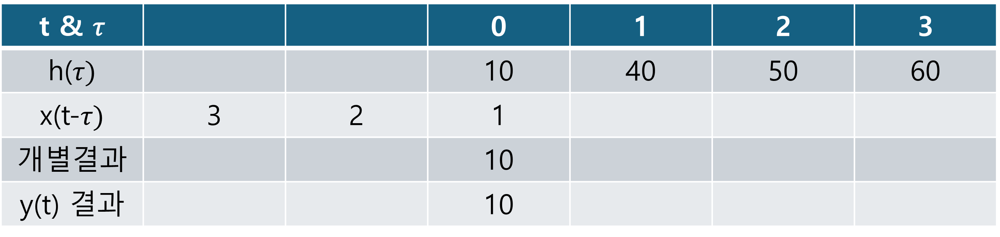
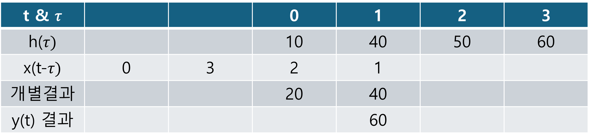
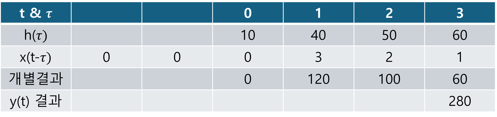

+++
title = "(b) Convolution"
weight = 2
+++

---

### 0. Convolution의 정의

**이전 입력의 현재상태 + 현재 입력의 현재상태**

$$
y\left(t\right)=x\left(t\right)\ast h\left(t\right)
=h\left(t\right)\ast x\left(t\right)
=\int_{-\infty}^{\infty}d\tau\left[h\left(t-\tau\right)x\left(\tau\right)\right]
=\int_{-\infty}^{\infty}d\tau\left[x\left(t-\tau\right)h\left(\tau\right)\right]
$$

---

### 1. 그림으로 이해하는 컨볼루션

드럼을 친다고 생각하자. 관측 시작 후, 현시점을 기준으로 **이전 드럼 입력의 현재 상태 + 현재 드럼 입력의 현재 상태** 나타날 것이다.

위 그래프에 대한 이해를 명확하게 해야 한다.

- τ=0은, 입력이 시스템과 반응하는 **최초 시점**을 의미한다. -- 드럼을 치는 순간
- τ=t은, 반응하기 시작한 이전 입력이 **t초 만큼 시간이 흘럿다**는 것을 의미한다.
- 빨간색 그래프는, **입력량**을 의미한다. -- 드럼을 치는 강도
- 파란색은, **입력에 대한 응답**이다. -- 드럼의 소리가 시간에 따라 어떻게 변할지를 결정하는 함수
- 검은색은, 입력과 그 **응답에 대한 결과**이다. -- 이전 드럼 입력의 현재 상태 + 현재 드럼 입력의 현재 상태
- 0.5초는 별 의미가 없고 보기 편하게 하기 위해 그냥 응답에 대한 결과를 저 시점부터 그린다는 것이다.

---

### 2. 숫자(리스트)로 이해하는 컨볼루션

수학적으로 표현(절차)하면, 다음과 같다.

**(1) 시간에 대한 시스템 응답을, 리스트화 한다.**

$$
h\left(t\right)\rightarrow h\left(\tau\right)
$$

**(2) input을, 리스트화 한다. 그 다음, 처음 intput이 시스템에 들어가야 하므로 filp 시킨다.**

$$
x\left(t\right)\rightarrow x\left(\tau\right)\rightarrow x\left(-\tau\right)
$$

**(3) 리스트화 된 input을 시간에 따라, 오른쪽으로 shift 하면서 시스템 응답과 곱한다.**

$$
h\left(\tau\right)x\left(t-\tau\right)
$$

**(4) 곱해진 각 개별 결과를 더한다.**

$$
y\left(t\right)=\int_{-\infty}^{\infty}d\tau\left[h\left(t-\tau\right)x\left(\tau\right)\right]
$$

---

### 3. 주의사항

많은 곳에서 convolution 은 LTI(선형 시불변 시스템)에서만 이루어지는 연산이라고 되어있다. 이는 잘못된 설명이다. **정확한 설명은, convolution 은 선형/비선형과 상관없이 수학적 표현일 뿐**이다. **컨볼루션 연산 자체가 선형연산일 뿐이다.**

[참조] [Is convolution only defined for lti systems? - Quora](https://www.quora.com/Is-convolution-only-defined-for-lti-systems)

Convolution is not only defined for Linear Time-Invariant (LTI) systems. While convolution is commonly associated with LTI systems in the context of signal processing and control theory, it is a fundamental operation in mathematics and has applications in various fields beyond LTI systems. Convolution can be defined for a wide range of functions and systems, including non-linear and time-varying systems. In mathematics, convolution is used in areas such as probability theory, image processing, and differential equations. Therefore, while it is often discussed in the context of LTI systems, convolution has broader applications across different domains.

---

**example1)** 

$$
x\left(t\right)\ast h\left(t\right)=y\left(t\right)
$$

아래의 convolution 결과를 y로 표현하라.

$$
x\left(t-t_1\right)\ast h\left(t-t_2\right)
$$



$$
\int_{-\infty}^{\infty} d\tau \left[ x\left(t-\tau-t_1\right) h\left(\tau-t_2\right) \right]
$$

$k=\tau-t_2$ 라고 하면,

$$
d\tau=dk
$$

따라서,

$$
\int_{-\infty}^{\infty} dk \left[ x\left(t-k-t_1-t_2\right) h\left(k\right) \right]
$$

$$
=y\left(t-t_1-t_2\right)
$$





$h$는 $t_2$ 만큼 시간 지연, x는 $t_1$ 만큼 시간 지연이 발생되었다. 따라서, convolution 의 결과인 총 시간 지연은 $t_1+t_2$ 이다.



**example2)**

$$
x\left(t\right)\ast\delta\left(at+b\right)
$$



$$
\int_{-\infty}^{\infty} d\tau \left[ x\left(t-\tau\right) \delta\left(a\tau+b\right) \right]
$$

$k=a\tau+b$ 라고 하면,

$$
dk=a d\tau
$$

따라서,

$$
\int_{-\infty}^{\infty} \frac{1}{a} dk \left[ x\left(t-\frac{k}{a}+\frac{b}{a}\right) \delta\left(k\right) \right]
$$

$$
=\frac{1}{a}x\left(t+\frac{b}{a}\right)
$$





디렉델타의 시간 압축/확장 특성을 이용한다.

$$
x\left(t\right)\ast\delta\left(at+b\right)=x\left(t\right)\ast\frac{1}{\left|a\right|}\delta\left(t+\frac{b}{\left|a\right|}\right)
=\frac{1}{\left|a\right|}x\left(t+\frac{b}{\left|a\right|}\right)
$$



**example3)**

$$
x\left(-t\right)\ast\delta\left(-t-t_0\right)
$$



$$
\int_{-\infty}^{\infty} d\tau \left[ x\left(-t+\tau\right) \delta\left(-\tau-t_0\right) \right]
$$

$k=-\tau-t_0$ 라고 하면,

$$
dk=- d\tau
$$

따라서,

$$
\int_{-\infty}^{\infty} -dk \left[ x\left(-t-k-t_0\right) \delta\left(k\right) \right]
$$

$$
=x\left(-t-t_0\right)
$$





디렉 델타 함수의 대칭 특성을 이용한다.

  

$$
x\left(-t\right)\ast\delta\left(-t-t_0\right)=x\left(-t\right)\ast\delta\left(t+t_0\right)
=x\left(-t-t_0\right)
$$



**example4)** 

$$
x\left(t\right)\ast h\left(t\right)=x\left(3t-2\right)
$$

를 만족하는, h(t)를 구하여라.



공사중, 라플라스 변환 또는 푸리에 변환을 사용하여 풀 수 있다.



---

[Convolution - Wikipedia](https://en.wikipedia.org/wiki/Convolution)