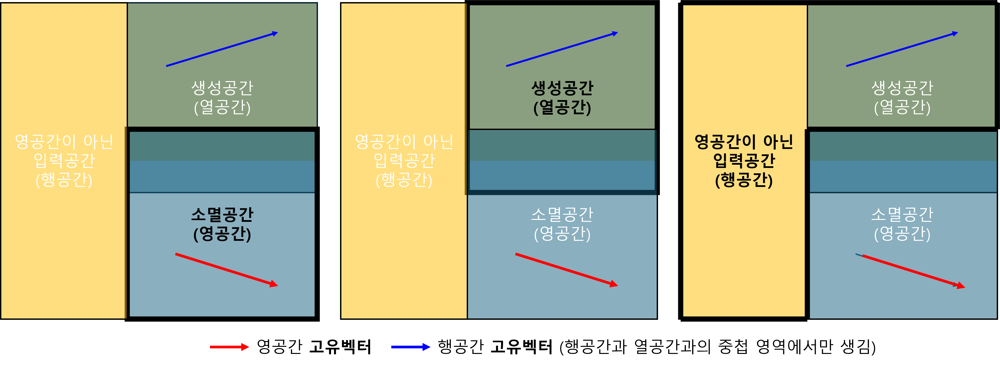

+++
title = "(b) Space"
weight = 1
+++

---

---

### 1. 열공간(생성 출력공간)

연산자 $\hat{A}$의 **생성공간(Column Space)** 이란, 연산자의 작용을 통해 생성(출력)되는 모든 벡터들의 집합이다. 행렬의 열벡터는 생성공간을 만든다.

$$
\text{Col}(\hat{A})
=\{|f\rangle, \hat{A}|v\rangle=|f\rangle\}
$$

---

### 2. 영공간(소멸 입력공간)

연산자 $\hat{A}$의 **영공간(Null Space)** 이란, 연산결과가 0벡터가 되는 모든 입력 벡터 들의 집합이다.**제차 선형 방정식(Homogeneous Linear Equation)** 의 **해공간(Solution Space)** 과 같다.

$$
\text{Null}(\hat{A})
=\{|n\rangle, \hat{A}|n\rangle=0\}
$$

영공간은 어떤 연산자(변환)에 의해 '소멸(annihilate)'되거나 '무시'되는 상태들의 집합이다. 이는 시스템의 **평형 상태, 보존 법칙, 대칭성, 정보 손실** 등 근본적인 특성을 나타내는 매우 중요한 공간이다. 이 때문에 **소멸 공간(Annihilation Space)** 이라는 직관적인 이름으로도 이해할 수 있다.

---

### 3. 행공간(영공간을 제외한 입력공간)

영공간을 제외한 모든 입력공간을 의미하며, 행렬에서 행공간을 의미한다. 말 그대로 영공간의 제외해야 하므로, 영공간과 독립이어야 한다. 따라서, 행렬의 행벡터가 된다.

$$
\text{Row}(\hat{A})
=\{\langle r|, \langle r|n\rangle=0\text{ for all }|n\rangle \text{ where }\hat{A}|n\rangle=0\}
$$

지금까지 공간을 켓으로 표기하였다. 행공간을 브라로 표현했다고 해서 그것이 더 이상 공간이 아닌 것이 아니다. 단지 공간에 사는 벡터들의 한 종류를, 그들의 '연산자'적인 성격을 부각시키기 위해 브라라는 얼굴로 표현했을 뿐이다.

행공간은 열공간(생성공간)과 일대일로 매칭된다.

---

**example1)** 1차원 영공간(직선), 행렬 A의 열공간, 영공간, 행공간을 구하시오.

$$
A
=\begin{bmatrix} 1 & 2 \\ 3 & 6 \end{bmatrix}
$$



(1) 열공간

$$
\text{span}\left\{\begin{bmatrix} 1 \\ 3 \end{bmatrix}\right\}
$$

(2) 영공간

$$
A\vec{v}=\vec{0}
$$
    
$$
\begin{bmatrix} 1 & 2 \\ 3 & 6 \end{bmatrix}
\begin{bmatrix} x \\ y \end{bmatrix}
=\begin{bmatrix} 0 \\ 0 \end{bmatrix}
$$

$$
\vec{v}
=\begin{bmatrix}
x \\ y
\end{bmatrix}
=\begin{bmatrix}
-2y \\ y
\end{bmatrix}
= y \begin{bmatrix} -2 \\ 1 \end{bmatrix}
$$

따라서, 영공간은

$$
\text{span}\left\{\begin{bmatrix} -2 \\ 1 \end{bmatrix}\right\}
$$

(3) 행공간

$$
\text{span}\left\{\begin{bmatrix} 1 & 2 \end{bmatrix}\right\}
$$



**example2)** 2차원 영공간 (평면), 행렬 B의 영공간을 구하시오.

$$
B
=\begin{bmatrix}
1 & 2 & 3 \\
0 & 0 & 0 \\
0 & 0 & 0
\end{bmatrix}
$$



$$
B\vec{v} = \vec{0}
$$

$$
\begin{bmatrix}
1 & 2 & 3 \\
0 & 0 & 0 \\
0 & 0 & 0
\end{bmatrix}
\begin{bmatrix} x \\ y \\ z \end{bmatrix}
=\begin{bmatrix} 0 \\ 0 \\ 0 \end{bmatrix}
$$

$$
\vec{v}
=\begin{bmatrix} -2y - 3z \\ y \\ z \end{bmatrix}
=y\begin{bmatrix} -2 \\ 1 \\ 0 \end{bmatrix}
+z\begin{bmatrix} -3 \\ 0 \\ 1 \end{bmatrix}
$$

따라서, 영공간은

$$\text{span}\left\{\begin{bmatrix}
-2 \\ 1 \\ 0
\end{bmatrix},
\begin{bmatrix}
-3 \\ 0 \\ 1
\end{bmatrix}\right\}
$$

