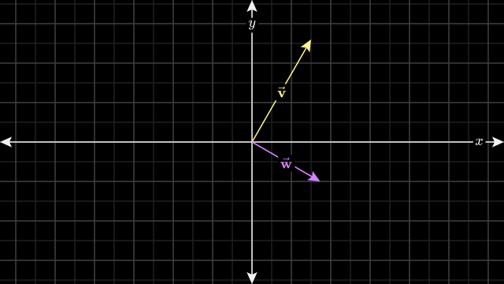
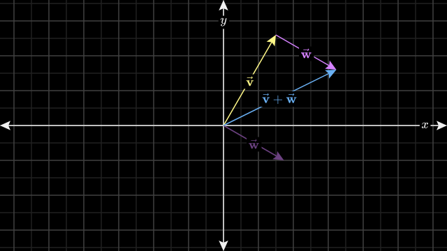
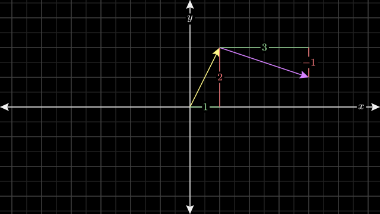
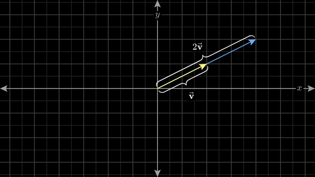

+++
title = "(b) Basic vector operations"
weight = 2
+++

---

### 1. 덧셈 & 뺄셈

벡터의 궤적을 따라 움직이는 것이다.

$\vec{v}+\vec{w}$는 벡터 $\vec{v}$의 궤적으로 움직인 다음,  벡터 $\vec{w}$의 궤적으로 움직이는 것이다.

 

이를 리스트(숫자의 나열)로 표현하면, 다음과 같다.

$$
\vec{v}+\vec{w}
=\left[\begin{matrix}
    v_1 \\ 
    v_2
\end{matrix}\right]+
\left[\begin{matrix}
    w_1 \\ 
    w_2
\end{matrix}\right]
=\left[\begin{matrix}
    v_1+w_1 \\ 
    v_2+w_2
\end{matrix}\right]
$$

---

### 2. Scaling

이를 리스트(숫자의 나열)로 표현하면, 다음과 같다.

$$
a\vec{v}
=a\left[\begin{matrix}
    v_1 \\
    v_2
\end{matrix}\right]
=\left[\begin{matrix}
    av_1 \\
    av_2
\end{matrix}\right]
$$

---

[Vectors, what even are they?](https://www.3blue1brown.com/lessons/vectors)