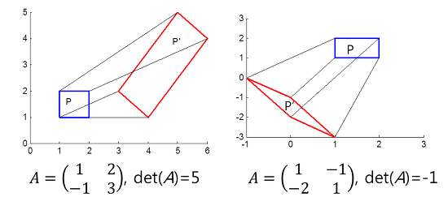
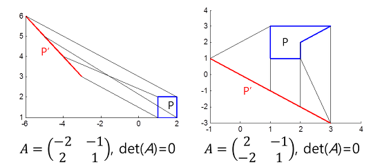
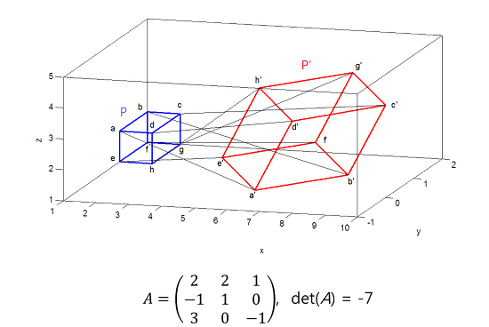
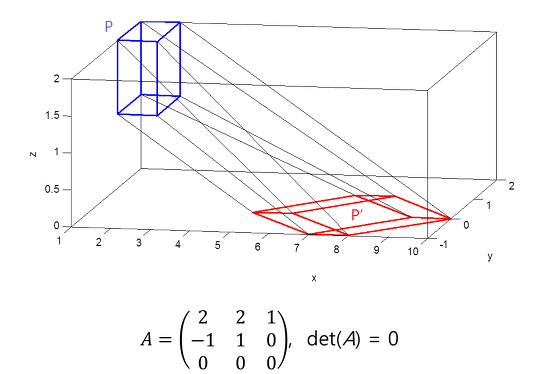

+++
title = "(b) Column vector of matrix II - Determinant"
weight = 7
+++

---

### 1. 행렬식의 의미

- X를 [x, y]$^{T}$, [x, y, z]$^{T}$ 등과 같이 좌표를 나타내는 벡터라고 했을 때, 행렬 A를 X'=AX와 같이 사용하면 행렬 A는 입력좌표 X를 X'으로 변환시켜주는 일종의 선형변환(linear transformation)으로 해석할 수 있다.
- **행렬식은 부피 또는 선형변환의 넓이 또는 부피의 보정 값** 으로 볼 수 있다.
- **det(A)>0이면 도형의 방향(orientation)이 보존**되고 **det(A)<0이면 도형의 방향이 보존** 되지 않는다.

$$
P'=AP
$$

$$
\text{면적}\left(P'\right)=\left|\det\left(A\right)\right|\cdot\text{면적}\left(P\right)
$$

$$
\text{부피}\left(P'\right)=\left|\det\left(A\right)\right|\cdot\text{부피}\left(P\right)
$$

---

### 2. 2D 변환

---

### 3. 2D 변환 & det(A)=0

- det(A)=0, 넓이 보정값은 0
- det(A)=0, 차원 축소를 의미한다. **2D->1D or dot**

---

### 4. 3D 변환

---

### 5. 3D 변환 & det(A)=0

- det(A)=0, 부피 보정값은 0
- det(A)=0, 차원 축소를 의미한다. **3D->2D or 1D or dot**

---

### 6. 중요 특성

$$
\left|AB\right|=\left|A\right|\left|B\right|
$$

---

### 7. det(A)=0, 선형 독립 & 선형 종속

det(A)=0인 A(행렬, 연산자)는 피연산되는 모든 벡터들을

- 같은 (선 또는 면)방향으로 재배치 하거나,
- 같은 동일한 점으로 재배치 한다.
- 같은 방향 또는 하나의 점으로 재배치 하므로, **det(A)=0 은, 행렬 A의 각 열벡터가 종속 성분이 있음을 의미한다.**

행렬 A의 각 열벡터를 $v_{1}, v_{2}, v_{3}, \cdots$ 라고 하자. 

$$
c_1v_{1}+c_2v_{2}+c_3v_{3}+\cdots=0
$$

$$
A\vec{c}=0
$$

- **각 열벡터가 선형 독립** 이라면, 각 열벡터에 곱한 계수가 모두 0이어야**만** 한다. 따라서, 계수는 0인 자명해만 존재해야한다.

$$
\text{det}(A)\ne0
$$

- **각 열벡터가 선형 종속** 이라면, 각 열벡터에 곱한 계수가 모두 0이 아닌것이 존재해야 한다. 따라서, 0이외의 자명하지 않은 해도 존재해야한다.

$$
\text{det}(A)=0
$$

---

[다크 프로그래머 :: [선형대수학 #2] 역행렬과 행렬식(determinant)](https://darkpgmr.tistory.com/104)