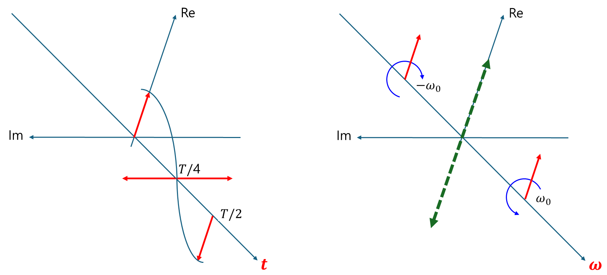
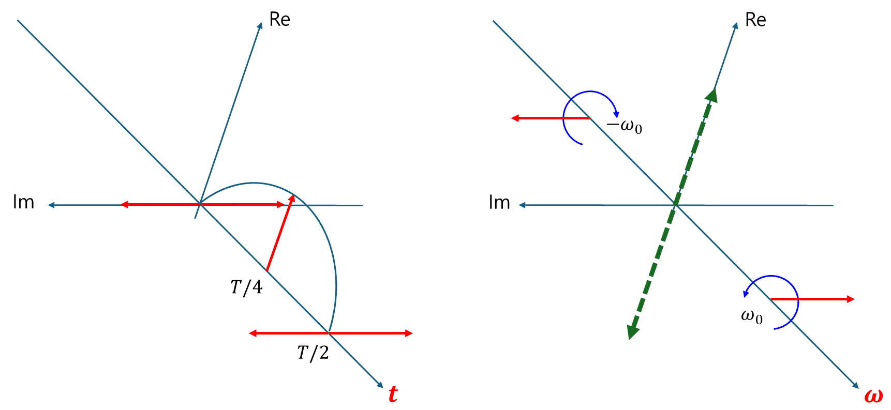

+++
title = "(b) Fourier transform I"
weight = 6
+++

---

### 1. 푸리에 변환의 본질

푸리에 변환은 라플라스 변환의 특수한 경우이다. 즉, **s-domain의 실수부가 0으로 고정하고, 허수축에서만의 변환** 을 의미한다.

우선 라플라스 변환 연산자를 살펴보자.

$$
\langle s^L|f\rangle=\int dt \left[ e^{-st} f(t) \right]
$$

실수부가 0으로 고정되면,

$$
\langle s^L|f\rangle|_{\operatorname{Re}[s]=0}
=2\pi i\langle s^d|f\rangle|_{\operatorname{Re}[s]=0}
=\int_{-\infty}^{\infty} dt \left[ e^{-i\omega t} f(t) \right]
$$

**(1) 비정규 직교 기저 푸리에 변환 & 변환 연산자**

- **수학, 공학, 특히 신호 처리에서** 비대칭성 기반 정의가 더 많이 사용된다.
- 비대칭적인 형태가 수학적 이론 전개에 편리하기 때문

$$
\langle \omega|f\rangle
=\langle s^L|f\rangle|_{\operatorname{Re}[s]=0}
=\int_{-\infty}^{\infty} dt \left[ e^{-i\omega t} f(t) \right]
$$

**(2) 정규 직교 기저 푸리에 변환 & 변환 연산자**

- **물리학, 특히 양자역학에서 정규 직교성 기반 정의**가 필수적으로 많이 사용된다.
- 에너지 보존과 확률 진폭 해석의 중요성 때문

$$
\langle \omega|f\rangle
=\frac{1}{\sqrt{2\pi}}\langle s^L|f\rangle|_{\operatorname{Re}[s]=0}
=\frac{1}{\sqrt{2\pi}}\int_{-\infty}^{\infty} dt \left[ e^{-i\omega t} f(t) \right]
$$

---

### 2. Basis

**(1) 비정규 직교 기저**

$$
\langle t|\omega\rangle
=\langle t|s\rangle|_{\operatorname{Re}[s]=0}=e^{i\omega t},\quad \langle\omega|t\rangle=e^{-i\omega t}
$$

$$
\langle\omega^d|
=\frac{1}{2\pi}\langle\omega|
$$

이것은 푸리에 변환의 결과가, $|\omega\rangle$의 기저를 사용한 좌표 $\langle \omega^d|f\rangle$ 에 $1/(2\pi)$ 배 임을 알 수 있다. 

**(2) 정규 직교 기저**

대칭 푸리에 변환을 기준으로 설명한다.

$$
\langle \omega|f\rangle
=\frac{1}{\sqrt{2\pi}}\int_{-\infty}^{\infty} dt \left[ e^{-i\omega t} f(t) \right]
$$

$$
\langle \omega|f\rangle
=\langle \omega|\hat{I}|f\rangle
=\int_{-\infty}^{\infty} dt \langle \omega|t\rangle\langle t|f\rangle
$$

위 두개의 식을 비교하면,

$$
\langle \omega|t\rangle=\frac{1}{\sqrt{2\pi}}e^{-i\omega t},\quad
\langle t|\omega\rangle=\frac{1}{\sqrt{2\pi}}e^{+i\omega t}
$$

$\langle \omega|\omega'\rangle$ 이 무엇인지 확인해 보자.

$$
\langle \omega|\omega'\rangle
=\langle \omega|\hat{I}|\omega'\rangle
=\int_{-\infty}^{\infty} dt \langle \omega|t\rangle\langle t|\omega'\rangle
=\frac{1}{2\pi}\int_{-\infty}^{\infty} dt e^{-i(\omega-\omega')t}
=\delta(\omega-\omega')
$$

따라서, 

$$
\langle \omega^d|=\langle \omega|
$$

즉, $|\omega\rangle$ 은 **정규직교기저** 이다.

---

### 3. 푸리에 역변환

**(1) 비정규 직교 기저**

$$
\langle t|f\rangle
=\frac{1}{2\pi}\int d\omega f(\omega) e^{i\omega t}
$$

proof)

$$
\langle t|f\rangle=\int d\omega \langle \omega^d|f\rangle \langle t|\omega\rangle
=\frac{1}{2\pi}\int d\omega \langle \omega|f\rangle \langle t|\omega\rangle
=\frac{1}{2\pi}\int d\omega f(\omega) e^{i\omega t}
$$

**(2) 정규 직교 기저**

$$
\langle t|f\rangle
=\frac{1}{\sqrt{2\pi}}\int d\omega f(\omega) e^{i\omega t}
$$

proof)

$$
\langle t|f\rangle=\int d\omega \langle \omega^d|f\rangle \langle t|\omega\rangle
=\int d\omega \langle \omega|f\rangle \langle t|\omega\rangle
=\frac{1}{\sqrt{2\pi}}\int d\omega f(\omega) e^{i\omega t}
$$

---

### 4. 푸리에 변환의 물리적 의미

**함수는 여러 주파수 성분들이 중첩** 되어 있다고 볼 수 있다. 푸리에 변환은 **감쇄하지 않는 정현파의 각주파수 성분 크기를 구하는 것** 이다. 아래는 cosine과 sine 함수를 나타내며, 빨간색은 주파수 성분의 크기이다.

- cosine 함수

- sine 함수

---

### 2. 각 주파수 성분들은 orthogonal 하다.

$$
\langle e^{i\omega't}|e^{i\omega t} \rangle=2\pi\delta\left(\omega-\omega'\right)
$$



$$
\int_{-\infty}^{\infty}dt\left\lbrack e^{i\omega t}e^{-i\omega't}\right\rbrack
$$

위 식이 무엇인지 구하는 것이 목적이다. 'Regularization(정칙화) 기법'을 사용하자. 수학이나 물리학에서 다루는 문제 중에는 발산하거나(divergent), 특이점(singularity)을 포함하거나, 또는 해가 유일하게 결정되지 않는(ill-posed problem) 등 수학적으로 잘 정의되지 않거나 다루기 어려운 경우가 있다. 정칙화는 이러한 문제들을 직접 다루는 대신, 하나 이상의 매개변수(ϵ 등)를 도입하여 문제를 약간 변형(정칙화)함으로써 임시적으로 잘 정의되고 다루기 쉬운 형태로 만든 다음, 그 매개변수에 대해 특정 극한을 취하여 원래 문제의 '해석적인(meaningful)' 결과를 얻어내는 기법 이다.

$$
\Omega=\omega-\omega'
$$

$$
f_{\epsilon}(\Omega)=\int_{-\infty}^{\infty}dt\left\lbrack e^{i\Omega t}e^{-\epsilon|t|}\right\rbrack
$$

$$
\int_{-\infty}^{\infty}dt\left\lbrack e^{i\left(\omega-\omega'\right)t}\right\rbrack
=\lim_{\epsilon\to0}f_{\epsilon}(\Omega)
=\lim_{\epsilon\to0}\int_{-\infty}^{\infty}dt\left\lbrack e^{i\Omega t}e^{-\epsilon|t|}\right\rbrack
=\int_{-\infty}^0dt\left\lbrack e^{i\Omega t}e^{\epsilon t}dt\right\rbrack+\int_0^{\infty}dt\left\lbrack e^{i\Omega t}e^{-\epsilon t}\right\rbrack
$$

음수 구간

$$
\int_{-\infty}^0dt\left\lbrack e^{i\Omega t}e^{\epsilon t}dt\right\rbrack=\int_{-\infty}^0dt\left\lbrack e^{(\epsilon+i\Omega)t}\right\rbrack=\left[\frac{1}{\epsilon+ i\Omega}e^{(\epsilon+i\Omega)t}\right]_{-\infty}^0=\frac{1}{\epsilon+ i\Omega}
$$

양수 구간

$$
\int_{0}^{\infty} e^{i\Omega t} e^{-\epsilon t} dt = \int_{0}^{\infty} e^{(-\epsilon + i\Omega)t} dt = \left[ \frac{1}{-\epsilon + i\Omega} e^{(-\epsilon + i\Omega)t} \right]_{0}^{\infty} = \frac{1}{\epsilon - i\Omega}
$$

따라서,

$$
f_{\epsilon}(\Omega)=\int_{-\infty}^{\infty}dt\left\lbrack e^{i\Omega t}e^{-\epsilon|t|}\right\rbrack=\frac{2\epsilon}{\Omega^2 + \epsilon^2}
$$

(1) $\Omega=0$

$$
\lim_{\epsilon\to0}f_{\epsilon}(\Omega)=\lim_{\epsilon\to0}\frac{2}{\epsilon}=\infty
$$

(2) $\Omega\ne0$

$$
\lim_{\epsilon\to0}f_{\epsilon}(\Omega)=\lim_{\epsilon\to0}\frac{0}{\Omega^2}=0
$$

(1) & (2) 의 결과를 사용하면, 다음을 얻을 수 있다.

$$
\lim_{\epsilon\to0}f_{\epsilon}(\Omega)=A\delta\left(\Omega\right)
$$

계수 A가 무엇인지 구해보자. 디렉델타함수의 정의를 사용한다.

$$
A=\int_{-\infty}^{\infty}d\Omega\left\lbrack \frac{2\epsilon}{\Omega^2 + \epsilon^2} \right\rbrack
=2\int_{-\infty}^{\infty}d\left(\frac{\Omega}{\epsilon}\right)\left\lbrack \frac{1}{\left(\frac{\Omega}{\epsilon}\right)^2 + 1} \right\rbrack
=2\left[\operatorname{atan}\left(\frac{\Omega}{\epsilon}\right)\right]^{\infty}_{-\infty}=2\pi
$$

최종적으로,

$$
\langle e^{i\omega't}|e^{i\omega t} \rangle=2\pi\delta\left(\omega-\omega'\right)
$$

만약 orthonormal 한 기저로서 표현하고 싶다면,

$$
\left\langle \frac{e^{i\omega't}}{\sqrt{2\pi}}\middle|\frac{e^{i\omega t}}{\sqrt{2\pi}}\right\rangle=\delta\left(\omega-\omega'\right)
$$



---

### 6. 라플라스 변환과의 관계

$$
\langle s|f\rangle|_{s=i\omega}=\langle \omega|f\rangle
$$

위 식을 만족하려면,

- ROC가 허수축을 포함하는 열린 영역인 경우: 표준 푸리에 변환 존재. (분포 푸리에 변환은 표준을 포함하는 더 큰 개념)
- ROC가 $\operatorname{Re}\lbrace s\rbrace=0$ 시: 분포 푸리에 변환 존재 (표준 푸리에 변환은 정의되지 않음)
- ROC가 $\operatorname{Re}\lbrace s\rbrace>0$ 또는 $\operatorname{Re}\lbrace s\rbrace<0$ 시: 분포 푸리에 변환 존재
- 단, ROC **공집합** 시: 표준 & 분포 푸리에 변환이 존재 안 함
