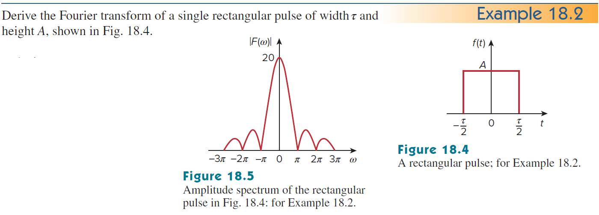
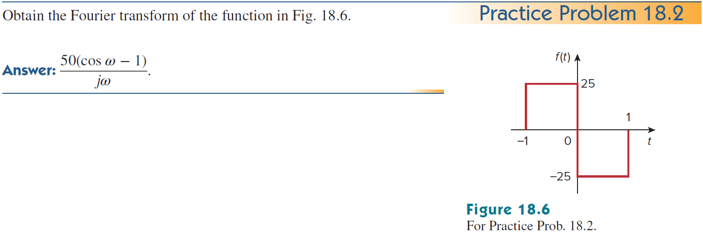
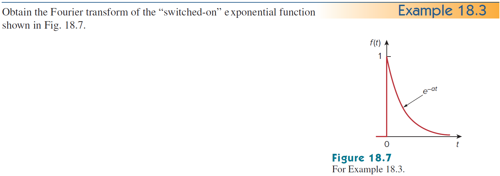
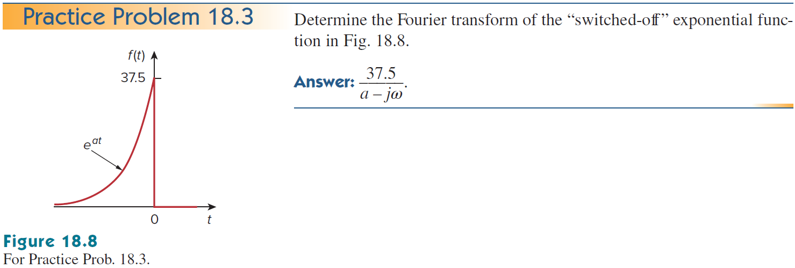
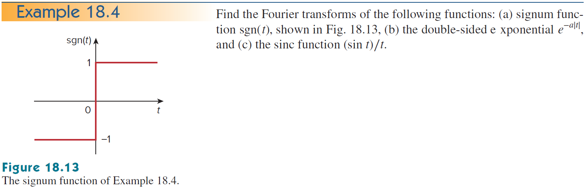
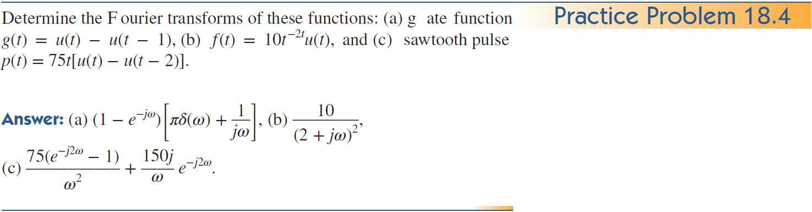
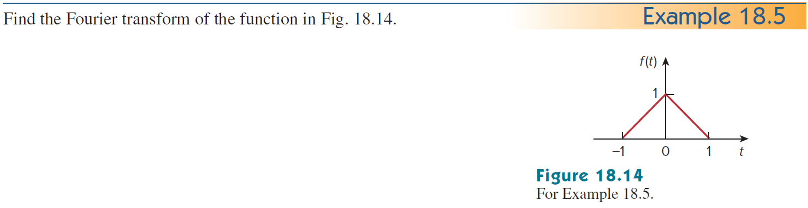
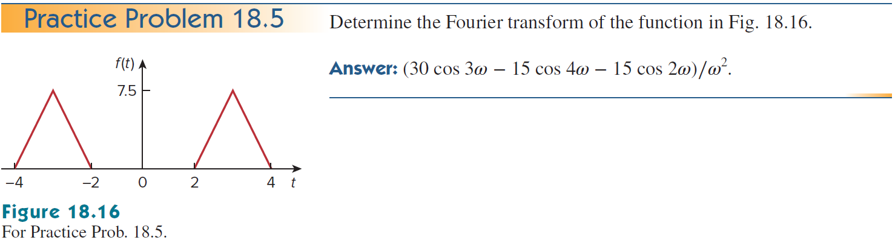
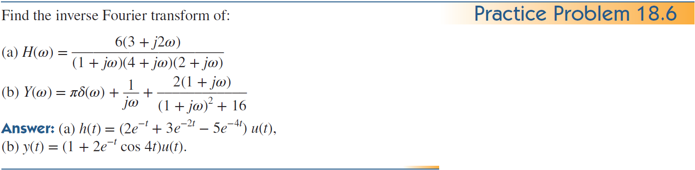

+++
title = "(b) Fourier transform II"
weight = 8
+++

---

### 1. 중요변환

**1) Dirac delta function - time to frequency domain**

$$
\langle \omega^A| \delta \rangle=1,\quad
\langle \omega^S| \delta \rangle=\frac{1}{\sqrt{2\pi}}
$$

**2) Dirac delta function - frequency to time domain**

$$
\langle t^A| \delta \rangle=\frac{1}{2\pi},\quad
\langle t^S| \delta \rangle=\frac{1}{\sqrt{2\pi}}
$$

**3) DC, Constant**

$$
\langle\omega^A|1\rangle=2\pi\delta(\omega),\quad
\langle\omega^S|1\rangle=\sqrt{2\pi}\delta(\omega)
$$

**4) Unit function**

$$
\langle\omega^A|u\rangle=\pi\delta(\omega)+\frac{1}{i\omega},\quad
\langle\omega^S|u\rangle=\frac{1}{\sqrt{2\pi}}\left\lbrace\pi\delta(\omega)+\frac{1}{i\omega}\right\rbrace
$$

**5) cosine function**

$$
\langle\omega^A|\cos at\rangle=\pi\delta(\omega-a)+\pi\delta(\omega+a),\quad
\langle\omega^S|\cos at\rangle=\frac{1}{\sqrt{2\pi}}\left\lbrace\pi\delta(\omega-a)+\pi\delta(\omega+a)\right\rbrace
$$

**6) sine function**

$$
\langle\omega^A|\sin at\rangle
=-i\pi\delta\left(\omega-a\right)+i\pi\delta\left(\omega+a\right),\quad
\langle\omega^S|\sin at\rangle
=\frac{1}{\sqrt{2\pi}}\left\{-i\pi\delta\left(\omega-a\right)+i\pi\delta\left(\omega+a\right)\right\}
$$

---

### 2. Duality

푸리에 변환의 쌍대성은 시간 영역과 주파수 영역 사이의 대칭적인 관계를 나타낸다. 함수 $f(t)$의 푸리에 변환이 $F(\omega)$일 때, $F(\omega)$를 시간 함수 $F(t)$로 간주하고 그 푸리에 변환을 구하면 원래 함수 $f(t)$와 관련된 형태가 나온다.

**비대칭성 (Asymmetric Convention)**

$$
\mathcal{F}\{F(t)\}(\omega)
=2\pi f(-\omega),\quad
\langle\omega|F(t)\rangle
=2\pi\langle-\omega|f\rangle
$$



$F(\omega)$를 시간 함수 $F(t)$로 간주하고 비대칭 푸리에 변환을 수행하면,

$$
\mathcal{F}\{F(t)\}(\omega)
=\int_{-\infty}^{\infty} dt \left[ F(t) e^{-i\omega t} \right]
$$

역 푸리에 변환 정의에서 변수 $\omega$와 $t$를 교환하면,

$$
f(\omega) = \frac{1}{2\pi} \int_{-\infty}^{\infty} dt \left[ F(t) e^{it\omega } \right]
$$

여기서 $\omega$ 대신에  $-\omega$를 대입하면,

$$
f(-\omega) = \frac{1}{2\pi} \int_{-\infty}^{\infty} dt \left[ F(t) e^{-it \omega} \right] 
$$

이 식의 양변에 $2\pi$를 곱하면,

$$
\mathcal{F}\{F(t)\}(\omega)=2\pi f(-\omega),\quad
\langle\omega|F(t)\rangle=2\pi\langle-\omega|f\rangle
$$



**대칭성 (Symmetric Convention)**

$$
\mathcal{F}\{F(t)\}(\omega)
= f(-\omega), \quad
\langle \omega | F(t) \rangle
= \langle -\omega | f \rangle
$$

---

### 3. Practice 1

**example1)** 

$$
\langle\omega^S|u\left(t-t'\right)\rangle
$$



$$
\langle\omega^S|u\left(t-t'\right)\rangle
=e^{-i\omega t'}\langle\omega^S|u\rangle
=\frac{e^{-i\omega t'}}{\sqrt{2\pi}}\left\lbrace\frac{1}{i\omega}+\pi\delta\left(\omega\right)\right\rbrace
$$



**example2)**

$$
\langle\omega^S|\delta\left(t-t'\right)\rangle
$$


    
$$
\langle\omega^S|\delta\left(t-t'\right)\rangle
=e^{-i\omega t'}\langle\omega^S|\delta\rangle
=\frac{e^{-i\omega t'}}{\sqrt{2\pi}}
$$



**example3)**

$$
\langle\omega^S|e^{iat}\rangle
$$


    
$$
\langle\omega^S|e^{iat}\rangle
=\langle(\omega+i\cdot ia)^S|1\rangle
=\sqrt{2\pi}\delta\left(\omega-a\right)
$$



**example4)** 

$$
\langle\omega^S|e^{at}u(t)\rangle,\quad a<0
$$



$$
\langle\omega^S|e^{at}u(t)\rangle
=\langle(\omega+ia)^S|u\rangle
=\frac{1}{\sqrt{2\pi}}\left\lbrace\frac{1}{i\left(\omega+ia\right)}+\pi\delta\left(\omega+ia\right) \right\rbrace
$$

$$
=\frac{1}{\sqrt{2\pi}}\cdot\frac{1}{i\omega-a}
$$



**example5)** 

$$
\langle\omega^S|u\left(-t\right)\rangle
$$



$$
\langle\omega^S|u\left(-t\right)\rangle
=\langle(-\omega)^S|u\rangle
=\frac{1}{\sqrt{2\pi}}\left\lbrace -\frac{1}{i\omega}+\pi\delta\left(\omega\right) \right\rbrace
$$



**example6)**

$$
\langle\omega^S|e^{at}u\left(-t\right)\rangle,\quad a>0
$$



$$
\langle\omega^S|e^{at}u\left(-t\right)\rangle
=\langle(\omega+ia)^S|u\left(-t\right)\rangle
=\langle(-\omega-ia)^S|u\left(t\right)\rangle
$$

$$
=\frac{1}{\sqrt{2\pi}}\left\lbrace\frac{1}{i\left(-\omega-ia\right)}+\pi\delta\left(-\omega-ia\right) \right\rbrace
$$

$$
=\frac{1}{\sqrt{2\pi}}\cdot\frac{1}{-i\omega+a}
$$



**example7)**

$$
\langle\omega^S|e^{-t}u\left(t-1\right)\rangle
$$



$$
\langle\omega^S|e^{-t}u\left(t-1\right)\rangle
=\langle(\omega-i)^S|u\left(t-1\right)\rangle
=e^{-i(\omega-i)}\langle(\omega-i)^S|u\rangle
$$

$$
=e^{-i\omega-1}\langle(\omega-i)^S|u\rangle
=\frac{e^{-i\omega-1}}{\sqrt{2\pi}}\cdot\frac{1}{i\omega+1}
$$



**example8)**

$$
\langle\omega^S|e^{-2t}u\left(2t-1\right)\rangle
$$



$$
\langle \omega^S| e^{-2t}u\left(2t-1\right)\rangle
=\langle (\omega-2i)^S| u\left(2t-1\right)\rangle
$$

$$
=e^{-\frac{i}{2}(\omega-2i)}\langle(\omega-2i)^S|u\left(2t\right)\rangle
=\frac{1}{2}e^{-i\frac{\omega}{2}-1}\left\langle\left(\frac{\omega}{2}-i\right)^S\middle| u\right\rangle
$$

$$
=\frac{1}{2\sqrt{2\pi}}e^{-i\frac{\omega}{2}-1}\left\lbrace\frac{1}{i\left(\omega/2-i\right)}\right\rbrace
$$

$$
=\frac{1}{\sqrt{2\pi}}\frac{e^{-i\omega/2-1}}{i\omega+2}
$$



**example9)**

$$
\langle\omega^S|e^{t}u\left(1-t\right)\rangle
$$



$$
\langle \omega^S| e^{t}u\left(1-t\right)\rangle
=\langle(\omega+i)^S| u\left(1-t\right)\rangle
=e^{-i\omega+1}\langle(\omega+i)^S| u\left(-t\right)\rangle
$$

$$
=e^{-i\omega+1}\langle(-\omega-i)^S|u\rangle
=\frac{1}{\sqrt{2\pi}}e^{-i\omega+1}\cdot\frac{1}{i(-\omega-i)}
$$

$$
=\frac{1}{\sqrt{2\pi}}\frac{e^{1-i\omega}}{1-i\omega}
$$



**example10)**

$$
\langle \omega^S|tu\left(t\right)\rangle
$$



$$
\langle\omega^S|t\cdot u\rangle
=\langle \omega^S|\hat{t}|u\rangle
=i\frac{d}{d\omega}\langle\omega^S|u\rangle
$$

$$
=\frac{i}{\sqrt{2\pi}}\frac{d}{d\omega}\left\lbrace\frac{1}{i\omega}+\pi\delta\left(\omega\right)\right\rbrace
=\frac{i}{\sqrt{2\pi}}\left\lbrace-\frac{1}{i\omega^2}+\pi\delta'\left(\omega\right)\right\rbrace
$$



**example11)**

$$
\langle \omega^S|tu\left(-t\right)\rangle
$$



$$
\langle\omega^S|t\cdot u(-t)\rangle
=\langle \omega^S|\hat{t}|u(-t)\rangle
=i\frac{d}{d\omega}\langle(-\omega)^S|u\rangle
$$

$$
=\frac{i}{\sqrt{2\pi}}\frac{d}{d\omega}\left\lbrace -\frac{1}{i\omega}+\pi\delta\left(\omega\right) \right\rbrace
=\frac{i}{\sqrt{2\pi}}\left\lbrace\frac{1}{i\omega^2}+\pi\delta'\left(\omega\right)\right\rbrace
$$



---

### 4. Practice2 - 비대칭성 기반 풀이

**example1) 문제 자체가 중요**



$$
\langle \omega | \hat{D}_t | f \rangle
= (i\omega)\langle \omega | f \rangle
$$

왼쪽항

$$
\left\langle \omega \middle| \frac{d}{dt} f \right\rangle
= \left\langle \omega \middle| A\delta\left(t+\frac{\tau}{2}\right) - A\delta\left(t-\frac{\tau}{2}\right) \right\rangle
$$

$$
= \left\langle \omega \middle| A\delta\left(t+\frac{\tau}{2}\right)\right\rangle - \left\langle \omega \middle| A\delta\left(t-\frac{\tau}{2}\right) \right\rangle
= A\left( e^{i\frac{\tau}{2}\omega} - e^{-i\frac{\tau}{2}\omega} \right) \left\langle \omega \middle| \delta\right\rangle
$$

$$
=A\left( e^{i\frac{\tau}{2}\omega} - e^{-i\frac{\tau}{2}\omega} \right)
$$

따라서,

$$
\langle\omega|f\rangle
=\frac{A}{i\omega}\left( e^{i\frac{\tau}{2}\omega} - e^{-i\frac{\tau}{2}\omega} \right)
=A\tau\frac{\sin\left(\omega\tau/2\right)}{\omega\tau/2}
=A\tau\cdot \operatorname{sinc}\left(\frac{\omega\tau}{2}\right)
$$



**example2)**



$$
\langle \omega | \hat{D}_t | f \rangle
= (i\omega)\langle \omega | f \rangle
$$

왼쪽항

$$
\left\langle \omega \middle| \frac{d}{dt} f \right\rangle
= \left\langle \omega \middle| 25\delta\left(t+1\right)- 50\delta\left(t\right)+25\delta\left(t-1\right) \right\rangle
=50\left(\frac{e^{i\omega}+e^{-i\omega}}{2}-1\right)
$$

따라서,

$$
\langle\omega|f\rangle
=\frac{50}{i\omega}\left(\frac{e^{i\omega}+e^{-i\omega}}{2}-1\right)
=\frac{50}{i\omega}\left(\cos\omega-1\right)
$$



**example3)**



$$
\langle\omega|e^{at}u\rangle
=\langle\omega+ia|u\rangle
=\frac{1}{i\left(\omega+ia\right)}+\pi\delta\left(\omega+ia\right)
$$

$$
=\frac{1}{i\omega-a}
$$



**example4)** 



$$
\langle\omega|37.5e^{at}u\left(-t\right)\rangle
=37.5\langle\omega+ia|u\left(-t\right)\rangle
=37.5\langle-\omega-ia|u\left(t\right)\rangle
$$

$$
=37.5\left\lbrace\frac{1}{i\left(-\omega-ia\right)}+\pi\delta\left(-\omega-ia\right) \right\rbrace
$$

$$
=\frac{37.5}{-i\omega+a}
$$



**example5)**



$$
\left\langle\omega\middle|\frac{d}{dt}f\right\rangle
=\left\langle\omega\middle|2\delta(t)\right\rangle
=2
$$

$$
\left\langle\omega\middle|f\right\rangle
=\frac{2}{i\omega}
$$


    
**example6)** 



$$
\left\langle\omega\middle|u(t)-u(t-1)\right\rangle
=\left\langle\omega\middle|u\right\rangle-e^{-i\omega}\left\langle \omega\middle|u\right\rangle
=(1-e^{-i\omega})\left\langle \omega\middle|u\right\rangle
$$

$$
=(1-e^{-i\omega})\left\lbrace\frac{1}{i\omega}+\pi\delta(\omega)\right\rbrace
$$





$$
\left\langle\omega\middle|e^{-2t}u\right\rangle
=10\left\langle\omega-2i\middle|u\right\rangle
=\frac{10}{2-i\omega}
$$





$$
\left\langle\omega\middle|75t\lbrace u(t)-u(t-2)\rbrace\right\rangle
=75i\frac{d}{d\omega}\left\langle\omega\middle|u(t)-u(t-2)\right\rangle
$$

$$
=75i\frac{d}{d\omega}\left[\frac{1}{i\omega}+\pi\delta(\omega)-e^{-i2\omega}\left\lbrace \frac{1}{i\omega}+\pi\delta(\omega)\right\rbrace\right]
$$

$$
=75i\frac{d}{d\omega}\left[\left\lbrace1-e^{-i2\omega}\right\rbrace\left\lbrace \frac{1}{i\omega}+\pi\delta(\omega)\right\rbrace\right]
$$

$$
=\frac{150ie^{-i2\omega}}{\omega}-\frac{75(1-e^{-i2\omega})}{\omega^2}
$$



**example7)**



$$
f'(t)=u(t+1)-2u(t)+u(t-1)
$$

$$
f''(t)=\delta(t+1)-2\delta(t)+\delta(t-1)
$$

따라서,

$$
\left\langle\omega\middle|f''(t)\right\rangle
=(i\omega)^2\left\langle\omega\middle|f\right\rangle
$$

$$
\left\langle\omega\middle|f''(t)\right\rangle
=\left\langle\omega\middle|\delta(t+1)-2\delta(t)+\delta(t-1)\right\rangle
$$

$$
=e^{i\omega}+e^{-i\omega}-2
$$

푸리에 변환의 결과는

$$
\left\langle\omega\middle|f\right\rangle
=\frac{1}{(i\omega)^2}(e^{i\omega}+e^{-i\omega}-2)
=-\frac{2}{\omega^2}(\cos\omega-1)
$$

$$
=\operatorname{sinc^2}\left(\frac{\omega}{2}\right)
$$



**example8)**



$$
f'(t)=u(t-2)-2u(t-3)+u(t-4)
$$

$$
f''(t)=\delta(t-2)-2\delta(t-3)+\delta(t-4)
$$

따라서,

$$
\left\langle\omega\middle|f''(t)\right\rangle
=(i\omega)^2\left\langle\omega\middle|f\right\rangle
$$

$$
\left\langle\omega\middle|f''(t)\right\rangle
=\left\langle\omega\middle|\delta(t-2)-2\delta(t-3)+\delta(t-4)\right\rangle
$$

$$
=e^{-i2\omega}-2e^{-i3\omega}+e^{-i4\omega}
$$

따라서,

$$
\left\langle\omega\middle|f''(t)\right\rangle+\left\langle\omega\middle|f''(t+6)\right\rangle
=e^{-i2\omega}-2e^{-i3\omega}+e^{-i4\omega}+e^{i6\omega}\{e^{-i2\omega}-2e^{-i3\omega}+e^{-i4\omega}\}
$$

$$
=e^{-i2\omega}+e^{+i2\omega}-2e^{-i3\omega}-2e^{+i3\omega}+e^{-i4\omega}+e^{-i4\omega}
$$

$$
=2\cos2\omega-4\cos3\omega+2\cos4\omega
$$

푸리에 변환의 결과는 

$$
7.5\left\langle\omega\middle|f\right\rangle
=\frac{7.5}{(i\omega)^2}(2\cos2\omega-4\cos3\omega+2\cos4\omega)
$$

$$
=\frac{1}{\omega^2}(-15\cos2\omega+30\cos3\omega-15\cos4\omega)
$$



**example9)**



$$
\left\langle t\middle|F(s)\right\rangle
=\left\langle t\middle|\frac{10s+4}{s^2+6s+8}\right\rangle
=\left\langle t\middle|\frac{10(s+3)-26}{(s+3)^2-1}\right\rangle
$$

ROC 가 $\operatorname{Re}\lbrace s\rbrace>-2$ 이어야 푸리에 변환이 존재한다. 따라서, 

$$
=e^{-3t}\left\langle t\middle|\frac{10s-26}{s^2-1}\right\rangle
$$

$$
=e^{-3t}(10\cosh t-26\sinh t)u(t)
$$





$$
\left\langle t\middle|F(s)\right\rangle
=\left\langle t\middle|\frac{\left(\frac{s}{i}\right)^2+21}{\left(\frac{s}{i}\right)^2+9}\right\rangle
=\left\langle t\middle|1-\frac{12}{s^2-3^2}\right\rangle
=\left\langle t\middle|1-\frac{12}{s^2-3^2}\right\rangle
$$

$$
=\left\langle t\middle|1-\frac{12}{(s+3)(s-3)}\right\rangle
=\left\langle t\middle|1+\frac{2}{s+3}-\frac{2}{s-3}\right\rangle
$$

ROC가 허수축을 포함하거나 허수축이 ROC의 경계가 되는 경우, 푸리에 변환이 존재한다.

1: ROC=전체, 두번째 항: ROC>-3, 세번째 항: ROC<3

따라서,

$$
=\delta(t)+2e^{-3t}u(t)+2e^{3t}u(-t)
$$



**example10)** 



$$
\left\langle t\middle|\frac{6(3+2s)}{(1+s)(4+s)(2+s)}\right\rangle
=\left\langle t\middle|\frac{2}{1+s}-\frac{5}{4+s}+\frac{3}{2+s}\right\rangle
$$

ROC>-1 이다. 따라서,

$$
=(2e^{-t}+3e^{-2t}-5e^{-4t})u(t)
$$





$$
\left\langle t\middle|\pi\delta(-is)+\frac{1}{s}+\frac{2(1+s)}{(1+s)^2+16}\right\rangle
=\left\langle t\middle|\pi\delta(s)+\frac{1}{s}+\frac{2(1+s)}{(1+s)^2+16}\right\rangle
$$

ROC가 허수축을 포함하거나 허수축이 ROC의 경계가 되는 경우, 푸리에 변환이 존재한다.

첫쨰항 전체 s, 둘째항 Re[s]>0 or Re[s]<0, 세째항 Re[s]>-1 이다.

$$
=\left\langle t\middle|\pi\delta(s)\right\rangle+\left\langle t\middle|\frac{1}{s}\right\rangle+2e^{-t}\left\langle t\middle|\frac{s}{s^2+4^2}\right\rangle
$$

$$
=\frac{1}{2}+\frac{1}{2}\operatorname{sgn}(t)+2e^{-t}\cos4t \cdot u(t)
$$

$$
=u(t)+2e^{-t}\cos4t \cdot u(t)
$$

