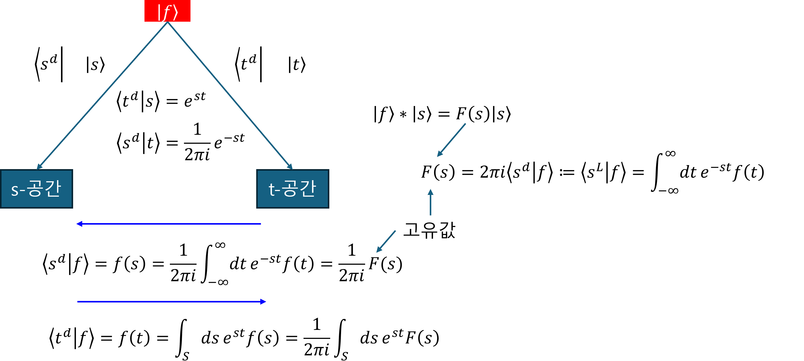

+++
title = "(b) Laplace transform I"
weight = 4
+++

---

---

### 1. Eigenvector & eigenvalue of LSI systems

연산자 $|h\rangle\ast$ 의 고유값과 고유벡터

$$
\text{eigenvalue}: \langle s^L|h\rangle=\int_{-\infty}^{\infty} dt h(t) e^{-st},\quad \langle s^L|t\rangle=e^{-st}
$$

$$
\text{eigenvector}: |s\rangle,\quad \langle t|s\rangle=e^{st}
$$

proof)

$$
|h\rangle\ast|s\rangle=H(s)|s\rangle
$$

위의 식을 토대로,

$$
\langle t|(|h\rangle\ast)|s\rangle
=\int^{\infty}_{-\infty}d\tau h(\tau) s(t-\tau)
$$

$$
\langle t|H(s)|s\rangle
=H(s)\langle t|s\rangle
=H(s) s(t)
$$

$\langle t|s\rangle=s(t)=e^{st}$ 라고 하면,

$$
\int^{\infty}_{-\infty}d\tau h(\tau) s(t-\tau)
=\int^{\infty}_{-\infty}d\tau h(\tau) e^{s(t-\tau)}
=\left(\int^{\infty}_{-\infty}d\tau e^{-s\tau}h(\tau) \right)e^{st}
$$

**고유값을 라플라스 변환** 이라고 하며, **추출(변환) 연산자** 로 표현해 보자.

$$
H(s)=\langle s^L|h\rangle=\int_{-\infty}^{\infty} dt e^{-st} h(t)
$$

$$
\langle s^L|t\rangle=e^{-st}
$$

---

### 2. "$|s\rangle$" & "$\langle s^L|$" & "$\langle s^d|$"

**(1) $|s\rangle\$ 은 비직교 기저**

- if $\sigma\ne 0$, $|s\rangle\$ 은 비직교 기저이다.
- if $\sigma= 0$, $|s\rangle\$ 은 직교 기저이다.
 

proof)

$$
\langle s|s'\rangle
=\int dt e^{s^\ast t}e^{s't}
= \int dt e^{(s^\ast+s')t}
$$

- if $\sigma\ne 0$, 발산하기 때문에, 적분값이 존재하지 않음, $\delta$ 함수가 아니므로,  $|s\rangle\$은 비직교 기저
- if $\sigma= 0$, 분포수렴하기 때문에, 적분값은 $2\pi\delta(\omega-\omega')$, $\delta$ 함수이나, 1이 아닌 상수가 곱해져 있으므로, 비정규 직교기저

**(2) $\langle s^L|$ & $\langle s^d|$**

$$
\langle s^L|s'\rangle=2\pi i\delta(s-s'),\quad
\langle s^d|=\frac{1}{2\pi i}\langle s^L|
$$

proof)

브롬위치 적분을 사용하면,

$$
\langle s^L|s'\rangle
=\int dt e^{-(s-s')t}
=2\pi i \delta(s-s')
$$

따라서, 기저 $|s\rangle$에 대한 dual basis 는

$$
\langle s^d|=\frac{1}{2\pi i}\langle s^L|
$$

---

### 3. 스팩트럼 분해

벡터 $|h\rangle$는 **'설계도(DNA)'** 이고, 연산자 $|h\rangle\ast$는 **'설계도대로 작동하는 기계'** 이다.

proof)

연산자는 스팩트럼 분해에 의해서,

$$
|h\rangle\ast = \int ds (\langle s^L|h\rangle)|s\rangle\langle s^d|
$$

시스템 벡터는 고유벡터로 표현할 수 있다.

$$
|h\rangle
= \int ds (\langle s^d|h\rangle)|s\rangle
= \frac{1}{2\pi i}\int ds (\langle s^L|h\rangle)|s\rangle
$$

---

### 4. 라플라스 변환의 관점

아래는 동일한 것을 다른 관점으로 설명한 것이다.

(1) 관점1: **라플라스 변환**은 convolution으로 모두 귀결되는 LSI 연산자의 **eigenvalue**(고유값)을 찾아 내는 방법이다.

$$
\langle s^L|h\rangle
=\int_{-\infty}^{\infty}dt\left[e^{-st}h\left(t\right)\right]
$$

(2) 관점2: **라플라스 변환**은 벡터의 **좌표**를 찾아 내는 방법이다. 즉, **라플라스 변환은 s-영역 좌표의 $2\pi i$ 배** 이다. 직관적으로 표현하기 위해, 아래와 같이 사용한다.

$$
\langle s^d|h\rangle
=\frac{1}{2\pi i}\langle s^L|h\rangle
$$

---

### 6. 라플라스 역변환

$|s\rangle$에 대한 기저를 $|t\rangle$에 대한 기저로 옮기는 것이다.

$$
\langle t|h\rangle
= \langle t|\left(\int ds \langle s^d|h\rangle|s\rangle \right)
= \frac{1}{2\pi i}\int ds \langle s^L|h\rangle e^{st}
$$

---

### 7. 라플라스 변환의 활용

**(1) 미분 방정식**

미분방정식을 대수 방정식으로 바꾼다. 단방향 라플라스 변환을 사용하면, 초기값이 있는 문제를 쉽게 다룰 수 있다.

$$
y''-7y'=7e^{t}\implies
|f_1\rangle+|f_2\rangle=|f_3\rangle
$$

- 관점1: **라플라스 변환**은 convolution으로 모두 귀결되는 LSI 연산자의 **eigenvalue**(고유값)을 찾아 내는 방법이다.

$$
|f_1\rangle\ast|s\rangle+|f_2\rangle\ast|s\rangle=|f_3\rangle\ast|s\rangle
$$

$$
\lambda_1|s\rangle+\lambda_2|s\rangle=\lambda_3|s\rangle
$$

$$
\lambda_1+\lambda_2=\lambda_3
$$

- 관점2: **라플라스 변환**은 벡터의 **좌표**를 찾아 내는 방법이다.

$$
\langle s^L|f_1\rangle+\langle s^L|f_2\rangle=\langle s^L|f_3\rangle
$$

$$
\lambda_1+\lambda_2=\lambda_3
$$

**(2) 성분 추출**

파형(파동) $f$에 **감쇄를 포함한 정현파 성분** 이 얼마만큼 되는지를 추출하는데 사용할 수 있다.

$$
\langle s^L|f\rangle=\int_{-\infty}^{\infty} dt e^{-st} f(t)
$$

---

### 8. 주의사항

Laplace transform은 다양한 함수에 적용할 수 있는 강력한 수학적 도구이다. 하지만, 이 변환을 사용하여 시스템의 출력을 전달 함수와의 곱, 즉 $Y(s) = H(s)X(s)$로 간단하게 계산하는 것은 시스템이 반드시 선형 이동 불변(LSI)일 때만 유효하다.

비선형 시스템은 중첩의 원리를 만족하지 않으므로, 임펄스 응답 h(t)와 전달 함수 H(s)라는 개념 자체가 시스템 전체를 대표할 수 없다. 따라서 이 문서에서 다루는 모든 시스템 분석 기법은 LSI 시스템을 전제로 한다.