+++
title = "(b) Laplace transform III"
weight = 5.5
+++

---

- 수렴여부에 따라, 분포 라플라스 변환, 표준 라플라스 변환이 존재한다.
- 일반적인 라플라스 변환의 적용은 표준 라플라스 변환을 사용한다.
- **99%의 공학 문제는 안정적인 신호를 다루므로 표준 라플라스로 충분하다.**
- 여기에 나온, **표준 라플라스 변환은 모두 암기** 해야 한다.
- 분포 라플라스 변환에서, **허수축의 경우 푸리에 변환과 동일** 하다.

---

### 1. 중요 변환

- Region of Convergence(ROC) 는 적분값이 수렴하는 s의 영역 이다.
- 중요 계산을 통해 **라플라스 변환의 극점과 ROC의 관계** 를 살펴보자.

**1-1) 디렉 델타 함수**

$$
\langle s^L|\delta\rangle=1,\quad\text{표준 ROC: 모든 } s
$$

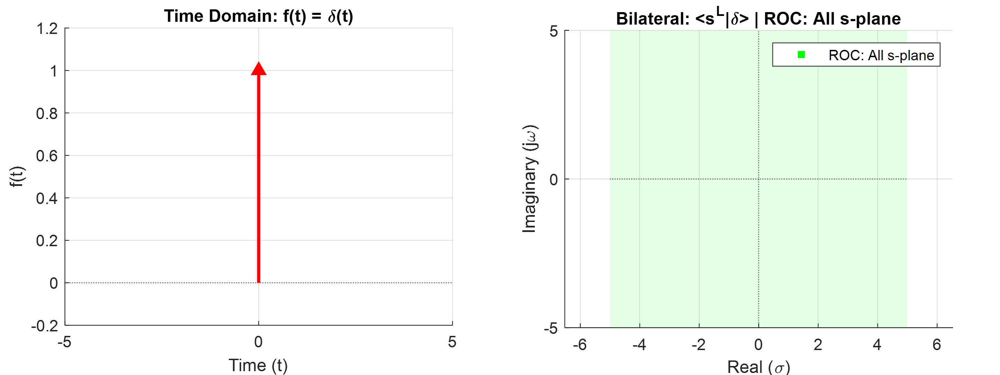


    
$$
\int_{-\infty}^{\infty}dt\left\lbrack\delta\left(t\right)e^{-st}\right\rbrack=1\cdot\int_{-\infty}^{\infty}dt\left\lbrack\delta\left(t\right)\right\rbrack=1,\quad
\text{ROC: 모든 } s
$$



**1-2) 디렉 델타 함수**

$$
\langle s^L|\delta \cdot u\rangle=1\quad\text{표준 ROC: 모든 } s
$$


    
$$
\int_{0-}^{\infty}dt\left\lbrack\delta\left(t\right)e^{-st}\right\rbrack
=1\cdot\int_{0-}^{\infty}dt\left\lbrack\delta\left(t\right)\right\rbrack=1, \quad
\text{ROC: 모든 } s
$$



**2-1) 상수 함수, 분포**

$$
\langle s^L|1\rangle=2\pi\delta(\omega),\quad\text{분포 ROC: }\operatorname{Re}\left\lbrace s\right\rbrace=0
$$


    
시간 신호 $f(t)=1$의 표준적인 양방향 라플라스 변환 적분 $\int_{-\infty}^{\infty}dt\left[e^{-st}\right]$는 어떤 열린 수렴 영역(ROC)에서도 수렴하지 않으므로, 표준적인 양방향 라플라스 변환은 존재하지 않는다. 

그럼에도 불구하고, <b>분포(Distribution)의 영역에서는 양방향 라플라스 변환이 존재</b>한다.

$$
\left. \int_{-\infty}^{\infty}dt\left[e^{-st}\right] \right|_{\operatorname{Re}\left\lbrace s\right\rbrace=0} = \int_{-\infty}^{\infty}dt\left[e^{-j\omega t}\right] = 2\pi\delta(\omega)
$$

$$
\langle s|1\rangle
=2\pi\delta\left(s\right),\quad
\text{ROC: }\operatorname{Re}\left\lbrace s\right\rbrace=0
$$



**2-2) 단위 계단 함수**

$$
\langle s^L|u\rangle=\frac{1}{s},\quad\text{표준 ROC: }\operatorname{Re}\left\lbrace s\right\rbrace>0
$$

$$
\langle s^L|u\rangle
=\pi\delta(\omega)+\operatorname{p.v.}\left(\frac{1}{i\omega}\right),\quad\text{분포 ROC: }\operatorname{Re}\left\lbrace s\right\rbrace=0
$$

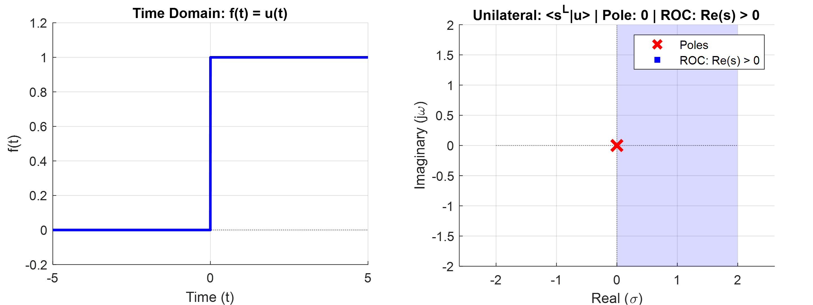


    
$$
\int_0^{\infty}dt\left\lbrack e^{-st}\right\rbrack=\frac{1}{s},\quad
\text{ROC: } \operatorname{Re}\lbrace s \rbrace>0
$$

극점은 0에서 존재한다. 이 때, ROC는 우측영역에서 형성된다. 이 극점을 포함한 허수축에서 분포 수렴을 확인한다.

$$
\lim_{\sigma\to 0}\langle s^L|u\rangle
=\lim_{\sigma\to 0}\left\langle s^L\middle|\frac{1}{2}+\frac{1}{2}\text{sgn}\right\rangle
=\pi\delta(\omega)+\operatorname{p.v.}\left(\frac{1}{i\omega}\right),\quad
\text{ROC: } \operatorname{Re}\lbrace s \rbrace=0
$$



**2-3) 단위 계단 함수**

$$
\langle s^L|u(-t)\rangle=-\frac{1}{s},\quad\text{표준 ROC: }\operatorname{Re}\left\lbrace s\right\rbrace<0
$$

$$
\langle s^L|u(-t)\rangle
=\pi\delta(\omega)-\operatorname{p.v.}\left(\frac{1}{i\omega}\right),\quad\text{분포 ROC: }\operatorname{Re}\left\lbrace s\right\rbrace=0
$$

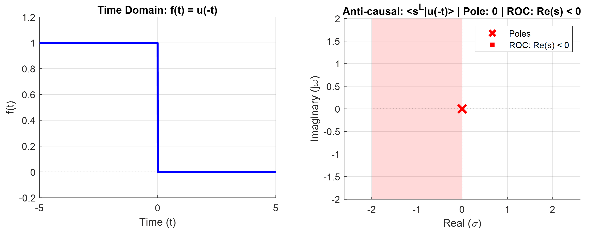


    
$$
\int_{-\infty}^{0}dt\left\lbrack e^{-st}\right\rbrack=-\frac{1}{s},\quad
\text{ROC: } \operatorname{Re}\lbrace s \rbrace < 0
$$

극점은 0에서 존재한다. 이 때, ROC는 좌측영역에서 형성된다. 이 극점을 포함한 허수축에서 분포 수렴을 확인한다.

$$
\lim_{\sigma\to 0}\langle s^L|u(-t)\rangle
=\lim_{\sigma\to 0}\left\langle s^L\middle|\frac{1}{2}-\frac{1}{2}\text{sgn}\right\rangle
=\pi\delta(\omega)-\operatorname{p.v.}\left(\frac{1}{i\omega}\right),\quad
\text{ROC: } \operatorname{Re}\lbrace s \rbrace=0
$$



**3-1) cosine 함수, 분포**

$$
\langle s^L|\cos at\rangle=\pi\delta(\omega-a)+\pi\delta(\omega+a),\quad\text{분포 ROC: }\operatorname{Re}\left\lbrace s\right\rbrace=0
$$


    
위의 cosine 예에서 겹치는 ROC 영역이 없으므로, 표준 라플라스 변환은 존재하지 않는다. 또한 직관적으로보면, 적분은 발산한다.

그럼에도 불구하고, <b>분포(Distribution)의 영역에서는 양방향 라플라스 변환이 존재</b>한다.

$$
\left\langle s^L|\cos at\right\rangle
= \left\langle s^L \middle|\frac{1}{2}\left(e^{+iat}+e^{-iat}\right)\right\rangle
=\frac{1}{2} \left\langle s^L \middle|e^{+iat}\right\rangle+\frac{1}{2} \left\langle s^L \middle|e^{-iat}\right\rangle
$$

$$
=\frac{1}{2} \left\langle (s-ia)^L \middle|1\right\rangle+\frac{1}{2} \left\langle (s+ia)^L \middle|1\right\rangle
$$

$$
=\pi\delta(\omega-a)+\pi\delta(\omega+a),\quad
\text{ROC: } \operatorname{Re}\lbrace s \rbrace=0
$$



**3-2) cosine 함수**

$$
\langle s^L|\cos at\cdot u(t)\rangle
=\frac{s}{s^2+a^2},\quad
\text{표준 ROC: } \operatorname{Re}\lbrace s \rbrace>0
$$

$$
\langle s^L|\cos at\cdot u(t)\rangle
=\frac{\pi}{2}\delta(\omega+a)+\frac{\pi}{2}\delta(\omega-a)-\frac{i\omega}{\omega^2-a^2},
\quad\text{분포 ROC: } \operatorname{Re}\lbrace s \rbrace=0
$$

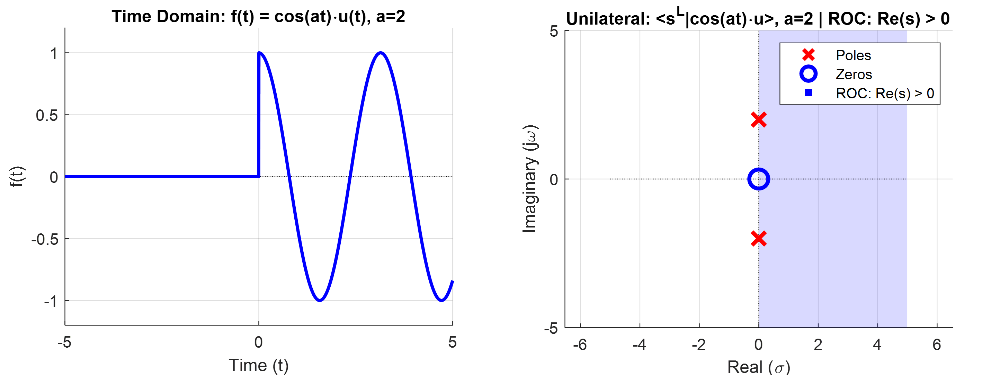


    
$$
\int_0^{\infty}dt\left\lbrack\cos at\cdot e^{-st}\right\rbrack=\operatorname{Re}\left\lbrace\int_0^{\infty}dt\left\lbrack e^{iat}\cdot e^{-st}\right\rbrack\right\rbrace
$$
    
$$
=\operatorname{Re}\left\lbrace\int_0^{\infty}dt\left\lbrack e^{-\left(s-ia\right)t}\right\rbrack\right\rbrace=\frac{s}{s^2+a^2},\quad
\text{ROC: } \operatorname{Re}\lbrace s \rbrace>0
$$

극점은 $\pm ia$ 이다. 이 때, ROC 는 우측영역에서 형성된다. 이 극점을 포함한 허수축에서 분포 수렴을 확인한다.

$$
\langle s^L|\cos at\cdot u\rangle
=\left\langle s^L\middle|\frac{1}{2}(e^{iat}\cdot u+e^{-iat}\cdot u)\right\rangle
=\frac{1}{2}\left\langle (s+ia)^L\middle|u\right\rangle+\frac{1}{2}\left\langle (s-ia)^L\middle|u\right\rangle
$$

$$
=\frac{\pi}{2}\delta(i\omega+ia)+\frac{1}{2i(\omega+a)}+\frac{\pi}{2}\delta(i\omega-ia)+\frac{1}{2i(\omega-a)} 
$$

$$
=\frac{\pi}{2}\delta(\omega+a)+\frac{\pi}{2}\delta(\omega-a)-\frac{i\omega}{\omega^2-a^2},\quad\text{ROC: } \operatorname{Re}\lbrace s \rbrace=0
$$



**3-3) cosine 함수**

$$
\langle s^L|\cos at\cdot u(-t)\rangle
=-\frac{s}{s^2+a^2},\quad\text{표준 ROC: } \operatorname{Re}\lbrace s \rbrace<0
$$

$$
\langle s^L|\cos at\cdot u(-t)\rangle
=\frac{\pi}{2}\delta(\omega+a)+\frac{\pi}{2}\delta(\omega-a)+\frac{i\omega}{\omega^2-a^2},\quad\text{분포 ROC: } \operatorname{Re}\lbrace s \rbrace=0
$$

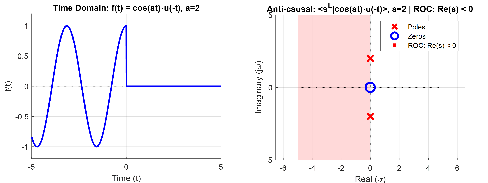

    
$$
F(s)=\int_{-\infty}^0 dt\left\lbrack\cos at\cdot e^{-st}\right\rbrack
=\operatorname{Re}\left\lbrace\int_{-\infty}^0 dt\left\lbrack e^{iat}\cdot e^{-st}\right\rbrack\right\rbrace
$$
    
$$
=\operatorname{Re}\left\lbrace\int_{-\infty}^0 dt\left\lbrack e^{-\left(s-ia\right)t}\right\rbrack\right\rbrace
=-\frac{s}{s^2+a^2},\quad
\text{ROC: } \operatorname{Re}\lbrace s \rbrace<0
$$

극점은 $\pm ia$ 이다. 이 때, ROC 는 좌측영역에서 형성된다. 이 극점을 포함한 허수축에서 분포 수렴을 확인한다.

$$
\langle s^L|\cos at\cdot u(-t)\rangle
=\left\langle s^L\middle|\frac{1}{2}(e^{iat}\cdot u(-t)+e^{-iat}\cdot u(-t))\right\rangle
$$

$$
=\frac{1}{2}\left\langle (s+ia)^L\middle|u(-t)\right\rangle+\frac{1}{2}\left\langle (s-ia)^L\middle|u(-t)\right\rangle
$$

$$
=\frac{\pi}{2}\delta(i\omega+ia)-\frac{1}{2i(\omega+a)}+\frac{\pi}{2}\delta(i\omega-ia)-\frac{1}{2i(\omega-a)} 
$$

$$
=\frac{\pi}{2}\delta(\omega+a)+\frac{\pi}{2}\delta(\omega-a)+\frac{i\omega}{\omega^2-a^2},\quad\text{ROC: } \operatorname{Re}\lbrace s \rbrace=0
$$



**4-1) sine 함수**

$$
\langle s^L|\sin at\cdot u(t)\rangle
$$

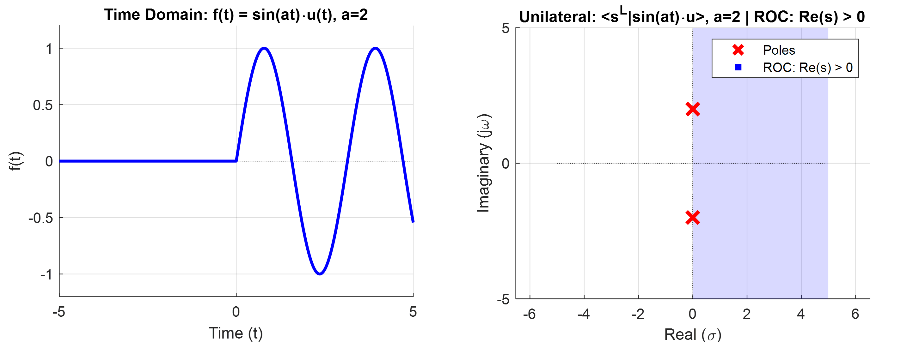


    
$$
\int_0^{\infty}dt\left\lbrack\sin at\cdot e^{-st}\right\rbrack=\operatorname{Im}\left\lbrack\int_0^{\infty}dt\left\lbrace e^{iat}\cdot e^{-st}\right\rbrack\right\rbrace
$$
    
$$
=\operatorname{Im}\left\lbrace\int_0^{\infty}dt\left\lbrack e^{-\left(s-ia\right)t}\right\rbrack\right\rbrace=\frac{a}{s^2+a^2},\quad
\text{ROC: } \operatorname{Re}\lbrace s \rbrace>0
$$

극점은 $\pm ia$ 이다. 이 때, ROC 는 우측영역에서 형성된다.



**4-2) sine 함수**

$$
\langle s^L|\sin at\cdot u(-t)\rangle
$$


    
$$
\int_{-\infty}^{0}dt\left\lbrack\sin at\cdot e^{-st}\right\rbrack=\operatorname{Im}\left\lbrack\int_{-\infty}^{0}dt\left\lbrace e^{iat}\cdot e^{-st}\right\rbrack\right\rbrace
$$
    
$$
=\operatorname{Im}\left\lbrace\int_{-\infty}^{0}dt\left\lbrack e^{-\left(s-ia\right)t}\right\rbrack\right\rbrace=-\frac{a}{s^2+a^2},\quad
\text{ROC: } \operatorname{Re}\lbrace s \rbrace<0
$$

극점은 $\pm ia$ 이다. 이 때, ROC 는 좌측영역에서 형성된다.  



**4-3) sine 함수, 분포**

$$
\langle s^L|\sin at\rangle
$$

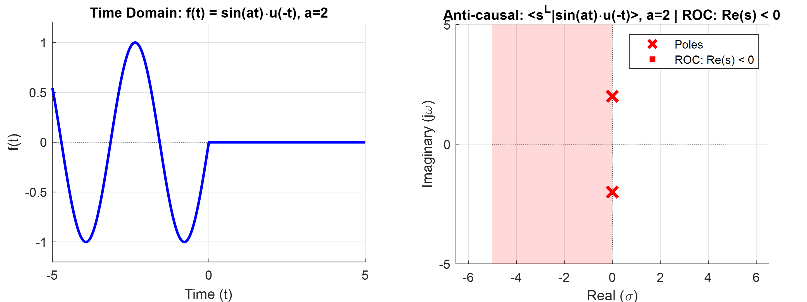


    
위의 cosine 예에서 겹치는 ROC 영역이 없으므로, 표준 라플라스 변환은 존재하지 않는다. 또한 직관적으로보면, 적분은 발산한다.

그럼에도 불구하고, <b>분포(Distribution)의 영역에서는 양방향 라플라스 변환이 존재</b>한다.

$$
\left\langle s^L|\sin at\right\rangle
= \left\langle s \middle|\frac{1}{2i}\left(e^{+iat}-e^{-iat}\right)\right\rangle
=\frac{1}{2i} \left\langle s^L\middle|e^{+iat}\right\rangle-\frac{1}{2i}\left\langle s^L\middle|e^{-iat}\right\rangle
$$

$$
=\frac{1}{2i}\left\langle (s-ia)^L\middle|1\right\rangle-\frac{1}{2i} \left\langle (s+ia)^L \middle|1\right\rangle
$$

$$
=-i\pi\delta(s-ia)+i\pi\delta(s+ia),\quad
\text{ROC: } \operatorname{Re}\lbrace s \rbrace=0
$$



**5-1) cosh 함수**

$$
\langle s^L|\cosh at\cdot u(t)\rangle
$$

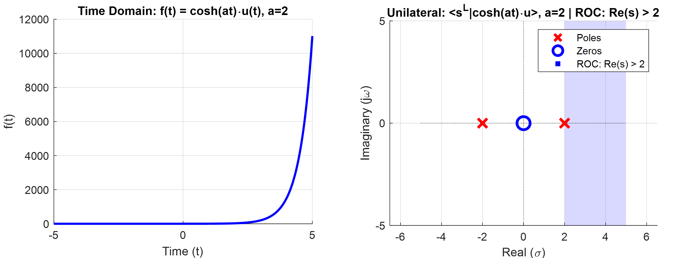


    
$$
\int_0^{\infty}dt\left\lbrack e^{-st}\cosh at\right\rbrack
=\int_0^{\infty}dt\left\lbrack e^{-st}\cdot\frac{e^{+at}+e^{-at}}{2}\right\rbrack
$$
    
$$
=\frac{1}{2}\int_0^{\infty}dt\left\lbrack e^{-(s-a)t}+e^{-(s+a)t} \right\rbrack
=\frac{s}{s^2-a^2},\quad
\text{ROC: } \operatorname{Re}\lbrace s \rbrace>|\operatorname{Re}\lbrace a\rbrace|
$$

극점은 $\pm a$ 이다. 이 때, ROC 는 $|\operatorname{Re}\lbrace a\rbrace|$ 보다 큰 우측영역에서 형성된다. 



**5-2) cosh 함수**

$$
\langle s^L|\cosh at\cdot u(-t)\rangle
$$


    
$$
\int_{-\infty}^{0}dt\left\lbrack e^{-st}\cosh at\right\rbrack
=\int_{-\infty}^{0}dt\left\lbrack e^{-st}\cdot\frac{e^{+at}+e^{-at}}{2}\right\rbrack
$$
    
$$
=\frac{1}{2}\int_{-\infty}^{0}dt\left\lbrack e^{-(s-a)t}+e^{-(s+a)t} \right\rbrack
=-\frac{s}{s^2-a^2},\quad
\text{ROC: } \operatorname{Re}\lbrace s \rbrace<-|\operatorname{Re}\lbrace a\rbrace|
$$

극점은 $\pm a$ 이다. 이 때, ROC 는 $-|\operatorname{Re}\lbrace a\rbrace|$ 보다 작은 좌측영역에서 형성된다. 



**5-3) cosh 함수, 분포**

$$
\langle s^L|\cosh at\rangle
$$

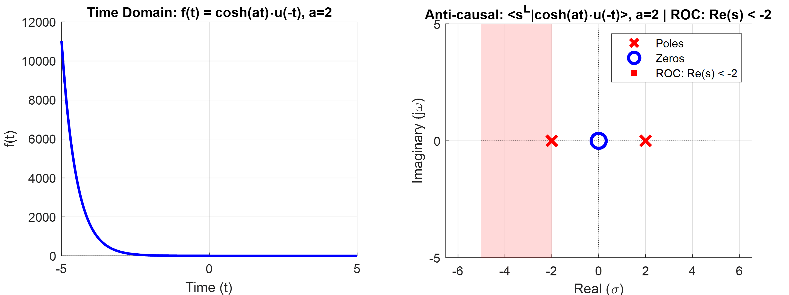


    
위의 cosh 에서 겹치는 ROC 영역이 없으므로, 표준 라플라스 변환은 존재하지 않는다. 또한 직관적으로보면, 적분은 발산한다.

그럼에도 불구하고, <b>분포(Distribution)의 영역에서는 양방향 라플라스 변환이 존재</b>한다.

$$
\left\langle s^L|\cosh at\right\rangle
= \left\langle s^L \middle|\frac{1}{2}\left(e^{+at}+e^{-at}\right)\right\rangle
=\frac{1}{2} \left\langle s^L \middle|e^{+at}\right\rangle+\frac{1}{2} \left\langle s^L \middle|e^{-at}\right\rangle
$$

$$
=\frac{1}{2} \left\langle (s-a)^L \middle|1\right\rangle+\frac{1}{2} \left\langle (s+a)^L \middle|1\right\rangle
$$

$$
=\pi\delta(s-a)+\pi\delta(s+a),\quad
\text{ROC: } 공집합
$$

 

여기서 중요한 것은 ROC 가 존재하지 않는다. 따라서, 위에서 구한 라플리스 변환은 아무런 의미가 없으며, 라플라스 변환은 존재하지 않는다.



**6-1) sinh 함수**

$$
\langle s^L|\sinh at\cdot u(t)\rangle
$$

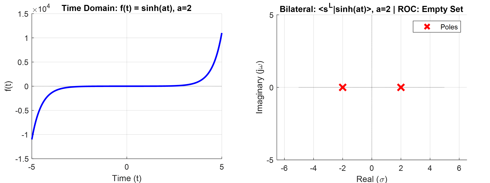


    
$$
\int_0^{\infty}dt\left\lbrack e^{-st}\sinh at\right\rbrack
=\int_0^{\infty}dt\left\lbrack e^{-st}\cdot\frac{e^{+at}-e^{-at}}{2}\right\rbrack
$$
    
$$
=\frac{1}{2}\int_0^{\infty}dt\left\lbrack e^{-(s-a)t}-e^{-(s+a)t} \right\rbrack
=\frac{a}{s^2-a^2},\quad
\text{ROC: } \operatorname{Re}\lbrace s \rbrace>|\operatorname{Re}\lbrace a\rbrace|
$$

극점은 $\pm a$ 이다. 이 때, ROC 는 $|\operatorname{Re}\lbrace a\rbrace|$ 보다 큰 우측영역에서 형성된다.  



**6-2) sinh 함수**

$$
\langle s^L|\sinh at\cdot u(-t)\rangle
$$

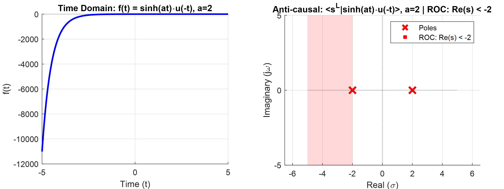


    
$$
\int_{-\infty}^{0}dt\left\lbrack e^{-st}\sinh at\right\rbrack
=\int_{-\infty}^{0}dt\left\lbrack e^{-st}\cdot\frac{e^{+at}-e^{-at}}{2}\right\rbrack
$$
    
$$
=\frac{1}{2}\int_{-\infty}^{0}dt\left\lbrack e^{-(s-a)t}-e^{-(s+a)t} \right\rbrack
=-\frac{a}{s^2-a^2},\quad
\text{ROC: } \operatorname{Re}\lbrace s \rbrace<-|\operatorname{Re}\lbrace a\rbrace|
$$

극점은 $\pm a$ 이다. 이 때, ROC 는 $-|\operatorname{Re}\lbrace a\rbrace|$ 보다 작은 좌측영역에서 형성된다.



**6-3) sinh 함수, 분포**

$$
\langle s^L|\sinh at\rangle
$$


    
위의 cosh 에서 겹치는 ROC 영역이 없으므로, 표준 라플라스 변환은 존재하지 않는다. 또한 직관적으로보면, 적분은 발산한다.

그럼에도 불구하고, <b>분포(Distribution)의 영역에서는 양방향 라플라스 변환이 존재</b>한다.

$$
\left\langle s|\sinh at\right\rangle
=\left\langle s \middle|\frac{1}{2}\left(e^{+at}-e^{-at}\right)\right\rangle
=\frac{1}{2} \left\langle s \middle|e^{+at}\right\rangle-\frac{1}{2} \left\langle s \middle|e^{-at}\right\rangle
$$

$$
=\frac{1}{2} \left\langle s-a\middle|1\right\rangle-\frac{1}{2} \left\langle s+a \middle|1\right\rangle
$$

$$
=\pi\delta(s-a)-\pi\delta(s+a),\quad
\text{ROC: } 공집합
$$

 

여기서 중요한 것은 ROC 가 존재하지 않는다. 따라서, 위에서 구한 라플리스 변환은 아무런 의미가 없으며, 라플라스 변환은 존재하지 않는다.



---

### 4. 라플라스 변환, 분포 라플라스 변환, ROC 관계 요약

**1) ROC (수렴 영역)**

-   **가장 중요:** 라플라스 변환 적분 $\int_{-\infty}^{\infty} dt [e^{-st}f(t)]$ 가 **수렴하는 복소 평면의 $s$ 값들의 집합**.
-   여기서 수렴은 **표준적인 수렴**일 수도, **분포적인 수렴**일 수도 있다.

**2) 표준 라플라스 변환**

-   정의: 적분이 **표준적인 의미로 수렴**할 때의 변환.
-   대상: 주로 시간 무한대에서 지수적으로 감쇠하는 신호.
-   **ROC 형태: 항상 열린 영역 (띠 또는 반평면).**

**3) 분포 라플라스 변환**

-   정의: 표준 적분이 어떤 열린 영역에서도 수렴하지 않는 신호들을 다루기 위해 **분포 개념을 확장하여 정의된 변환**.
-   대상: 표준 LT가 어려운 신호 (상수, 진동, 임펄스, 성장 신호 등) 포함.
-   **존재:** 표준 LT보다 넓은 범위의 신호에 대해 존재함이 보장됨.

**4) 핵심 관계: 신호, ROC, 변환 형태**

-   **ROC의 의미:** 근본적으로는 **원래 라플라스 변환 적분이 수렴하는 영역** (표준적 수렴이든 분포적 수렴이든)
-   ROC 형태가 신호와 변환 성질을 알려준다.
-   **(A) 신호가 지수적으로 감쇠 (또는 유한 길이)**
    -   **ROC:** **열린 영역** (표준 수렴).
    -   변환: 표준 LT 존재 (ROC에서 해석 함수). 분포 LT도 존재.
    -   FT: ROC에 허수축 포함 시 존재.

-   **(B) 신호가 진동 또는 상수 (성장 안함)**
    -   **ROC:** **특정 선 (예: $\operatorname{Re}\lbrace s\rbrace=0$)** (분포적 수렴).
    -   변환: 표준 LT는 열린 ROC 없음. **분포 LT는 존재**. 결과는 선 위 함수 또는 $s$ 영역 분포.
    -   FT: ROC가 $\operatorname{Re}\lbrace s\rbrace=0$ 인 것 **<=> 분포 푸리에 변환 존재**.

-   **(C) 신호가 지수적으로 성장**
    -   **ROC:** **열린 영역 (허수축 미포함)** (표준 수렴) **또는 공집합** (양쪽 성장).
    -   변환: 단방향 성장은 표준 LT 존재. 양방향 성장(실수 cosh/sinh)은 표준 LT 없음. **분포 LT는 존재**하나, ROC는 그대로 (허수축 미포함 또는 공집합).
    -   **FT:** **존재 안 함**.

**5) 결론**

-   ROC는 **라플라스 변환 적분(표준 또는 분포적)이 유효한 영역**
-   분포 LT에서도 ROC는 중요하며, **ROC 형태는 신호 시간 특성 및 FT 존재/형태의 핵심 정보**
-   분포 LT는 표준 LT가 안 되는 신호까지 다루게 해주는 도구이며, ROC는 그 이해의 열쇠

