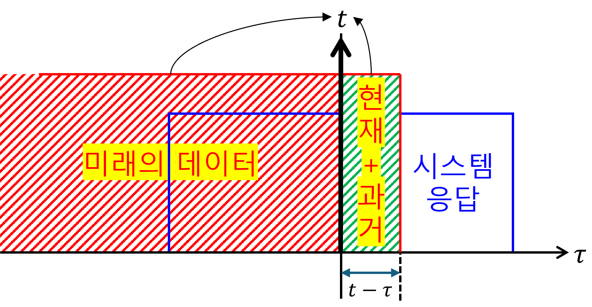

+++
title = "(b) Causality"
weight = 3
+++

---

### 1. LSI vs. LSI+causality

- **LSI**: **L**inearity(선형성) + **S**hift 
**I**nvarient(이동 불변) 의 축약어 이다.
- **LSI+causality**: LSI 특성 + causality(인과성) 이다.

모든 선형 시스템이 causality 특성을 가지는것이 아니라는 의미이다. 예로, 이상적인 필터는 LSI 특성을 가지지만, 비인과적이다.

---

### 2. Causality(인과성)

인과성은 시스템의 또 다른 중요한 특성이다. 인과적인(causal) **시스템은 현재의 출력이 오직 현재 또는 과거의 입력에 의해서만 결정되는 시스템**을 말한다. 미래의 입력이 현재 출력에 영향을 미치지 않는다. 

대부분의 실제 물리 시스템은 인과적이다. 소리가 들리는 것은 소리가 발생한 이후에만 가능하며, 미리 소리를 들을 수는 없다.

물론 비인과적 시스템 또한 존재한다. 고급 노이즈 제거 알고리즘(필터)은 수학적으로 '현재 시점의 소리에서 노이즈를 완벽하게 제거하려면, 현재 시점 이후의 소리 패턴(미래 정보)까지 알아야 한다.' 여기에서 중요한건 **관측시점=현재시점** 인 것이다.

---

### 3. LTI system + Causality

LTI 시스템의 경우, 인과성은 임펄스 응답 $h(t)$의 특성으로 나타난다. 인과적인 LTI 시스템의 임펄스 응답은 **$t < 0$ 인 모든 시간에서 0이어야 한다.** convolution의 교환법칙을 사용하면 위 조건을 쉽게 증명할 수 있다. 아래는 교환법칙이 적용된 식을 그림으로 표현하였다.

$$
y(t)
=x(t)\ast h(t)
=h(t)\ast x(t)
=\int_{-\infty}^{\infty}d\tau\left[h(\tau)x(t-\tau)\right]
$$

수학적으로 엄밀한 증명 보다는 위의 그림으로 직관적으로 이해할 수 있다. 인과성을 만족하려면, 미래의 응답이 현재에 영향을 주면 안 된다. 따라서, 

$$
h(t) = 0, \text{for } t < 0
$$

---

### 4. Practice

(1) $y(t)=x(3t)$, non-causal

(2) $y(t)=x(t)\cos(3t)$, causal

(3) $y(t)=x(t)\cos(t+1)$, causal

(4) $y(t)=x(-t)$, non-causal

