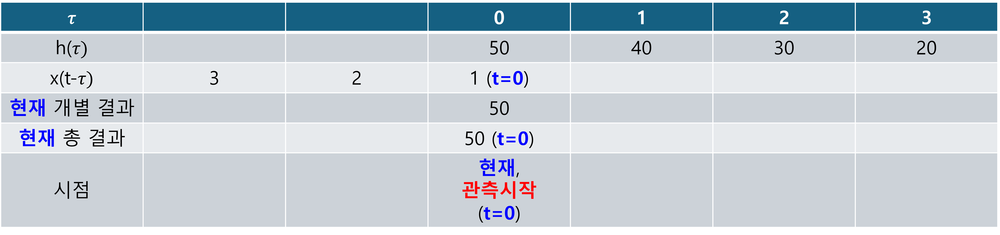
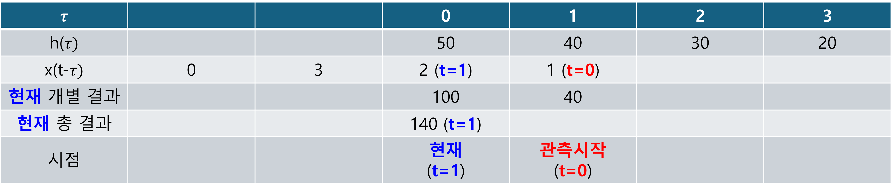
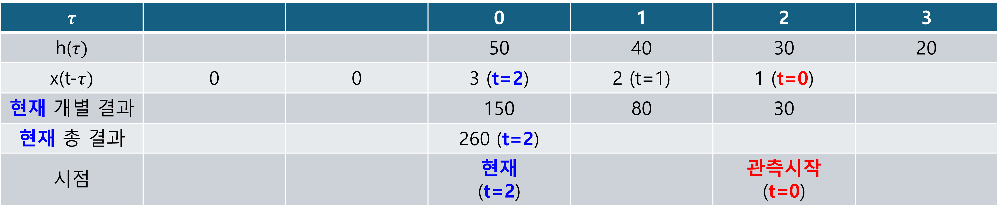
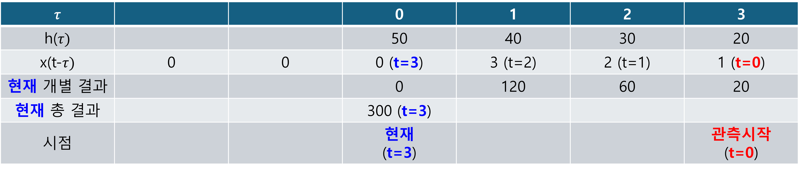

+++
title = "(b) Convolution"
weight = 2.5
+++

---

### 1. Convolution

- **(이전입력+현재입력+미래입력)의 현재상태**: convolution for LSI + non-causal 
- **(이전입력+현재입력)의 현재상태**: convolution for LSI + causal 

$$
y\left(t\right)=x\left(t\right)\ast h\left(t\right)
=h\left(t\right)\ast x\left(t\right)
=\int_{-\infty}^{\infty}d\tau\left[h\left(t-\tau\right)x\left(\tau\right)\right]
=\int_{-\infty}^{\infty}d\tau\left[x\left(t-\tau\right)h\left(\tau\right)\right]
$$

---

### 2. 숫자(리스트)와 그림으로 이해하는 컨볼루션

수학적으로 표현(절차)하면, 다음과 같다.

**(1) 시간에 대한 시스템 응답을, 리스트화 한다.**

$$
h\left(t\right)\rightarrow h\left(\tau\right)
$$

**(2) input을, 리스트화 한다. 그 다음, 처음 intput이 시스템에 들어가야 하므로 filp 시킨다.**

$$
x\left(t\right)\rightarrow x\left(\tau\right)\rightarrow x\left(-\tau\right)
$$

**(3) 리스트화 된 input을 시간에 따라, 오른쪽으로 shift 하면서 시스템 응답과 곱한다.**

$$
h\left(\tau\right)x\left(t-\tau\right)
$$

**(4) 곱해진 각 개별 결과를 더한다.**

$$
y\left(t\right)=\int_{-\infty}^{\infty}d\tau\left[h\left(t-\tau\right)x\left(\tau\right)\right]
$$

---

### 3. Impulse response

임펄스 응답 $h(t)$는 시스템 $\mathcal{H}$에 **순간적인 충격(임펄스 $\delta(t)$)을 가했을 때 나오는 출력**을 말한다.

$$
\langle t|\delta\ast h\rangle
=\delta(t)\ast h(t)
=\int^{\infty}_{-\infty} d\tau \delta(t-\tau) h(\tau)
=h(t)
$$

위 식을 잘 살펴보면, '$\delta(t)\ast$' 는 **어떠한 함수(시스템)를 sampling 하는 연산자**라는 것을 알수 있다.

이 $h(t)$가 시스템 전체를 '대표'하고 모든 입력에 대한 출력을 예측하는 데 사용될 수 있는 것은 **오직 LTI(선형 시불변) 시스템의 경우에만 해당**한다.

* **LTI 시스템의 경우:** 임펄스 응답 $h(t)$는 시스템의 모든 특성을 담고 있어, 어떤 입력 $x(t)$가 들어오더라도 출력 $y(t)$를 **합성곱**($x(t) \ast h(t)$)으로 **정확히 예측**할 수 있다. 이것이 LTI 시스템의 핵심이다.
* **LTI 시스템이 아닌 경우:** 임펄스 입력에 대한 출력이 나타나긴 하지만, 이 출력이 $h(t)$처럼 시스템 전체를 대표하거나 다른 입력에 대한 출력을 합성곱으로 예측하는 데 사용될 수는 없다.

---

**example1)** 

$$
x\left(t\right)\ast h\left(t\right)=y\left(t\right)
$$

아래의 convolution 결과를 y로 표현하라.

$$
x\left(t-t_1\right)\ast h\left(t-t_2\right)
$$



$$
\int_{-\infty}^{\infty} d\tau \left[ x\left(t-\tau-t_1\right) h\left(\tau-t_2\right) \right]
$$

$k=\tau-t_2$ 라고 하면,

$$
d\tau=dk
$$

따라서,

$$
\int_{-\infty}^{\infty} dk \left[ x\left(t-k-t_1-t_2\right) h\left(k\right) \right]
$$

$$
=y\left(t-t_1-t_2\right)
$$





$h$는 $t_2$ 만큼 시간 지연, x는 $t_1$ 만큼 시간 지연이 발생되었다. 따라서, convolution 의 결과인 총 시간 지연은 $t_1+t_2$ 이다.



**example2)**

$$
x\left(t\right)\ast\delta\left(at+b\right)
$$



$$
\int_{-\infty}^{\infty} d\tau \left[ x\left(t-\tau\right) \delta\left(a\tau+b\right) \right]
$$

$k=a\tau+b$ 라고 하면,

$$
dk=a d\tau
$$

따라서,

$$
\int_{-\infty}^{\infty} \frac{1}{a} dk \left[ x\left(t-\frac{k}{a}+\frac{b}{a}\right) \delta\left(k\right) \right]
$$

$$
=\frac{1}{a}x\left(t+\frac{b}{a}\right)
$$





디렉델타의 시간 압축/확장 특성을 이용한다.

$$
x\left(t\right)\ast\delta\left(at+b\right)=x\left(t\right)\ast\frac{1}{\left|a\right|}\delta\left(t+\frac{b}{\left|a\right|}\right)
=\frac{1}{\left|a\right|}x\left(t+\frac{b}{\left|a\right|}\right)
$$



**example3)**

$$
x\left(-t\right)\ast\delta\left(-t-t_0\right)
$$



$$
\int_{-\infty}^{\infty} d\tau \left[ x\left(-t+\tau\right) \delta\left(-\tau-t_0\right) \right]
$$

$k=-\tau-t_0$ 라고 하면,

$$
dk=- d\tau
$$

따라서,

$$
\int_{-\infty}^{\infty} -dk \left[ x\left(-t-k-t_0\right) \delta\left(k\right) \right]
$$

$$
=x\left(-t-t_0\right)
$$





디렉 델타 함수의 대칭 특성을 이용한다.

  

$$
x\left(-t\right)\ast\delta\left(-t-t_0\right)=x\left(-t\right)\ast\delta\left(t+t_0\right)
=x\left(-t-t_0\right)
$$



**example4)** 

$$
x\left(t\right)=3\operatorname{rect}\left(\frac{t}{\tau}\right)
=3u\left(t+\frac{\tau}{2}\right)-3u\left(t-\frac{\tau}{2}\right)
$$

$$
x\left(t\right)\ast h\left(t\right)=x\left(3t-2\right)
$$

를 만족하는, h(t)를 구하여라.



푸리에 변환을 사용하여 풀 수 있다.

  

$$
\langle \omega|x\ast h\rangle
=\langle\omega|x(3t-2)\rangle
$$

오른쪽 항

$$
\langle\omega|x(3t-2)\rangle
=e^{-i\frac{2}{3}\omega}\langle\omega|x(3t)\rangle
=\frac{1}{3}e^{-i\frac{2}{3}\omega}\left\langle\frac{\omega}{3}\middle|x\right\rangle
$$

$$
\left\langle\frac{\omega}{3}\middle|x\right\rangle
=\left\langle\frac{\omega}{3}\middle|3u\left(t+\frac{\tau}{2}\right)-3u\left(t-\frac{\tau}{2}\right)\right\rangle
$$

$$
=3\left( e^{+i\frac{\tau}{6}\omega}
-e^{-i\frac{\tau}{6}\omega}\right)\left\langle\frac{\omega}{3}\middle|u\right\rangle
=9\left( e^{+i\frac{\tau}{6}\omega}
-e^{-i\frac{\tau}{6}\omega}\right)\left\langle\omega\middle|u\right\rangle
$$

$$
\langle\omega|x(3t-2)\rangle
=3e^{-i\frac{2}{3}\omega}\left( e^{+i\frac{\tau}{6}\omega}
-e^{-i\frac{\tau}{6}\omega}\right)\left\langle\omega\middle|u\right\rangle
$$

왼쪽항

$$
\langle \omega|x\ast h\rangle=\langle \omega|x\rangle\langle \omega|h\rangle
$$

$$
\langle\omega|x\rangle
=\left\langle\omega\middle|3u\left(t+\frac{\tau}{2}\right)-3u\left(t-\frac{\tau}{2}\right)\right\rangle
$$

$$
=3\left(e^{+i\frac{\tau}{2}\omega}
-e^{-i\frac{\tau}{2}\omega}\right)\left\langle\omega|u\right\rangle
$$

따라서,

$$
\langle \omega|x\rangle\langle \omega|h\rangle
=\langle\omega|x(3t-2)\rangle
$$

$$
3\left( e^{+i\frac{\tau}{2}\omega}
-e^{-i\frac{\tau}{2}\omega}\right)\left\langle\omega|u\right\rangle\langle \omega|h\rangle
=3e^{-i\frac{2}{3}\omega}\left(e^{+i\frac{\tau}{6}\omega}
-e^{-i\frac{\tau}{6}\omega}\right)\left\langle\omega\middle|u\right\rangle
$$

$$
\langle \omega|h\rangle
=e^{-i\frac{2}{3}\omega}\cdot\frac{e^{+i\frac{\tau}{6}\omega}
-e^{-i\frac{\tau}{6}\omega}}{e^{+i\frac{\tau}{2}\omega}
-e^{-i\frac{\tau}{2}\omega}}
=e^{-i\tau\omega}\cdot\frac{1
-e^{-i\frac{\tau}{3}\omega}}{1
-e^{-i\tau\omega}}
$$

매크로니 급수를 사용한다.

$$
\frac{1}{1-e^{-i\tau\omega}}
=\sum_{n=0}e^{-in\tau\omega}
$$

$$
\langle \omega|h\rangle
=e^{-i\tau\omega}\left(e^{-i\frac{\tau}{3}\omega}-e^{-i\frac{2}{3}\tau\omega}\right)\sum_{n=0}e^{-in\tau\omega}
=\sum_{n=0}\left[e^{-i\left(\frac{4}{3}+n\right)\tau\omega}-e^{-i\left(\frac{5}{3}+n\right)\tau\omega}\right]
$$

역 푸리에 변환을 수행한다.

$$
\langle t|H(\omega)\rangle
=\sum_{n=0}\left[\left\langle t\middle|e^{-i\left(\frac{4}{3}+n\right)\tau\omega}\right\rangle
-\left\langle t\middle|e^{-i\left(\frac{5}{3}+n\right)\tau\omega}\right\rangle\right]
$$

$$
=\sum_{n=0}\left[\left\langle t-\left(\frac{4}{3}+n\right)\tau\middle|1\right\rangle
-\left\langle t-\left(\frac{5}{3}+n\right)\tau\middle|1\right\rangle\right]
$$

$$
=\sum_{n=0}\left[\delta\left\lbrace t-\left(\frac{4}{3}+n\right)\tau\right\rbrace -\delta\left\lbrace t-\left(\frac{5}{3}+n\right)\tau\right\rbrace\right]
$$



---

[Convolution - Wikipedia](https://en.wikipedia.org/wiki/Convolution)