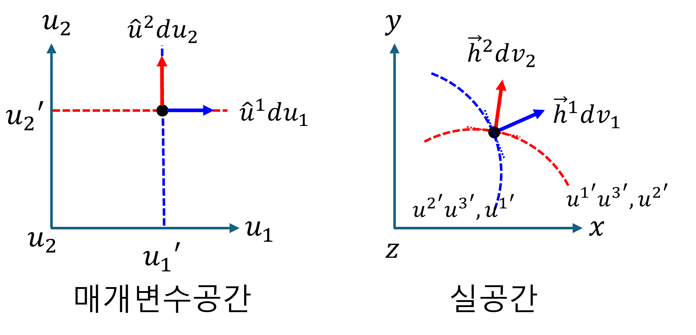
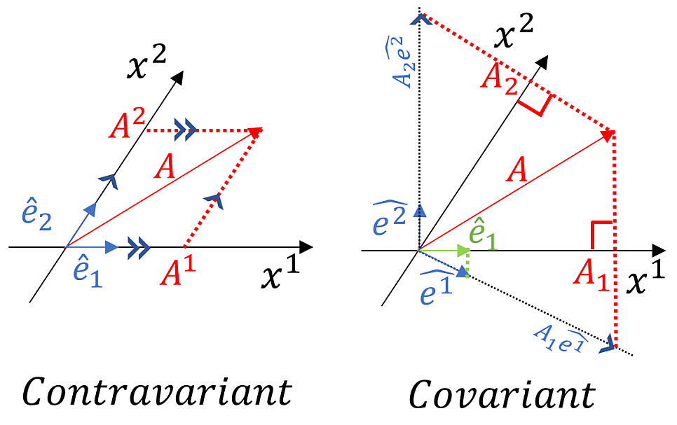

+++
title = "(a) Covariant and contravariant"
weight = 1
+++

---

이전 챕터에서는 매개변수공간(데카르트 좌표계로 간주)에서 단위 기저 벡터에 대해서 다루었다. 그러나 **모든 기저가 직교하지 않을 수도 있으며, 그 크기가 1이 아닐 수도 있다.**

여기에서는 실공간의 일반 좌표계에서 기하학적 텐서를 표현하는 새로운 방식을 소개한다. **orthogonal coordinates** 에 대한 기본적인 이해가 있다면 학습에 도움이 될 것이다

---

### 1. 벡터의 표현

**일반 좌표계에서 벡터의 "좌표값"은 벡터를 해당 좌표축 벡터의 방향으로 평행하게 분해했을 때의 각 축에 대한 스케일링 계수** 이다. suffix notation을 사용하여, 일반좌표계에서 벡터표현은 다음과 같다.

$$
\vec{v}=v^{i}\vec{h}_i=v_i\vec{h}^i
$$

- $\vec{h}_i$는 자연 기저 벡터 (natural base vectors) 라고 한다. 또는 **공변기저벡터** 라고 한다.
- $v^i$ 는 성분을 나타내며, 이것을 $\vec{v}$ 의 contravariant(반변) 성분이라고 한다.
- $\vec{h}^i$는 역 기저 벡터 (reciprocal base vectors) 라고 한다. 또는 **반변기저벡터** 라고 한다.
- $v_i$ 는 성분을 나타내며, 이것을 $\vec{v}$ 의 covariant(공변) 성분이라고 한다.

---

### 2. 공변기저벡터

아래 2가지 관점은 동등하며, 서로를 통해 완전한 의미를 가진다. **관점 1**은 q좌표계의 기하학적 틀을 제공한다. **관점 2**는 그 기하학적 틀 위에서, 물리적 대상을 어떻게 분석하고 표현할 것인지에 대한 도구를 제공한다.

**[관점 1] 매개변수 공간($q$)에서 실공간으로의 매핑**

데카르트 좌표계처럼 다룰 수 있는 매개변수 공간의 미소변위벡터($d\vec{q}$)는 아래와 같이 표현할 수 있다. 여기에서, $\hat{q}_j$가 $\hat{e}_k$ 와 같은 물리적 공간의 벡터가 아니라, 매개변수 공간 내에서 $q^j$ 축 방향의 단위 변화를 나타내는 **추상적인 기저 벡터** 이다.

$$
d\vec{q}=dq^j\hat{q}_j
$$

이제, $d\vec{q}$를 실공간의 벡터 $d\vec{x}$로 mapping 한다.

$$
d\vec{x}
=(d\vec{q}\cdot\nabla)\vec{x}
=dq^j\partial_j\vec{x}
$$

여기에서의 $\vec{x}$는 매개변수공간의 위치벡터 $\vec{q}$ 가 실공간으로 매핑되었을 때, 실공간의 위치벡터를 의미한다.

$$
\vec{x}
=x^k(q^1,q^2,q^3)\hat{e}_k
$$

실공간의 위치벡터 $\vec{x}$를 대입하면,

$$
d\vec{x}
=dq^j\partial_jx^k\hat{e}_k
=dq^j\frac{\partial x^k}{\partial q^j}\hat{e}_k
$$

처음과 윗 식을 비교해보자. 매핑 관점에서, 매개변수 공간의 단위 벡터 $\hat{q}_j$ 가 실공간의 $\partial x^k/\partial q^j\hat{e}_k$ 로 매핑됨을 확인할 수 있다. 여기에서, **$\partial x^k/\partial q^j\hat{e}_k$를 공변기저벡터**라고 한다. 공변기저벡터의 기하학적 의미를 살펴보자. 위의 수식에서 매개변수 $q$가 변함에 따라, **실공간에서 궤적을 만들며, 이 궤적의 접선벡터가 공변기저 벡터**임을 알 수 있다.

$$
\hat{q}_j\to
\vec{g}_j=\frac{\partial x^k}{\partial q^j}\hat{e}_k
$$

**[관점 2] 동일 실공간에서 $q$좌표계로의 표현**

실공간의 데카르트 좌표계에서 원점으로부터 임의의 거리 만큼 떨어진 공간상의 한 점 P를 고려하면, 그 점에 대한 위치벡터는 다음과 같이 표현할 수 있다.

$$
\vec{x}=x^j\hat{e}_j
$$

점 P에서 미소변위벡터 $d\vec{x}$는 다음과 같다.

$$
d\vec{x}
=dx^j\hat{e}_j
$$

$q$ **좌표계에서 $d\vec{x}$를 표현하기 위함**이다. 다만, $q$ **좌표계의 기저를 우리가 익숙한 $\hat{e}_k$ (데카르트 기저)를 통해 '설명'** 하고 싶다. 따라서, 변환 텐서를 사용하여 데카르트 기저로 표현해 보자.

$$
d\vec{x}
=dq^j\vec{g}_j
=dq^jg_j^k\hat{e}_k
$$

위 식을 **관점 1**의 결과와 비교하면 아래와 같다.

$$
g^k_j
=\frac{\partial x^k}{\partial q^j}
$$

---

### 2. 역(반변)기저벡터

공변기저벡터의 경우, 매개변수공간의 (추상적인) 단위 기저벡터를 실공간으로 mapping된 궤적의 접선벡터라고 하였다. 이번에는 매개변수공간의 단위기저벡터를 등위면의 법선벡터라고 정의하자. 그러면, 실공간으로 mapping 하였을 때, mapping된 등위면이 생기며, 이 등위면의 법선 벡터를 반변기저벡터라고 한다.

**[관점 1] 매개변수 공간($q$)에서 실공간으로의 매핑**

실공간의 미소변위벡터 $d\vec{x}$를 매개변수공간의 $q^i$로 mapping 해 보자. 여기에서, 매개변수 공간의 (추상적) 단위 기저 벡터를 구하는 것은 의미가 없다. 왜냐하면, 이미 알고 있기 때문이다. mapping 된 각 단위 벡터의 성분은 아래와 같이 구할 수 있다. 

$$
dq^i
=d\vec{x}\cdot\nabla q^i
=dx^j\partial_jq^i
$$

여기에서, $\vec{g}^i=\nabla q^i$를 **반변기저벡터** 라고 한다. mapping 으로의 의미를 생각해보자. $\vec{g}^i\cdot$ 는 **매개변수공간의 성분(스칼라)으로 변환하는 연산자** 이다. 이것을 **쌍대공간의 기저**라고 볼 수 있다. 따라서, 아래와 같이 쓸 수 있다.

$$
dq^i
=d\vec{x}\cdot \vec{g}^i
$$

**[관점 2] 동일 실공간에서 $q$좌표계로의 표현**

점 P에서 미소변위벡터 $d\vec{x}$는 다음과 같다.

$$
d\vec{x}
=dx^j\hat{e}_j
$$

$q$ **좌표계에서 $d\vec{x}$를 표현하기 위함**이다. 다만, $q$ **좌표계의 기저를 우리가 익숙한 $\hat{e}_k$ (데카르트 기저)를 통해 '설명'** 하고 싶다. 따라서, 변환 텐서를 사용하여 데카르트 기저로 표현해 보자.

$$
d\vec{x}
=dq_j\vec{g}^j
=dq_jg_k^j\hat{e}_k
$$

위 식을 **관점 1**의 결과와 비교하면 아래와 같다.

$$
g_k^j
=\frac{\partial q^j}{\partial x^k}
$$

---

---

### 2. 공변기저벡터

**매개변수공간[u] → 실공간[v] 변환에 대한 설명**으로, 즉, Jacobian 에 대한 내용이다. Jacobian은 매개변수 공간의 미소변위벡터를 실 공간의 미소변위벡터로 변환(mapping)하는 연산자이다.

$$
d\vec{v}
=d\vec{u}\cdot\nabla_{u}\vec{v}
=du^i\frac{\partial\vec{v}}{\partial u^i}
=\vec{h}_idu^i
$$

여기에서, $\partial\vec{v}/\partial u^i$는 매개변수 $u^i$ 대한 벡터 궤적 $\vec{v}$ 의 **접선 벡터**를 의미하며, 이것이 **자연기저벡터(공변기저벡터)** $\vec{h}_i$를 의미한다.

---

### 3. 반변기저벡터

앞서, 매개변수공간[u] → 실공간[v] 변환할 때, 실공간의 기저(공변기저벡터)를 벡터 $\vec{v}$ 의 접선벡터로 정의하였다. 또 다른 관점으로는 매개변수공간의 $u^i$ 는 실공간의 $u^i$의 등위면을 만들어 낸다. **매개변수공간 $u^i$ 에서 실공간으로 mapping 된 등위면** '$u^i(v^1,v^2,v^3)=\text{상수}$'이다. 이 **등위면의 법선벡터를 기저로 정의**할 수 있다. 이것을 **반변기저벡터** $\vec{h}^i$ 라고 한다.

반변기저벡터 $\vec{h}^i$ 를 사용해 실공간에서의 미소변위벡터 $d\vec{v}$를 표현할 수 있다. $\vec{h}^i=\nabla_v u^i$ 이다. (여기서 $\nabla_v u^i$ 는 **스칼라 함수** $u^i$ 의 그래디언트)

$$
d\vec{v}=\vec{h}^idv_i=dv_i\nabla_v u^i
$$

여기에서 주의해야할 사항은, **$v_i$ 는 실공간에서 벡터를 반변 기저 벡터로 표현했을 때의 공변 성분이다.**

---

### 2. 반변기저벡터

공변기저벡터와 마찬가지로, 반변기저벡터 역시 아래 2가지 관점에서 동등하며, 서로를 통해 완전한 의미를 가진다. **관점 1**은 $q$좌표계의 기하학적 틀(특히 좌표면의 방향)을 제공한다. **관점 2**는 그 기하학적 틀 위에서, 물리적 대상을 어떻게 분석하고 표현할 것인지에 대한 도구를 제공한다.

**관점 1) 실공간($x$)에서 매개변수($q$)의 변화로의 매핑**

우리는 실공간의 미소변위벡터($d\vec{x}$)가 데카르트 기저 $\hat{e}_k$를 사용하여 다음과 같이 표현됨을 알고 있다.

$$d\vec{x}=dx^k\hat{e}_k$$

이제 이 실공간의 미소변위 $d\vec{x}$가 각 매개변수 $q^i$ 값(스칼라 함수)을 어떻게 변화시키는지 살펴보자. 각 $q^i$는 실공간의 위치($\vec{x}$)에 따라 변하는 스칼라 함수로 볼 수 있다: $q^i = q^i(\vec{x})$.

스칼라 함수 $q^i(\vec{x})$의 미소 변화 $dq^i$는 그레디언트(gradient)와 $d\vec{x}$의 내적을 통해 구할 수 있다. 이 관계는 $q^i$의 전미분으로부터 유도된다.

$$dq^i = \nabla q^i \cdot d\vec{x}$$

여기서 $\nabla q^i$는 스칼라 함수 $q^i$의 구배(gradient)이다. 구배는 스칼라 값이 가장 가파르게 증가하는 방향을 가리키는 벡터이며, **이 벡터는 실공간에 존재한다.** 이 $\nabla q^i$ 벡터를 **반변기저벡터(contravariant basis vector)**라고 정의한다.

$$\vec{g}^i \equiv \nabla q^i$$

이제 $\nabla q^i$를 실공간의 데카르트 기저 $\hat{e}_k$를 사용하여 표현해 보자. $\nabla$ 연산자는 $\frac{\partial}{\partial x^k}\hat{e}_k$ 이므로,

$$
\nabla q^i
=\frac{\partial q^i}{\partial x^k}\hat{e}_k
$$

따라서, 반변기저벡터는 다음과 같이 표현될 수 있다.

$$\vec{g}^i = \frac{\partial q^i}{\partial x^k}\hat{e}_k$$

반변기저벡터의 기하학적 의미를 살펴보자. $\nabla q^i$는 스칼라 함수 $q^i$의 등위면(level surface, $q^i=\text{상수}$)에 항상 수직인 벡터이다. 즉, **반변기저벡터는 $q^i$ 좌표면에 대한 법선 벡터**이다.

---

**관점 2) 공변기저벡터와의 쌍대성(Duality)을 통한 반변기저벡터의 이해**

우리는 실공간의 미소변위벡터 $d\vec{x}$를 $q$ 좌표계의 공변 성분($dx_i$)과 반변 기저 벡터($\vec{g}^i$)의 곱으로도 표현할 수 있다. 이는 $d\vec{x} = dx_i \vec{g}^i$와 같이 쓸 수 있다.

이때 반변기저벡터 $\vec{g}^i$는 공변기저벡터 $\vec{g}_j$와 매우 중요한 **쌍대 관계**를 가진다. 이 관계는 $dq^i = \nabla q^i \cdot d\vec{x}$ (관점 1의 핵심식)와 $d\vec{x} = dq^j \vec{g}_j$ (공변기저벡터 섹션의 결과)를 결합하여 유도할 수 있다.

$dq^i = \nabla q^i \cdot d\vec{x}$ 에 $d\vec{x} = dq^j \vec{g}_j$를 대입하면,
$dq^i = (\nabla q^i) \cdot (dq^j \vec{g}_j)$
$dq^i = dq^j (\nabla q^i \cdot \vec{g}_j)$

이때 $dq^i = \delta^i_j dq^j$ (여기서 $\delta^i_j$는 크로네커 델타) 이므로, 양변의 $dq^j$ 계수를 비교하면 다음 관계를 얻는다.
$\nabla q^i \cdot \vec{g}_j = \delta^i_j$

그리고 관점 1에서 $\vec{g}^i \equiv \nabla q^i$ 이므로, 최종적으로 다음과 같은 쌍대 관계가 성립한다.

$$\vec{g}^i \cdot \vec{g}_j = \delta^i_j$$

이 쌍대 관계는 반변기저벡터 $\vec{g}^i$와 공변기저벡터 $\vec{g}_j$가 서로 **역수(reciprocal) 관계**에 있음을 보여준다. 이는 **공변 기저 벡터가 좌표선에 접선인 반면, 반변 기저 벡터는 해당 좌표면에 법선**이라는 기하학적 의미와 완벽하게 일치하며, 서로의 방향에 대해 특정 조건을 만족함을 의미한다.

---

### 4. 중복지수표기법

일반 tensor의 표기에서 중복 지수는 반드시 위 아래로 교차해야 한다.

- **올바른 표기**

$$
v_iu^i,\quad u^iv_i,\quad a_ig^i_j,\quad b_ig^{ij}c_j,\quad g^{ij}d^kg_{kj}
$$

- **잘못된 표기**

$$
v^iu^i,\quad u_iv_i,\quad a^ig^{ij},\quad b_{i}g_{ij}c_j,\quad g_{ij}d^kg^{kj}
$$

---

### 5. 왜 '공변(Covariant)'이고 '반변(Contravariant)'인가

**(1) 공변 기저 벡터 ($\vec{h}_i$)와 반변 성분 ($v^i$)**

- **공변 기저 벡터 ($\vec{h}_i$)**:
  * 매개변수 축($u^i$)을 따라 실공간의 벡터 궤적에 **접선**으로 놓인다.
  * 매개변수 축이 늘어나면, $\vec{h}_i$도 실공간에서 그 늘어난 축을 따라 **'함께' 길어진다.**
  * 이처럼 좌표계 변화에 **'함께(co-vary)' 반응**하는 특성 때문에 '공변' 기저 벡터라고 불린다.

- **반변 성분 ($v^i$)**:
  * 전체 벡터 $\vec{v}$의 값을 일정하게 유지하기 위해, 공변 기저 벡터($\vec{h}_i$)의 변화와 **'반대' 방향으로 변하는** 성분이다.
  * 예를 들어, $\vec{h}_i$가 길어지면, $v^i$는 상대적으로 작아져야 총 벡터의 크기가 유지된다. 기저와 성분의 변화 방향이 **반대**되기 때문에 '반변' 성분이라고 불린다.

**(2) 반변 기저 벡터 ($\vec{h}^i$)와 공변 성분 ($v_i$)**

- **반변 기저 벡터 ($\vec{h}^i$)**:
  * 매개변수 $u^i$의 **등위면(level surface)에 수직인 법선 벡터**이다.
  * 매개변수 축($u^i$)이 늘어나서 등위면들이 실공간에서 **더 넓게 퍼지면(덜 촘촘해지면)**, $\vec{h}^i$의 크기는 **'짧아진다.'**
  * 반대로 매개변수 축이 압축되어 등위면들이 **더 촘촘하게 모이면**, $\vec{h}^i$의 크기는 **'길어진다.'**
  * 이처럼 매개변수 축의 변화 방향과 **'반대'되는 경향으로 길이가 변하므로** '반변' 기저 벡터라고 불린다. 또한 공변 기저($\vec{h}_i$)와 $\vec{h}_i \cdot \vec{h}^j = \delta_i^j$ 관계처럼 **상보적이고 역수적인 관계**를 가진다.

- **공변 성분 ($v_i$)**:
  * 전체 벡터 $\vec{v}$의 값을 일정하게 유지하기 위해, 반변 기저 벡터($\vec{h}^i$)의 변화와 **'같은' 방향으로 변하는** 성분이다.
  * $\vec{h}^i$가 길어지면(등위면이 촘촘해지면), $v_i$도 커져야 총 벡터의 크기가 유지된다. 기저와 성분의 변화 방향이 **같기** 때문에 '공변' 성분이라고 불린다.

---

### 6. 공변기저벡터와 반변기저벡터의 내적: 쌍대성

$$
\vec{h}_i\cdot\vec{h}^j=\delta_i^j
$$

proof)

$$
d\vec{v}
=du^i\vec{h}_i,\quad
du^j
=d\vec{v}\cdot\nabla_v u^j
$$

$$
du^j
=du^i\vec{h}_i\cdot\nabla_v u^j
=\left(\vec{h}_i\cdot\nabla_v u^j\right)du^i
$$

양변이 같으려면,

$$
\vec{h}_i\cdot\nabla_v u^j=\delta_i^j
$$

$\nabla_v u^j=\vec{h}^j$ 이므로,

$$
\vec{h}_i\cdot\vec{h}^j=\delta_i^j
$$

---

### 7. 공변, 반변 성분 추출

**(1) 반변성분추출**

$$
\vec{v}\cdot\vec{h}^i=v^i
$$

proof)

$$
\vec{v}\cdot\vec{h}^i
=v^k\vec{h}_k\cdot\vec{h}^i
=v^k\delta^i_k
=v^i
$$

**(2) 공변성분추출**

$$
\vec{v}\cdot\vec{h}_i=v_i
$$

proof)

$$
\vec{v}\cdot\vec{h}^i
=v_k\vec{h}^k\cdot\vec{h}_i
=v_k\delta^k_i
=v_i
$$

---

[[일반 상대성이론] 공변(Covariant)과 반변(Contravariant)](https://m.blog.naver.com/jmj_0309/222311484066)
