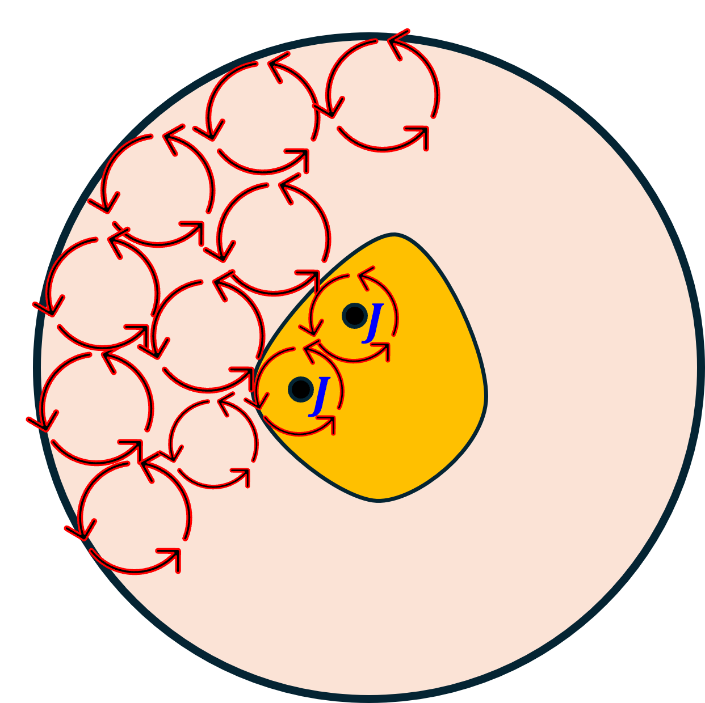
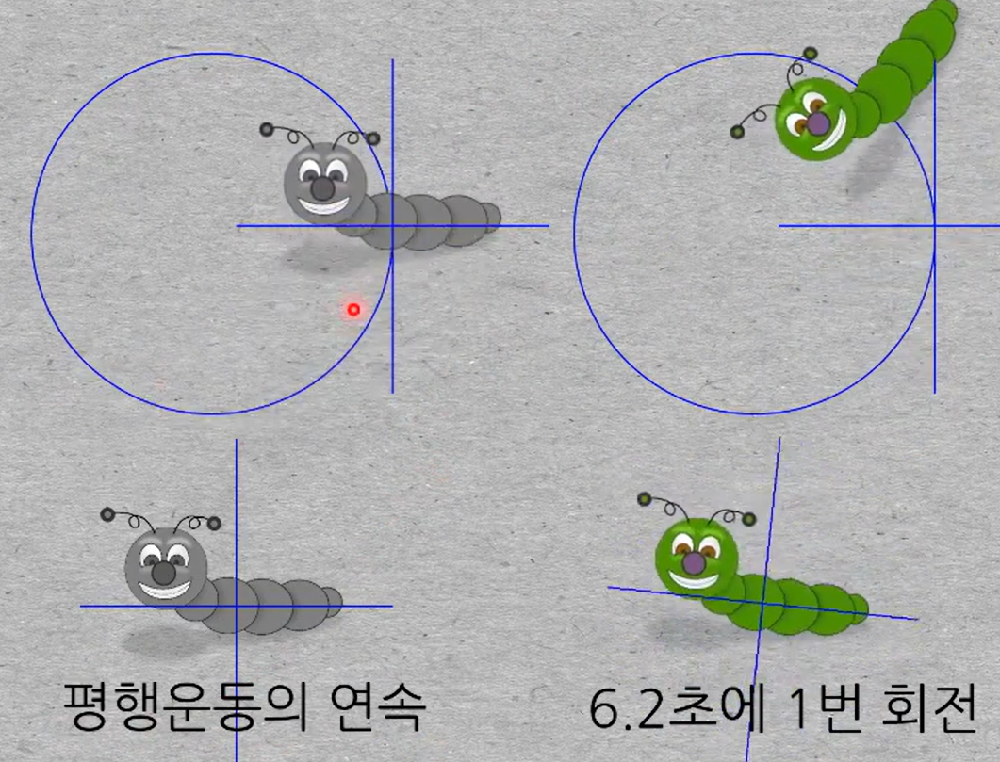
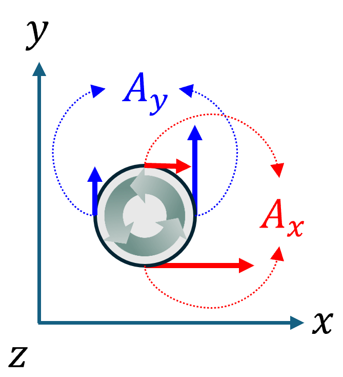

+++
title = "(b) Curl"
weight = 7
+++

---

### 1. Curl

- **어떤 위치에서, 벡터장을 회전시키는 근원을 구하고자 할 때**, 쓰는 연산자(도구).
- 근원의 크기에 비례하여, **벡터장**이 회전한다.
- 근원의 방향은 **벡터장**의 회전방향을 결정(오른손 나사 법칙)한다.

**(1) 세번째 Maxwell equation**

$$
\nabla\times\vec{E}
=-\frac{\partial\vec{B}}{\partial t}
$$

위 식이 의미하는 바는, 전기장을 회전시키는 근원을 구하기 위해, 어느 위치에서 curl (연산자)도구 를 사용하였다. 연산 결과, 시간에 따라 변하는 자기장이 전기장을 회전시킴을 알았다.

**(2) 네번째 Maxwell equation**

$$
\nabla\times\vec{H}
=\vec{J}+\frac{\partial\vec{D}}{\partial t}
$$

위 식이 의미하는 바는, 자계강도를 회전시키는 근원을 구하기 위해, 어느 위치에서 curl (연산자)도구 를 사용하였다. 연산 결과, 전류밀도와 시간에 따라 변하는 전속밀도가 자계강도를 회전을 회전시킴을 알았다.

---

### 2. Curl 중요 연산자 특성

$$
d^2\vec{s}\times\nabla=d\vec{l}
$$

proof)

$$
\int_{s'}d^2\vec{s}\cdot\nabla\times\vec{A}
=\int_{s'}d^2\vec{s}\times\nabla\cdot\vec{A}
=\oint_{l'}d\vec{l}\cdot\vec{A}
$$

여기에서 공통된 부분을 제거하면, 위에서 제시한 유용한 관계식을 얻을 수 있다. (수학적으로 엄밀한 연산자 정의라기보다는, Stokes 정리를 간략하게 표현하는 매우 유용한 방법이다.)

---

### 3. Curl 연산의 해석 영역

 

위 그림과 같이 해석영역에서, 주황색 영역은 전류밀도가 존재하는 영역이다. 네번째 Maxwell 방정식으로 부터,

$$
\int_{s'}d^2\vec{s}\cdot\nabla\times\vec{H}
=\int_{s'}d^2\vec{s}\cdot\vec{J}
=I
$$

첫번째 항을 살펴보면,

$$
\int_{s'}d^2\vec{s}\cdot\nabla\times\vec{H}
=\int_{\text{분홍}}d^2\vec{s}\cdot\nabla\times\vec{H}+\int_{\text{주황}}d^2\vec{s}\cdot\nabla\times\vec{H}
=0+\int_{\text{주황}}d^2\vec{s}\cdot\vec{J}
=I
$$

stokes 정리를 적용하자.

$$
\int_{s'}d^2\vec{s}\cdot\nabla\times\vec{H}
=\oint_{l'}d\vec{l}\cdot\vec{H}
=I
$$

위를 비교해 보면, **원천(근원)을 동일하게 포함한 상태에서, 해석 영역 (폐)경로를 어떻게 잡던간에 적분결과는 동일**하다.

---

### 4. 주의사항

curl 연산자는, **어떤 위치에서**, 벡터장을 회전시키는 근원을 구하고자 할 때 사용한다고 했다. **(고정)위치에서** 라는 의미가 중요하다. 

- **평행운동의 연속: curl 연산의 결과는 0**
- 물체의 회전: curl 연산의 결과는 0 이 아님

---

### 5. Curl for an orthogonal coordinate

**매개변수 공간 → 실공간 직교좌표계**

$$
\nabla_u\times\vec{A}
=\varepsilon_{ijk}\partial_jA_k\implies
\nabla\times\vec{A}
=\hat{e}_i\frac{h_i}{h_1h_2h_3}\varepsilon_{ijk}\partial_j\left(h_kA_k\right)
$$

proof)

(고정)위치에서, (아주 작은)물체가 회전하려면, 공간에 따라 같은 방향들의 힘의 차이가 존재해야 한다. 반시계 방향(기준)으로 회전하려면, 이 회전의 정도를 아래와 같이 표현할 수 있다.

$$
J_z=\frac{\partial A_y}{\partial x}-\frac{\partial A_x}{\partial y}
$$

각 평면에 대해 계산하면,

$$
\vec{J}
=\hat{x}\left(\frac{\partial A_z}{\partial y}-\frac{\partial A_x}{\partial z}\right)
+\hat{y}\left(\frac{\partial A_x}{\partial z}-\frac{\partial A_z}{\partial x}\right)
+\hat{z}\left(\frac{\partial A_y}{\partial x}-\frac{\partial A_x}{\partial y}\right)
$$

특히, 데카르트 좌표계에서 위의 식이 바로 나올 수 있도록 학습하자.

---

[곡선좌표계 - 위키백과, 우리 모두의 백과사전](https://en.wikipedia.org/wiki/Curvilinear_coordinates)