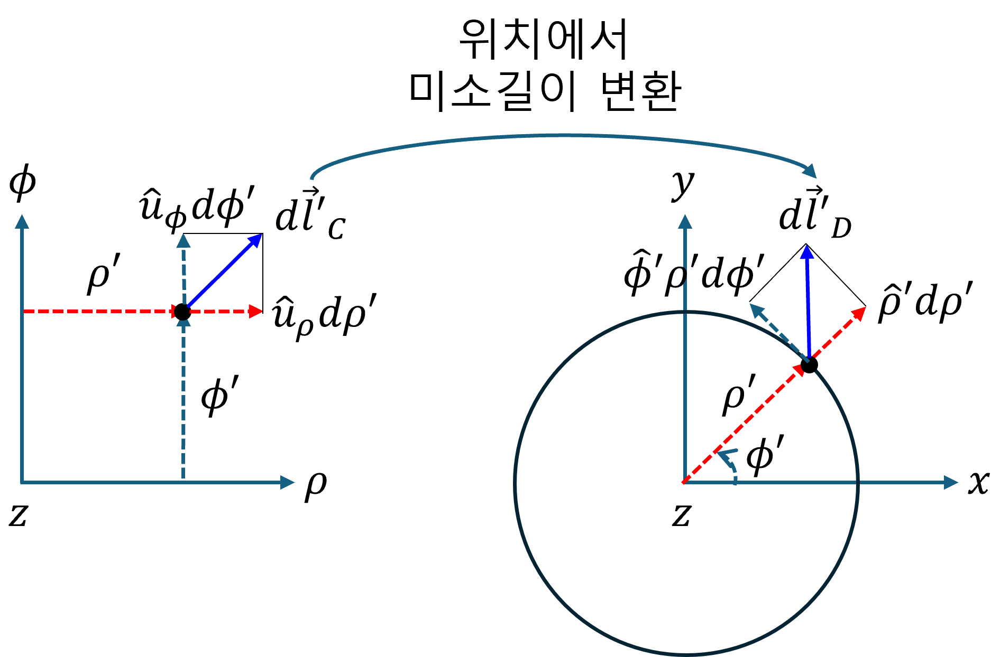
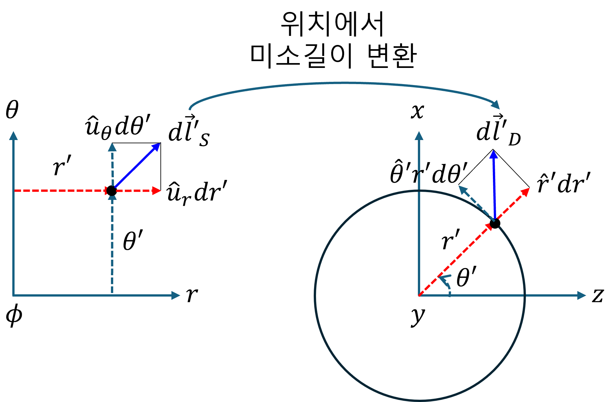
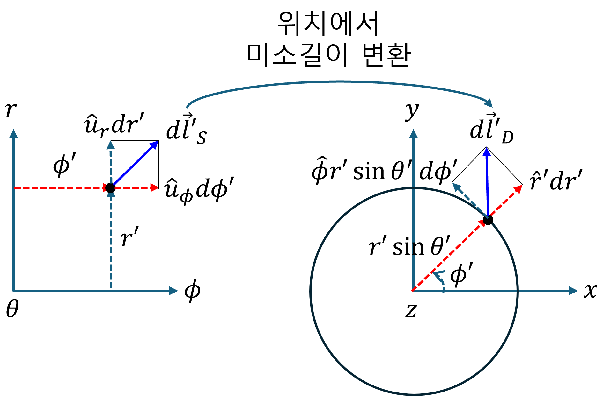

+++
title = "(a) Mapping III - Jacobian"
weight = 5
+++

---

**중요사항: [매개변수 공간] → [실 공간]** 에 대한 것으로 **미소변위벡터 변환(mapping)** 을 다룬다.

---

### 1. Jacobian

Jacobian은 매개변수 공간의 미소변위벡터를 실 공간의 미소변위벡터로 변환(mapping)하는 연산자이다.

- **u 매개변수 공간** 미소변위벡터

$$
d\vec{u}
=\hat{u}_idu^i
$$

- **v 실 공간** 매핑 위치에서, 미소변위벡터

$$
d\vec{v}
=\vec{h}_idu^i
$$

- **변환(mapping) 연산자 작용, **매핑 위치**에 해당하는  [u 매개변수 공간] 미소변화량벡터 du → [v 좌표계 공간] 미소변위벡터 dv**

$$
d\vec{v}
=d\vec{u}\cdot\nabla_{u}\vec{v}
=du^i\frac{\partial\vec{v}}{\partial u_i}
$$

수학적 벡터로 표현하면,

$$
\begin{bmatrix}
    dv^1 \\ dv^2 \\ dv^3
\end{bmatrix}
=du^1\begin{bmatrix}
    \cfrac{\partial v^1}{\partial u^1} \\
    \cfrac{\partial v^2}{\partial u^1} \\
    \cfrac{\partial v^3}{\partial u^1}
\end{bmatrix}+du^2
\begin{bmatrix}
    \cfrac{\partial v^1}{\partial u^2} \\
    \cfrac{\partial v^2}{\partial u^2} \\
    \cfrac{\partial v^3}{\partial u^2}
\end{bmatrix}+du^3
\begin{bmatrix}
    \cfrac{\partial v^1}{\partial u^3} \\
    \cfrac{\partial v^2}{\partial u^3} \\
    \cfrac{\partial v^3}{\partial u^3}
\end{bmatrix}
=\begin{bmatrix}
    \cfrac{\partial v^1}{\partial u^1} & \cfrac{\partial v^1}{\partial u^2} & \cfrac{\partial v^1}{\partial u^3} \\
    \cfrac{\partial v^2}{\partial u^1} & \cfrac{\partial v^2}{\partial u^2} & \cfrac{\partial v^2}{\partial u^3} \\
    \cfrac{\partial v^3}{\partial u^1} & \cfrac{\partial v^3}{\partial u^2} & \cfrac{\partial v^3}{\partial u^3}
\end{bmatrix}
\begin{bmatrix}
    du^1 \\ du^2 \\ du^3
\end{bmatrix}
$$

여기에서, 3x3 행렬을 Jacobian 이라고 한다. **Jacobian의 각 열 벡터**는 매개변수 공간의 각 축이 실 공간으로 변환(mapping)될 때 만들어지는 벡터이다. 이 벡터들이 해당 지점에서 **실 공간의 새로운 기준 방향들(기저)을 형성**한다.suffix notation을 사용하여 각 열벡터 성분에 대해 아래와 같이 표현할 수 있으며, 이와 관련한 기하학적 해석을 해보자.

$$
\vec{h}_i=\frac{\partial\vec{v}}{\partial u^i} \text{, 매개변수의 미소변화량에 대한 벡터 v의 미소변화량 - 궤적의 접선 벡터}
$$

---

### 2. Scale factor

**Jacobian 의 각 열벡터는 실 공간에 유도된 새로운 기저 벡터** 라고 하였다. 
위의 기저를 normalize 하고, 실 공간의 미소길이벡터 $d\vec{v}$ 를 표현해 보자.

$$
d\vec{v}
=du^i\frac{\partial\vec{v}}{\partial u^i}
=du^i\vec{h}_i
=\hat{e}_ih_idu^i
$$

$$
\vec{h}_{i}=\frac{\partial\vec{v}}{\partial u^{i}},\quad
h_{i}=\left|\vec{h}_{i}\right|,\quad
\hat{e}_{i}=\frac{\vec{h}_{i}}{h_{i}}
$$

이전 챕터에서 학습한 바, scale factor $h_i$ 를 매개변수 공간 $u_i$ 방향의 미소 변화량에 곱하면, 실 공간에서의 미소 길이가 된다.

---

### 3. [원통좌표계 매개변수 공간] → [실 공간]

- **매개변수 공간** 미소변위벡터

$$
d\vec{u}=\left[d\rho,d\phi,dz\right]^T
$$

- **실 공간** 매핑 위치의 미소변위벡터

$$
d\vec{v}=\left[dx',dy',dz'\right]^T
$$

- **Mapping, 매핑 위치 에서의 [원통좌표계 매개변수 공간] → [실 공간]**

$$
d\vec{v}=\left(d\vec{u}\cdot\nabla_{u}\right)\vec{v}
=\vec{h}_i du^i
$$

하나하나 씩 살펴보자.

$$
\vec{h}_{\rho}
=\begin{bmatrix}
    \cfrac{\partial x'}{\partial \rho} \\
    \cfrac{\partial y'}{\partial \rho} \\
    \cfrac{\partial z'}{\partial \rho}
\end{bmatrix}
=\begin{bmatrix}
    \cfrac{\partial}{\partial \rho} (\rho\cos\phi) \\
    \cfrac{\partial}{\partial \rho} (\rho\sin\phi) \\
    \cfrac{\partial}{\partial \rho} (z)
\end{bmatrix}
=\begin{bmatrix}
    \cos\phi \\
    \sin\phi \\
    0
\end{bmatrix} \implies
h_\rho=1,
\hat{\rho}
=\begin{bmatrix}
    \cos\phi \\
    \sin\phi \\
    0
\end{bmatrix}
$$

$$
\vec{h}_{\phi}
=\begin{bmatrix}
    \cfrac{\partial x'}{\partial \phi} \\
    \cfrac{\partial y'}{\partial \phi} \\
    \cfrac{\partial z'}{\partial \phi}
\end{bmatrix}
=\begin{bmatrix}
    \cfrac{\partial}{\partial \phi} (\rho\cos\phi) \\
    \cfrac{\partial}{\partial \phi} (\rho\sin\phi) \\
    \cfrac{\partial}{\partial \phi} (z)
\end{bmatrix}
=\rho\begin{bmatrix}
    -\sin\phi \\
    \cos\phi \\
    0
\end{bmatrix} \implies
h_\phi=\rho,
\hat{\phi}
=\begin{bmatrix}
    -\sin\phi \\
    \cos\phi \\
    0
\end{bmatrix}
$$

$$
\vec{h}_{z}
=\begin{bmatrix}
    \cfrac{\partial x'}{\partial z} \\
    \cfrac{\partial y'}{\partial z} \\
    \cfrac{\partial z'}{\partial z}
\end{bmatrix}
=\begin{bmatrix}
    \cfrac{\partial}{\partial z} (\rho\cos\phi) \\
    \cfrac{\partial}{\partial z} (\rho\sin\phi) \\
    \cfrac{\partial}{\partial z} (z)
\end{bmatrix}
=\begin{bmatrix}
    0 \\
    0 \\
    1
\end{bmatrix} \implies
h_z=1,
\hat{z}
=\begin{bmatrix}
    0 \\
    0 \\
    1
\end{bmatrix}
$$

**정리하면,**

$$
d\vec{u}\xrightarrow{\text{mapping: }\cdot\nabla_{u}\vec{v}}d\vec{v}
$$

$$
d\vec{v}
=\begin{bmatrix}
    \cos\phi \\ \sin\phi \\ 0
\end{bmatrix}d\rho
+\begin{bmatrix}
    -\sin\phi \\ \cos\phi \\ 0
\end{bmatrix}\rho d\phi
+\begin{bmatrix}
    0 \\ 0 \\ 1
\end{bmatrix}dz
$$

$$
=\hat{\rho}d\rho+\hat{\phi}\rho d\phi+\hat{z}dz
$$

$$
=\hat{x}\left(\cos\phi d\rho-\rho\sin\phi d\phi\right)
+\hat{y}\left(\sin\phi d\rho+\rho\cos\phi d\phi\right)
+\hat{z}dz
$$

아래 이미지의 이해는 매우 중요하다.

---

### 4. [구좌표계 매개변수 공간] → [실 공간]

- **매개변수 공간** 에서, 매핑 위치에서 미소변위벡터

$$
d\vec{u}=\left[dr,d\theta,d\phi\right]^T
$$

- **실 공간** 에서, 매핑 위치에서 미소변위벡터

$$
d\vec{v}=\left[dx',dy',dz'\right]^T
$$

- **Mapping, 매핑 위치 에서의 [원통좌표계 매개변수 공간] → [데카르트좌표계 실 공간]**

$$
d\vec{v}=\left(d\vec{u}\cdot\nabla_u\right)\vec{v}
=\vec{h}_i du^i
$$

하나하나 씩 살펴보자.

$$
\vec{h}_{r}
=\begin{bmatrix}
    \cfrac{\partial x'}{\partial r} \\
    \cfrac{\partial y'}{\partial r} \\
    \cfrac{\partial z'}{\partial r}
\end{bmatrix}
=\begin{bmatrix}
    \cfrac{\partial}{\partial r} (r\sin\theta\cos\phi) \\
    \cfrac{\partial}{\partial r} (r\sin\theta\sin\phi) \\
    \cfrac{\partial}{\partial r} (r\cos\theta)
\end{bmatrix}
=\begin{bmatrix}
    \sin\theta\cos\phi \\
    \sin\theta\sin\phi \\
    \cos\theta
\end{bmatrix} \implies
h_r=1,
\hat{r}
=\begin{bmatrix}
    \sin\theta\cos\phi \\
    \sin\theta\sin\phi \\
    \cos\theta
\end{bmatrix} 
$$

$$
\vec{h}_{\theta}
=\begin{bmatrix}
    \cfrac{\partial x'}{\partial \theta} \\
    \cfrac{\partial y'}{\partial \theta} \\
    \cfrac{\partial z'}{\partial \theta}
\end{bmatrix}
=\begin{bmatrix}
    \cfrac{\partial}{\partial \theta} (r\sin\theta\cos\phi) \\
    \cfrac{\partial}{\partial \theta} (r\sin\theta\sin\phi) \\
    \cfrac{\partial}{\partial \theta} (r\cos\theta)
\end{bmatrix}
=r\begin{bmatrix}
    \cos\theta\cos\phi \\
    \cos\theta\sin\phi \\
    -\sin\theta
\end{bmatrix} \implies
h_\theta= r,
\hat{\theta}
=\begin{bmatrix}
    \cos\theta\cos\phi \\
    \cos\theta\sin\phi \\
    -\sin\theta
\end{bmatrix}
$$

$$
\vec{h}_{\phi}
=\begin{bmatrix}
    \cfrac{\partial x'}{\partial \phi} \\
    \cfrac{\partial y'}{\partial \phi} \\
    \cfrac{\partial z'}{\partial \phi}
\end{bmatrix}
=\begin{bmatrix}
    \cfrac{\partial}{\partial \phi} (r\sin\theta\cos\phi) \\
    \cfrac{\partial}{\partial \phi} (r\sin\theta\sin\phi) \\
    \cfrac{\partial}{\partial \phi} (r\cos\theta)
\end{bmatrix}
=r\sin\theta\begin{bmatrix}
    -\sin\phi \\
    \cos\phi \\
    0
\end{bmatrix} \implies
h_\phi= r\sin\theta,
\hat{\phi}
=\begin{bmatrix}
    -\sin\phi \\
    \cos\phi \\
    0
\end{bmatrix}
$$

**정리하면,**

$$
d\vec{u}\xrightarrow{\text{mapping: }\cdot\nabla_{u}\vec{v}}d\vec{v}
$$

$$
d\vec{v}
=\begin{bmatrix}
    \sin\theta\cos\phi \\
    \sin\theta\sin\phi \\
    \cos\theta
\end{bmatrix}dr
+\begin{bmatrix}
    \cos\theta\cos\phi \\
    \cos\theta\sin\phi \\
    -\sin\theta
\end{bmatrix}rd\theta
+\begin{bmatrix}
    -\sin\phi \\
    \cos\phi \\
    0
\end{bmatrix}r\sin\theta d\phi
$$

$$
=\hat{r}dr+\hat{\theta}rd\theta+\hat{\phi}r\sin\theta d\phi
$$

아래 이미지의 이해는 매우 중요하다.

