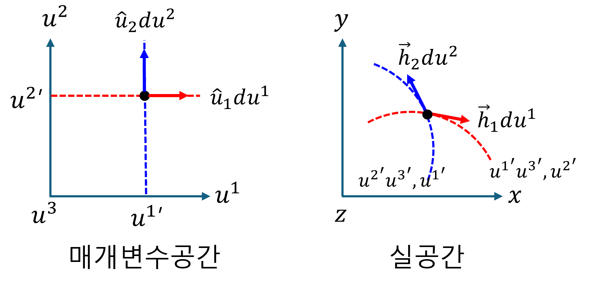

+++
title = "(a) Mapping"
weight = 4
+++

---

이전 챕터에서는 매개변수공간(데카르트 좌표계로 간주)에서 단위 기저 벡터에 대해서 다루었다. 그러나 **모든 기저가 직교하지 않을 수도 있으며, 그 크기가 1이 아닐 수도 있다.**

여기에서는 실공간의 일반 좌표계에서 기하학적 텐서를 표현하는 새로운 방식을 소개한다. **orthogonal coordinates** 에 대한 기본적인 이해가 있다면 학습에 도움이 될 것이다

---

### 1. 벡터의 표현

**일반 좌표계에서 벡터의 "좌표값"은 벡터를 해당 좌표축 벡터의 방향으로 평행하게 분해했을 때의 각 축에 대한 스케일링 계수** 이다. suffix notation을 사용하여, 일반좌표계에서 벡터표현은 다음과 같다.

$$
\vec{x}=x^{i}\vec{g}_i=x_i\vec{g}^i
$$

- $\vec{g}_i$는 자연 기저 벡터 (natural base vectors) 라고 한다. 또는 **공변기저벡터** 라고 한다.
- $x^i$ 는 성분을 나타내며, 이것을 $\vec{x}$ 의 contravariant(반변) 성분이라고 한다.
- $\vec{g}^i$는 역 기저 벡터 (reciprocal base vectors) 라고 한다. 또는 **반변기저벡터** 라고 한다.
- $x_i$ 는 성분을 나타내며, 이것을 $\vec{x}$ 의 covariant(공변) 성분이라고 한다.

---

### 2. 공변기저벡터

**매개변수 공간($q$)에서 실공간으로의 매핑**

데카르트 좌표계처럼 다룰 수 있는 매개변수 공간의 미소변위벡터($d\vec{q}$)는 아래와 같이 표현할 수 있다. 여기에서, $\hat{q}_j$가 $\hat{e}_k$ 와 같은 물리적 공간의 벡터가 아니라, 매개변수 공간 내에서 $q^j$ 축 방향의 단위 변화를 나타내는 **추상적인 기저 벡터** 이다.

$$
d\vec{q}=dq^j\hat{q}_j
$$

이제, $d\vec{q}$를 실공간의 벡터 $d\vec{x}$로 mapping 한다.

$$
d\vec{x}
=(d\vec{q}\cdot\nabla)\vec{x}
=dq^j\partial_j\vec{x}
$$

여기에서의 $\vec{x}$는 매개변수공간의 위치벡터 $\vec{q}$ 가 실공간으로 매핑되었을 때, 실공간의 위치벡터를 의미한다.

$$
\vec{x}
=x^k(q^1,q^2,q^3)\hat{e}_k
$$

실공간의 위치벡터 $\vec{x}$를 대입하면,

$$
d\vec{x}
=dq^j\partial_jx^k\hat{e}_k
=dq^j\frac{\partial x^k}{\partial q^j}\hat{e}_k
$$

처음과 윗 식을 비교해보자. 매핑 관점에서, 매개변수 공간의 단위 벡터 $\hat{q}_j$ 가 실공간의 $\partial x^k/\partial q^j\hat{e}_k$ 로 매핑됨을 확인할 수 있다. 여기에서, **$\partial x^k/\partial q^j\hat{e}_k$를 공변기저벡터**라고 한다. 공변기저벡터의 기하학적 의미를 살펴보자. 위의 수식에서 매개변수 $q$가 변함에 따라, **실공간에서 궤적을 만들며, 이 궤적의 접선벡터가 공변기저 벡터**임을 알 수 있다.

$$
\hat{q}_j\to
\vec{g}_j=\frac{\partial x^k}{\partial q^j}\hat{e}_k
$$

$q$ **좌표계에서 $d\vec{x}$를 표현하기 위함**이다. 다만, $q$ **좌표계의 기저를 우리가 익숙한 $\hat{e}_k$ (데카르트 기저)를 통해 '설명'** 하고 싶다. 따라서, 변환 텐서를 사용하여 데카르트 기저로 표현해 보자.

$$
d\vec{x}
=dq^j\vec{g}_j
=dq^jg_j^k\hat{e}_k
$$

$$
g^k_j
=\frac{\partial x^k}{\partial q^j}
$$

---

### 3. 역(반변)기저벡터

공변기저벡터의 경우, 매개변수공간의 (추상적인) 단위 기저벡터를 실공간으로 mapping된 궤적의 접선벡터라고 하였다. 이번에는 매개변수공간의 단위기저벡터를 등위면의 법선벡터라고 정의하자. 그러면, **실공간으로 mapping 하였을 때, mapping된 등위면이 생기며, 이 등위면의 법선 벡터를 반변기저벡터**라고 한다.

**실공간에서 매개변수 공간($q$)으로의 매핑**

실공간의 미소변위벡터 $d\vec{x}$를 매개변수공간의 $q^i$로 mapping 해 보자. 여기에서, 매개변수 공간의 (추상적) 단위 기저 벡터는 이미 알고 있기에 구하는 의미가 없다. 매개변수공간으로 mapping 된 각 단위 벡터의 성분은 아래와 같이 구할 수 있다. 

$$
dq^i
=d\vec{x}\cdot\nabla q^i
=dx^j\partial_jq^i
$$

여기에서, $\vec{g}^i=\nabla q^i$를 **반변기저벡터** 라고 한다. mapping 으로의 의미를 생각해보자. $\vec{g}^i\cdot$ 는 **매개변수공간의 성분(스칼라)으로 변환하는 연산자** 이다. 이것을 **쌍대공간의 기저**라고 볼 수 있다. 따라서, 아래와 같이 쓸 수 있다.

$$
dq^i
=d\vec{x}\cdot \vec{g}^i
$$

$q$ **좌표계에서 $d\vec{x}$를 표현하기 위함**이다. 다만, $q$ **좌표계의 반변 기저를 우리가 익숙한 $\hat{e}_k$ (데카르트 기저)를 통해 '설명'** 하고 싶다. 따라서, 변환 텐서를 사용하여 데카르트 기저로 표현해 보자.

$$
d\vec{x}
=dq_j\vec{g}^j
=dq_jg_k^j\hat{e}_k
$$

$$
g_k^j
=\frac{\partial q^j}{\partial x^k}
$$

---

### 4. 왜 '공변(Covariant)'이고 '반변(Contravariant)'인가

**(1) 공변 기저 벡터 ($\vec{g}_i$)와 반변 성분 ($q^i$)**

- **공변 기저 벡터 ($\vec{g}_i$)**:
  * 매개변수 축($q^i$)을 따라 실공간의 벡터 궤적에 **접선**으로 놓인다.
  * 매개변수 축이 늘어나면, $\vec{g}_i$도 실공간에서 그 늘어난 축을 따라 **'함께' 길어진다.**
  * 이처럼 좌표계 변화에 **'함께(co-vary)' 반응**하는 특성 때문에 '공변' 기저 벡터라고 불린다.

- **반변 성분 ($q^i$)**:
  * 벡터 $\vec{x}$의 값을 일정하게 유지하기 위해, 공변 기저 벡터($\vec{g}_i$)의 변화와 **'반대' 방향으로 변하는** 성분이다.
  * 예를 들어, $\vec{g}_i$가 길어지면, $q^i$는 상대적으로 작아져야 총 벡터의 크기가 유지된다. 기저와 성분의 변화 방향이 **반대**되기 때문에 '반변' 성분이라고 불린다.

**(2) 반변 기저 벡터 ($\vec{g}^i$)와 공변 성분 ($q_i$)**

- **반변 기저 벡터 ($\vec{g}^i$)**:
  * 매개변수 $q^i$의 **등위면(level surface)에 수직인 법선 벡터**이다.
  * 매개변수 축($q^i$)이 늘어나서 등위면들이 실공간에서 **더 넓게 퍼지면(덜 촘촘해지면)**, $\vec{g}^i$의 크기는 **'짧아진다.'**
  * 반대로 매개변수 축이 압축되어 등위면들이 **더 촘촘하게 모이면**, $\vec{g}^i$의 크기는 **'길어진다.'**
  * 이처럼 매개변수 축의 변화 방향과 **'반대'되는 경향으로 길이가 변하므로** '반변' 기저 벡터라고 불린다. 또한 공변 기저($\vec{g}_i$)와 $\vec{g}_i \cdot \vec{g}^j = \delta_i^j$ 관계처럼 **상보적이고 역수적인 관계**를 가진다.

- **공변 성분 ($q_i$)**:
  * 벡터 $\vec{q}$의 값을 일정하게 유지하기 위해, 반변 기저 벡터($\vec{g}^i$)의 변화와 **'같은' 방향으로 변하는** 성분이다.
  * $\vec{g}^i$가 길어지면(등위면이 촘촘해지면), $q_i$도 커져야 총 벡터의 크기가 유지된다. 기저와 성분의 변화 방향이 **같기** 때문에 '공변' 성분이라고 불린다.

---

### 5. 공변기저벡터와 반변기저벡터의 내적: 쌍대성

$$
\vec{g}_i\cdot\vec{g}^j
=\langle g_i|g^j\rangle
=\delta_i^j
$$

proof)

$$
\langle g_i|g^j\rangle
=\frac{\partial x^k}{\partial q^i}\hat{e}_k\cdot
\frac{\partial q^j}{\partial x^l}\hat{e}_l
=\frac{\partial x^k}{\partial q^i}
\frac{\partial q^j}{\partial x^l}\delta_{kl}
=\frac{\partial x^l}{\partial q^i}
\frac{\partial q^j}{\partial x^l}
=\frac{\partial q^j}{\partial q^i}
=\delta_i^j
$$

---

### 6. 공변기저벡터와 반변기저벡터의 dyad: 단위 tensor

$$
\bar{\bar{I}}
=\vec{g}_i\vec{g}^i
=|g^i\rangle\langle g_i|
$$

proof)

$$
\langle g_i|g^j\rangle\langle g_j|g^i\rangle
=\delta_i^j\delta^i_j
=\delta_i^i
=1
$$

따라서,

$$
|g^j\rangle\langle g_j|
=\bar{\bar{I}}
$$

---

### 7. 공변, 반변 성분 추출

**(1) 반변성분추출**

$$
\vec{x}\cdot\vec{g}^i=x^i
$$

proof)

$$
\vec{x}\cdot\vec{g}^i
=x^k\vec{g}_k\cdot\vec{g}^i
=x^k\delta^i_k
=x^i
$$

**(2) 공변성분추출**

$$
\vec{x}\cdot\vec{g}_i=x_i
$$

proof)

$$
\vec{x}\cdot\vec{g}^i
=x_k\vec{g}^k\cdot\vec{g}_i
=x_k\delta^k_i
=x_i
$$

---

[[일반 상대성이론] 공변(Covariant)과 반변(Contravariant)](https://m.blog.naver.com/jmj_0309/222311484066)
