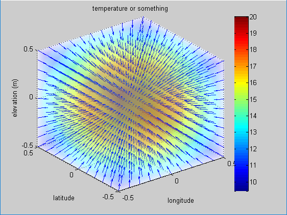
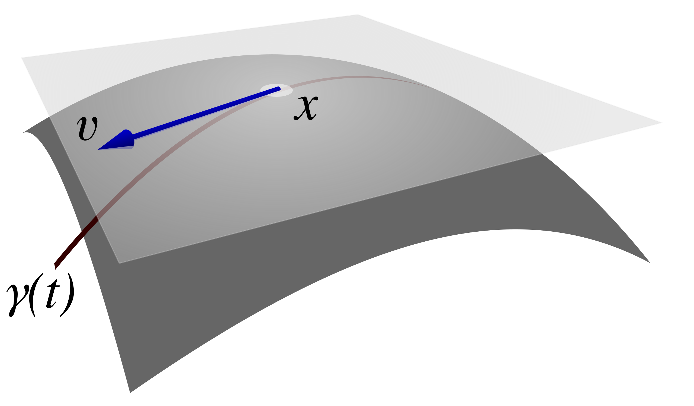

+++
title = "(b) Gradient"
weight = 4
+++

---

### 0.  Total derivative & Gradient

다변수 함수에 대한 전미분은 아래와 같다. 여기에서, 매개변수를 $u^i$ 라고 하자.

$$
df
=du^i\frac{\partial f}{\partial u^i}
$$

위 식을 벡터로 표현하면, 아래와 같다.

$$
df
=d\vec{u}\cdot\nabla_u f
$$

$$
\nabla_u
=\left[\frac{\partial}{\partial u^1}, \frac{\partial}{\partial u^2}, \frac{\partial}{\partial u^3}\right]^T
$$

여기에서 $f$ 를 제거하면, 유용한 관계식을 얻을 수 있다. (수학적으로 엄밀한 연산자 정의라기보다는, 전미분 연산자를 간략하게 표현하는 매우 유용한 방법이다.)

$$
d:=d\vec{u}\cdot\nabla_u
$$

---

### 1. Gradient for scalar in an arbitrary space

일반적으로, 임의의 공간 $q$ 에서, gradient가 무엇인지 살펴보자.

**(1) 방향 도함수 해석**

gradient 의 특성을 엄밀하게 해석하는 방법이다. 임의의 위치에서 gradient 와 그 위치에서의 임의의 단위벡터를 내적해보자.

$$
\nabla_q f \cdot \hat{l} = |\nabla_q f|\cdot1\cdot\cos\theta
$$

$\nabla_q f$의 크기를 생각하면, $\cos\theta=1$ 이 되어야 하므로 $\theta=0$ 이다. 따라서, **$\nabla_q f$의 특성은 공간상의 기울기가 최대가 되는 방향임**을 알수 있다.

**(2) 등고선 or 등위면 해석**

**등위면이나 등고선 해석**은 (1)의 방법보다 gradient 의 기하학적 의미를 '시각화'하고 '직관적'으로 이해하는 데 매우 유용하다. (단, 이 방식은 등위 값을 가질 때 적용할 수 있다.) 
등고선은 같은 값을 선으로 연결한 형태를 의미하고, 등위면은 같은 값을 면으로 연결한 형태를 말한다. 공간 $q$에 대해 수식으로 표현하면, 다음과 같다.

$$
f(q^1,q^2,q^3)=c,\quad \text{단, c는 상수}
$$

전미분을 수행한다.

$$
df=d\vec{q}\cdot\nabla_q f=0
$$

**여기에서 중요하게 생각해야 할 지점이 있다. $f=c$ 이라고 해서, $\nabla_q f=0$ 이 아닐 수 있다는 점이다. 이것은 자칫하면 오해할 수 있는 부분으로, 꼭 기억하자.**

$df=0$이 되려면, $d\vec{q}$ 와 $\nabla_q f$ 는 서로 수직이어야 한다. $d\vec{q}$는 등위면 상에 존재하므로, **$\nabla_q f$는 등위면과 수직**이다. 어떤 지점에서 함수 $f$의 값을 가장 빠르게 변화시키려면, **함수 값이 변하지 않는 등위면의 접선 방향이 아닌, 등위면에 수직인 방향으로 이동**해야 한다. 마치 언덕에서 등고선을 따라가면 높이 변화가 없지만, 등고선에 수직으로 올라가면 가장 가파른 경사를 만나는 것과 같다. 이는 위(1)의 결과와 연결시켜 생각하면 이해하기 쉽다.

아래 그림은 구 대칭 형태로 온도가 분포할 때며, gradient 연산 결과의 방향은 방사 방향에 해당함을 확인할 수 있다.

---

### 2. Gradient for scalar in parameter & real spaces

**(1) 매개변수 공간과 실공간에서의 스칼라 $f$**

우선, 매개변수 공간($u^1,u^2,u^3$)은 실 공간 $v^1(u^1,u^2,u^3),v^2(u^1,u^2,u^3),v^3(u^1,u^2,u^3)$ 에 대응된다. 따라서, 스칼라 $f$는 다음과 같이 표현될 수 있다.

$$
f(u^1,u^2,u^3)=f(v^1(u^1,u^2,u^3),v^2(u^1,u^2,u^3),v^3(u^1,u^2,u^3))
$$

매개변수 공간과, 실공간에서 gradient는 아래와 같이 표현된다.

$$
\nabla_u f
=\left[\frac{\partial f}{\partial u^1}, \frac{\partial f}{\partial u^2}, \frac{\partial f}{\partial u^3}\right]^T
,\quad
\nabla_v f
=\left[\frac{\partial f}{\partial v^1}, \frac{\partial f}{\partial v^2}, \frac{\partial f}{\partial v^3}\right]^T
$$

**위와 달리**, 각 공간에서의 gradient 가 동일하지 않음을 주의하라. 두 경우 모두 하나의 물리량 $f$를 다루고 있으며, 그 '$f$의 기울기'라는 **하나의 벡터량을 서로 다른 '공간 또는 좌표계'에서 표현**한 것이다. 그리고 이 두 표현($\nabla_u f$, $\nabla_v f$)은 서로 다르게 나타난다.

$$
\nabla_u f \ne \nabla_v f
$$

이는 곧, 해석공간 또는 좌표계가 바뀌면 같은 물리량을 나타내는 벡터의 성분 표현이 달라질 수 있음을 의미한다. 이러한 좌표계 변환에 따른 물리량의 표현 변화를 체계적으로 다루는 것이 바로 텐서의 핵심 개념 중 하나이다.

**(2) [매개변수 공간]에서 [실 공간]의 공간 자체 변환(기저 변환)**

앞선, 등위면이나 등고선 해석을 생각해보자. 매개변수 공간[u]에서 등위면은 실공간[v]로 mapping 되는 등위면을 만든다. 예로, 구 좌표계 매개변수 공간 $r=a$에 해당하는 등위 평면($r=a$, $\theta=$모든값, $\phi=$모든값)은 실공간에서 $r=a$의 등위 구면을 형성하는 것으로 생각할 수 있다.

매개변수공간 [$u$, $u^i$]에서 실공간으로 mapping된 등위면 [$v$, $u^i(v^1,v^2,v^3)=$상수]에 대한 법선 벡터는 아래와 같이 구할 수 있다.

$$
\nabla_vu^i
$$

위의 식은 추후 **반변기저벡터로서 사용**된다.

---

### 3. Gradient for vector

벡터에 대한 gradient는 위의 스칼라에 대한 gradient 보다 직관적이다. 전미분 연산자를 사용하여, 미소변위벡터를 표현해 보자.

$$
d\vec{r}
=d\vec{u}\cdot\nabla_u\vec{r}
=du^i\frac{\partial \vec{r}}{\partial u^i}
$$

이것을 매개변수공간의 벡터와 실공간으로 해석하면, $d\vec{u}$ 는 매개변수 공간의 미소변위벡터이다. '$\cdot\nabla_u\vec{r}$'는 이 매개변수공간의 미소변위벡터를 **실공간의 미소변위벡터 $d\vec{r}$ 로 변환**하는 연산자로 볼 수 있으며, 2계 tensor 형태인 Jacobian 행렬이다.

$$
\frac{\partial \vec{r}}{\partial u^i}
$$

위 식의 의미를 자세하게 살펴보자. Jacobian 행렬의 각 열벡터에 해당하며, 이는 **매개변수 공간의 기저(직교 단위 벡터) $\hat{u}_i$가 실공간에서 $\partial \vec{r}/\partial u^i$ 의 기저로 변환되었음**을 나타낸다. $\partial \vec{r}/\partial u^i$ 의 기하학적 의미는 상당히 중요하다. 실공간에서, 매개변수 $u^i$의 변화에 따라, $\vec{r}$는 이동 궤적을 형성하게 된다. **$\partial \vec{r}/\partial u^i$는 이동 궤적의 접선 벡터임**을 알 수 있다. 추후, **공변기저백터로 사용**된다. 아래 이미지의 벡터 표기는 궤적에 대한 접선벡터를 보여준다.

---

[공돌이의 수학정리 노트-스칼라장의 기울기(gradient)](https://angeloyeo.github.io/2019/08/25/gradient.html)

[wikipedia-Tangent_space](https://en.wikipedia.org/wiki/Tangent_space#)