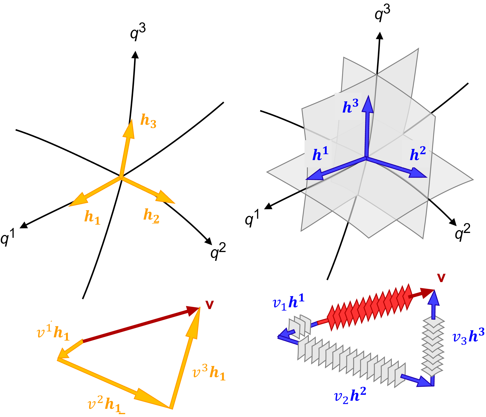

+++
title = "(a) Covariant and contravariant"
weight = 1
+++

---

이 챕터를 학습하려면, 이전 **Transformation**을 반드시 숙지해야 한다.

---

---

### 1. 일반좌표계에서의 표기법

**일반 좌표계에서 벡터의 "좌표값"은 벡터를 해당 좌표축 벡터의 방향으로 평행하게 분해했을 때의 각 축에 대한 스케일링 계수** 이다.

직교좌표계의 경우, 좌표축 벡터의 방향으로 평행하게 분해하는 것이 좌표축에 수선의 발을 내리는 것과 동일하며, 이때 해당 좌표축 벡터(단위 기저 벡터)와의 내적 연산을 통해 좌표값을 쉽게 구할 수 있다. 그러나, **직교가 아닌 일반 좌표계에서는 이러한 방식으로 좌표값을 직접 구할 수 없다.** 이때는 단순히 수선의 발을 내리는 것이 아니라, 각 축에 대한 기하학적 의미를 가지는 특정 역 기저 벡터와의 내적을 통해 좌표값을 추출하거나, 좌표 변환을 위한 매트릭 텐서가 사용된다.

suffix notation을 사용하여, 일반좌표계에서 벡터표현은 다음과 같다.

$$
\vec{v}=v^{i}\vec{h}_i=v_i\vec{h}^i
$$

- $\vec{h}_i$는 자연 기저 벡터 (natural base vectors) 라고 한다. 또는 **공변기저벡터** 라고 한다.
- $v^i$ 는 성분을 나타내며, 이것을 $\vec{v}$ 의 contravariant(반변) 성분이라고 한다.
- $\vec{h}^i$는 역 기저 벡터 (reciprocal base vectors) 라고 한다. 또는 **반변기저벡터** 라고 한다.
- $v_i$ 는 성분을 나타내며, 이것을 $\vec{v}$ 의 covariant(공변) 성분이라고 한다.

---

### 2. 공변기저벡터

**매개변수공간[u] → 실공간[v] 변환에 대한 설명**으로, 즉, Jacobian 에 대한 내용이다. Jacobian은 매개변수 공간의 미소변위벡터를 실 공간의 미소변위벡터로 변환(mapping)하는 연산자이다.

$$
d\vec{v}
=d\vec{u}\cdot\nabla_{u}\vec{v}
=du^i\frac{\partial\vec{v}}{\partial u^i}
=\vec{h}_idu^i
$$

여기에서, $\partial\vec{v}/\partial u^i$는 매개변수 $u^i$ 대한 벡터 궤적 $\vec{v}$ 의 **접선 벡터**를 의미하며, 이것이 **자연기저벡터(공변기저벡터)** $\vec{h}_i$를 의미한다.

---

### 3. 반변기저벡터

앞서, 매개변수공간[u] → 실공간[v] 변환할 때, 실공간의 기저(공변기저벡터)를 벡터 $\vec{v}$ 의 접선벡터로 정의하였다. 또 다른 관점으로는 매개변수공간의 $u^i$ 는 실공간의 $u^i$의 등위면을 만들어 내며, 이 **등위면의 법선벡터를 기저로 정의**할 수 있다. 이것을 **반변기저벡터** $\vec{h}^i$ 라고 한다.

반변기저벡터 $\vec{h}^i$ 를 사용해 실공간에서의 미소변위벡터 $d\vec{v}$를 표현할 수 있다. $\vec{h}^i=\nabla_v u^i$ 이다. (여기서 $\nabla_v u^i$ 는 **스칼라 함수** $u^i$ 의 그래디언트)

$$
d\vec{v}=\vec{h}^idv_i=dv_i\nabla_v u^i
$$

여기에서 주의해야할 사항은, **$v_i$ 는 실공간에서 벡터를 반변 기저 벡터로 표현했을 때의 공변 성분이다.**

---

### 4. 중복지수표기법

일반 tensor의 표기에서 중복 지수는 반드시 위 아래로 교차해야 한다.

- **올바른 표기**

$$
v_iu^i,\quad u^iv_i,\quad a_ig_{ij},\quad b_ig^{ij}c_j,\quad g^{ij}d^kg_{kj}
$$

- **잘못된 표기**

$$
v^iu^i,\quad u_iv_i,\quad a^ig^{ij},\quad b_{i}g_{ij}c_j,\quad g_{ij}d^kg^{kj}
$$

---

### 5. 왜 '공변(Covariant)'이고 '반변(Contravariant)'인가

**(1) 공변 기저 벡터 ($\vec{h}_i$)와 반변 성분 ($v^i$)**

- **공변 기저 벡터 ($\vec{h}_i$)**:
  * 매개변수 축($u^i$)을 따라 실공간의 벡터 궤적에 **접선**으로 놓인다.
  * 매개변수 축이 늘어나면, $\vec{h}_i$도 실공간에서 그 늘어난 축을 따라 **'함께' 길어진다.**
  * 이처럼 좌표계 변화에 **'함께(co-vary)' 반응**하는 특성 때문에 '공변' 기저 벡터라고 불린다.

- **반변 성분 ($v^i$)**:
  * 전체 벡터 $\vec{v}$의 값을 일정하게 유지하기 위해, 공변 기저 벡터($\vec{h}_i$)의 변화와 **'반대' 방향으로 변하는** 성분이다.
  * 예를 들어, $\vec{h}_i$가 길어지면, $v^i$는 상대적으로 작아져야 총 벡터의 크기가 유지된다. 기저와 성분의 변화 방향이 **반대**되기 때문에 '반변' 성분이라고 불린다.

**(2) 반변 기저 벡터 ($\vec{h}^i$)와 공변 성분 ($v_i$)**

- **반변 기저 벡터 ($\vec{h}^i$)**:
  * 매개변수 $u^i$의 **등위면(level surface)에 수직인 법선 벡터**이다.
  * 매개변수 축($u^i$)이 늘어나서 등위면들이 실공간에서 **더 넓게 퍼지면(덜 촘촘해지면)**, $\vec{h}^i$의 크기는 **'짧아진다.'**
  * 반대로 매개변수 축이 압축되어 등위면들이 **더 촘촘하게 모이면**, $\vec{h}^i$의 크기는 **'길어진다.'**
  * 이처럼 매개변수 축의 변화 방향과 **'반대'되는 경향으로 길이가 변하므로** '반변' 기저 벡터라고 불린다. 또한 공변 기저($\vec{h}_i$)와 $\vec{h}_i \cdot \vec{h}^j = \delta_i^j$ 관계처럼 **상보적이고 역수적인 관계**를 가진다.

- **공변 성분 ($v_i$)**:
  * 전체 벡터 $\vec{v}$의 값을 일정하게 유지하기 위해, 반변 기저 벡터($\vec{h}^i$)의 변화와 **'같은' 방향으로 변하는** 성분이다.
  * $\vec{h}^i$가 길어지면(등위면이 촘촘해지면), $v_i$도 커져야 총 벡터의 크기가 유지된다. 기저와 성분의 변화 방향이 **같기** 때문에 '공변' 성분이라고 불린다.

---

### 6. 공변기저벡터와 반변기저벡터의 내적: 쌍대성

$$
\vec{h}_i\cdot\vec{h}^j=\delta_i^j
$$

proof)

$$
d\vec{v}
=du^i\vec{h}_i,\quad
du^j
=d\vec{v}\cdot\nabla_v u^j
$$

$$
du^j
=du^i\vec{h}_i\cdot\nabla_v u^j
=\left(\vec{h}_i\cdot\nabla_v u^j\right)du^i
$$

양변이 같으려면,

$$
\vec{h}_i\cdot\nabla_v u^j=\delta_i^j
$$

$\nabla_v u^j=\vec{h}^j$ 이므로,

$$
\vec{h}_i\cdot\vec{h}^j=\delta_i^j
$$

---

### 7. 공변, 반변 성분 추출

**(1) 반변성분추출**

$$
\vec{v}\cdot\vec{h}^i=v^i
$$

proof)

$$
\vec{v}\cdot\vec{h}^i
=v^k\vec{h}_k\cdot\vec{h}^i
=v^k\delta^i_k
=v^i
$$

**(2) 공변성분추출**

$$
\vec{v}\cdot\vec{h}_i=v_i
$$

proof)

$$
\vec{v}\cdot\vec{h}^i
=v_k\vec{h}^k\cdot\vec{h}_i
=v_k\delta^k_i
=v_i
$$

