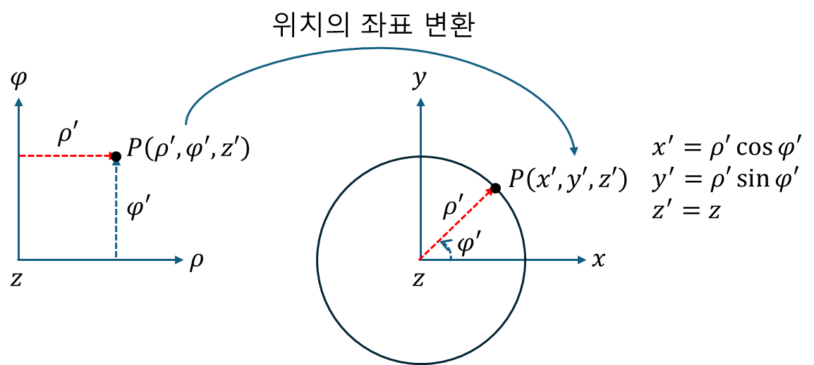
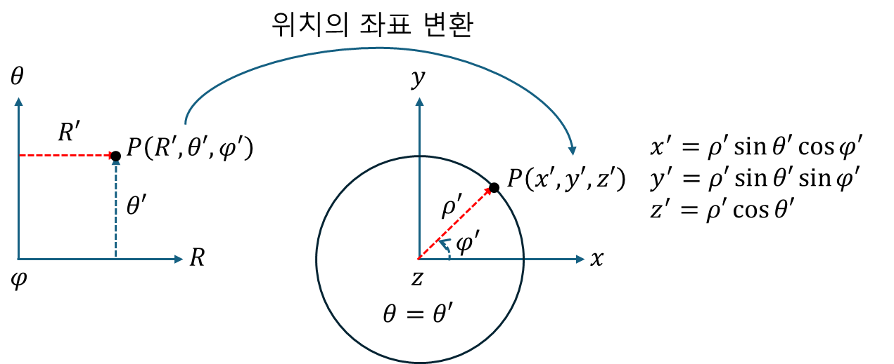

+++
title = "(b) Parameter space transformation I - Position"
weight = 3
+++

---

**중요사항: [매개변수 공간] → [실 공간]** 에 대한 것으로 **점(위치) 변환**을 다룬다.

---

### 1. [원통 좌표계 매개변수 공간] → [데카르트 좌표계 실 공간]

아래 그림에서 왼쪽은 원통 매개변수 공간이다. 매개변수 공간이란 실제 공간이 아니다. 원통 좌표계를 데카르트 좌표계와 유사하게 표현한 것이다. 따라서, 저 매개변수 공간의 좌표를 실제 공간의 좌표로 변환해야 한다. 

---

### 2. [구 좌표계 매개변수 공간] → [데카르트 좌표계 실 공간]

아래 그림에서 왼쪽은 구 매개변수 공간이다. 매개변수 공간이란 실제 공간이 아니다. 구 좌표계를 데카르트 좌표계와 유사하게 표현한 것이다. 따라서, 저 매개변수 공간의 좌표를 실제 공간의 좌표로 변환해야 한다. 

