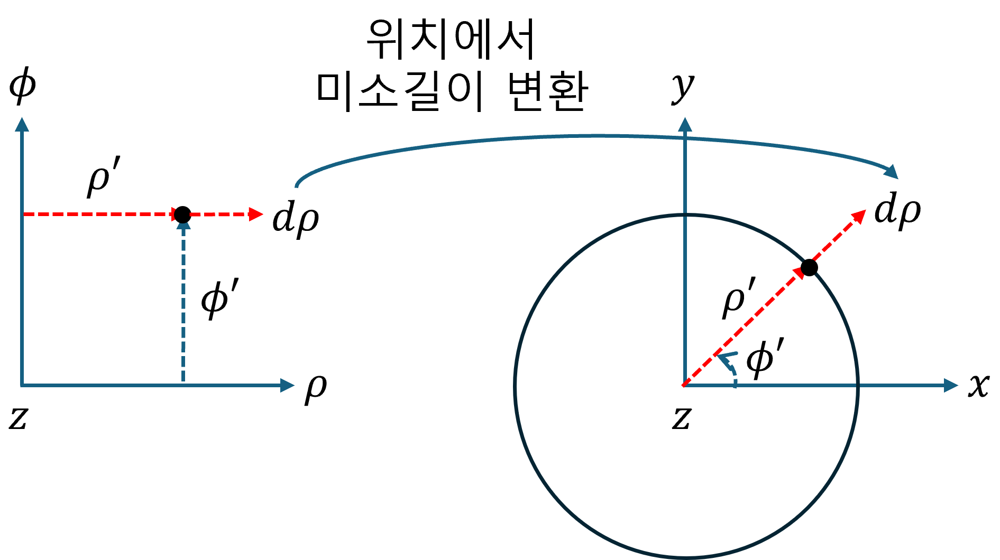
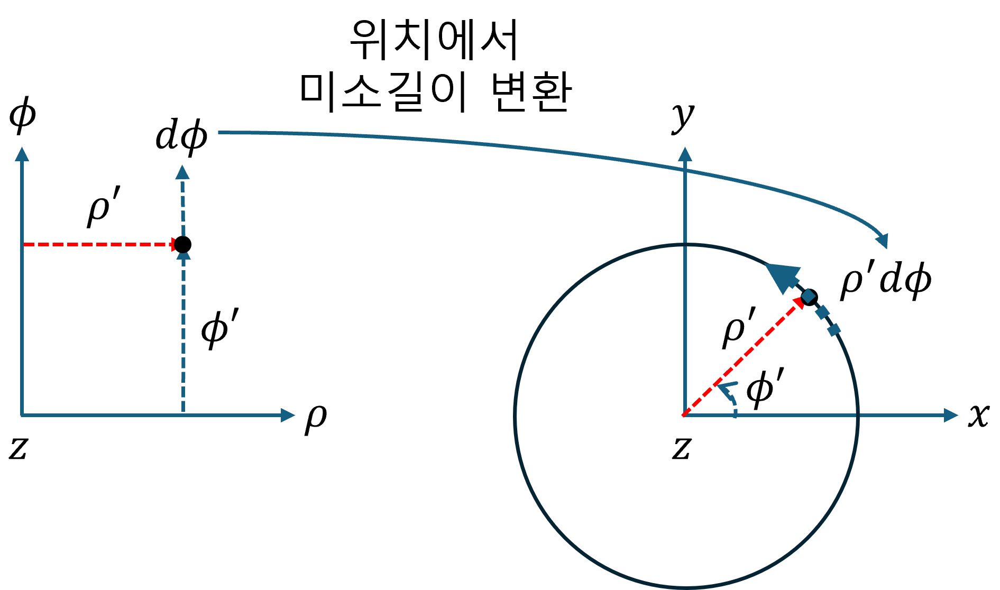
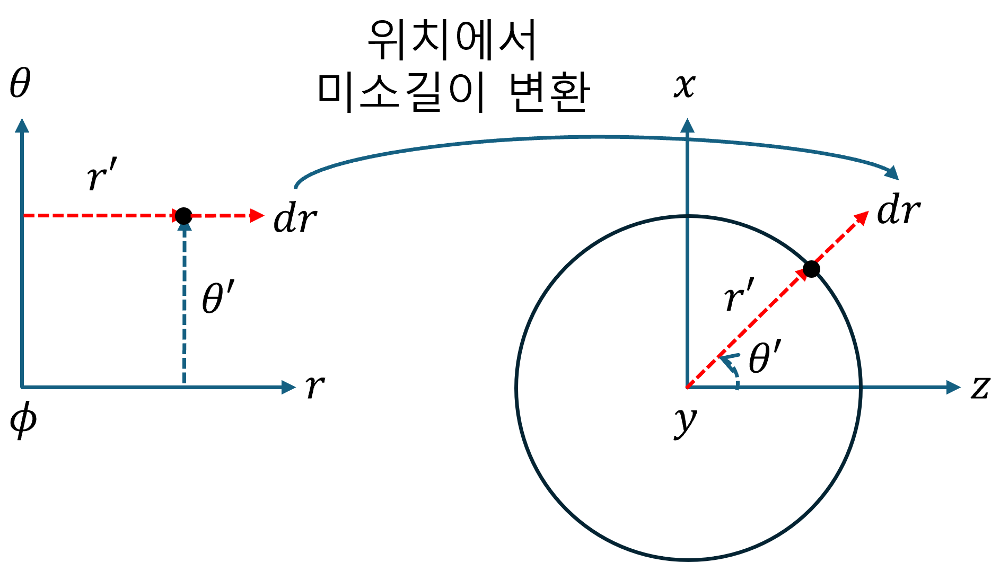
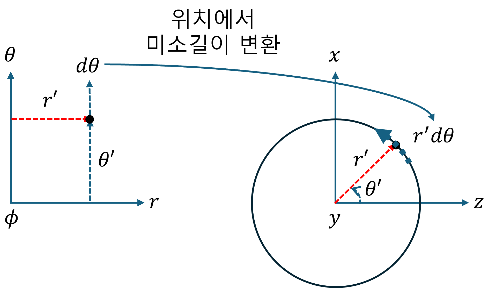
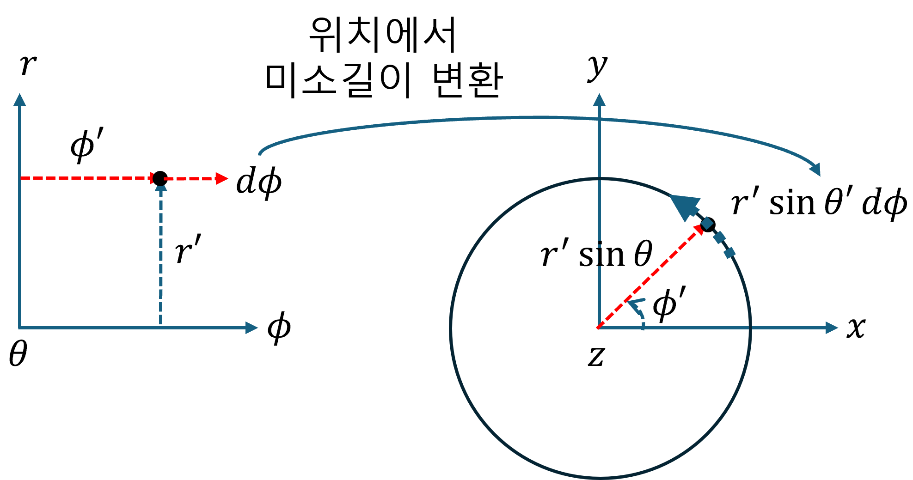

+++
title = "(b) Mapping II - Scale factor"
weight = 4
+++

---

**중요사항: [매개변수 공간] → [실 공간]** 에 대한 것으로 **길이 변환(mapping)** 을 다룬다.

---

### 1. Scale factor

- **우리에게 의미있는 “길이, 넓이, 부피”는 실 공간(real space) 에서 정의된 값**이다.
- 실 공간에서의 물리량 계산을 위해, 매개변수 공간의 영역을 이용하여 계산하는 것이 편리한 경우가 많다.
- 매개변수 공간의 미소 변화량을 실 공간에서의 물리적 미소 길이, 넓이, 부피 요소로 변환(mapping)하기 위해 scale factor가 사용된다.
- **매개변수 공간에서 미소 변화량은 scale factor 와의 단순 곱으로, 실 공간에서 물리적 미소 길이로 변환(mapping)** 된다.

---

### 2. 원통좌표계, Scale factor

- 왼쪽 그림과 같이, 매개변수 공간으로 표현한다면, 원래의 길이(scale)와 다르므로 보정해야 한다. 이 보정 계수를 scale factor 라고 한다.
- 간단하게 설명하면, 매개변수 공간에서 표현한 미소변화량을 **물리적 의미를 가지는 미소변위벡터로 변환(mapping)** 한다.

$$
\left[\begin{matrix}
    d\rho\\ d\phi\\ dz
\end{matrix}\right] \rightarrow
\left[\begin{matrix}
    d\rho \\ \rho d\phi \\ dz
\end{matrix}\right],\quad
\hat{u}_\rho d\rho+\hat{u}_\phi d\phi+\hat{u}_z dz \rightarrow
\hat{\rho}d\rho+\hat{\phi}\rho d\phi+\hat{z}z
$$

보정 계수를 $h_1, h_2, h_3$ 라고 하면,

$$
h_1=1,\quad h_2=\rho',\quad h_3=1
$$

---

### 3. 구좌표계, Scale factor

- 왼쪽 그림과 같이, 매개변수 공간으로 표현한다면, 원래의 길이(scale)와 다르므로 보정해야 한다. 이 보정 계수를 scale factor 라고 한다.
- 간단하게 설명하면, 매개변수 공간에서 표현한 미소변화량을 **물리적 의미를 가지는 미소변위벡터로 변환(mapping)** 한다.

$$
\left[\begin{matrix}
    dr \\ d\theta \\ d\phi
\end{matrix}\right] \rightarrow
\left[\begin{matrix}
    dr \\ r'd\theta \\ r'\sin\theta' d\phi
\end{matrix}\right], \quad
\hat{u}_rdr+\hat{u}_\theta d\theta+\hat{u}_\phi d\phi \rightarrow
\hat{r}dr+\hat{\theta}r'd\theta+\hat{\phi}r'\sin\theta' d\phi
$$

보정 계수를 $h_1, h_2, h_3$ 라고 하면,

$$
h_1=1,\quad h_2=r',\quad h_3=r'\sin\theta'
$$