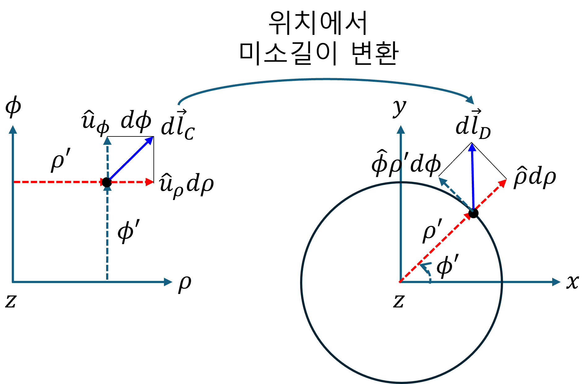
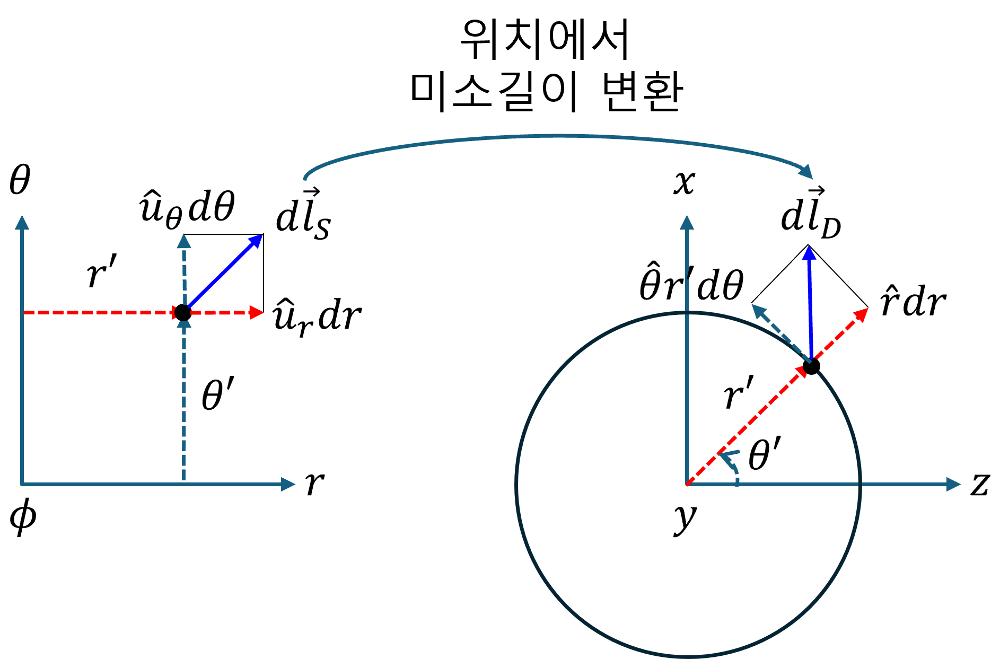
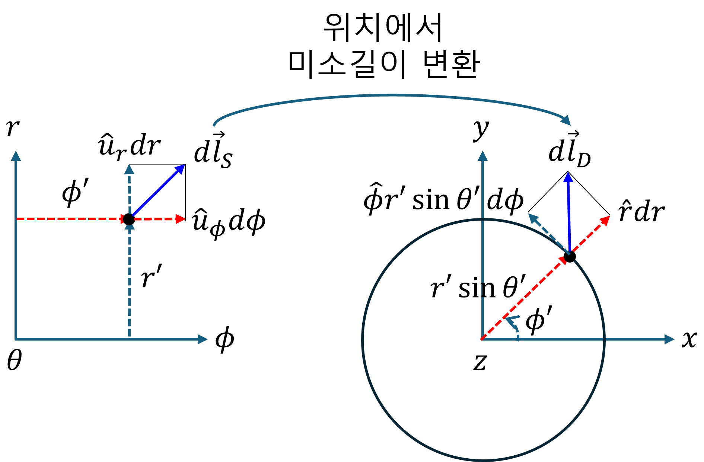

+++
title = "(a) Mapping III - Jacobian"
weight = 5
+++

---

**중요사항: [매개변수 공간] → [실 공간]** 에 대한 것으로 **미소변위벡터 변환(mapping)** 을 다룬다.

---

### 1. Jacobian

Jacobian은 매개변수 공간의 미소변위벡터를 실 공간의 미소변위벡터로 변환(mapping)하는 연산자이다.

- **u 매개변수 공간** 에서, 미소변위벡터

$$
d\vec{u}=\left[\begin{matrix}
    du_1 \\ du_2 \\ du_3
\end{matrix}\right]
=\hat{u}_1du_1+\hat{u}_2du_2+\hat{u}_3du_3
$$

- **v 실 공간** 에서, **매핑된 위치** 에서의 미소변위벡터

$$
d\vec{v}=\left[\begin{matrix}
    dv_1 \\ dv_2 \\ dv_3
\end{matrix}\right]
=\hat{v}_1dv_1+\hat{v}_2dv_2+\hat{v}_3dv_3
$$

- **변환(mapping) 연산자 작용, [u 매개변수 공간] 미소변화량벡터 du → [v 좌표계 공간] 미소변위벡터 dv**

$$
d\vec{v}=d\vec{u}\cdot\nabla_{u}\vec{v}
$$

$$
=du_1\frac{\partial\vec{v}}{\partial u_1}+du_2\frac{\partial\vec{v}}{\partial u_2}+du_3\frac{\partial\vec{v}}{\partial u_3}
$$

수학적 벡터로 표현하면,

$$
\left[\begin{matrix}
    dv_1 \\ dv_2 \\ dv_3
\end{matrix}\right]
=du_1\left[\begin{matrix}
    \cfrac{\partial v_1}{\partial u_1} \\
    \cfrac{\partial v_2}{\partial u_1} \\
    \cfrac{\partial v_3}{\partial u_1}
\end{matrix}\right]+du_2
\left[\begin{matrix}
    \cfrac{\partial v_1}{\partial u_2} \\
    \cfrac{\partial v_2}{\partial u_2} \\
    \cfrac{\partial v_3}{\partial u_2}
\end{matrix}\right]+du_3
\left[\begin{matrix}
    \cfrac{\partial v_1}{\partial u_3} \\
    \cfrac{\partial v_2}{\partial u_3} \\
    \cfrac{\partial v_3}{\partial u_3}
\end{matrix}\right]
=\begin{bmatrix}
    \cfrac{\partial v_1}{\partial u_1} & \cfrac{\partial v_1}{\partial u_2} & \cfrac{\partial v_1}{\partial u_3} \\
    \cfrac{\partial v_2}{\partial u_1} & \cfrac{\partial v_2}{\partial u_2} & \cfrac{\partial v_2}{\partial u_3} \\
    \cfrac{\partial v_3}{\partial u_1} & \cfrac{\partial v_3}{\partial u_2} & \cfrac{\partial v_3}{\partial u_3}
\end{bmatrix}
\begin{bmatrix}
    du_1 \\ du_2 \\ du_3
\end{bmatrix}
$$

여기에서, 3x3 행렬을 Jacobian 이라고 한다. **Jacobian의 각 열 벡터**는 매개변수 공간의 각 축이 실 공간으로 변환(mapping)될 때 만들어지는 벡터이다. 이 벡터들이 해당 지점에서 **실 공간의 새로운 기준 방향들(기저)을 형성**한다. 이와 관련한 기하학적 해석 및 그림은 아래를 학습한다.

---

### 2. Scale factor

$$
d\vec{v}=du_1\frac{\partial\vec{v}}{\partial u_1}+du_2\frac{\partial\vec{v}}{\partial u_2}+du_3\frac{\partial\vec{v}}{\partial u_3}
$$

**Jacobian 의 각 열벡터는 실 공간에 유도된 새로운 기저 벡터** 라고 하였다. 
위의 기저를 normalize 하고, 실 공간의 미소길이벡터 $d\vec{v}$ 를 표현해 보자.

$$
d\vec{v}=\hat{e}_1h_1du_1+\hat{e}_2h_2du_2+\hat{e}_3h_3du_3
$$

$$
\vec{h}_{j}=\frac{\partial\vec{v}}{\partial u_{j}},\quad
h_{j}=\left|\vec{h}_{j}\right|,\quad
\hat{e}_{j}=\frac{\vec{h}_{j}}{h_{j}}
$$

이전 챕터에서 학습한 바, scale factor $h_j$ 를 매개변수 공간 $u_j$ 방향의 미소 변화량에 곱하면, 실 공간에서의 미소 길이가 된다.

---

### 3. [원통좌표계 매개변수 공간] → [데카르트좌표계 실 공간]

- **매개변수 공간** 에서, 미소변위벡터

$$
d\vec{l}_C=\left[d\rho,d\phi,dz\right]^T
$$

- **실 공간** 에서, **매핑된 위치** 에서의 미소변위벡터

$$
d\vec{l}_D=\left[dx,dy,dz\right]^T
$$

- **Mapping, [원통좌표계 매개변수 공간] → [데카르트좌표계 실 공간]**

$$
d\vec{l}_D=\left(d\vec{l}_C\cdot\nabla\right)\vec{l}_D
$$

$$
= \vec{h}_\rho d\rho + \vec{h}_\phi d\phi + \vec{h}_z dz
$$

$$
=\hat{\rho} h_\rho d\rho+\hat{\phi}h_\phi d\phi+\hat{z} h_z dz
$$

하나하나 씩 살펴보자.

$$
\vec{h}_{\rho}
=\left[\begin{matrix}
    \cfrac{\partial x}{\partial \rho} \\
    \cfrac{\partial y}{\partial \rho} \\
    \cfrac{\partial z}{\partial \rho}
\end{matrix}\right]_{\rho',\phi',z'}
=\left[\begin{matrix}
    \cfrac{\partial}{\partial \rho} \rho\cos\phi \\
    \cfrac{\partial}{\partial \rho} \rho\sin\phi \\
    \cfrac{\partial}{\partial \rho} z
\end{matrix}\right]_{\rho',\phi',z'}
=\left[\begin{matrix}
    \cos\phi' \\
    \sin\phi' \\
    0
\end{matrix}\right] \implies
h_\rho=1,
\hat{\rho}
=\left[\begin{matrix}
    \cos\phi' \\
    \sin\phi' \\
    0
\end{matrix}\right]
$$

$$
\vec{h}_{\phi}
=\left[\begin{matrix}
    \cfrac{\partial x}{\partial \phi} \\
    \cfrac{\partial y}{\partial \phi} \\
    \cfrac{\partial z}{\partial \phi}
\end{matrix}\right]_{\rho',\phi',z'}
=\left[\begin{matrix}
    \cfrac{\partial}{\partial \phi} \rho\cos\phi \\
    \cfrac{\partial}{\partial \phi} \rho\sin\phi \\
    \cfrac{\partial}{\partial \phi} z
\end{matrix}\right]_{\rho',\phi',z'}
=\rho'\left[\begin{matrix}
    -\sin\phi' \\
    \cos\phi' \\
    0
\end{matrix}\right] \implies
h_\phi = \rho',
\hat{\phi}
=\left[\begin{matrix}
    -\sin\phi' \\
    \cos\phi' \\
    0
\end{matrix}\right]
$$

$$
\vec{h}_{z}
=\left[\begin{matrix}
    \cfrac{\partial x}{\partial z} \\
    \cfrac{\partial y}{\partial z} \\
    \cfrac{\partial z}{\partial z}
\end{matrix}\right]_{\rho',\phi',z'}
=\left[\begin{matrix}
    \cfrac{\partial}{\partial z} \rho\cos\phi \\
    \cfrac{\partial}{\partial z} \rho\sin\phi \\
    \cfrac{\partial}{\partial z} z
\end{matrix}\right]_{\rho',\phi',z'}
=\left[\begin{matrix}
    0 \\
    0 \\
    1
\end{matrix}\right] \implies
h_z = 1,
\hat{z}
=\left[\begin{matrix}
    0 \\
    0 \\
    1
\end{matrix}\right]
$$

**정리하면,**

$$
d\vec{l}_C\xrightarrow{\text{mapping: }\cdot\nabla_{C}}d\vec{l}_D
$$

$$
d\vec{l}_D
=\left[\begin{matrix}
    \cos\phi' \\ \sin\phi' \\ 0
\end{matrix}\right]d\rho
+\left[\begin{matrix}
    -\sin\phi' \\ \cos\phi' \\ 0
\end{matrix}\right]\rho' d\phi
+\left[\begin{matrix}
    0 \\ 0 \\ 1
\end{matrix}\right]dz
$$

$$
=\hat{\rho}d\rho+\hat{\phi}\rho' d\phi+\hat{z}dz
$$

$$
=\hat{x}dx
+\hat{y}dy
+\hat{z}dz
$$

$$
=\hat{x}\left(\cos\phi' d\rho-\rho'\sin\phi' d\phi\right)
+\hat{y}\left(\sin\phi' d\rho+\rho'\cos\phi' d\phi\right)
+\hat{z}dz
$$

아래 이미지의 이해는 매우 중요하다.

---

### 4. [구좌표계 매개변수 공간] → [데카르트좌표계 실 공간]

- **매개변수 공간** 에서, 미소변위벡터

$$
d\vec{l}_S=\left[dr,d\theta,d\phi\right]^T
$$

- **실 공간** 에서, **매핑된 위치** 에서의 미소변위벡터

$$
d\vec{l}_D=\left[dx,dy,dz\right]^T
$$

- **Mapping, [원통좌표계 매개변수 공간] → [데카르트좌표계 실 공간]**

$$
d\vec{l}_D=\left(d\vec{l}_S\cdot\nabla\right)\vec{l}_D
$$

$$
= \vec{h}_r dr + \vec{h}_\theta d\theta + \vec{h}_\phi d\phi
$$

$$
=\hat{r} h_r dr+\hat{\theta}h_\theta d\theta+\hat{\phi} h_\phi d\phi
$$

하나하나 씩 살펴보자.

$$
\vec{h}_{r}
=\left[\begin{matrix}
    \cfrac{\partial x}{\partial r} \\
    \cfrac{\partial y}{\partial r} \\
    \cfrac{\partial z}{\partial r}
\end{matrix}\right]_{r',\theta',\phi'}
=\left[\begin{matrix}
    \cfrac{\partial}{\partial r} r\sin\theta\cos\phi \\
    \cfrac{\partial}{\partial r} r\sin\theta\sin\phi \\
    \cfrac{\partial}{\partial r} r\cos\theta
\end{matrix}\right]_{r',\theta',\phi'}
=\left[\begin{matrix}
    \sin\theta'\cos\phi' \\
    \sin\theta'\sin\phi' \\
    \cos\theta'
\end{matrix}\right] \implies
h_r=1,
\hat{r}
=\left[\begin{matrix}
    \sin\theta'\cos\phi' \\
    \sin\theta'\sin\phi' \\
    \cos\theta'
\end{matrix}\right] 
$$

$$
\vec{h}_{\theta}
=\left[\begin{matrix}
    \cfrac{\partial x}{\partial \theta} \\
    \cfrac{\partial y}{\partial \theta} \\
    \cfrac{\partial z}{\partial \theta}
\end{matrix}\right]_{r',\theta',\phi'}
=\left[\begin{matrix}
    \cfrac{\partial}{\partial \theta} r\sin\theta\cos\phi \\
    \cfrac{\partial}{\partial \theta} r\sin\theta\sin\phi \\
    \cfrac{\partial}{\partial \theta} r\cos\theta
\end{matrix}\right]_{r',\theta',\phi'}
=r'\left[\begin{matrix}
    \cos\theta'\cos\phi' \\
    \cos\theta'\sin\phi' \\
    -\sin\theta'
\end{matrix}\right] \implies
h_\theta = r',
\hat{\theta}
=\left[\begin{matrix}
    \cos\theta'\cos\phi' \\
    \cos\theta'\sin\phi' \\
    -\sin\theta'
\end{matrix}\right]
$$

$$
\vec{h}_{\phi}
=\left[\begin{matrix}
    \cfrac{\partial x}{\partial \phi} \\
    \cfrac{\partial y}{\partial \phi} \\
    \cfrac{\partial z}{\partial \phi}
\end{matrix}\right]_{r',\theta',\phi'}
=\left[\begin{matrix}
    \cfrac{\partial}{\partial \phi} r\sin\theta\cos\phi \\
    \cfrac{\partial}{\partial \phi} r\sin\theta\sin\phi \\
    \cfrac{\partial}{\partial \phi} r\cos\theta
\end{matrix}\right]_{r',\theta',\phi'}
=r'\sin\theta'\left[\begin{matrix}
    -\sin\phi' \\
    \cos\phi' \\
    0
\end{matrix}\right] \implies
h_\phi = r'\sin\theta',
\hat{\phi}
=\left[\begin{matrix}
    -\sin\phi' \\
    \cos\phi' \\
    0
\end{matrix}\right]
$$

**정리하면,**

$$
d\vec{l}_S\xrightarrow{\text{mapping: }\cdot\nabla_{S}}d\vec{l}_D
$$

$$
d\vec{l}_D
=\left[\begin{matrix}
    \sin\theta'\cos\phi' \\
    \sin\theta'\sin\phi' \\
    \cos\theta'
\end{matrix}\right]dr
+\left[\begin{matrix}
    \cos\theta'\cos\phi' \\
    \cos\theta'\sin\phi' \\
    -\sin\theta'
\end{matrix}\right]r'd\theta
+\left[\begin{matrix}
    -\sin\phi' \\
    \cos\phi' \\
    0
\end{matrix}\right]r'\sin\theta' d\phi
$$

$$
=\hat{r}dr+\hat{\theta}r' d\theta+\hat{\phi}r'\sin\theta'd\phi
$$

$$
=\hat{x}dx
+\hat{y}dy
+\hat{z}dz
$$

아래 이미지의 이해는 매우 중요하다.

