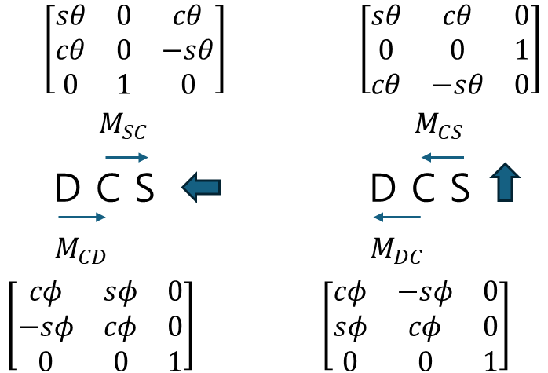
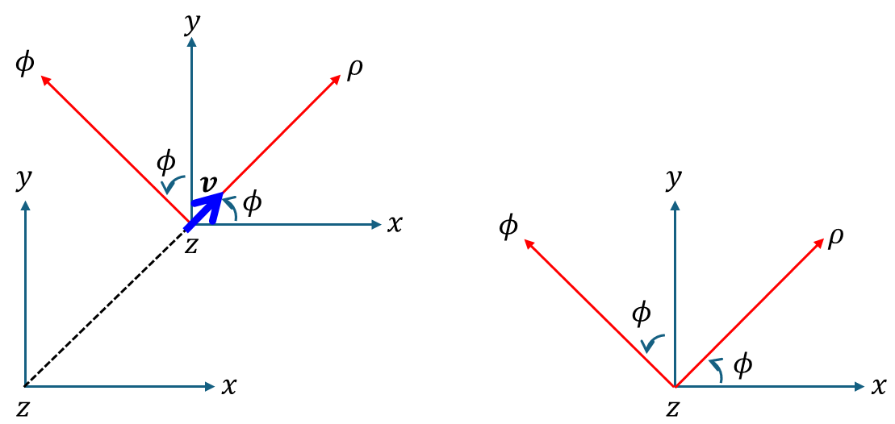
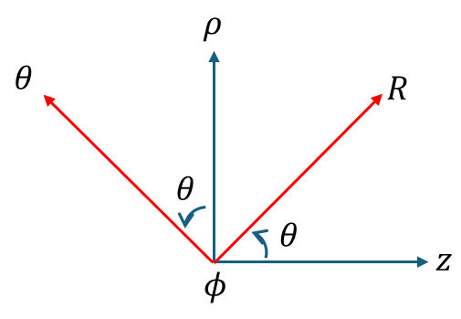

+++
title = "(b) Tensor components transformation II"
weight = 7
+++

---

**중요사항: 동일 [실 공간]** 에 대한 것으로 **기저를 다르게 표현하였을 때, 텐서의 성분 변환** 을 다룬다.

---

### 0. 정리

- **데카르트 → 원통, 원통 → 구**

$$
M_{CD}=\begin{bmatrix}
    \cos\phi & \sin\phi & 0 \\
    -\sin\phi & \cos\phi & 0 \\
    0 & 0 & 1
\end{bmatrix}, \quad 
M_{CS}=\begin{bmatrix}
    \sin\theta & 0 & \cos\theta \\
    \cos\theta & 0 & -\sin\theta \\
    0 & 1 & 0
\end{bmatrix}
$$

- **원통 → 데카르트, 구 → 원통**

$$
M_{DC}=\begin{bmatrix}
    \cos\phi & -\sin\phi & 0 \\
    \sin\phi & \cos\phi & 0 \\
    0 & 0 & 1
\end{bmatrix},\quad
M_{CS}=\begin{bmatrix}
    \sin\theta & \cos\theta & 0 \\
    0 & 0 & 1 \\
    \cos\theta & -\sin\theta & 0
\end{bmatrix}
$$

---

### 1. 데카르트 좌표계 ↔︎ 원통 좌표계

- 데카르트 좌표계 기준에서, 데카르트 좌표계의 국소 벡터 표현

$$
u_1\begin{bmatrix}
    1 \\ 0 \\ 0
\end{bmatrix}
+u_2\begin{bmatrix}
    0 \\ 1 \\ 0
\end{bmatrix}
+u_3\begin{bmatrix}
    0 \\ 0 \\ 1
\end{bmatrix}
=\begin{bmatrix}
    1 & 0 & 0 \\
    0 & 1 & 0 \\
    0 & 0 & 1
\end{bmatrix}
\begin{bmatrix}
    u_1 \\ u_2 \\ u_3
\end{bmatrix}
$$

- 데카르트 좌표계 기준에서, 원통 좌표계의 국소 벡터 표현

$$
v_1\begin{bmatrix}
    \cos\phi \\ \sin\phi \\ 0
\end{bmatrix}
+v_2\begin{bmatrix}
    -\sin\phi \\ \cos\phi \\ 0
\end{bmatrix}
+v_3\begin{bmatrix}
    0\\ 0\\ 1
\end{bmatrix}
=\begin{bmatrix}
    \cos\phi & -\sin\phi & 0 \\
    \sin\phi & \cos\phi & 0 \\
    0 & 0 & 1
\end{bmatrix}
\begin{bmatrix}
    v_1 \\ v_2 \\ v_3
\end{bmatrix}
$$

국소 벡터는 텐서 이므로, 좌표계에 상관없이 동일해야 한다.

$$
\begin{bmatrix}
    u_1 \\ u_2 \\ u_3
\end{bmatrix}
=\begin{bmatrix}
    \cos\phi & -\sin\phi & 0 \\
    \sin\phi & \cos\phi & 0 \\
    0 & 0 & 1
\end{bmatrix}
\begin{bmatrix}
    v_1 \\ v_2 \\ v_3
\end{bmatrix}
$$

또한, **위의 행렬은 회전변환 행렬이므로, 유니타리 연산자** 이다. 따라서, 역행렬은 전치행렬과 같다.

$$
\begin{bmatrix}
    v_1 \\ v_2 \\ v_3
\end{bmatrix}
=\begin{bmatrix}
    \cos\phi & \sin\phi & 0 \\
    -\sin\phi & \cos\phi & 0 \\
    0 & 0 & 1
\end{bmatrix}
\begin{bmatrix}
    u_1 \\ u_2 \\ u_3
\end{bmatrix}
$$

---

### 2. 원통 좌표계 ↔︎ 구 좌표계

- 원통 좌표계 기준에서, 원통 좌표계의 국소 벡터 표현

$$
u_1\begin{bmatrix}
    1 \\ 0\\ 0
\end{bmatrix}
+u_2\begin{bmatrix}
    0 \\ 1 \\ 0
\end{bmatrix}
+u_3\begin{bmatrix}
    0 \\ 0 \\ 1
\end{bmatrix}
=\begin{bmatrix}
    1 & 0 & 0 \\
    0 & 1 & 0 \\
    0 & 0 & 1
\end{bmatrix}
\begin{bmatrix}
    u_1 \\ u_2 \\ u_3
\end{bmatrix}
$$

- 원통 좌표계 기준에서, 구 좌표계의 국소 벡터 표현

$$
v_1\begin{bmatrix}
    \sin\theta \\ 0 \\ \cos\theta
\end{bmatrix}
+v_2\begin{bmatrix}
    \cos\theta \\ 0 \\ -\sin\theta
\end{bmatrix}
+v_3\begin{bmatrix}
    0 \\ 1 \\ 0
\end{bmatrix}
=\begin{bmatrix}
    \sin\theta & \cos\theta & 0 \\
    0 & 0 & 1 \\
    \cos\theta & -\sin\theta & 0
\end{bmatrix}
\begin{bmatrix}
    v_1 \\ v_2 \\ v_3
\end{bmatrix}
$$

국소 벡터는 텐서 이므로, 좌표계에 상관없이 동일해야 한다.

$$
\begin{bmatrix}
    u_1 \\ u_2 \\ u_3
\end{bmatrix}
=\begin{bmatrix}
    \sin\theta & \cos\theta & 0 \\
    0 & 0 & 1 \\
    \cos\theta & -\sin\theta & 0
\end{bmatrix}
\begin{bmatrix}
    v_1 \\ v_2 \\ v_3
\end{bmatrix}
$$

또한, **위의 행렬은 회전변환 행렬이므로, 유니타리 연산자** 이다. 따라서, 역행렬은 전치행렬과 같다.

$$
\begin{bmatrix}
    v_1 \\ v_2 \\ v_3
\end{bmatrix}
=\begin{bmatrix}
    \sin\theta & 0 & \cos\theta \\
    \cos\theta & 0 & -\sin\theta \\
    0 & 1 & 0
\end{bmatrix}
\begin{bmatrix}
    u_1 \\ u_2 \\ u_3
\end{bmatrix}
$$

---

### 3. 데카르트 좌표계(D) → 구좌표계(S)

데카르트 좌표계에서 구좌표계로의 **좌표 변환 행렬** $M_{SD}$ 는

$$
M_{SD}=M_{SC}M_{CD}
$$

$$
M_{SD}=\begin{bmatrix}
    \sin\theta & 0 & \cos\theta \\
    \cos\theta & 0 & -\sin\theta \\
    0 & 1 & 0
\end{bmatrix}
\begin{bmatrix}
    \cos\phi & \sin\phi & 0 \\
    -\sin\phi & \cos\phi & 0 \\
    0 & 0 & 1
\end{bmatrix}
$$

구좌표계에서 데카르트 좌표계로의 **좌표 변환 행렬** $M_{DS}$ 는

$$
M_{DS}=M_{DC}M_{CS}
$$

$$
M_{DS}=\begin{bmatrix}
    \sin\theta & \cos\theta & 0 \\
    0 & 0 & 1 \\
    \cos\theta & -\sin\theta & 0
\end{bmatrix}
\begin{bmatrix}
    \cos\phi & -\sin\phi & 0 \\
    \sin\phi & \cos\phi & 0 \\
    0 & 0 & 1
\end{bmatrix}
$$

---

**example1)**

Express vector $\vec{A}=\hat{x}\left(x+y\right)+\hat{y}\left(y-x\right)+\hat{z}z$ in spherical coordinates.


    
$$
M_{SD}=\begin{bmatrix}
    \sin\theta & 0 & \cos\theta \\
    \cos\theta & 0 & -\sin\theta \\
    0 & 1 & 0
\end{bmatrix}
\begin{bmatrix}
    \cos\phi & \sin\phi & 0 \\
    -\sin\phi & \cos\phi & 0 \\
    0 & 0 & 1
\end{bmatrix}
=\begin{bmatrix}
    \sin\theta\cos\phi & \sin\theta\sin\phi & \cos\theta \\
    \cos\theta\cos\phi & \cos\theta\sin\phi & -\sin\theta \\
    -\sin\phi & \cos\phi & 0
\end{bmatrix}
$$

좌표변환을 수행한다.

$$
\begin{bmatrix}
    A_{R} \\ A_{\theta} \\ A_{\phi}
\end{bmatrix}
=\begin{bmatrix}
    \sin\theta\cos\phi & \sin\theta\sin\phi & \cos\theta \\
    \cos\theta\cos\phi & \cos\theta\sin\phi & -\sin\theta \\
    -\sin\phi & \cos\phi & 0
\end{bmatrix}
\begin{bmatrix}
    x+y \\ y-x \\ z
\end{bmatrix}
$$

$$
=\begin{bmatrix}
    \left(x+y\right)\sin\theta\cos\phi+\left(y-x\right)\sin\theta\sin\phi+z\cos\theta \\
    \left(x+y\right)\cos\theta\cos\phi+\left(y-x\right)\cos\theta\sin\phi-z\sin\theta \\
    -\left(x+y\right)\sin\phi+\left(y-x\right)\cos\phi
\end{bmatrix}
$$
    
x,y,z 는 아래와 같다.
    
$$
x=r\sin\theta\cos\phi
$$
    
$$
y=r\sin\theta\sin\phi
$$
    
$$
z=r\cos\theta
$$

대입하면,

$$
\begin{bmatrix}
    A_{R} \\ A_{\theta} \\ A_{\phi}
\end{bmatrix}
=\begin{bmatrix}
    R \\ 0 \\ r\sin\theta
\end{bmatrix}
$$



---