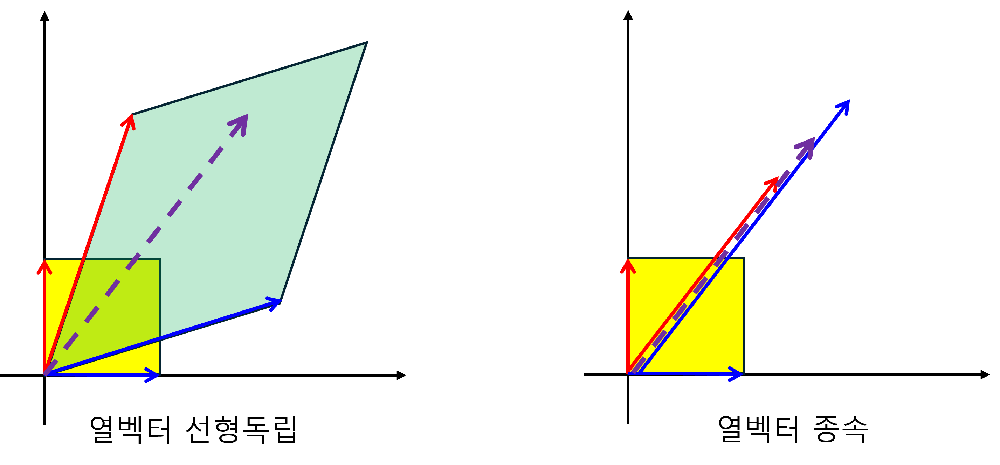

+++
title = "(b) Column vector of matrix"
weight = 6
+++

---

### 1. Matrix는 선형 변환된 열벡터 기저의 집합

행렬은 아래와 같이 표현할 수 있다.

$$
A
=\begin{bmatrix}
    A_{11} & A_{12} \\
    A_{21} & A_{22} 
\end{bmatrix}
$$

표준기저와의 연산은

$$
\begin{bmatrix}
    A_{11} \\ A_{12}
\end{bmatrix}
=\begin{bmatrix}
    A_{11} & A_{12} \\
    A_{21} & A_{22}
\end{bmatrix}
\begin{bmatrix}
    1 \\ 0
\end{bmatrix}
$$

$$
\begin{bmatrix}
    A_{21} \\ A_{22}
\end{bmatrix}
=\begin{bmatrix}
    A_{11} & A_{12} \\
    A_{21} & A_{22}
\end{bmatrix}
\begin{bmatrix}
    0 \\ 1
\end{bmatrix}
$$

따라서, **Matrix 는 선형 변환된 기저의 열벡터 집합이다.**

---

### 2. 행렬 연산은 선형 변환된 기저를 scaling 하고 더한 결과

행렬 연산은 아래와 같이 표현할 수 있다.

$$
A\vec{u}
=\begin{bmatrix}
    A_{11} & A_{12} \\
    A_{21} & A_{22} 
\end{bmatrix}
\begin{bmatrix}
    u_1 \\ u_2 
\end{bmatrix}
=u_1\begin{bmatrix}
    A_{11} \\ A_{21} 
\end{bmatrix}
+u_2\begin{bmatrix}
    A_{12} \\ A_{22} 
\end{bmatrix}
$$

---

### 3. 행렬 연산(선형 변환)의 의미

행렬의 열벡터는 **변환된 기저의 집합** 이라고 하였다. **행렬연산(선형변환)의 결과는 이 변환된 기저가 만드는 공간에 속해** 있다.

- **열벡터간의 선형독립** : 행벡터가 선형 독립이면, 공간의 차원이 유지된다.
- **열벡터간의 종속** : 행벡터가 종속이면, 공간의 차원은 축소된다.