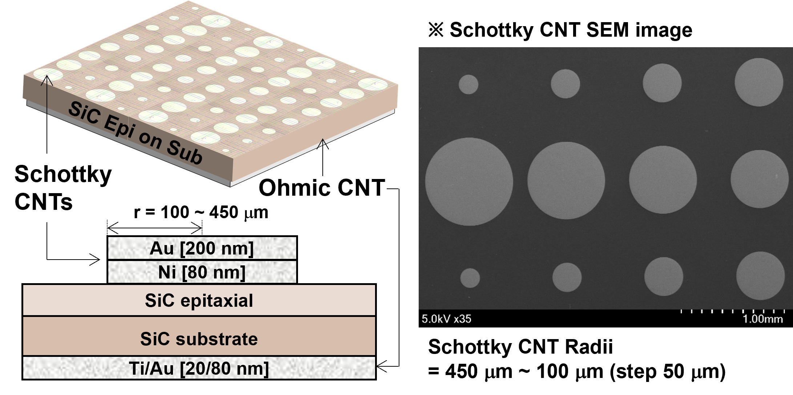
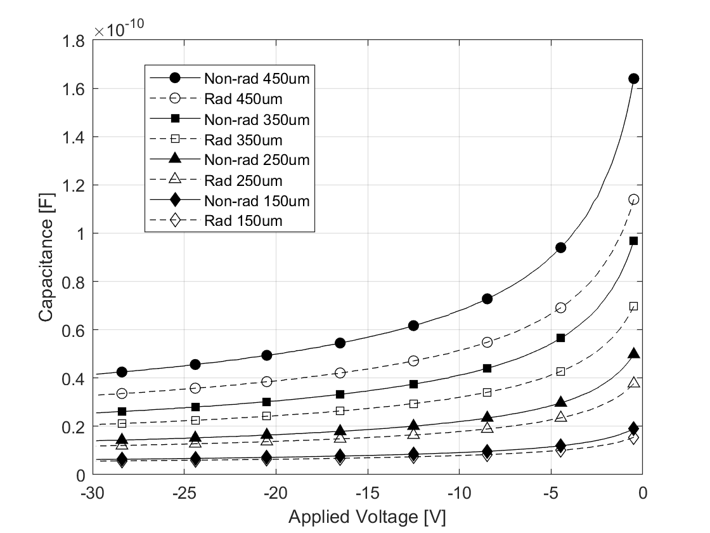
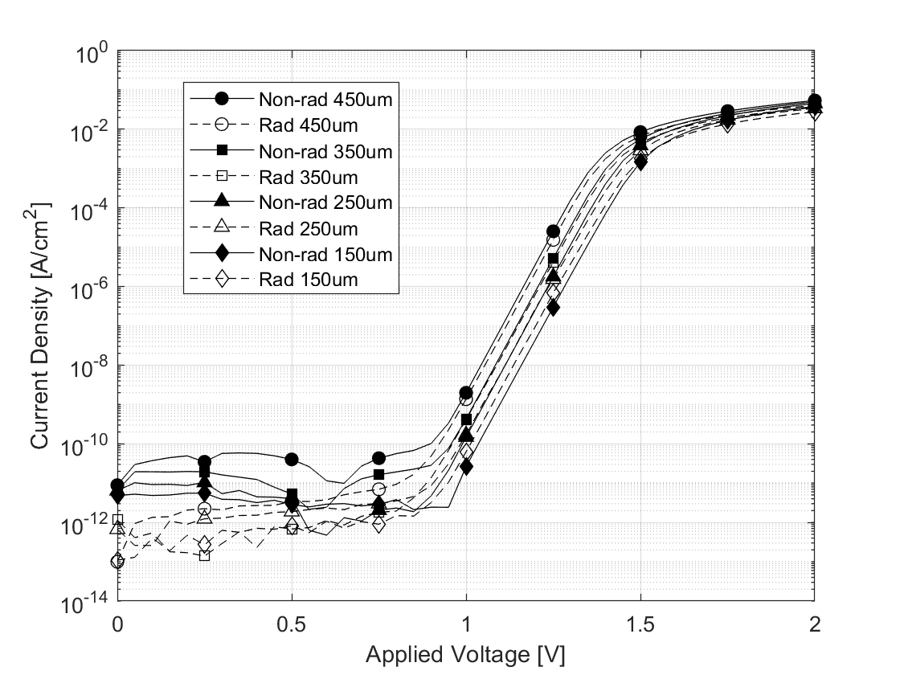

+++
title = "Paper_eng"
weight = 11
+++

---

### Asymptotic Series Model for Quantum Transport at Defective Interfaces

Kibeom Kim1, Young Joon Yoon2*, Jea Hwa Seo3*

1kohmeutto@gmail.com

2School of Electronics and Mechanical Engineering, Gyeongkuk National University, Andong, Republic of Korea (yjyoon@gknu.ac.kr)

3Advanced Semiconductor Research Center, Power Semiconductor Research Division, Korea Electrotechnology Research Institute (KERI), Changwon-si, Republic of Korea (jaehwaseo@keri.re.kr)

*Correspondence: Young Jun Yoon and Jae Hwa Seo

---

### Abstract

This study presents an algebraic quantum-transport model that quantitatively describes charge transport at defect-rich metal-semiconductor interfaces, addressing the limitations of conventional classical thermionic-emission theories that rely on phenomenological fitting parameters. By combining the nonequilibrium Green's function (NEGF) formalism with the Landauer-Büttiker approach, the inelastic scattering and quantum decoherence induced by interface defects are defined as the complex self-energy of a non-Hermitian effective Hamiltonian and modeled using a Lorentzian spectral function. To analytically evaluate the complex transport integral, an asymptotic series expansion based on Watson's lemma is introduced. This yields a closed-form solution that enables the extraction of the microscopic interface scattering amplitude ($\eta_0$) and the quantum relaxation time strictly from direct-current (DC) I-V measurements. Application of this model to 4H-SiC Schottky barrier diodes (SBDs) subjected to high-energy proton irradiation enables the quantification of the interface trap density, which increases to a range of $3.60 \times 10^{12} \text{ to } 5.55 \times 10^{12} \text{ cm}^{-2}$ post-irradiation. Furthermore, analysis of the device perimeter-to-area ratio reveals a geometric scaling behavior; smaller devices exhibit a reduced quantum coherence length due to the accumulation of peripheral defects. This analytical approach provides a broad theoretical basis for investigating charge-transport mechanisms across various nonideal interfaces, including ultrawide-bandgap (UWBG) materials and two-dimensional van der Waals heterojunctions.

---

### 1. Introduction

The metal-semiconductor interface is a primary physical region governing the charge-transport properties of electronic devices. In solid-state physics and semiconductor-device engineering, classical thermionic-emission (TE) and thermionic-field-emission (TFE) theories have primarily been utilized to analyze charge transport across this interface \cite{ref1,ref2}. For ideal single-crystal interfaces with controlled defect densities, these semiclassical approximations remain valid, and the conduction characteristics of the device are determined by the theoretical Richardson constant and the barrier height. However, nonideal interfaces, including devices subjected to radiation exposure or degradation stress and heterojunctions based on ultrawide-bandgap (UWBG) or two-dimensional materials, contain numerous atomic point defects and dangling bonds \cite{ref3,ref4,ref5,ref6,ref7}. As electrons traverse these interfaces, they experience inelastic scattering and quantum decoherence caused by dense defect networks, in addition to potential-barrier tunneling. Consequently, measured current-voltage (I-V) characteristics deviate from classical theoretical predictions, exhibiting nonlinear behavior with increased leakage currents \cite{ref8,ref9}. To compensate for these deviations, previous studies have predominantly employed phenomenological fitting methods, such as increasing the ideality factor ($n$) or empirically reducing the effective Richardson constant \cite{ref10,ref11,ref12,ref13}. However, addressing degradation by altering thermodynamic constants, defined by the effective mass of the electron and absolute temperature, conflicts with the conservation of the density of states and lacks physical consistency.

To address these analytical limitations, this study proposes an analytical quantum-transport model independent of empirical fitting parameters. Based on the Landauer-Büttiker transport formalism and nonequilibrium Green's function (NEGF) theory, scattering due to interface defects is treated as a complex eigenvalue of a non-Hermitian effective Hamiltonian \cite{ref14,ref15,ref16}. This approach extends the one-dimensional transport spectrum of electrons from a conventional Dirac delta function to a Lorentzian distribution, incorporating quantum-mechanical scattering and dephasing effects into the macroscopic current equation. Furthermore, to evaluate the transport integral combining Fermi-Dirac statistics and the Lorentzian spectral function without numerical approximations, a two-stage asymptotic analysis method is introduced to derive a closed-form solution. The peak contribution near the barrier maximum is evaluated by applying the Sokhotski-Plemelj theorem, while the nonideal scattering tail contribution in the low-energy regime is expanded into an asymptotic series using Laplace's method and Watson's lemma. This yields an algebraic analytical solution that enables the calculation of the microscopic interface scattering amplitude and quantum relaxation time strictly from direct-current (DC) I-V measurement data.

To verify the practical device applicability of the proposed theoretical model, 4H-SiC Schottky barrier diodes are employed as an experimental case. When lattice damage data generated through a 55 MeV proton-irradiation experiment using a linear accelerator are applied to this model, the variations in quantum relaxation time ($\tau$) and quantum coherence length ($l_{coh}$) before and after irradiation are quantitatively extracted through the correlation of the macroscopic current deviation to the microscopic interface scattering amplitude ($\eta_0$), while keeping the thermodynamic constants fixed. Furthermore, the physical scaling characteristics are analyzed using the device size and perimeter-to-area (P/A) ratio as variables.
---

### 2. Nomenclature and Assumptions

Prior to the mathematical development of the proposed quantum-transport model, the fundamental constants and device property symbols used in the equations are defined, and the physical assumptions applied to the model are specified. The material properties of 4H-SiC and the primary thermodynamic variables utilized to derive the transport equation are defined as follows:

- $e$: Elementary charge ($1.602 \times 10^{-19}$ C)
- $k_B$: Boltzmann constant ($1.38 \times 10^{-23}$ J/K)
- $h, \hbar$: Planck constant and reduced Planck constant ($\hbar = h/2\pi$)
- $T$: Absolute temperature (K)
- $m_0$: Electron rest mass ($9.11 \times 10^{-31}$ kg)
- $m^*_R$: Richardson effective mass of 4H-SiC (utilized for calculating the Richardson-Dushman constant)
- $m_{\parallel}$: Transport effective mass along the $c$-axis direction
- $A^*$: Richardson-Dushman constant ($A^* = 4\pi e m^*_R k_B^2 / h^3 \approx 146$ A cm$^{-2}$ K$^{-2}$)
- $N_C$: Effective density of states in the conduction band ($\text{cm}^{-3}$)
- $N_D$: Donor doping concentration ($\text{cm}^{-3}$)
- $V$: Forward applied voltage
- $V_{bi}$: Built-in potential
- $E_c$: Conduction-band minimum energy of the semiconductor bulk ($E_c = eV + k_BT \ln(N_C/N_D)$)
- $\Phi_B$: Effective electrostatic barrier height ($\Phi_B = eV_{bi} + k_BT \ln(N_C/N_D)$)
- $\Delta E$: Effective barrier height relative to the conduction-band minimum ($\Delta E = \Phi_B - E_c = e(V_{bi} - V)$)
- $\eta_0$: Interface scattering amplitude

To derive an analytical solution for the transport phenomena, this model is predicated on the following physical conditions:

- Single-band transport: Only electron transport through the conduction band is considered. An intermediate voltage regime is assumed where the influence of Shockley-Read-Hall (SRH) recombination in the space-charge region via the valence band is excluded.
- Parabolic band approximation: A quadratic dispersion relation of $E(\mathbf{k}) = \Phi_B + \hbar^2\mathbf{k}^2 / 2m^*$ is assumed for electrons near the conduction-band minimum.
- Boltzmann statistics limit: The Fermi-Dirac distribution function is approximated by the Maxwell-Boltzmann exponential function in the energy regime satisfying the nondegenerate condition ($E - \mu \gg k_BT$).

---

### 3. 1D quantum transport

Electrons within an ideal single-crystal semiconductor are described by a Hermitian Hamiltonian in a periodic potential, yielding real eigenvalues. However, when interface defects are present due to radiation exposure or heterojunction formation, electrons undergo inelastic scattering while traversing the interface. To describe the dissipation process of this open quantum system, a complex self-energy ($\Sigma = \Delta - i\eta_0$), where $\Delta$ is the real energy shift and $\eta_0$ is the interface scattering amplitude, is introduced to define an effective Hamiltonian ($\hat{H}_{\text{eff}}$) [17-21]:

$$
\hat{H}_{eff}(\mathbf{k},V) = E_r(\mathbf{k},V) - i\eta_0
\quad\text{(1)}
$$

Here, $\mathbf{k}$ is the three-dimensional momentum, and $E_r(\mathbf{k},V)$ is the kinetic energy modulated by the applied voltage $V$. By constructing the retarded Green's function from $\hat{H}_{\text{eff}}$ and extracting its imaginary part, the spectral function ($A(E, \mathbf{k}, V)$) dependent on the total energy ($E$) is derived as follows:

$$
A(E, \mathbf{k}, V) = \frac{1}{\pi} \frac{\eta_0}{(E - E_r(\mathbf{k},V))^2 + \eta_0^2}
\quad\text{(2)}
$$

While $A$ of an ideal system converges to a Dirac delta function, it exhibits a Lorentzian distribution with a finite full width at half maximum ($\Gamma = 2\eta_0$) at a nonideal interface due to $\eta_0$. This indicates the energy uncertainty of the electron state resulting from interactions with defects. Based on a statistical-mechanical lifetime model ($P(t) \propto e^{-t/\tau}$), $\eta_0$ induces temporal dissipation of the wave function. Consequently, the quantum relaxation time ($\tau$) of the carrier due to interface scattering is defined as follows [22]:

$$
\tau = \frac{\hbar}{2\eta_0}
\quad\text{(3)}
$$

This satisfies the Heisenberg energy-time uncertainty principle ($\Gamma \tau = \hbar$) relating $\Gamma$ and $\tau$. To convert the microscopic quantum-state spectrum into a macroscopic direct-current (DC) at the interface, the Landauer-Büttiker transport formalism is applied [23,24]. The steady-state total current density ($J(V)$) consists of an integration over $\mathbf{k}$ and $E$. Applying the forward-transport condition where the longitudinal momentum ($k_z$) satisfies $k_z > 0$, and the Boltzmann approximation ($E - \mu \gg k_BT$) where $\mu$ is the chemical potential, yields the thermodynamic driving force function ($\Delta F(V) = \exp(eV/k_BT) - 1$). This is modeled as a one-dimensional scattering problem where defect scattering primarily disrupts translational symmetry in the $z$-direction perpendicular to the junction plane, while the transverse momentum ($\mathbf{k}_\perp$) is conserved [25]. Accordingly, $E$ is separated as $E = E_z + \epsilon_\perp$, where $E_z$ is the longitudinal total energy and $\epsilon_\perp$ is the transverse kinetic energy, and $J(V)$ is orthogonally decomposed as follows:

$$
J(V) = 2e \Delta F(V) \int_{-\infty}^{\infty} dE_z \exp\left(-\frac{E_z}{k_BT}\right) \int_0^\infty \frac{dk_z}{2\pi} v_z(k_z) A_z(E_z, \epsilon_z) \int_0^\infty \frac{d^2\mathbf{k}_\perp}{(2\pi)^2} \exp\left(-\frac{\epsilon_\perp}{k_BT}\right)
\quad\text{(4)}
$$

Here, $v_z(k_z)$ is the group velocity in the $z$-direction, $A_z(E_z, \epsilon_z)$ is the longitudinal spectral function, and $\epsilon_z$ is the vertical kinetic energy. The $\mathbf{k}_\perp$ component within the transport integral is evaluated analytically under the parabolic band approximation, yielding the Richardson-Dushman constant ($A^* = 4\pi e m^*_R k_B^2 / h^3$). Consequently, $J(V)$ reduces to a one-dimensional quantum-transmission function ($U(E_z)$) dependent on $\epsilon_z$. Evaluating $U(E_z)$ via an arctangent definite integral yields the following closed-form solution:

$$
U(E_z) = \int_0^\infty d\epsilon_z \frac{1}{\pi} \frac{\eta_0}{(E_z - \Phi_B - \epsilon_z)^2 + \eta_0^2} = \frac{1}{2} + \frac{1}{\pi} \arctan\left(\frac{E_z - \Phi_B}{\eta_0}\right)
\quad\text{(5)}
$$

Defining the presence of electrons exclusively at energy states above the conduction-band minimum ($E_c$) using the Heaviside step function ($\Theta(E_z - E_c)$), $J(V)$ is defined as a one-dimensional vertical energy integral ($\mathcal{I}_z$) as follows:

$$
J(V) = A^*T^2 \frac{\Delta F(V)}{k_BT} \int_{E_c}^{\infty} dE_z \, U(E_z) \exp\left(-\frac{E_z}{k_BT}\right) = A^*T^2 \frac{\Delta F(V)}{k_BT} \mathcal{I}_z
\quad\text{(6)}
$$

---

### 4. Asymptotic analysis

The previously derived $\mathcal{I}_z$ comprises the product of $U(E_z)$ and the Boltzmann exponential decay function $\exp(-E_z/k_BT)$, which cannot be integrated into elementary analytical functions. To avoid truncation errors and computational costs associated with numerical integration, asymptotic analysis is introduced in this section. $\mathcal{I}_z$ is decomposed into two distinct physical contributions: the peak contribution ($\mathcal{I}_{peak}$) near the barrier maximum and the boundary contribution ($\mathcal{I}_{boundary}$) near $E_c$.

$$
\mathcal{I}_z = \int_{E_c}^{\infty} dE_z \, U(E_z) \exp\left(-\frac{E_z}{k_BT}\right) 
= \mathcal{I}_{peak} + \mathcal{I}_{boundary}
\quad\text{(7)}
$$

In the energy regime where $E_z$ approaches $\Phi_B$, the electron thermal energy exceeds $\eta_0$. Consequently, the limit condition ($\eta_0 \to 0^+$) representing negligible scattering effects is applied. Under this condition, $U(E_z)$ based on the non-Hermitian operator converges to the Dirac delta function $\delta(E_z - \Phi_B)$ by the Sokhotski-Plemelj theorem [26]. As the transmission-function kernel within the integrand reduces to a delta function at the barrier maximum, the integral is resolved, yielding $\mathcal{I}_{peak}$ corresponding to classical ideal thermionic emission:

$$
\mathcal{I}_{peak} = k_BT \exp\left(-\frac{\Phi_B}{k_BT}\right)
\quad\text{(8)}
$$

This represents the macroscopic current behavior at an ideal interface devoid of scattering, demonstrating that the proposed quantum-transport model incorporates the classical thermionic-emission theory under the correspondence principle. In the low-energy regime below the barrier ($E_z < \Phi_B$), the influence of $\eta_0$ becomes significant. The transmission probability governed by quantum scattering combines with the exponential decay function to form $\mathcal{I}_{boundary}$. Due to the nature of $\exp(-E_z/k_BT)$, the primary contribution of this integral is concentrated near $E_c$. According to Laplace's method, an integration variable ($t$) is substituted as $t = E_z - E_c$ to shift the lower limit to 0:

$$
\mathcal{I}_{boundary} = \exp\left(-\frac{E_c}{k_BT}\right) \int_{0}^{\infty} dt \, U(t + E_c) \exp\left(-\frac{t}{k_BT}\right) 
\quad\text{(9)}
$$

To apply Watson's lemma to the above equation, $U(t + E_c)$ is expanded into a Taylor series near $t=0$. Under the condition that $\Delta E$ is greater than $\eta_0$ ($\Delta E \gg \eta_0$), the $n$-th order derivative ($U^{(n)}(E_c)$) is approximated as $U^{(n)}(E_c) \approx (\eta_0/\pi)(n!/\Delta E^{n+1})$. By multiplying each expanded polynomial term by the exponential function and performing term-by-term integration, an asymptotic series is derived utilizing the properties of the gamma function [27]:

$$
\mathcal{I}_{boundary} = \left[ \frac{\eta_0 k_BT}{\pi \Delta E} \exp\left(-\frac{E_c}{k_BT}\right) \right] \cdot \mathcal{F}_{asymp}
\quad\text{(10)}
$$

Here, the dimensionless asymptotic correction term ($\mathcal{F}_{asymp}$) is defined as follows:

$$
\mathcal{F}_{asymp} = 1 + \sum_{n=1}^{\infty} n! \left( \frac{k_BT}{\Delta E} \right)^n
\quad\text{(11)}
$$

This asymptotic series expansion converts the numerical integration process into an algebraic polynomial. Although the series derived from Watson's lemma diverges as $n \to \infty$ due to the factorial ($n!$) term, Poincaré asymptotic expansion states that when the expansion parameter ($k_BT/\Delta E$) is small, truncating the series at a finite order ($N$) limits the remainder error to the magnitude of the next-order ($N+1$) term. Since $k_BT/\Delta E$ of this model is less than 1, the expansion is truncated at the first-order term ($n=1$) to construct an algebraic solution with controlled error. Substituting the derived $\mathcal{I}_{peak}$ and $\mathcal{I}_{boundary}$ into $J(V)$, the measured macroscopic current ($J_{exp}(V)$) is expressed as a linear combination of the classical ideal current component ($J_{ideal}(V)$) and the quantum scattering tail component:

$$
J_{exp}(V) = \underbrace{ A^*T^2 \Delta F(V) \exp\left(-\frac{\Phi_B}{k_BT}\right) }_{J_{ideal}(V)} + \underbrace{ A^*T^2 \Delta F(V) \frac{\eta_0}{\pi \Delta E} \exp\left(-\frac{E_c}{k_BT}\right) \mathcal{F}_{asymp} }_{\text{Non-ideal Scattering Tail}}
\quad\text{(12)}
$$

This addresses the limitations of conventional fitting practices. Rather than adjusting $A^*$, an intrinsic material constant, to an effective value to compensate for ($J_{exp}(V) - J_{ideal}(V)$), this deviation is analytically assigned to the contribution of $\eta_0$. Rearranging the equation by substituting the relation for $E_c = eV + k_BT \ln(N_C/N_D)$ and $\Delta F(V)$ yields $\eta_0$ as follows:

$$
\eta_0 = \frac{\pi e(V_{bi}-V)}{\mathcal{F}_{asymp}} \left[ \frac{J_{exp}(V)}{A^*T^2} \cdot \frac{N_C/N_D}{1 - \exp\left(-\frac{eV}{k_BT}\right)} - \exp\left(-\frac{e(V_{bi}-V)}{k_BT}\right) \right]
\quad\text{(13)}
$$

This closed-form solution provides a model for extracting $\eta_0$ strictly based on direct-current (DC) I-V measurement data ($J_{exp}(V), V$) and fundamental material parameters ($A^*, V_{bi}, N_C$, and $N_D$), without requiring phenomenological fitting variables.

---

### 5. C-V & I-V curves analysis

 

<small>FIG. 1. Schematic of the device structure and scanning-electron-microscope (SEM) surface image of the fabricated 4H-SiC Schottky barrier diodes (SBDs). The three-dimensional and cross-sectional schematics on the left illustrate the stacked structure of the Schottky electrode (Ni/Au, 80/200 nm) formed on the top of the SiC epitaxial layer and the ohmic electrode (Ti/Au, 20/80 nm) at the bottom of the substrate. The planar SEM image on the right shows the circular Schottky contact arrays patterned in 50-$\mu\text{m}$ increments from 100 $\mu\text{m}$ to 450 $\mu\text{m}$ to analyze the geometric size dependence of the devices.<small>

 

The analytical model based on $\mathcal{F}_{asymp}$ derived previously is applied to analyze the charge-transport characteristics of 4H-SiC SBDs exposed to high-energy proton irradiation. The device features a 10-$\mu\text{m}$-thick epitaxial layer grown on the top of the substrate, doped with nitrogen (N) at a concentration of approximately $1.84 \times 10^{16}\text{ cm}^{-3}$. On the back side of the device, a Ti/Au-based ohmic metal layer was deposited via electron-beam evaporation, followed by rapid thermal annealing (RTA) in a nitrogen atmosphere at $950^{\circ}\text{C}$ to minimize contact resistance. The top Schottky electrode was completed by depositing Ni/Au metal through a lithography process. To maintain the characteristics of the metal-semiconductor interface, no additional thermal annealing was performed after the top deposition. To cross-validate the effect of the geometric scale on radiation vulnerability, experimental groups were fabricated by subdividing the radius ($r$) of the Schottky contacts in 50-$\mu\text{m}$ increments from 100 $\mu\text{m}$ to 450 $\mu\text{m}$ (see Fig. 1). The proton-irradiation experiment was conducted using the 100-MeV linear accelerator at the Korea Multi-purpose Accelerator Complex (KOMAC), affiliated with the Korea Atomic Energy Research Institute (KAERI). The experimental devices were exposed to a 55-MeV proton beam at room temperature with a cumulative fluence of $1 \times 10^{14}\text{ cm}^{-2}$ under zero external bias.

Independent C-V measurements were performed for each $r$ to extract $V_{bi}$ and $N_D$ of the corresponding device. Conversely, $A^*$ was fixed at $146\text{ A cm}^{-2}\text{K}^{-2}$ reflecting the density of states of 4H-SiC. The $m_{\parallel}$ required to calculate the one-dimensional directional thermal velocity ($v_R$) was set to $0.42m_0$ to account for the crystallographic anisotropy of 4H-SiC [28-30]. As shown in Figs. 2 and 3, following the high-energy proton irradiation, the 4H-SiC SBDs exhibit a macroscopic capacitance degradation alongside nonlinear $J_{exp}(V)$ fluctuations dependent on the voltage regime and device size. This indicates that displacement damage induced by elastic collisions between protons and lattice atoms complexly altered the physical equilibrium state within the epitaxial layer and the one-dimensional vertical and two-dimensional peripheral charge-transport mechanisms.

 

<small>FIG. 2. Reverse capacitance-voltage (C-V) characteristics of 4H-SiC SBDs before and after 55-MeV proton irradiation ($1 \times 10^{14} \text{ cm}^{-2}$). The capacitance behavior before (Non-rad, solid lines) and after (Rad, dashed lines) irradiation according to $r$ ($150, 250, 350, 450 \, \mu\text{m}$) is compared over the reverse applied voltage range of $0 \sim -30$ V. A decrease in capacitance is observed across all device sizes due to the carrier-removal effect within the epitaxial layer caused by proton irradiation.<small>

 

Examining the C-V measurement results, the junction capacitance tends to decrease across the entire reverse-voltage regime after proton irradiation (see Fig. 2). This capacitance reduction is primarily attributed to the carrier-removal effect within the epitaxial layer [31,32]. High-energy proton irradiation generates numerous Frenkel pairs. During this process, generated carbon and silicon vacancies or interstitial atoms migrate and bond with existing substitutional nitrogen donor atoms [33,34]. These bonds form electrically inactive complexes, leading to nitrogen donor deactivation. Consequently, as $N_D$ decreases, the depletion-layer width expands for a given voltage, resulting in a macroscopic capacitance reduction.

 

<small>FIG 3. Forward current density-voltage (I-V) characteristics of 4H-SiC SBDs before and after 55-MeV proton irradiation ($1 \times 10^{14} \text{ cm}^{-2}$) on a semi-log scale. The current behavior before (Non-rad, solid lines and filled symbols) and after (Rad, dashed lines and empty symbols) irradiation is compared according to $r$ ($150, 250, 350, 450 \, \mu\text{m}$). In the high-voltage regime above 1.55 V, a common decrease in $J_{exp}(V)$ is observed in all devices due to an increase in series resistance ($R_s$). Conversely, in the regime below 1.55 V, a crossover phenomenon occurs depending on the device size.<small>

 

The DC I-V measurement results reveal that the degradation behavior induced by protons varies depending on the applied voltage regime and the geometric size of the device, specifically the perimeter-to-area (P/A) ratio (see Fig. 3). First, in the high-voltage regime above 1.55 V, a common $J_{exp}(V)$ reduction is observed across all devices, where the pre-irradiation (Non-rad) $J_{exp}(V)$ remains higher than the post-irradiation (Rad) $J_{exp}(V)$. The high-voltage regime is where the Schottky barrier is fully open, and the $R_s$ of the epitaxial layer dominates $J_{exp}(V)$. Due to the carrier-removal effect in the bulk confirmed by the preceding C-V analysis, the free-electron concentration decreased, and the resistivity ($\rho$) increased. This increased $R_s$ decelerates the exponential rise of the forward $J_{exp}(V)$, resulting in a lower $J_{exp}(V)$ at identical high voltages [35]. In contrast, in the low- and mid-voltage regimes below 1.55 V, the $J_{exp}(V)$ variation differs according to device size. For large devices with wide active areas (450 and 350 $\mu\text{m}$), the post-irradiation $J_{exp}(V)$ generally decreases even in these regimes. This is a consequence of the increased $R_s$ combined with proton-induced defects accumulated at the interface, which act as inelastic scattering centers and lower the $U(E_z)$ of carriers. However, for small devices (250 and 150 $\mu\text{m}$) with relatively high P/A ratios, a crossover phenomenon is observed where the post-irradiation (Rad) $J_{exp}(V)$ exceeds the pre-irradiation (Non-rad) measurement in specific low-voltage ranges. This indicates that damage is concentrated at the periphery due to the non-uniform electric field and structural characteristics near the device perimeter. Defects accumulated on the peripheral sidewalls form parallel leakage paths mediating SRH recombination and trap-assisted tunneling (TAT) in the low-voltage regime [36,37]. In small devices, as this two-dimensional peripheral leakage current increment surpasses the $J_{exp}(V)$ reduction in the one-dimensional vertical channel, it induces a $J_{exp}(V)$ rise in the low-voltage regime.

---

### 6. Parameter extraction

 

<small>TABLE I. Summary of transport parameters for 4H-SiC SBDs of various sizes before and after 55-MeV proton irradiation ($1 \times 10^{14}$ cm$^{-2}$). $V_{bi}$ and $N_D$ were extracted from C-V measurements in the range of 0.0 to 1.8 V. Microscopic scattering variables, including $R_s$, were derived using the first-order asymptotic series model within the effective voltage regime of the DC I-V data. The quantum coherence length ($l_{coh}$) values for large devices in the pristine state represent baseline limits under ideal transport conditions (ideal TE), as $\eta_0$ converges below the detection limit of the model.</small>c
| Radius | State | $V_{bi}$ (V) | $N_D$   (10^16 cm-3) | $R_s$ (Ohm) | 교정률 (%) | $\eta_0$ (meV) | $\tau$ (ps) | $l_{coh}$ (nm) |
| :--- | :--- | :--- | :--- | :--- | :--- | :--- | :--- | :--- |
| 450 μm | Pristine | 1.4785 | 1.87 | 7.11 | 2.56 | $1.28 \times 10^{-9}$ | $2.57 \times 10^8$ | $1.06 \times 10^{10}$ |
| | Rad | 1.8031 | 1.05 | 13.38 | 5.42 | 0.43 | 0.77 | 31.94 |
| 350 μm | Pristine | 1.5659 | 1.87 | 7.09 | 2.40 | $4.43 \times 10^{-10}$ | $7.44 \times 10^8$ | $3.09 \times 10^{10}$ |
| | Rad | 1.8345 | 1.09 | 14.30 | 5.39 | 0.44 | 0.74 | 30.74 |
| 250 μm | Pristine | 1.6923 | 2.01 | 7.36 | 2.19 | $1.73 \times 10^{-10}$ | $1.90 \times 10^9$ | $7.89 \times 10^{10}$ |
| | Rad | 1.9215 | 1.28 | 14.78 | 4.61 | 0.51 | 0.64 | 26.68 |
| 150 μm | Pristine | 1.9399 | 2.54 | 7.94 | 4.43 | 0.04 | 8.95 | 371.59 |
| | Rad | 2.1360 | 1.81 | 17.07 | 4.09 | 0.66 | 0.50 | 20.72 |

 

Parameters for quantifying interface characteristics are extracted using the previously derived analytical model alongside the C-V and I-V measurement data, and the results are summarized in Table I. The proposed model assumes the thermionic-emission current penetrating the interface potential barrier as the primary component. Therefore, it is necessary to establish an effective voltage window that satisfies the mathematical approximation conditions of the model while excluding the interference regime of parasitic current components. In the high-voltage regime, the voltage drop caused by the increase in $R_s$ distorts the exponential current growth of the device into ohmic behavior. To correct this, the effective voltage ($V_{eff}$) applied to the actual junction area ($A_{area}$) is calculated using the following relation:

$$
V_{eff} = V_{app} - J_{exp} R_{s} A_{area}
\quad\text{(14)}
$$

Here, $V_{app}$ is the applied voltage. The $R_s$ component required for this correction is extracted through linear regression of the $dV_{app}/d\ln J_{exp}(V)$ versus $J_{exp}(V)$ curve. The analysis reveals that $R_s$, which remained in the range of 7.11 to 7.94 $\Omega$ before proton irradiation, increased to a level of 13.38 to 17.07 $\Omega$ after irradiation. In the low-voltage regime, the space-charge recombination current ($J_{rec}$) mediated by deep-level defects within the depletion layer is dominant. Thus, the crossover point where the charge-transport mechanism transitions from space-charge recombination to interface thermionic emission is derived and set as the lower bound ($V_{lower}$) for applying the analytical model. To maintain the validity of the Boltzmann statistical approximation ($E - \mu \gg k_BT$) introduced during the transport integral expansion, the upper bound ($V_{upper}$) is defined as the voltage point where the effective energy barrier secures a thickness of at least $3k_BT$ relative to the Fermi level ($V_{eff} \le V_{bi} - 3k_BT/e$) [38]. Extracting parameters by applying $\mathcal{F}_{asymp}$ up to the first-order term to the I-V data within the established effective voltage window, the numerical correction rate induced by the first-order term relative to the zeroth-order principal component converges to a range of 2.19% to 5.42%. This indicates that the expansion parameter ($k_BT/\Delta E$) is sufficiently small under the integration conditions of the model, rendering the contribution of higher-order terms negligible and allowing the construction of a physically valid analytical solution simply by truncating at the first-order term.

When charges tunnel through the interface barrier, the numerous traps present at the nonideal interface induce an inelastic scattering regime that perturbs the wave-function phase of the carriers. This translates into $\eta_0$ within the macroscopic transport model. $\tau$, an indicator in the time domain, is converted into $l_{coh}$, an indicator in the spatial domain, using the carrier transport velocity. Defining $v_R = \sqrt{k_B T / (2\pi m_{\parallel})}$, $l_{coh}$ calculated as the product of these two physical quantities represents the effective distance over which the electron wave function can maintain phase coherence without inelastic scattering by defects. It is expanded as follows:

$$
l_{coh} = v_R \tau = \frac{\hbar v_R}{2\eta_0}
\quad\text{(15)}
$$

First, $\eta_0$ calculated for the pristine 450-μm and 350-μm large devices is at a baseline level of $10^{-9}$ to $10^{-10}$ meV. The corresponding $l_{coh}$ exceeds 10¹⁰ nm. Since the actual coherence length of carriers at room temperature is limited to within a few tens of nanometers due to lattice phonon (acoustic and optical) scattering, this value cannot be regarded as an absolute physical distance. This divergent derived value is not a calculation error of the scattering model. Rather, it demonstrates that the defect-induced inelastic scattering at the initial device interface remains at a negligible background noise limit compared to phonon scattering, indicating that the measured current follows ideal thermionic-emission behavior. Following proton irradiation, $\eta_0$ increased to a range of 0.43 to 0.66 meV across all four device sizes. Commensurate with the rise in inelastic scattering probability, $\tau$ was calculated in the range of 0.50 to 0.77 ps, and $l_{coh}$ shortened to a level of 20.72 to 31.94 nm.

Second, contrasting the proton-irradiation degradation patterns based on the P/A ratio reveals a tendency for increased vulnerability to proton stress as the P/A ratio increases. For the 450-μm device with the lowest P/A ratio, the post-irradiation $\eta_0$ and $\tau$ were derived as 0.43 meV and 0.77 ps, respectively. However, for the 150-μm device with a high P/A ratio, $\eta_0$ increased to 0.66 meV, and $\tau$ decreased to 0.50 ps. Accordingly, $l_{coh}$ was calculated to be the shortest at 20.72 nm. Analysis of the 150-μm device in the pristine state reveals that, unlike large devices, $\eta_0$ was observed at 0.04 meV (with a corresponding $\tau$ of 8.95 ps) even prior to proton irradiation. This indicates that physical damage incurred during fabrication processes, including plasma etching and edge passivation, is concentrated at the device perimeter. Consequently, smaller devices inherently exhibit a greater influence from initial process defects [39]. When lattice damage generated by proton irradiation is additionally superimposed on the peripheral regions where fabrication-induced initial defects are located, it couples with local edge-field crowding in those areas to accelerate the degradation of device transport characteristics. As a result, as the device size scales down, the accumulation of peripheral defects exerts a dominant influence on the overall transport channel, causing charge carriers to lose phase coherence within a short distance of a few tens of nanometers before penetrating the interface barrier.

---

### 7. Conclusion

This study derived an algebraic quantum-transport model based on an asymptotic series to quantitatively describe charge transport at nonideal, defect-rich metal-semiconductor interfaces. This approach converts the inelastic scattering at the interface into a Lorentzian spectral function and combines it with the Landauer-Büttiker transport formalism, providing a closed-form solution that correlates the uncertainty of the natural linewidth to the macroscopic current deviation. Applying this analytical model to 4H-SiC diodes in a proton-irradiation environment, the physical variations of the quantum relaxation time ($\tau$) and quantum coherence length ($l_{coh}$) were presented based on the interface scattering amplitude ($\eta_0$) extracted from direct-current (DC) I-V measurement data, without the intervention of external parameters or phenomenological conversion processes. Analysis of the C-V and I-V behavior of the device confirmed macroscopic changes, specifically the carrier-removal effect and bulk resistivity increase within the epitaxial layer. Quantitative parameters were extracted by establishing an effective voltage window that excludes parasitic current interference and ohmic voltage drops. The analysis yielded an interface scattering amplitude in the range of 0.43 to 0.66 meV, with a corresponding quantum relaxation time of 0.50 to 0.77 ps and a quantum coherence length of 20.72 to 31.94 nm. By analyzing the physical scaling characteristics using the device size and perimeter-to-area (P/A) ratio as variables, a geometric dependence was identified where defects accumulated at the periphery of smaller devices induce edge-field crowding, shortening the quantum coherence length to a tens-of-nanometers scale.

The proposed model offers an analytical advantage by enabling the tracking of nanoscale quantum scattering characteristics using only basic direct-current (DC) I-V measurements. It is broadly applicable to conditions ranging from typical operating environments at room temperature to nonideal environments exposed to degradation stress. If this transport model is combined with alternating-current-based admittance spectroscopy or low-frequency noise measurement techniques in the future, multidimensional cross-validation between the capture cross-section ($\sigma$) and the quantum relaxation time ($\tau$) becomes possible. Furthermore, the proposed model possesses generality and is not limited to a specific material group. The non-Hermitian approach based on complex self-energy is widely applicable to interface studies of next-generation ultra-wide-bandgap (UWBG) semiconductors, including GaN, $\beta$-Ga$_2$O$_3$, and diamond, which feature deep intra-band defect levels and challenging dangling-bond control. It can also be utilized as a model for calculating interlayer inelastic scattering and coherence length in van der Waals heterojunctions based on two-dimensional nanomaterials, including transition-metal dichalcogenides (TMDs) and graphene. This study provides a theoretical basis for understanding the nonideal interfaces of next-generation electronic devices at the quantum-mechanical level and optimizing rad-hard design and defect engineering.

---

### Acknowledgement

This work was supported by a Research Grant of Gyeongkuk National University.

---

### References

[1] Li, W., Jena, D., & Xing, H. G. (2022). A unified thermionic and thermionic-field emission (TE–TFE) model for ideal Schottky reverse-bias leakage current. Journal of Applied Physics, 131(1).
https://doi.org/10.1063/5.0070668  
[2] Mekaret, F., Rabehi, A., Zebentout, B., Tizi, S., Douara, A., Bellucci, S., ... & Alhussan, A. A. (2024). A comparative study of Schottky barrier heights and charge transport mechanisms in 3C, 4H, and 6H silicon carbide polytypes. AIP Advances, 14(11).
https://doi.org/10.1063/5.0240123  
[3] Chen, F., Cheung, M. C., Sweeney, P. M., Kirkey, W. D., Furis, M., & Cartwright, A. N. (2003). Ultrafast differential transmission spectroscopy of excitonic transitions in InGaN/GaN multiple quantum wells. Journal of applied physics, 93(8), 4933-4935.
http://dx.doi.org/10.1063/1.1559432  
[4] Korkmaz, M., Kaldirim, M., Arikan, B., Serincan, U., & Aslan, B. (2015). Comparative evaluation of InAs/GaSb superlattices for mid infrared detection: p–i–n versus residual doping. Semiconductor Science and Technology, 30(8), 085006.
https://doi.org/10.1088/0268-1242/30/8/085006  
[5] Zhang, C. X., Zhang, E. X., Fleetwood, D. M., Alles, M. L., Schrimpf, R. D., Rutherglen, C., & Galatsis, K. (2014). Total-ionizing-dose effects and reliability of carbon nanotube FET devices. Microelectronics Reliability, 54(11), 2355-2359.
https://doi.org/10.1016/j.microrel.2014.05.011  
[6] Singh, S., Katoch, J., Xu, J., Tan, C., Zhu, T., Amamou, W., ... & Kawakami, R. (2016). Nanosecond spin relaxation times in single layer graphene spin valves with hexagonal boron nitride tunnel barriers. Applied Physics Letters, 109(12).
http://dx.doi.org/10.1063/1.4962635  
[7] Kasu, M., Hanada, K., Moribayashi, T., Hashiguchi, A., Oshima, T., Oishi, T., ... & Ueda, O. (2016). Relationship between crystal defects and leakage current in β-Ga2O3 Schottky barrier diodes. Japanese Journal of Applied Physics, 55(12), 1202BB.
https://doi.org/10.7567/JJAP.55.1202BB  
[8] Gammon, P. M., Pérez-Tomás, A., Shah, V. A., Roberts, G. J., Jennings, M. R., Covington, J. A., & Mawby, P. A. (2009). Analysis of inhomogeneous Ge/SiC heterojunction diodes. Journal of Applied Physics, 106(9).
http://dx.doi.org/10.1063/1.3255976  
[9] Tung, R. T. (1992). Electron transport at metal-semiconductor interfaces: General theory. Physical Review B, 45(23), 13509.
https://doi.org/10.1103/PhysRevB.45.13509  
[10] Norde, H. (1979). A modified forward IV plot for Schottky diodes with high series resistance. Journal of applied physics, 50(7), 5052-5053.
http://dx.doi.org/10.1063/1.325607  
[11] Cheung, S. K., & Cheung, N. W. (1986). Extraction of Schottky diode parameters from forward current‐voltage characteristics. Applied physics letters, 49(2), 85-87.
http://dx.doi.org/10.1063/1.97359  
[12] Omar, S. U., Sudarshan, T. S., Rana, T. A., Song, H., & Chandrashekhar, M. V. S. (2014). Interface trap-induced nonideality in as-deposited Ni/4H-SiC Schottky barrier diode. IEEE Transactions on Electron Devices, 62(2), 615-621.
https://doi.org/10.1109/TED.2014.2383386  
[13] Roccaforte, F., La Via, F., Raineri, V., Pierobon, R., & Zanoni, E. (2003). Richardson’s constant in inhomogeneous silicon carbide Schottky contacts. Journal of applied Physics, 93(11), 9137-9144.
http://dx.doi.org/10.1063/1.1573750  
[14] Datta, S. (2000). Nanoscale device modeling: the Green’s function method. Superlattices and microstructures, 28(4), 253-278.
https://doi.org/10.1006/spmi.2000.0920  
[15] Datta, S. (2004). Electrical resistance: an atomistic view. Nanotechnology, 15(7), S433-S451.
https://doi.org/10.1088/0957-4484/15/7/051  
[16] Anantram, M. P., Lundstrom, M. S., & Nikonov, D. E. (2008). Modeling of nanoscale devices. Proceedings of the IEEE, 96(9), 1511-1550.
https://doi.org/10.1109/JPROC.2008.927355  
[17] Hatano, N., & Nelson, D. R. (1998). Non-Hermitian delocalization and eigenfunctions. Physical Review B, 58(13), 8384.
https://doi.org/10.1103/PhysRevB.58.8384  
[18] Giusteri, G. G., Mattiotti, F., & Celardo, G. L. (2015). Non-Hermitian Hamiltonian approach to quantum transport in disordered networks with sinks: Validity and effectiveness. Physical Review B, 91(9), 094301.
https://doi.org/10.1103/PhysRevB.91.094301  
[19] Ostahie, B., Niţa, M., & Aldea, A. (2016). Non-Hermitian approach of edge states and quantum transport in a magnetic field. Physical Review B, 94(19), 195431.
https://doi.org/10.1103/PhysRevB.94.195431  
[20] Ju, C. Y., Miranowicz, A., Chen, Y. N., Chen, G. Y., & Nori, F. (2024). Emergent parallel transport and curvature in Hermitian and non-Hermitian quantum mechanics. Quantum, 8, 1277.
https://doi.org/10.22331/q-2024-03-13-1277  
[21] Xie, H., Kwok, Y., Jiang, F., Zheng, X., & Chen, G. (2014). Complex absorbing potential based Lorentzian fitting scheme and time dependent quantum transport. The Journal of chemical physics, 141(16).
https://doi.org/10.1063/1.4898729  
[22] Rotter, I. (2009). A non-Hermitian Hamilton operator and the physics of open quantum systems. Journal of Physics A: Mathematical and Theoretical, 42(15), 153001.
https://doi.org/10.1088/1751-8113/42/15/153001  
[23] Büttiker, M. (1986). Four-terminal phase-coherent conductance. Physical review letters, 57(14), 1761.
https://doi.org/10.1103/PhysRevLett.57.1761  
[24] Landauer, R. (1987). Electrical transport in open and closed systems. Zeitschrift für Physik B Condensed Matter, 68(2), 217-228.
https://doi.org/10.1007/BF01304229  
[25] Landauer, R. (1957). Spatial variation of currents and fields due to localized scatterers in metallic conduction. IBM Journal of research and development, 1(3), 223-231.
https://doi.org/10.1147/rd.13.0223  
[26] Weinberg, S. (1995). The quantum theory of fields. Volume 1: foundations.
[27] Neamen, D. A. (2012). Semiconductor physics and devices: basic principles (4th ed.). McGraw-Hill.
[28] Sidi, A. (1985). Asymptotic expansions of Mellin transforms and analogues of Watson’s lemma. SIAM journal on mathematical analysis, 16(4), 896-906.
https://doi.org/10.1137/0516068  
[29] Lambrecht, W. R. L., Segall, B., Yoganathan, M., Suttrop, W., Devaty, R. P., Choyke, W. J., ... & Alouani, M. (1994). Calculated and measured uv reflectivity of SiC polytypes. Physical Review B, 50(15), 10722.
https://doi.org/10.1103/PhysRevB.50.10722  
[30] Persson, C., Lindefelt, U., & Sernelius, B. E. (1999). Doping-induced effects on the band structure in n-type 3 C−, 2 H−, 4 H−, 6 H− S i C, and Si. Physical Review B, 60(24), 16479.
https://doi.org/10.1103/PhysRevB.60.16479  
[31] Schaffer, W. J., Negley, G. H., Irvine, K. G., & Palmour, J. W. (1994). Conductivity anisotropy in epitaxial 6H and 4H SiC. MRS Online Proceedings Library (OPL), 339, 595.
https://doi.org/10.1557/PROC-339-595  
[32] Seo, J. H., Kim, Y. J., Kang, I. H., Moon, J. H., Kim, Y. M., Yoon, Y. J., & Kim, H. W. (2025). Degeneration mechanism of 30áMeV and 100áMeV proton irradiation effects on 1.2 ákV SiC MOSFETs. Radiation Physics and Chemistry, 227, 112378.
https://doi.org/10.1016/j.radphyschem.2024.112378  
[33] Kim, K., Woo, S. Y., Moon, J. H., Yoon, Y. J., & Seo, J. H. (2026). Robust C–V Ratio Technique for Profiling Defects in Proton‐Irradiated 4H‐SiC. Advanced Electronic Materials, e00601.
https://doi.org/10.1002/aelm.202500601  
[34] Storasta, L., Bergman, J. P., Janzén, E., Henry, A., & Lu, J. (2004). Deep levels created by low energy electron irradiation in 4H-SiC. Journal of applied physics, 96(9), 4909-4915.
https://doi.org/10.1063/1.1778819  
[35] Mancuso, A. S., Sangregorio, E., Muoio, A., De Luca, S., Kushoro, M. H., Gallo, E., ... & Via, F. L. (2025). Defects induced by high-temperature neutron irradiation in 250 µm-Thick 4H-SiC pn junction detector. Materials, 18(11), 2413.
https://doi.org/10.3390/ma18112413  
[36] Luo, Z., Chen, T., Ahyi, A. C., Sutton, A. K., Haugerud, B. M., Cressler, J. D., ... & Reed, R. A. (2004). Proton radiation effects in 4H-SiC diodes and MOS capacitors. IEEE transactions on nuclear science, 51(6), 3748-3752.
https://doi.org/10.1109/TNS.2004.839254  
[37] Neudeck, P. G. (1998). Perimeter governed minority carrier lifetimes in 4H-SiC p+ n diodes measured by reverse recovery switching transient analysis. Journal of electronic materials, 27(4), 317-323.
https://doi.org/10.1007/s11664-998-0408-5  
[38] Sozzi, G., Puzzanghera, M., Menozzi, R., & Nipoti, R. (2019). The role of defects on forward current in 4H-SiC pin diodes. IEEE Transactions on Electron Devices, 66(7), 3028-3033.
https://doi.org/10.1109/TED.2019.2917534  
[39] Chen, X., Yang, W., & Wu, Z. (2006). Visible blind p–i–n ultraviolet photodetector fabricated on 4H-SiC. Microelectronic engineering, 83(1), 104-106.
https://doi.org/10.1016/j.mee.2005.10.034