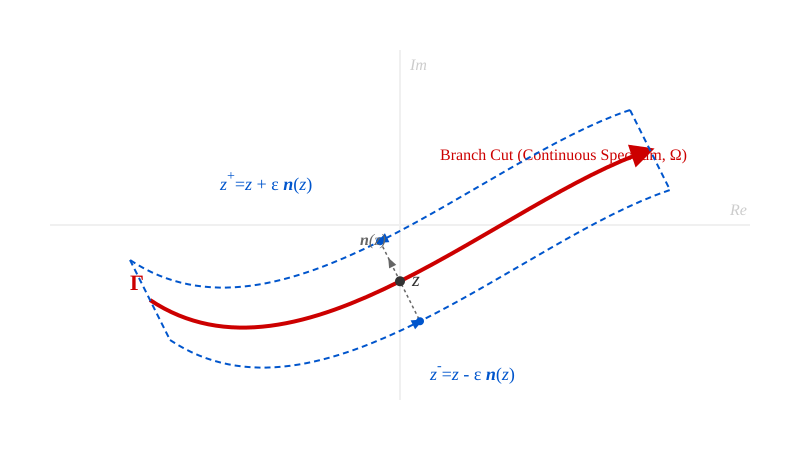
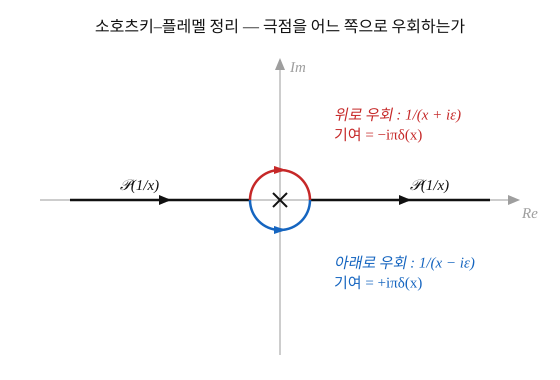

+++
title = "(b) Continuous"
weight = 4
+++

---

### 1. 연속 스펙트럼과 복소 평면의 분지절단 (Branch Cut)

이산 공간(Discrete space)에서 연산자의 스펙트럼은 복소 평면 상에 고립된 점 형태의 특이점(Isolated singularity)으로 존재하며, 레졸번트는 이 극점들을 중심으로 로랑 급수(Laurent series) 전개를 이룬다. 반면, 시스템의 차원이 무한대로 확장되거나 경계 조건이 개방(Open boundary)될 경우, 이산적인 고윳값 $\lambda_m$ 은 밀집되어 연속적인 스펙트럼 구간 $\Omega$ 상의 연속 변수 $\nu$ 로 변환된다.

이러한 연속 공간(Continuous space)에서 레졸번트 연산자 $R(z, \hat{A}) = (z\hat{I} - \hat{A})^{-1}$ 는 더 이상 고립된 극점을 갖지 않으며, 복소 평면 상의 특정 선분 또는 곡선을 따라 특이점이 조밀하게 배열된 분지절단(Branch cut)을 형성한다. 레졸번트는 이 절단선을 경계로 해석적 연속성(Analytic continuation)을 상실하며, 복소수 $z$ 가 절단선의 상단($\text{Im}(z) > 0$)에서 접근할 때와 하단($\text{Im}(z) < 0$)에서 접근할 때 대수적으로 서로 다른 극한값을 가지게 된다.

---

### 2. 극한 흡수 원리 (Limiting Absorption Principle)와 사영 밀도

이산 공간에서 코시 닫힌 경로 적분 $\oint_{\Gamma_m}$ 을 통해 단일 사영 연산자 $\hat{P}_m$ 을 축출했던 대수적 과정은, 연속 공간에서 분지절단 경로를 따라 위아래로 주행하는 선적분으로 치환된다. 절단선 상의 임의의 점 $\nu$ 에 대하여, 복소 허수부 $\pm i\epsilon$ 을 도입하여 경로를 무한히 밀착시키는 극한 흡수 원리(Limiting absorption principle)를 적용한다.

이를 통해 고립된 사영 연산자 $\hat{P}_m$ 은 미소 구간 $d\nu$ 에 대한 사영 밀도(Projection density) $d\hat{P}(\nu)$ 로 재정의되며, 절단선을 가로지르는 레졸번트의 도약(Jump) 연산으로 축출된다.

$$
d\hat{P}(\nu) = \lim_{\epsilon \to 0^+} \frac{1}{2\pi i} \left[ R(\nu - i\epsilon, \hat{A}) - R(\nu + i\epsilon, \hat{A}) \right] d\nu
$$

proof)

특이점 구간 $[\nu_1, \nu_2]$ 을 둘러싸는 직사각형 형태의 닫힌 경로 $\Gamma$ 를 설정한다. 코시 적분 공식에 의해 이 경로 내부의 적분은 해당 구간의 스펙트럼 사영 연산자 부분합을 구성한다.

$$
\Delta\hat{P}_{[\nu_1, \nu_2]} = \frac{1}{2\pi i} \oint_{\Gamma} R(z, \hat{A}) dz
$$

적분 경로 $\Gamma$ 를 분지절단(실수축 상의 스펙트럼 구간)에 무한히 밀착시키기 위해 수직 구간의 폭 $\epsilon$ 을 $0^+$ 로 수렴시킨다. 이때 직사각형의 좌우 수직 경계 경로에 대한 적분은 구간의 폭이 0으로 수렴하므로 소멸한다. 남은 것은 실수축과 평행하게 주행하는 상단 경로($z = \nu + i\epsilon$, 역방향 주행)와 하단 경로($z = \nu - i\epsilon$, 순방향 주행)의 적분이다.

$$
\Delta\hat{P}_{[\nu_1, \nu_2]} = \lim_{\epsilon \to 0^+} \frac{1}{2\pi i} \int_{\nu_1}^{\nu_2} \left[ R(\nu - i\epsilon, \hat{A}) - R(\nu + i\epsilon, \hat{A}) \right] d\nu
$$

적분 구간을 미소 척도 $d\nu$ 로 한정하면 연속 스펙트럼 공간에 대한 사영 밀도의 대수적 항등식이 연역적으로 증명된다.

---

### 3. 비대각 결함 성분: 멱영 밀도 (Nilpotent Density)의 도출

비정규(Non-normal) 특성을 지니는 연속 연산자 계에서, 대각화를 방해하는 잉여 상태(Surplus state) $|w(\nu)\rangle$ 는 이산 공간의 멱영 연산자 $\hat{N}_m$ 에 대응하는 멱영 밀도(Nilpotent density) $d\hat{N}(\nu)$ 로 발현된다. 사영 밀도와 동일한 극한 흡수 원리를 적용하여 비대각 결함 성분을 대수적으로 축출한다.

$$
d\hat{N}(\nu) = \lim_{\epsilon \to 0^+} \frac{1}{2\pi i} \left[ (\nu - i\epsilon) R(\nu - i\epsilon, \hat{A}) - (\nu + i\epsilon) R(\nu + i\epsilon, \hat{A}) \right] d\nu - \nu d\hat{P}(\nu)
$$

proof)

이산 공간의 레졸번트 적분에서 규명한 바와 같이, 연산자 항등식 $\hat{A}R(z, \hat{A}) = zR(z, \hat{A}) - \hat{I}$ 가 복소 평면 전체에서 성립한다. 이 항등식 양변에 $z = \nu \pm i\epsilon$ 을 대입하고 극한 흡수 원리에 따른 도약 연산을 적용한다.

$$
\lim_{\epsilon \to 0^+} \frac{1}{2\pi i} \left[ \hat{A}R(\nu - i\epsilon) - \hat{A}R(\nu + i\epsilon) \right] d\nu = \lim_{\epsilon \to 0^+} \frac{1}{2\pi i} \left[ (zR)_{-} - (zR)_{+} \right] d\nu - \lim_{\epsilon \to 0^+} \frac{1}{2\pi i} \left[ \hat{I} - \hat{I} \right] d\nu
$$

우변의 두 번째 항인 항등 연산자 $\hat{I}$ 는 특이점이 없는 전해석 함수(Entire function)이므로 분지절단에서의 도약 값이 자명하게 0으로 소멸한다. 좌변은 연산자 $\hat{A}$ 와 사영 밀도 $d\hat{P}(\nu)$ 의 곱인 $\hat{A}d\hat{P}(\nu)$ 로 치환된다.

남은 우변 첫 번째 항 내부의 변수 $z$ 를 $z = (z - \nu) + \nu$ 로 분할하여 전개한다.

$$
\hat{A}d\hat{P}(\nu) = \nu \left( \lim_{\epsilon \to 0^+} \frac{1}{2\pi i} \left[ R_{-} - R_{+} \right] d\nu \right) + \lim_{\epsilon \to 0^+} \frac{1}{2\pi i} \left[ (z - \nu)R_{-} - (z - \nu)R_{+} \right] d\nu
$$

우변의 첫 번째 항은 $\nu d\hat{P}(\nu)$ 로 정의되며, 두 번째 항은 이산 공간의 2차 극점 계수 축출($\hat{C}_{-2} = \oint (z-\lambda_m)R(z) dz$) 논리를 연속 공간으로 확장한 멱영 밀도 $d\hat{N}(\nu)$ 와 정확히 일치한다. 

결과적으로 이산 공간의 연산자 분해 항등식 $\hat{A}\hat{P}_m = \lambda_m\hat{P}_m + \hat{N}_m$ 은 연속 공간에서도 어떠한 대수적 비약 없이 밀도 항등식으로 동치 변환됨이 증명된다.

$$
\hat{A}d\hat{P}(\nu) = \nu d\hat{P}(\nu) + d\hat{N}(\nu)
$$

---

### 4. 연속 공간 연산자의 대수적 스펙트럼 분해

도출된 사영 밀도 $d\hat{P}(\nu)$ 와 멱영 밀도 $d\hat{N}(\nu)$ 를 전체 연속 스펙트럼 구간 $\Omega$ 에 대하여 적분함으로써, 일반화 챕터에서 구축한 대수적 분해 구조를 해석학적으로 복원한다.

$$
\hat{A} = \int_{\Omega} \big[ \nu \, d\hat{P}(\nu) + d\hat{N}(\nu) \big]
$$

연속 공간 상호 기저의 직교 규격화 조건은 미소 구간 밀도 간의 곱을 통해 델타 함수(Dirac delta function)의 형태로 대수적으로 보장된다. 제1 레졸번트 항등식을 극한 흡수 원리에 대입하여 밀도의 직교성을 증명한다.

$$
d\hat{P}(\nu) d\hat{P}(\nu') = \delta(\nu - \nu') d\hat{P}(\nu) d\nu'
$$

proof)

서로 다른 변수 $\nu$ 와 $\nu'$ 에 대하여 도약 연산의 곱을 전개하면 $R(\nu \pm i\epsilon) R(\nu' \pm i\epsilon')$ 항들이 생성된다. 레졸번트 항등식 $R(z)R(w) = \frac{R(z) - R(w)}{w - z}$ 에 의해 이들의 곱은 $\frac{1}{\nu' - \nu}$ 형태의 차분으로 분리된다.

극한 $\epsilon, \epsilon' \to 0$ 조건에서 $\nu \neq \nu'$ 일 경우, 분모가 0이 되지 않으므로 도약의 차분은 완벽히 상쇄되어 영연산자 $\hat{0}$ 으로 소멸한다. 오직 $\nu = \nu'$ 인 국소 지점에서만 $\epsilon$ 에 의한 극점 발산이 발생하며, 이는 분포 이론(Distribution theory)에 의해 델타 함수 $\delta(\nu - \nu')$ 로 수렴한다. 따라서 연속 공간 내 이종 특이점 간의 절대적인 대수적 직교성이 성립한다.

---

### 5. (정칙부의 확장) 코시 주치 적분과 환원 레졸번트 밀도

이산 공간의 정칙부(Regular part) 상수항이었던 환원 레졸번트 $\hat{S}_m$ 은 관측 공간을 제외한 모든 타 공간들의 배경장 역작용소 합($\sum_{l \neq m}$)으로 규정되었다. 연속 스펙트럼 공간에서는 이산적인 합산 기호 $\sum$ 이 적분 기호 $\int$ 로 대체되며, 관측 특이점 $\nu$ 를 제외한 나머지 연속 구간에 대한 기여도를 계산해야 한다.

그러나 적분 구간 내에 특이점 $\nu' = \nu$ 가 포함될 경우 분모가 0이 되어 발산하므로, 특이점을 우회하는 코시 주치(Cauchy Principal Value, $\mathcal{P}$)를 도입하여 연속 공간의 환원 레졸번트 $\hat{S}(\nu)$ 를 정의한다.

$$
\hat{S}(\nu) = \mathcal{P} \int_{\Omega} \frac{d\hat{P}(\nu')}{\nu - \nu'} = \lim_{\delta \to 0^+} \left( \int_{\min(\Omega)}^{\nu - \delta} \frac{d\hat{P}(\nu')}{\nu - \nu'} + \int_{\nu + \delta}^{\max(\Omega)} \frac{d\hat{P}(\nu')}{\nu - \nu'} \right)
$$

proof)

연속 공간의 레졸번트 $\hat{R}(z)$ 에 사영 밀도의 완비성 관계 $\hat{I} = \int_{\Omega} d\hat{P}(\nu')$ 를 대입하여 전개한다.

$$
R(z, \hat{A}) = \int_{\Omega} R(z, \hat{A}) d\hat{P}(\nu') = \int_{\Omega} \frac{d\hat{P}(\nu')}{z - \nu'} + \int_{\Omega} \frac{d\hat{N}(\nu')}{(z - \nu')^2} + \cdots
$$

이때 관측점 $z$ 가 분지절단 상의 특정 점 $\nu$ 로 접근할 때($z \to \nu$), 적분은 특이점 $\nu' = \nu$ 근방과 이를 제외한 나머지 영역으로 분할된다. 특이점 $\nu' = \nu$ 근방은 분지절단에서의 도약(Jump)을 발생시키는 델타 함수 생성 영역으로, 앞서 규명한 사영 밀도와 멱영 밀도(주부)의 원천이 된다.

반면 특이점 $\nu' = \nu$ 를 제외한 나머지 스펙트럼 구간 전체에 대한 적분은 발산하지 않는 얌전한 배경장(정칙부)을 형성한다. 이 배경장을 대수적으로 묶어내기 위해, 특이점 반경 $\delta$ 구간을 대칭적으로 절제한 후 극한을 취하는 코시 주치 $\mathcal{P}$ 연산을 적용하면, 발산 성분이 상쇄되고 오직 타 공간이 미치는 유효 배경장인 $\hat{S}(\nu)$ 만이 엄밀하게 축출된다.

이산 공간에서 증명된 직교성 $\hat{P}_m \hat{S}_m = \hat{0}$ 과 대칭적으로, 연속 공간에서도 국소 사영 밀도 $d\hat{P}(\nu)$ 와 환원 레졸번트 $\hat{S}(\nu)$ 간의 대수적 직교성이 완벽히 보존된다.

$$
d\hat{P}(\nu) \hat{S}(\nu) = d\hat{P}(\nu) \left( \mathcal{P} \int_{\Omega} \frac{d\hat{P}(\nu')}{\nu - \nu'} \right) = \mathcal{P} \int_{\Omega} \frac{\delta(\nu - \nu') d\hat{P}(\nu)}{\nu - \nu'} = \hat{0}
$$

(특이점 $\nu = \nu'$ 지점은 주치 적분의 정의에 의해 사전 배제되므로 델타 함수와의 내적은 항상 0으로 소멸한다.)

---

### 7. 소호츠키-플레멜 정리(Sokhotski-Plemelj theorem)와 대수적 통합

이산 공간에서 코시 적분을 통해 연역적으로 축출했던 주부와 정칙부는 연속 공간에서 복소해석학의 소호츠키-플레멜 정리(Sokhotski-Plemelj theorem)를 통해 하나의 항등식으로 대수적 통합을 이룬다. 이 정리는 앞서 전개한 극한 흡수 원리(Limiting absorption principle)의 수학적 근원이며 사영 밀도와 환원 레졸번트 밀도가 연속 스펙트럼 공간에서 공존하는 방식을 기하학적으로 규명한다.

**1) 특이점 우회와 반원 경로의 기하학적 구조**

실수축 상의 연속 스펙트럼 구간을 적분할 때 피적분 함수 내부에 특이점 $x = 0$ 이 존재할 경우 해당 적분은 발산한다. 이를 해석적으로 처리하기 위해 특이점 근방을 반지름 $\epsilon$ 인 미소 반원 경로 $C_{\epsilon}$ 으로 우회하는 방법을 적용한다.

적분 경로는 특이점을 제외한 실수축 구간(코시 주치)과 특이점을 감싸는 반원 구간으로 분할된다. 상단 반원을 통해 우회할 경우와 하단 반원을 통해 우회할 경우 적분 방향에 따라 유수(Residue)의 절반에 해당하는 $\mp i\pi$ 의 기여분이 발생한다. 이를 수식으로 정리하면 다음과 같은 분포 이론(Distribution theory) 상의 극한 항등식이 성립한다.

$$
\lim_{\epsilon \to 0^+} \frac{1}{x \pm i\epsilon} = \mathcal{P} \left( \frac{1}{x} \right) \mp i\pi \delta(x)
$$

여기서 $\mathcal{P}$ 는 코시 주치(Cauchy Principal Value)를 의미하며 $\delta(x)$ 는 디랙 델타 함수(Dirac delta function)를 나타낸다.

**2) 레졸번트 연산자로의 확장 적용**

위 항등식의 독립 변수 $x$ 를 연속 스펙트럼의 관측점 $\nu$ 와 시스템 연산자 $\hat{A}$ 의 대수적 차이인 $(\nu - \hat{A})$ 로 치환한다. 이는 분지절단 상의 관측점을 향해 상단과 하단에서 접근하는 레졸번트 연산자 $R(\nu \pm i\epsilon, \hat{A})$ 의 극한 형태와 정확히 일치한다.

$$
R(\nu \pm i\epsilon, \hat{A}) = \mathcal{P} \left( \frac{1}{\nu - \hat{A}} \right) \mp i\pi \delta(\nu - \hat{A})
$$

이 단일 항등식 내부에 연속 스펙트럼 연산자의 모든 기저 구조가 내포되어 있다. 좌변의 레졸번트 극한은 우변에서 발산하지 않는 배경장 성분(코시 주치)과 특이점에서의 붕괴 성분(델타 함수)으로 연역적으로 분리된다.

**3) 주부(사영 밀도)의 대수적 축출**

본문 2장에서 정의한 도약(Jump) 연산식에 소호츠키-플레멜 정리를 대입하여 하단 극한과 상단 극한의 차분을 계산한다.

$$
R(\nu - i\epsilon) - R(\nu + i\epsilon) = \left[ \mathcal{P} \left( \frac{1}{\nu - \hat{A}} \right) + i\pi \delta(\nu - \hat{A}) \right] - \left[ \mathcal{P} \left( \frac{1}{\nu - \hat{A}} \right) - i\pi \delta(\nu - \hat{A}) \right]
$$

차분 과정에서 코시 주치 성분은 대수적으로 완전히 상쇄되며 델타 함수 성분만이 보존된다.

$$
R(\nu - i\epsilon) - R(\nu + i\epsilon) = 2i\pi \delta(\nu - \hat{A})
$$

양변에 $\frac{1}{2\pi i}$ 를 곱하면 연속 스펙트럼 공간의 사영 밀도 $d\hat{P}(\nu)$ 가 엄밀하게 도출된다.

$$
\frac{1}{2\pi i} \left[ R(\nu - i\epsilon) - R(\nu + i\epsilon) \right] = \delta(\nu - \hat{A}) \equiv \frac{d\hat{P}(\nu)}{d\nu}
$$

**4) 정칙부(환원 레졸번트)의 수학적 실체**

도약 연산에서 상쇄되어 소거되었던 식의 첫 번째 항 $\mathcal{P}(\frac{1}{\nu - \hat{A}})$ 은 연속 공간의 환원 레졸번트 밀도 $\hat{S}(\nu)$ 의 정의와 정확히 일치한다. 이산 공간에서 환원 레졸번트가 타 공간 역작용소들의 합($\sum \hat{Y}_l^{-1}$)으로 규정되었듯 연속 공간에서는 특이점을 제외한 나머지 스펙트럼 구간의 주치 적분으로 발현된다.

결과적으로 소호츠키-플레멜 정리는 임의의 연속 결함 연산자 시스템이 복소 평면 위에서 어떻게 주부와 정칙부로 분할되는지 증명하는 가장 근본적인 대수학적 지배 방정식으로 작용한다.

---

### 8. 소호츠키-플레멜 정리의 해석학적 증명 (Analytic Proof)

소호츠키-플레멜 정리는 결코 외부에서 차용된 마법이 아니라, 극한 흡수 원리($\epsilon \to 0^+$) 하에서 복소 분수를 대수적으로 전개할 때 필연적으로 도출되는 분포 이론(Distribution theory)의 결론이다. 임의의 시험 함수(Test function) $\phi(x)$ 에 대하여 이 정리가 어떻게 연역적으로 증명되는지 해부한다.

**1) 복소 분수의 대수적 분리 (실수화)**

극한 대상이 되는 복소 분수 함수 $f_{\epsilon}(x) = \frac{1}{x \pm i\epsilon}$ 에 켤레 복소수 $x \mp i\epsilon$ 를 분모와 분자에 곱하여 실수부와 허수부로 엄밀하게 분리한다.

$$
\frac{1}{x \pm i\epsilon} = \frac{x \mp i\epsilon}{(x \pm i\epsilon)(x \mp i\epsilon)} = \frac{x \mp i\epsilon}{x^2 + \epsilon^2} = \frac{x}{x^2 + \epsilon^2} \mp i \frac{\epsilon}{x^2 + \epsilon^2}
$$

우변의 첫 번째 항은 정칙부(환원 레졸번트)의 기원이 되는 실수부 함수이며, 두 번째 항은 주부(사영 밀도)의 기원이 되는 허수부 함수이다. 이 두 함수에 대하여 극한 $\epsilon \to 0^+$ 을 취할 때 발생하는 해석학적 거동을 각각 증명한다.

**2) 허수부의 극한: 디랙 델타 함수의 연역**

허수부 함수 $D_{\epsilon}(x) = \frac{\epsilon}{x^2 + \epsilon^2}$ 는 로렌츠 분포(Lorentzian) 또는 코시 분포(Cauchy distribution)의 형태를 가진다. 이 함수를 임의의 시험 함수 $\phi(x)$ 와 함께 무한 구간에서 적분하고 실수 변수 치환 $x = \epsilon y$, $dx = \epsilon dy$ 를 적용한다.

$$
\lim_{\epsilon \to 0^+} \int_{-\infty}^{\infty} \frac{\epsilon}{x^2 + \epsilon^2} \phi(x) dx = \lim_{\epsilon \to 0^+} \int_{-\infty}^{\infty} \frac{\epsilon}{(\epsilon y)^2 + \epsilon^2} \phi(\epsilon y) (\epsilon dy)
$$

$$
= \lim_{\epsilon \to 0^+} \int_{-\infty}^{\infty} \frac{1}{y^2 + 1} \phi(\epsilon y) dy
$$

극한 $\epsilon \to 0^+$ 을 적분 내부로 전개하면 $\phi(\epsilon y) \to \phi(0)$ 이 되며, 남은 적분 $\int_{-\infty}^{\infty} \frac{1}{y^2 + 1} dy$ 은 아크탄젠트(Arctangent) 함수의 특성에 의해 정확히 $\pi$ 로 수렴한다.

$$
= \phi(0) \int_{-\infty}^{\infty} \frac{1}{y^2 + 1} dy = \pi \phi(0)
$$

분포 이론의 정의상 임의의 함수 $\phi(x)$ 를 $\phi(0)$ 으로 추출해 내는 연산자는 디랙 델타 함수 $\delta(x)$ 이다. 따라서 허수부는 다음의 극한으로 완벽히 종결된다.

$$
\lim_{\epsilon \to 0^+} \frac{\epsilon}{x^2 + \epsilon^2} = \pi \delta(x)
$$

**3) 실수부의 극한: 코시 주치(Principal Value)의 연역**

실수부 함수 $P_{\epsilon}(x) = \frac{x}{x^2 + \epsilon^2}$ 는 기함수(Odd function)이다. $x=0$ 근방에서 발산하는 $\frac{1}{x}$ 의 적분을 수학적으로 정의하기 위해, 시험 함수 $\phi(x)$ 에 대입하여 극한을 취한다.

$$
\lim_{\epsilon \to 0^+} \int_{-\infty}^{\infty} \frac{x}{x^2 + \epsilon^2} \phi(x) dx
$$

적분을 $x=0$ 을 중심으로 대칭적인 미소 구간 $[-\delta, \delta]$ 와 그 외부 구간으로 분할한다. 외부 구간에서는 $\epsilon \to 0$ 극한 시 특이점이 없으므로 $\frac{x}{x^2} = \frac{1}{x}$ 로 자연스럽게 수렴한다.

내부 미소 구간 $[-\delta, \delta]$ 에서는 시험 함수를 $\phi(x) = \phi(0) + x\psi(x)$ 로 테일러 전개하여 대입한다.

$$
\int_{-\delta}^{\delta} \frac{x}{x^2 + \epsilon^2} \left[ \phi(0) + x\psi(x) \right] dx = \phi(0) \int_{-\delta}^{\delta} \frac{x}{x^2 + \epsilon^2} dx + \int_{-\delta}^{\delta} \frac{x^2}{x^2 + \epsilon^2} \psi(x) dx
$$

첫 번째 항의 피적분 함수 $\frac{x}{x^2 + \epsilon^2}$ 는 완벽한 기함수이므로 대칭 구간 $[-\delta, \delta]$ 에 대한 적분은 자명하게 0으로 소멸한다. (이것이 발산하는 특이점이 상쇄되는 대수적 원리이다.) 
두 번째 항은 $\epsilon \to 0$ 극한에서 특이점이 상쇄되어 적분 가능한 값으로 수렴한다.

결과적으로, 기함수의 대칭성을 이용해 발산 특이점을 제거하고 나머지 유효 면적만을 추출하는 이 적분 방식 자체가 바로 **코시 주치(Cauchy Principal Value, $\mathcal{P}$)**의 정의와 정확히 일치한다.

$$
\lim_{\epsilon \to 0^+} \frac{x}{x^2 + \epsilon^2} = \mathcal{P}\left(\frac{1}{x}\right)
$$

**4) 정리의 대수적 완성**

2)와 3)에서 각각 독립적으로 증명된 실수부와 허수부의 극한 결과를 본래의 분리 식에 대입하면, 어떠한 해석학적 비약 없이 소호츠키-플레멜 정리가 연역적으로 완성된다.

$$
\lim_{\epsilon \to 0^+} \frac{1}{x \pm i\epsilon} = \lim_{\epsilon \to 0^+} \left( \frac{x}{x^2 + \epsilon^2} \mp i \frac{\epsilon}{x^2 + \epsilon^2} \right) = \mathcal{P}\left(\frac{1}{x}\right) \mp i\pi \delta(x)
$$

---

### 6. 예제: 연속 스펙트럼과 위치 연산자 (Position Operator)

이산 공간의 예제(행렬)와 대비하여, 무한 차원 힐베르트 공간 $L^2(\mathbb{R})$ 상에서 작용하는 자기수반(Self-adjoint) 연속 연산자인 위치 연산자 $\hat{X}$ 를 통해 극한 흡수 원리(Limiting absorption principle)가 어떻게 연속 사영 밀도 $d\hat{P}(\nu)$ 를 대수적으로 축출해 내는지 교차 검증한다.

$$
\hat{X} |x\rangle = x |x\rangle
$$

**1) 특성 방정식의 붕괴와 연속 스펙트럼**

위치 연산자 $\hat{X}$ 는 임의의 실수 $x \in \mathbb{R}$ 전체 구간에 대하여 연속적인 고윳값을 가진다. 무한 차원 공간이므로 $\det(\hat{X} - \lambda\hat{I}) = 0$ 이라는 행렬식 기반의 대수적 특성 방정식은 성립하지 않으며, 고윳값들은 고립된 점이 아닌 실수축 전체를 덮는 분지절단(Branch cut) $\Omega = (-\infty, \infty)$ 을 형성한다.

**2) 레졸번트 전개 및 도약(Jump) 연산의 적용**

위치 연산자의 레졸번트 $R(z, \hat{X}) = (z\hat{I} - \hat{X})^{-1}$ 를 구성한다. 임의의 위치 기저 표상(Position representation)에서 레졸번트의 대각 성분은 다음과 같이 기술된다.

$$
\langle x | R(z, \hat{X}) | x' \rangle = \frac{1}{z - x} \delta(x - x')
$$

분지절단(실수축) 상의 임의의 관측점 $\nu$ 에 대하여, 앞서 유도한 극한 흡수 원리의 도약 연산식에 레졸번트를 직접 대입하여 사영 밀도 $d\hat{P}(\nu)$ 를 축출한다. 변수 $z$ 에 직하단 경로 $\nu - i\epsilon$ 와 직상단 경로 $\nu + i\epsilon$ 를 각각 대입하여 차분을 전개한다.

$$
R(\nu - i\epsilon, \hat{X}) - R(\nu + i\epsilon, \hat{X}) = \frac{1}{\nu - i\epsilon - \hat{X}} - \frac{1}{\nu + i\epsilon - \hat{X}}
$$

공통 분모를 형성하여 식을 결합한다.

$$
= \frac{(\nu + i\epsilon - \hat{X}) - (\nu - i\epsilon - \hat{X})}{(\nu - \hat{X})^2 + \epsilon^2} = \frac{2i\epsilon}{(\nu - \hat{X})^2 + \epsilon^2}
$$

**3) 디랙 델타 함수의 연역적 도출**

도출된 차분 결과에 $\frac{1}{2\pi i}$ 를 곱하고 $\epsilon \to 0^+$ 극한을 취하는 사영 밀도 정의식을 적용한다.

$$
\lim_{\epsilon \to 0^+} \frac{1}{2\pi i} \left[ \frac{2i\epsilon}{(\nu - \hat{X})^2 + \epsilon^2} \right] d\nu = \lim_{\epsilon \to 0^+} \frac{1}{\pi} \frac{\epsilon}{(\nu - \hat{X})^2 + \epsilon^2} d\nu
$$

우변의 극한 형태 $\lim_{\epsilon \to 0^+} \frac{1}{\pi} \frac{\epsilon}{x^2 + \epsilon^2}$ 는 코시 분포(Cauchy distribution)의 극한 규약에 의해 분포 이론(Distribution theory) 상의 디랙 델타 함수 $\delta(x)$ 로 엄밀하게 수렴한다. 따라서 연산자의 극한 결과는 다음과 같이 대수적으로 종결된다.

$$
d\hat{P}(\nu) = \delta(\nu - \hat{X}) d\nu
$$

**4) 분해 항등식 교차 검증**

축출된 사영 밀도를 기반으로 대상 연산자를 전체 스펙트럼 구간 $\Omega$ 에 대하여 적분한다. 자기수반 연산자이므로 멱영 밀도 $d\hat{N}(\nu) = \hat{0}$ 이다.

$$
\int_{-\infty}^{\infty} \nu \, d\hat{P}(\nu) = \int_{-\infty}^{\infty} \nu \, \delta(\nu - \hat{X}) d\nu
$$

델타 함수의 적분 필터링(Sifting) 성질에 의해 적분 변수 $\nu$ 는 연산자 $\hat{X}$ 로 치환되며 식이 완벽하게 항등원으로 환원된다.

$$
= \hat{X}
$$

결과적으로 무한 차원 연속 스펙트럼 시스템에서, 고립된 극점의 코시 적분을 대체한 **분지절단 상의 도약 연산**이 어떠한 해석학적 비약 없이 연속 기저를 투영하는 델타 함수 사영 밀도를 정확하게 생성해 냄이 확증된다.

---

<h4 style="margin:0 0 10px 0;color:#333;text-align:center;">소호츠키-플레멜 정리 대수적 분해 시뮬레이터</h4>

<label for="eps-slider" style="font-style:italic;font-size:1.1rem;">ε = 0.50</label>
<input type="range" id="eps-slider" min="0.01" max="1.0" step="0.01" value="0.5" style="width:60%;cursor:pointer;">

<canvas id="sokhotski-canvas" width="760" height="400" style="width:100%;height:auto;border:1px solid #eee;"></canvas>

실수부 (코시 주치): x / (x² + ε²)

허수부 (디랙 델타): ε / (x² + ε²)

슬라이더를 왼쪽으로 이동하여 ε → 0 극한에서의 대수적 붕괴 양상을 관찰하십시오.

